# 特点

## 主要特性

除了OOP外，近年出现了一些小众的编程哲学，Go语言对这些思想亦有所吸收。例如，Go语言接受了函数式编程的一些想法，支持匿名函数与闭包。再如，Go语言接受了以Erlang语言为代表的面向消息编程思想，支持goroutine和通道，并推荐使用消息而不是共享内存来进行并发编程。总体来说，Go语言是一个非常现代化的语言，精小但非常强大。

Go 语言最主要的特性：

- 自动垃圾回收
- 更丰富的内置类型
- 函数多返回值
- 错误处理
- 匿名函数和闭包
- 类型和接口
- 并发编程
- 反射
- 语言交互性

动态语言因为没有从编译代码到执行代码的中间过程，用动态语言写程序可以快速看到输出。代价是，动态语言不提供静态语言提供的类型安全特性。

## 设计哲学

### **追求简单，少即是多**

### **偏好组合，正交解耦**

Go语言遵从的设计哲学就是组合。我们看到无论是包、接口还是一个个具体的类型定义（包括类型的方法集合），Go语言为我们呈现了这样一幅图景：一座座没有关联的“孤岛”，但每个岛内又都很精彩。现在摆在面前的工作就是以最适当的方式在这些孤岛之间建立关联（耦合），形成一个整体。Go采用了组合的方式，也是唯一的方式。

#### 垂直组合

Go语言提供的最为直观的组合的语法元素是类型嵌入（type embedding）。通过类型嵌入，我们可以将已经实现的功能嵌入新类型中，以快速满足新类型的功能需求。这种方式有些类似经典OO语言中的继承机制，但在原理上与其完全不同，这是一种Go设计者们精心设计的语法糖。被嵌入的类型和新类型之间没有任何关系，甚至相互完全不知道对方的存在，更没有经典OO语言中的那种父类、子类的关系以及向上、向下转型（type casting）。在通过新类型实例调用方法时，方法的匹配取决于方法名字，而不是类型。这种组合方式，笔者称之为**“垂直组合”**，即通过类型嵌入，快速让一个新类型复用其他类型已经实现的能力，实现功能的垂直扩展。

```go
type poolLocal struct{
    private 	interface{}
    shared 		[]interface{}
    Mutex
    pad 		[128]byte
}
```

#### 水平组合

通过在interface的定义中嵌入interface类型来实现接口行为的聚合，组成大接口，这种方式在标准库中尤为常用，并且已经成为Go语言的一种惯用法。

```go
type ReadWriter interface {
    Reader
    Writer
}
```

nterface是Go语言中真正的“魔法”，是Go语言的一个创新设计，它只是方法集合，且与实现者之间的关系是隐式的，它让程序各个部分之间的耦合降至最低，同时是连接程序各个部分的“纽带”。隐式的interface实现会不经意间满足依赖抽象、里氏替换、接口隔离等设计原则，这在其他语言中是需要很刻意的设计谋划才能实现的，但在Go interface看来，一切却是自然而然的。通过interface将程序各个部分组合在一起的方法，笔者称之为**“水平组合”**。

综上，组合原则的应用塑造了Go程序的骨架结构。**类型嵌入为类型提供垂直扩展能力，interface是水平组合的关键。**

### 原生并发，轻量高效

### 面向工程，“自带电池”

（1）语言

语法是编程语言的用户接口，它直接影响开发人员对于一门语言的使用体验。Go语言是一门简单的语言，简单意味着可读性好，容易理解，容易上手，容易修复错误，节省开发者时间，提升开发者间的沟通效率。但作为面向工程的编程语言，光有简单的设计哲学还不够，每个语言设计细节还都要经过“工程规模化”的考验和打磨，需要在细节上进行充分的思考和讨论。

（2）标准库

Go在标准库中提供了各类高质量且性能优良的功能包，其中的net/http、crypto/xx、encoding/xx等包充分迎合了云原生时代关于API/RPCWeb服务的构建需求。Go开发者可以直接基于这些包实现满足生产要求的API服务，从而减轻对第三方包或库的依赖，降低工程代码依赖管理的复杂性，也降低开发人员学习第三方库的心智负担。

（3）工具链

+ 构建和运行：`go build/go run`
+ 依赖包查看与获取：`go list/go get/go mod xx`
+ 编辑辅助格式化：`go fmt/gofmt`
+ 文档查看：`go doc/godoc`
+ 单元测试/基准测试/测试覆盖率：`go test`
+ 代码静态分析：`go vet`
+ 性能剖析与跟踪结果查看：`go tool pprof/go tool trace`
+ 升级到新Go版本API的辅助工具：`go tool fix`
+ 报告Go语言bug：`go bug`

## 类型推导

Go语言支持`var a = 7`语法，这让Go语言有点像动态类型语言，但它实际上是强类型语言，只是变量a定义时会被自动推导出是整数类型。Go语言在代码风格上像动态语言，在运行效率上则像静态编译型语言。

# 包

使用包来封装不同语义单元的功能。
每个包都在一个单独的目录里。**不能把多个包放到同一个目录中，也不能把同一个包的文件分拆到多个不同的目录中。**这意味着，同一个目录下的所有.go文件必须声明为同一个包名。在Go语言中，命名为main的包具有特殊的含义。Go语言的编译程序会试图把这种名字的包编译为二进制可执行文件。所有用Go语言编一的可执行程序都必须有一个叫main的包。
`import .` 这个`.`的含义是，在调用包的函数时，可以省略包名。**`_`只用于导入包，而并不需要这个包的其他函数、常量等资源，而是调用了该包的`init`函数。**

## 包级变量

**包级变量**只能使用带有**var关键字**的变量声明形式。

一般将同一类的变量声明放在一个var块中，将不同类的声明放在不同的var块中；或者将延迟初始化的变量声明放在一个var块，而将声明并显式初始化的变量放在另一个var块中。笔者称之为**“声明聚类”**。
变量声明最佳实践中还有一条：**就近原则**，即尽可能在靠近第一次使用变量的位置声明该变量。如果一个包级变量在包内部被多处使用，那么这个变量还是放在源文件头部声明比较适合。

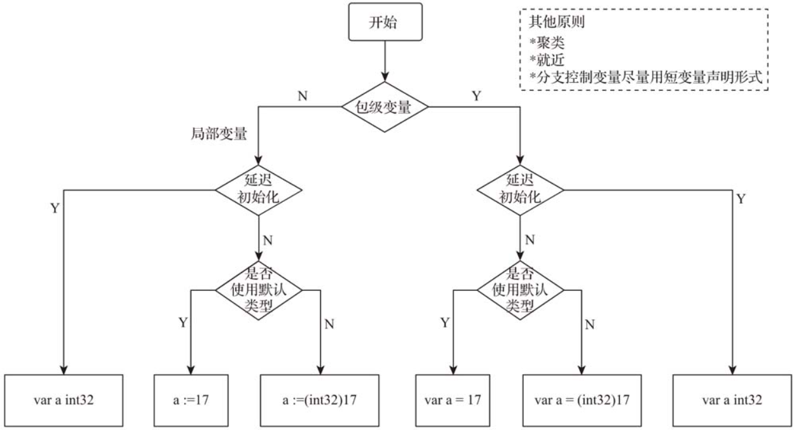

# 基础

## 常量

Go语言是站在C语言等编程语言的肩膀之上诞生的，它原生提供常量定义的关键字const。Go语言中的const整合了**C语言中宏定义常量、const只读变量和枚举常量**三种形式，并消除了每种形式的不足，使得Go常量成为类型安全且对编译器优化友好的语法元素。

绝大多数情况下，Go常量在声明时并不显式指定类型，也就是说使用的是**无类型常量**（untyped constant）。

```go
const (
	SeekStart   = 0 // seek relative to the origin of the file
	SeekCurrent = 1 // seek relative to the current offset
	SeekEnd     = 2 // seek relative to the end
)
```

**有类型常量的烦恼**

Go要求，两个类型即便拥有相同的底层类型（underlying type），也仍然是不同的数据类型，不可以被相互比较或混在一个表达式中进行运算。Go在处理不同类型的变量间的运算时不支持隐式的类型转换。

Go的无类型常量恰恰就拥有像字面值这样的特性，该特性使得无类型常量在参与变量赋值和计算过程时无须显式类型转换，从而达到简化代码的目的。无类型常量使得Go在处理表达式混合数据类型运算时具有较大的灵活性，代码编写也有所简化，我们无须再在求值表达式中做任何显式类型转换了。
除此之外，无类型常量也拥有自己的默认类型：无类型的布尔型常量、整数常量、字符常量、浮点数常量、复数常量、字符串常量对应的默认类型分别为bool、int、int32(rune)、float64、complex128和string。当常量被赋值给无类型变量、接口变量时，常量的默认类型对于确定无类型变量的类型及接口对应的动态类型是至关重要的。

### iota枚举

Go的const语法提供了“隐式重复前一个非空表达式”的机制。

```go
const(
    Apple, Banana = 11, 22
    Strawberry, Grape
    Pear, Watermelon
)
```

常量定义的后两行没有显式给予初始赋值，Go编译器将为其隐式使用第一行的表达式，这样上述定义等价于：

```go
const(
    Apple, Banana = 11, 22
    Strawberry, Grape = 11, 22
    Pear, Watermelon = 11, 22
)
```

iota是Go语言的一个预定义标识符，它表示的是const声明块（包括单行声明）中**每个常量所处位置在块中的偏移值（从零开始）**。同时，每一行中的iota自身也是一个无类型常量，可以像无类型常量那样自动参与不同类型的求值过程，而无须对其进行显式类型转换操作。

```go
const (
	mutexLocked = 1 << iota 	// 1
	mutexWoken					// 2
	mutexStarving				// 4
	mutexWaiterShift = iota		// 3
	starvationThresholdNs = 1e6
)
```

```go
const(
	_ = iota
    IPV6_V6ONLY		//1
    SOMAXCONN		//2
    SO_ERROR		//3
)
```

Go的枚举常量不限于整型值，也可以定义浮点型的枚举常量

```go
const(
	PI = 3.1415926
    PI_2 = 3.1415926 / (2 * iota)	// PI/2
    PI_4						// PI/4
)
```


## 零值

如果声明一个变量而没有给它赋值，该变量将包含其类型的零值。（也就是初始化？）当通过声明或调用new为变量分配存储空间，或者通过复合文字字面量或调用make创建新值，且不提供显式初始化时，<u>Go会为变量或值提供默认值。</u>
与变量一样，当创建一个数组时，它所包含的所有的值都初始化为该数组所保存类型的零值。
任何时候，创建一个变量并初始化为其零值，习惯是使用关键字`var`。这种用法是为了更明确地表示一个变量被设置为零值。如果变量被初始化为某个非零值，就配合结构字面量和短变量声明操作符来创建变量。

nil是预定义的一种标识符，代表指针、信道、函数、接口、映射或切片的零值。nil不能赋值给字符串、数值和布尔类型，否则会引发panic类型的错误。

+ 字符串：""
+ 所有整型类型：0
+ 浮点类型：0.0
+ 布尔：false
+ 指针：nil
+ 数组：每个数组元素类型对应的零值
+ 信道、函数、切片、接口、映射：nil

Go的零值初始是递归的，即数组、结构体等类型的零值初始化就是对其组成元素逐一进行零值初始化。

### 零值可用

#### 切片append

```go
var zeroSlice []int
zeroSlice = append(zeroSlice, 1)
zeroSlice = append(zeroSlice, 2)
zeroSlice = append(zeroSlice, 3)
fmt.Println(zeroSlice) //输出：[1 2 3]
```

我们声明了一个[]int类型的切片zeroSlice，但并没有对其进行显式初始化，这样zeroSlice这个变量就被Go编译器置为零值nil。但由于Go中的切片类型具备零值可用的特性，我们可以直接对其进行append操作，而不会出现引用nil的错误。

#### 通过nil指针调用方法

```go
func main() {
	var p *net.TCPAddr
	fmt.Println(p) //输出：<nil>
}
```

我们声明了一个net.TCPAddr的指针变量，但并未对其显式初始化，指针变量p会被Go编译器赋值为nil。在标准输出上输出该变量，fmt.Println会调用p.String()。

#### 标准库例子

`sync.Mutex`和`bytes.Buffer`

```go
var mu sync.Mutex
mu.Lock()
mu.Unlock()
```

```go
func main(){
    var b bytes.Buffer
    b.Write([]byte("Effective Go"))
    fmt.Println(b.String)	//输出：Effective Go
}
```

我们无须对bytes.Buffer类型的变量b进行任何显式初始化，即可直接通过b调用Buffer类型的方法进行写入操作。这是因为bytes.Buffer结构体用于存储数据的字段buf支持零值可用策略的切片类型。

```go
type Buffer struct{
    buf		[]byte
    off		int
    lastRead readOp
}
```

#### 限制

在append场景下，零值可用的切片类型不能通过下标形式操作数据。

```go
var s []int
s[0] = 12 //报错
s = append(s, 12) //正确
```

另外，像map这样的原生类型也没有提供对零值可用的支持。

另外零值可用的类型要注意尽量避免值复制：

```go
var mu sync.Mutex
mu1 := mu	// 错误：避免值复制
foo(mu)		// 错误：避免值复制
```

我们可以通过指针方式传递类似Mutex这样的类型

```go
var mu sync.Mutex
foo(&mu)	// 正确
```

## 数据类型

**字符串类型、数值类型和布尔类型在Go中是值类型，切片、channel、接口、函数和map属于引用类型。**<u>结构体类型可以描述一组不同类型的值，这一组值本质上既可以是引用类型也可以是值类型。</u>

Go 语言里的引用类型有如下几个：切片、映射、通道、接口和函数类型。当声明上述类型的变量时，创建的变量被称作**标头（header）值**。从技术细节上说，字符串也是一种引用类型。**每个引用类型创建的标头值是包含一个指向底层数据结构的指针。**每个引用类型还包含一组独特的字段，用于管理底层数据结构。因为标头值是为复制而设计的，所以永远不需要共享一个引用类型的值。**标头值里包含一个指针，因此通过复制来传递一个引用类型的值的副本，本质上就是在共享底层数据结构。**

类型的本质：使用值接收者还是指针接收者，不应该由方法是否修改了接收到的值来决定，这个决策应该基于该类型的本质。非原始的类型，应该用指针。这条规则的一个例外就是，需要让类型值符合某个接口的时候，即便类型的本质是非原始的，也可以选择使用值接收者声明方法。这样做完全符合接口值调用方法的机制。

Go语言中数组、字符串和切片三者是密切相关的数据结构。这3种数据类型，在底层原始数据有着相同的内存结构，在上层，因为语法的限制而有着不同的行为表现。首先，Go语言的数组是一种值类型，虽然数组的元素可以被修改，但是数组本身的赋值和函数传参都是以整体复制的方式处理的。<u>Go语言字符串底层数据也是对应的字节数组，但是字符串的只读属性禁止了在程序中对底层字节数组的元素的修改。</u>**字符串赋值只是复制了数据地址和对应的长度，而不会导致底层数据的复制。**切片的行为更为灵活，切片的结构和字符串结构类似，但是解除了只读限制。切片的底层数据虽然也是对应数据类型的数组，但是每个切片还有独立的长度和容量信息，切片赋值和函数传参时也是将切片头信息部分按传值方式处理。因为切片头含有底层数据的指针，所以它的赋值也不会导致底层数据的复制。其实Go语言的赋值和函数传参规则很简单，除闭包函数以引用的方式对外部变量访问之外，其他赋值和函数传参都是以传值的方式处理。要理解数组、字符串和切片这3种不同的处理方式的原因，需要详细了解它们的底层数据结构。					——《Go语言高级编程》

## 参数传递

Go语言中的函数参数都是按值传递的。

## 布尔

布尔类型无法参与数值运算，也无法与其他类型进行转换。

## 数组

复制指针数组，只会复制指针的值，而不会复制指针所指向的值。复制之后，两个数组指向同一组字符串。Go语言实战Page 57。

<u>Go语言中数组是值语义。一个数组变量即表示整个数组，它并不是隐式地指向第一个元素的指针（例如C语言的数组），而是一个完整的值。</u><u>当一个数组变量被赋值或者被传递的时候，实际上会复制整个数组。如果数组较大的话，数组的赋值也会有较大的开销。为了避免复制数组带来的开销，可以传递一个指向数组的指针，但是数组指针并不是数组。</u>		——《Go语言高级编程》

### 空数组 && 通道

我们还可以定义一个空的数组：

```go
var d [0]int		//定义一个长度为0的数组
var e = [0]int{}	//定义一个长度为0的数组
var f = [...]int{}	//定义一个长度为0的数组
```

长度为0的数组（空数组）在内存中并不占用空间。空数组虽然很少直接使用，但是可以用于强调某种特有类型的操作时避免分配额外的内存空间，例如用于通道的同步操作：

```go
c1 := make(chan [0]int)
go func() {
    fmt.Println("c1")
    c1 <- [0]int{}
}()
<-c1
```

在这里，我们并不关心通道中传输数据的真实类型，其中通道接收和发送操作只是用于消息的同步。对于这种场景，我们用空数组作为通道类型可以减少通道元素赋值时的开销。**当然，一般更倾向于用无类型的匿名结构体代替空数组**：

```go
c2 := make(chan struct{})
go func() {
    fmt.Println("c2")
    c2 <- struct{}{}	//struct{}部分是类型，{}表示对应的结构体值
}()
<-c2
```

### 多维数组：

```go
array := [4][2]int{{10, 11}, {20, 21}, {30, 31}, {40, 41}}
array := [4][2]int{1:{20, 21}, 3:{40,41}}
array := [4][2]int{1:{0:20}, 3:{1:41}}
```

### 在函数间传递数组

在函数间传递数组是一个开销很大的操作。在函数之间传递变量时，总是以值的方式传递的。如果这个变量是一个数组，意味着整个数组，不管有多长，都会完整复制，并传递给函数。

## 字符串

### 只读

**==字符串是**只读**的字符片段==。string类型的数据是不可变的。一旦声明了一个string类型的标识符，无论是常量还是变量，该标识符所指代的数据在整个程序的生命周期内便无法更改。**和数组不同的是，字符串的元素不可修改，是一个只读的字节数组。每个字符串的长度虽然也是固定的，但是字符串的长度并不是字符串类型的一部分。**获取字符串中某个字符的地址是非法的，比如&msg[0]。

### 零值可用

Go string类型支持“零值可用”的理念。Go字符串无须像C语言中那样考虑结尾'\0'字符，因此其零值为""，长度为0。

```go
var s string]
fmt.Println(s)	// s = ""
fmt.Println(len(s))	// 0
```

### 字符串比较

由于Go string是不可变的，因此如果两个字符串的长度不相同，那么无须比较具体字符串数据即可断定两个字符串是不同的。如果长度相同，则要进一步判断数据指针是否指向同一块底层存储数据。如果相同，则两个字符串是等价的；如果不同，则还需进一步比对实际的数据内容。

### 对非ASCII字符提供原生支持

Go语言源文件默认采用的Unicode字符集。Unicode字符集是目前市面上最流行的字符集，几乎囊括了所有主流非ASCII字符（包括中文字符）。**Go字符串的每个字符都是一个Unicode字符**，并且这些Unicode字符是以**UTF-8编码格式**存储在内存当中的。

用单引号（'）括起来的是单个字符，用int32表示。反单引号（\`）括起来的字符串不会被转义，而是按照原语输出。Go语言直接提供了通过反引号构造“所见即所得”的多行字符串的方法。【可以多行

### 内部表示

Go语言字符串的底层结构在`reflect.StringHeader`中定义：

```go
type StringHeader struct {
    Data uintptr
    Len int
}
```

字符串结构由**两个信息组成：第一个是字符串指向的底层字节数组；第二个是字符串的字节的长度。**字符串其实是一个结构体，因此字符串的赋值操作也就是`reflect.StringHeader`结构体的复制过程，<u>并不会涉及底层字节数组的复制</u>。

---

Go string在运行时表示为下面的结构：

```go
type stringStruct struct{
    str		unsafe.Pointer
    len		int
}
```

string类型也是一个描述符，它本身并不真正存储数据，而仅是由一个指向底层存储的指针和字符串的长度字段组成。

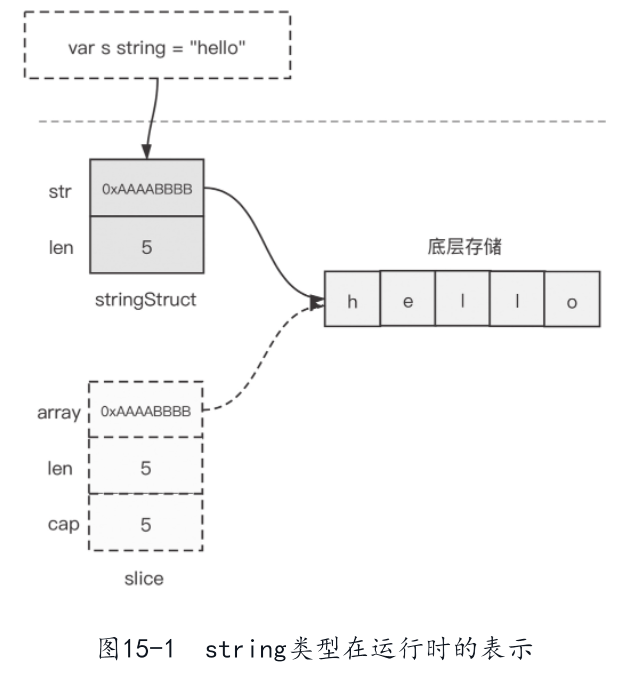

我们看到每个字符串类型变量/常量对应一个stringStruct实例，经过rawstring实例化后，stringStruct中的str指针指向真正存储字符串数据的底层内存区域，len字段存储的是字符串的长度（这里是5）；rawstring同时还创建了一个临时slice，该slice的array指针也指向存储字符串数据的底层内存区域。注意，rawstring调用后，新申请的内存区域还未被写入数据，该slice就是供后续运行时层向其中写入数据（"hello"）用的。写完数据后，该slice就可以被回收掉了，这也是图15-1中将slice结构以虚线框表示的原因。

直接将string类型通过函数/方法参数传入也不会有太多的损耗，因为传入的仅仅是一个“描述符”，而不是真正的字符串数据。

### 构造字符串

+ 使用fmt.Sprintf；
+ 使用strings.Join；
+ 使用strings.Builder；
+ 使用bytes.Buffer。

## 切片

### 切片与数组

```go
var myArray [3]int	//数组
var mySlice []int	//切片
```

**不像数组变量，声明切片变量并不会自动创建一个切片。**使用make或字面量来创建和初始化切片。

```go
var notes []string
notes = make([]string, 7) //创建7个字符的切片
//或者使用短变量声明，长度和容量都为5
primes := make([]int, 5)
//长度为3，容量为5
slice := make([]int, 3, 5)
```

切片并不会自己保存任何数据，它仅仅是底层数组的元素的**视图**。由于切片只是底层数组内容的视图，如果你修改底层数组，这些变化也会反映到切片。给切片的一个元素赋一个新值也会修改底层数组相应的元素。切片之于数组就像是文件描述符之于文件。在Go语言中，数组更多是“退居幕后”，承担的是底层存储空间的角色；而切片则走向“前台”，为底层的存储（数组）打开了一个访问的“窗口”。

### 底层表示

**切片有3个字段，分别是指向底层数组的指针、切片访问的元素的个数（即长度）和切片允许增长到的元素的个数（即容量）。**

```go
type slice struct{
    array	unsage.Pointer	// 指向下层数组某元素的指针，该元素也是切片的起始元素。
    len		int
    cap		int
}
```

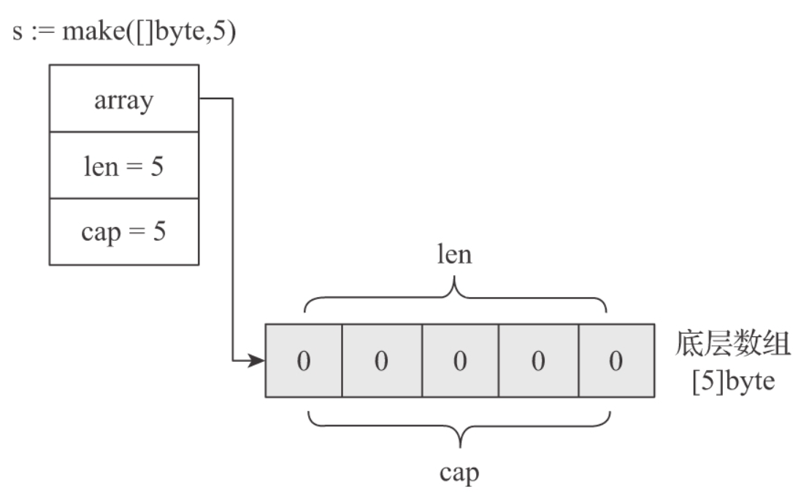

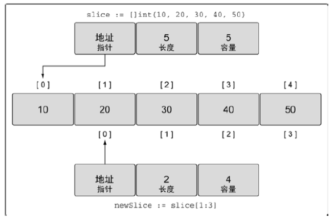

### 参数传递

在对切片本身进行赋值或参数传递时，和数组指针的操作方式类似，但是**只复制切片头信息**（`reflect.SliceHeader`），而不会复制底层的数据。对于类型，和数组的最大不同是，切片的类型和长度信息无关，只要是相同类型元素构成的切片均对应相同的切片类型。

### nil切片和空切片

在需要描述一个不存在的切片时，nil切片会很好用。`var a []int `nil切片，和nil相等。切片可以和nil进行比较，只有当切片底层数据指针为空时切片本身才为nil，这时候切片的长度和容量信息将是无效的。如果有切片的底层数据指针为空，但是长度和容量不为0的情况，那么说明切片本身已经被损坏了

空切片：

```go
// 空切片的两种方法
slice := make([]int, 0)
slice := []int{}
```

不管是使用nil切片还是空切片，对其调用内置的append、len和cap的效果都是一样的。

### append

切片增长：在切片容量小于1000时，成倍增长；在元素个数超过1000时，增长因子为1.25。 

```go
s1 := []int{1, 2}
s2 := []int{3, 4}
fmt.Printf("%v\n", append(s1, s2...)) //s2中的所有元素都添加到了s1之后。
```

以下来自《Go语言高级编程》

**末尾添加**：内置的泛型函数append()可以在切片的尾部追加N个元素：注意【解包】

```go
var a []int
a = append(a, 1)				//追加一个元素
a = append(a, 1, 2, 3)			//追加多个元素，手写解包方式
a = append(a, []int{1,2,3}...)	//追加一个切片，切片需要解包
```

**开头添加**：除了在切片的尾部追加，还可以在切片的开头添加元素：

```go
var a = []int{1,2,3}
a = append([]int{0}, a...)
a = append([]int{-3, -2, -1}, a...)
```

<u>在开头一般都会导致内存的重新分配，而且会导致已有的元素全部复制一次。因此，从切片的开头添加元素的性能一般要比从尾部追加元素的性能差很多。</u>

**中间添加**：由于append()函数返回新的切片，也就是它支持链式操作，因此我们可以将多个append ()操作组合起来，实现在切片中间插入元素：

```go
var a []int
a = append(a[:i], append([]int{x}, a[i:]...)...)		//在第i个位置插入x
a = append(a[:i], append([]int{1,2,3}, a[i:]...)...)	//在第i个位置插入切片
```

可以用copy和append结合的方式避免使用中间切片来进行在中间添加元素，具体看书1.3.3节。

在本节开头的数组部分我们提到过有类似[0]int的空数组，空数组一般很少用到。但是对于切片来说，len为0但是cap容量不为0的切片则是非常有用的特性。当然，如果len和cap都为0的话，则变成一个真正的空切片，虽然它并不是一个nil的切片。**在判断一个切片是否为空时，一般通过len获取切片的长度来判断，一般很少将切片和nil做直接的比较。**

### 动态扩容

切片的底层数组并不能增长大小。如果数组没有足够的空间来保存新的元素，所有的元素会被拷贝至一个新的更大的数组，并且切片会被更新为引用这个新的数组。但是由于这些场景都发生在append函数内部，无法知道返回的切片与传入append函数的切片是否具有相同的底层数组。如果你保留了两个切片，会导致一些非预期的错误。

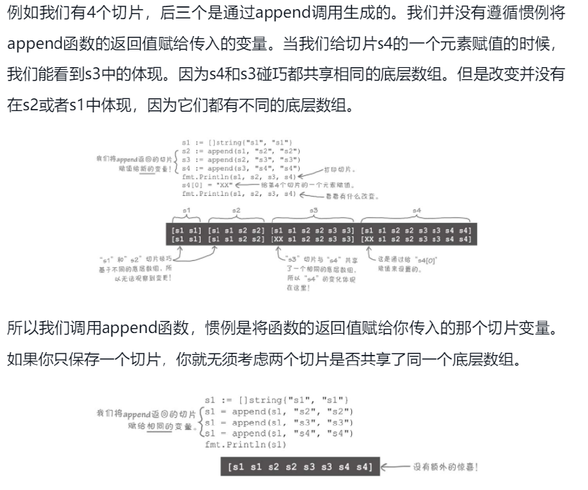

新数组建立后，append会把旧数组中的数据复制到新数组中，之后新数组便成为切片的底层数组，旧数组后续会被垃圾回收掉。这样的append操作有时会给Gopher带来一些困惑，比如通过语法u[low: high]形式进行数组切片化而创建的切片，一旦切片cap触碰到数组的上界，再对切片进行append操作，切片就会和原数组解除绑定：

```go
func main() {
	u := []int{11, 12, 13, 14, 15}
	fmt.Println("array:", u) // [11, 12, 13, 14, 15]
	s := u[1:3]
	fmt.Printf("slice(len=%d, cap=%d): %v\n", len(s), cap(s), s) // slice(len=2, cap=4): [12 13]
	s = append(s, 24)
	fmt.Println("after append 24, array:", u)	// [11 12 13 24 15]
	fmt.Printf("after append 24, slice(len=%d, cap=%d): %v\n", len(s), cap(s), s)	// slice(len=3, cap=4): [12 13 24]
	s = append(s, 25)
	fmt.Println("after append 25, array:", u)	// [11 12 13 24 25]
	fmt.Printf("after append 25, slice(len=%d, cap=%d): %v\n", len(s), cap(s), s)	// slice(len=4, cap=4): [12 13 24 25] 
	s = append(s, 26)
	fmt.Println("after append 26, array:", u)	// [11 12 13 24 25]
	fmt.Printf("after append 26, slice(len=%d, cap=%d): %v\n", len(s), cap(s), s)	// slice(len=5, cap=8): [12 13 24 25 26]

	s[0] = 22
	fmt.Println("after reassign 1st elem of slice, array:", u)	// [11 12 13 24 25]
	fmt.Printf("after reassign 1st elem of slice, slice(len=%d, cap=%d): %v\n", len(s), cap(s), s)	// slice(len=5, cap=8): [22 13 24 25 26]
}
```

我们看到在添加元素25之后，切片的元素已经触碰到底层数组u的边界；此后再添加元素26，append发现底层数组已经无法满足添加新元素的要求，于是新创建了一个底层数组（数组长度为cap(s)的2倍，即8），并将原切片的元素复制到新数组中。在这之后，即便再修改切片中的元素值，原数组u的元素也没有发生任何改变，因为此时切片s与数组u已经解除了绑定关系，s已经不再是数组u的描述符了。

### 在函数间传递切片

当切片作为函数参数传递给函数时，实际传递的是切片的内部表示，也就是上面的runtime.slice结构体实例，因此无论切片描述的底层数组有多大，切片作为参数传递带来的性能损耗都是很小且恒定的，甚至小到可以忽略不计，这就是函数在参数中多使用切片而不用数组指针的原因之一。而另一个原因就是切片可以提供比指针更为强大的功能，比如下标访问、边界溢出校验、动态扩容等。而C程序员最喜爱的指针本身在Go语言中的功能受到了限制，比如不支持指针算术运算等。

在函数间传递切片就是要在函数间以值的方式传递切片。由于切片尺寸很小，在函数间复制和传递切片成本也很低。<u>在64位架构的机器上，一个切片需要24字节的内存：指针字段需要8个字节，长度和容量分别需要8字节。</u>由于与切片关联的数据包含在底层数组里，不属于切片本身，所以将切片复制到任意函数的时候，对底层数组大小都不会有影响。复制时只会复制切片本身，不会涉及底层数组。

Go语言中，如果以切片为参数调用函数，有时候会给人一种参数采用了传引用的方式的假象：因为在被调用函数内部可以修改传入的切片的元素。<u>其实，任何可以通过函数参数修改调用参数的情形，都是因为函数参数中显式或隐式传入了指针参数。</u>函数参数传值的规范更准确说是只针对数据结构中固定的部分传值，例如字符串或切片对应结构体中的指针和字符串长度结构体传值，但是并不包含指针间接指向的内容。		因为切片中的底层数组部分通过隐式指针传递（<u>指针本身依然是传值的，但是指针指向的却是同一份的数据</u>），所以被调用函数可以通过指针修改调用参数切片中的数据。除数据之外，切片结构还包含了切片长度和切片容量信息，这两个信息也是传值的。如果被调用函数中修改了Len或Cap信息，就无法反映到调用参数的切片中，这时候我们一般会通过返回修改后的切片来更新之前的切片。这也是内置的append()必须要返回一个切片的原因。   ——《Go语言高级编程》

## map

map对value的类型没有限制，但是对key的类型有严格要求：key的类型应该严格定义了作为“==”和“!=”两个操作符的操作数时的行为，因此函数、map、切片不能作为map的key类型。map类型不支持“零值可用”，未显式赋初值的map类型变量的零值为nil。对处于零值状态的map变量进行操作将会导致运行时panic。**切片、函数以及包含切片的结构类型**这些类型由于具有引用语义，不能作为映射的键，使用这些类型会造成编译错误。

创建map类型变量有两种方式：一种是使用复合字面值，另一种是使用make这个预声明的内置函数。

### 基础操作

即便要删除的数据在map中不存在，delete也不会导致panic。

**映射一个存储键值对的==无序集合==。**我们看到对同一map做多次遍历，遍历的元素次序并不相同。这是因为Go运行时在初始化map迭代器时对起始位置做了随机处理。**因此千万不要依赖遍历map所得到的元素次序。**如果你需要一个稳定的遍历次序，那么一个比较通用的做法是使用另一种数据结构来按需要的次序保存key，比如切片。

### 内部实现

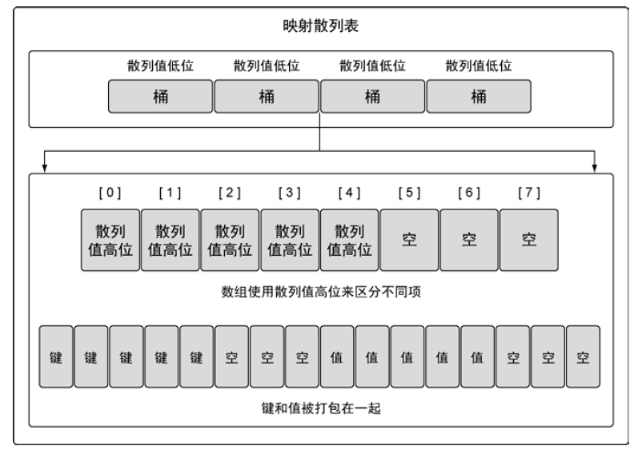

在我们的例子里，键是字符串，代表颜色。这些字符串会转换为一个数值（散列值）。这个数值落在映射已有桶的序号范围内表示一个可以用于存储的桶的序号。之后，这个数值就被用于选择桶，用于存储或者查找指定的键值对。对Go 语言的映射来说，**生成的散列键的一部分，具体来说是低位（LOB），被用来选择桶。**
如果再仔细看看图4-24，就能看出桶的内部实现。映射使用两个数据结构来存储数据。第一个数据结构是一个数组，内部存储的是用于选择桶的散列键的高八位值。这个数组用于区分每个键值对要存在哪个桶里。第二个数据结构是一个字节数组，用于存储键值对。该字节数组先依次存储了这个桶里所有的键，之后依次存储了这个桶里所有的值。实现这种键值对的存储方式目的在于减少每个桶所需的内存。

---

和切片相比，map类型的内部实现要复杂得多。Go运行时使用一张哈希表来实现抽象的map类型。运行时实现了map操作的所有功能，包括查找、插入、删除、遍历等。在编译阶段，Go编译器会将语法层面的map操作重写成运行时对应的函数调用。

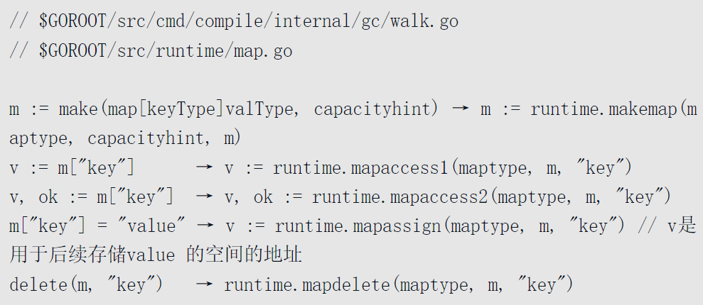

以下基于Go 1.12版本

#### 初始状态

从图14-1中我们可以看到，与语法层面map类型变量一一对应的是`runtime.hmap`类型的实例。**hmap是map类型的header，可以理解为map类型的描述符，它存储了后续map类型操作所需的所有信息。**

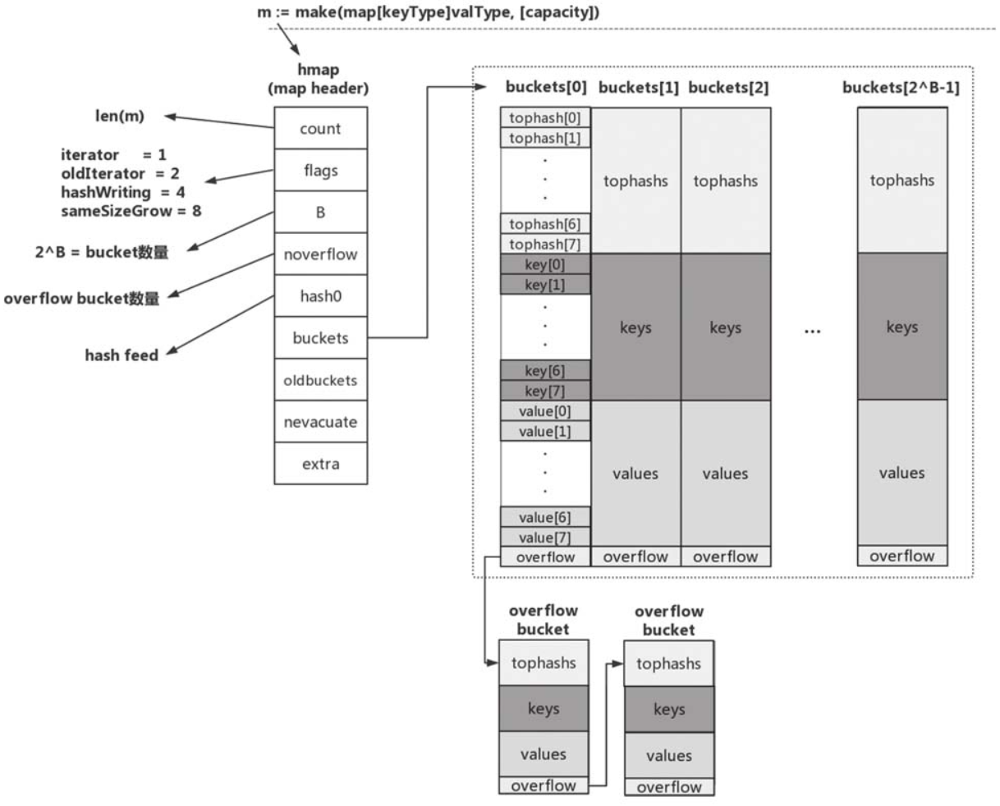

+ count：当前map中的元素个数；对map类型变量运用len内置函数时，len函数返回的就是count这个值。
+ flags：当前map所处的状态标志，目前定义了4个状态值——iterator、oldIterator、hashWriting和sameSizeGrow。
+ B：B的值是bucket数量的以2为底的对数，即2^B = bucket数量。
+ noverflow：overflow bucket的大约数量。
+ hash0：哈希函数的种子值。
+ buckets：指向bucket数组的指针。
+ oldbuckets：在map扩容阶段指向前一个bucket数组的指针。
+ nevacuate：在map扩容阶段充当扩容进度计数器。所有下标号小于nevacuate的bucket都已经完成了数据排空和迁移操作。
+ extra：可选字段。如果有overflow bucket存在，且key、value都因不包含指针而被内联（inline）的情况下，该字段将存储所有指向overflow bucket的指针，保证overflow bucket是始终可用的（不被垃圾回收掉）。

真正用来存储键值对数据的是bucket（桶），每个bucket中存储的是Hash值低bit位数值相同的元素，默认的元素个数为BUCKETSIZE（值为8，在`$GOROOT/src/cmd/compile/internal/gc/reflect.go`中定义，与`runtime/map.go`中常量`bucketCnt`保持一致）。当某个bucket（比如buckets[0]）的8个空槽（slot）都已填满且map尚未达到扩容条件时，运行时会建立overflow bucket，并将该overflow bucket挂在上面bucket（如buckets[0]）末尾的overflow指针上，这样两个bucket形成了一个链表结构，该结构的存在将持续到下一次map扩容。

每个bucket由三部分组成：tophash区域、key存储区域和value存储区域。

(1) tophash

当向map插入一条数据或从map按key查询数据的时候，运行时会使用哈希函数对key做哈希运算并获得一个哈希值hashcode。这个hashcode非常关键，运行时将hashcode“一分为二”地看待，其中低位区的值用于选定bucket，高位区的值用于在某个bucket中确定key的位置。这个过程可参考图14-2。

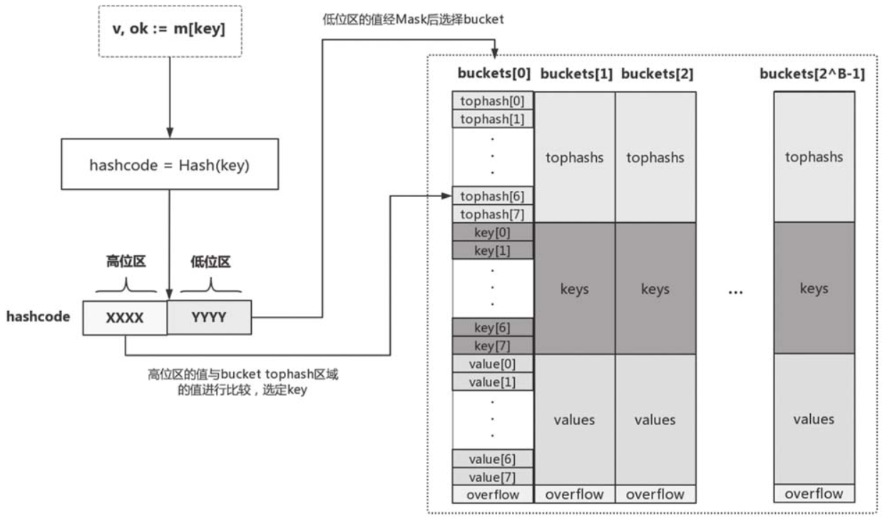

因此，每个bucket的tophash区域是用于快速定位key位置的，这样避免了逐个key进行比较这种代价较大的操作，尤其是当key是size较大的字符串类型时，这是一种以空间换时间的思路。

（2）key存储区域

（3）value存储区域

key存储区域下方是另一块连续的内存区域，该区域存储的是key对应的value。和key一样，该区域的创建也得到了maptype中信息的帮助。Go运行时采用了将key和value分开存储而不是采用一个kv接着一个kv的kv紧邻方式存储，这带来的是算法上的复杂性，但却减少了因内存对齐带来的内存浪费。
另外还有一点要提及的是，如果key或value的数据长度大于一定数值，那么运行时不会在bucket中直接存储数据，而是会存储key或value数据的指针

#### map扩容

那么map在什么情况下会进行扩容呢？Go运行时的map实现中引入了一个LoadFactor（负载因子），当`count > LoadFactor * 2^B`或`overflow bucket`过多时，运行时会对map进行扩容。

如果是因为overflow bucket过多导致的“扩容”，实际上运行时会新建一个和现有规模一样的bucket数组，然后在进行assign和delete操作时进行排空和迁移；如果是因为当前数据数量超出LoadFactor指定的水位的情况，那么运行时会建立一个两倍于现有规模的bucket数组，但真正的排空和迁移工作也是在进行assign和delete操作时逐步进行的。原bucket数组会挂在hmap的oldbuckets指针下面，直到原buckets数组中所有数据都迁移到新数组，原buckets数组才会被释放。结合图14-4来理解这个过程会更加深刻。

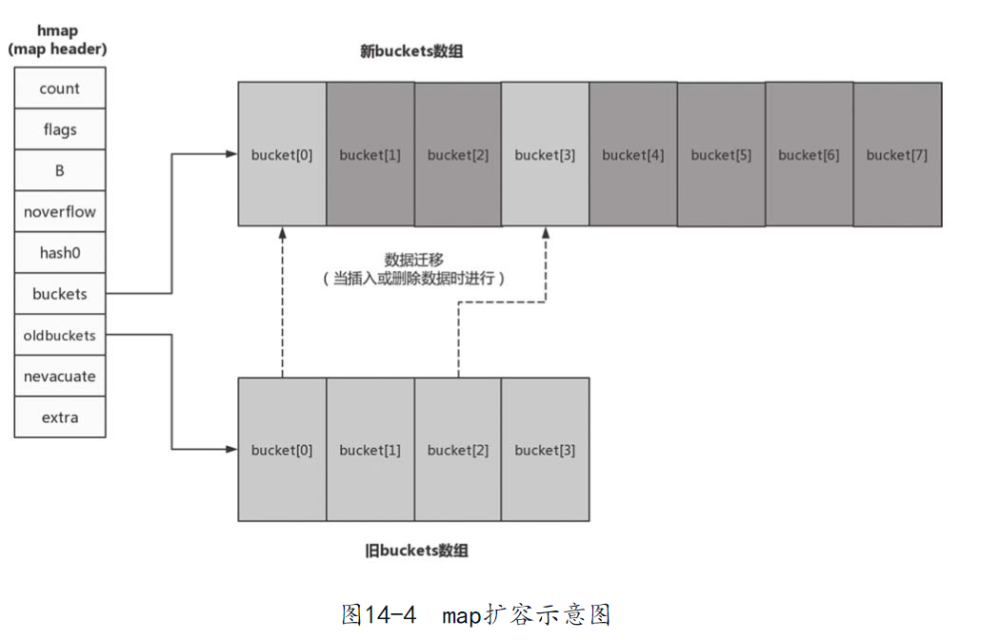

#### map与并发

从上面的实现原理来看，充当map描述符角色的hmap实例自身是有状态的（hmap.flags）且对状态的读写是没有并发保护的，因此map实例不是并发写安全的，不支持并发读写。如果对map实例进行并发读写，程序运行时会发生panic。

Go 1.9版本中引入了支持并发写安全的sync.Map类型，可以用来在并发读写的场景下替换掉map。另外考虑到map可以自动扩容，map中数据元素的value位置可能在这一过程中发生变化，因此Go不允许获取map中value的地址，这个约束是在编译期间就生效的。

### 参数传递

在函数间传递映射时，并不会制造出该映射的一个副本。和切片一样，map也是引用类型，将map类型变量作为函数参数传入不会有很大的性能损耗，并且在函数内部对map变量的修改在函数外部也是可见的。

```go
func foo(m map[string]int) {
	m["key1"] = 11
	m["key2"] = 12
}

func main() {
	m := map[string]int{
		"key1": 1,
		"key2": 2,
	}

	fmt.Println(m)		//map[key1:1 key2:2]
	foo(m)
	fmt.Println(m)		//map[key1:11 key2:22]
}
```


## 求值顺序

### 包级别变量

在Go包中，包级别变量的初始化按照变量声明的先后顺序进行。

+ 如果某个变量（如变量a）的初始化表达式中直接或间接依赖其他变量（如变量b），那么变量a的初始化顺序排在变量b后面。
+ 未初始化的且不含有对应初始化表达式或初始化表达式不依赖任何未初始化变量的变量，我们称之为“ready for initialization”变量。
+ 包级别变量的初始化是逐步进行的，每一步就是按照变量声明顺序找到下一个“ready for initialization”变量并对其进行初始化的过程。反复重复这一步骤，直到没有“ready for initialization”变量为止。
+ 位于同一包内但不同文件中的变量的声明顺序依赖编译器处理文件的顺序：先处理的文件中的变量的声明顺序先于后处理的文件中的所有变量。

还有一种比较特殊的情况值得我们在这里一并分析，那就是当多个变量在声明语句左侧且右侧为单一表达式时的表达式求值情况。在这种情况下，无论左侧哪个变量被初始化，同一行的其他变量也会被一并初始化。

具体看《Go语言精进之路》

### 普通求值顺序

Go规定表达式操作数中的所有函数、方法以及channel操作按照从左到右的次序进行求值。

当普通求值顺序与包级变量的初始化依赖顺序一并使用时，后者优先级更高，但每个单独表达式中的操作数求值依旧按照普通求值顺序的规则。

### 赋值语句求值

`n0, n1 = n0 + n1, n0`

这是一个赋值语句。Go语言规定，赋值语句求值分为两个阶段：1）第一阶段，对于等号左边的下标表达式、指针解引用表达式和等号右边表达式中的操作数，按照普通求值规则从左到右进行求值；2）第二阶段，按从左到右的顺序对变量进行赋值。

### switch/select语句中的求值

switch，惰性求值。

select：
1）select执行开始时，首先所有case表达式都会被按出现的先后顺序求值一遍。有一个例外，位于case等号左边的从channel接收数据的表达式（RecvStmt）不会被求值。
2）如果选择要执行的是一个从channel接收数据的case，那么该case等号左边的表达式在接收前才会被求值。

## 错误

The `error` type is an interface type. An `error` variable represents any value that can describe itself as a string

## make与new

<u>new一般用来获取类型对应的指针类型，而make只用来分配**管道、字典和切片**的创建等。make返回的是传入的类型，而不是指针。</u>

```go
// The new built-in function allocates memory. The first argument is a type,
// not a value, and the value returned is a pointer to a newly
// allocated zero value of that type.
func new(Type) *Type
```

```go
// The make built-in function allocates and initializes an object of type
// slice, map, or chan (only). Like new, the first argument is a type, not a
// value. Unlike new, make's return type is the same as the type of its
// argument, not a pointer to it. The specification of the result depends on
// the type:
// Slice: The size specifies the length. The capacity of the slice is
// equal to its length. A second integer argument may be provided to
// specify a different capacity; it must be no smaller than the
// length. For example, make([]int, 0, 10) allocates an underlying array
// of size 10 and returns a slice of length 0 and capacity 10 that is
// backed by this underlying array.
// Map: An empty map is allocated with enough space to hold the
// specified number of elements. The size may be omitted, in which case
// a small starting size is allocated.
// Channel: The channel's buffer is initialized with the specified
// buffer capacity. If zero, or the size is omitted, the channel is
// unbuffered.
func make(t Type, size ...IntegerType) Type
```

## 反射

在讲反射之前，先来看看 Golang 关于类型设计的一些原则

- 在 Golang 中变量包括（type, value）两部分
- type 包括 static type 和 concrete type. 简单来说 static type 是你在编码是看见的类型(如 int、string)，concrete type 是 runtime 系统看见的类型。类型断言能否成功，取决于变量的 concrete type，而不是 static type.

接下来要说的反射，就是能够在运行时更新变量和检查变量的值、调用变量的方法和变量支持的内在操作，而不需要在编译时就知道这些变量的具体类型。这种机制被称为反射。Golang 的基础类型是静态的（也就是指定 int、string 这些的变量，它的 type 是 static type），在创建变量的时候就已经确定，反射主要与 Golang 的 interface 类型相关（它的 type 是 concrete type），只有运行时 interface 类型才有反射一说。

# 函数与方法

## 函数

函数还可以返回一个函数。

### “一等公民”

基于上面关于“一等公民”的诠释，我们来看看Go语言的函数是如何满足上述条件而成为“一等公民”的。
（1）正常创建。（2）在函数内创建。（3）作为类型。`type HandleFunc func(ResponseWriter, *Request)`（4）存储到变量中。（5）作为参数传入函数。（6）作为返回值从函数返回。

Go中的函数可以像普通整型值那样被创建和使用。

#### 像对整型变量那样对函数进行显式类型转换

最为典型的示例就是http.HandlerFunc这个类型：

```go
func greeting(w http.ResponseWriter, r *http.Request) {
	fmt.Fprintf(w, "Welcome, Gopher!\n")
}

func main() {
	//http.ListenAndServe(":8080", http.HandlerFunc(greeting))
	http.ListenAndServe(":8080", greeting)
}
```

这里用到的正是函数作为“一等公民”的特性。
先来看ListenAndServe的源码：

```go
func ListenAndServe(addr string, handler Handler) error {
    server := &Server{Addr:addr, Handler:handler}
    return server.ListenAndServe()
}
```

ListenAndServe会将来自客户端的HTTP请求交给其第二个参数handler处理，而这里handler参数的类型http.Handler接口如下：

```go
type Handler interface{
    ServeHTTP(ResponseWriter, *Request)
}
```

该接口仅有一个方法ServeHTTP，其原型为func(http.ResponseWriter,*http.Request)。这与我们自己定义的HTTP请求处理函数greeting的原型是一致的。但我们不能直接将greeting作为参数值传入,即函数greeting并未实现接口Handler的方法，无法将其赋值给Handler类型的参数。
在代码中我们也并未直接将greeting传入ListenAndServe，而是将http.HandlerFunc(greeting)作为参数传给了ListenAndServe。

```go
type HandlerFunc func(ResponseWriter, *Request)

func (f Handler)ServeHTTP(w ResponseWriter, r *Request) {
    f(w, r)
}
```

HandlerFunc其实就是一个基于函数定义的新类型，它的底层类型为func(ResponseWriter, *Request)。该类型有一个方法ServeHTTP，因而实现了Handler接口。也就是说，http.HandlerFunc(greeting)这句代码的真正含义是将函数greeting显式转换为HandlerFunc类型，而后者实现了Handler接口，这样转型后的greeting就满足了ListenAndServe函数第二个参数的要求。另外，之所以http.HandlerFunc(greeting)这条语句可以通过编译器检查，是因为HandlerFunc的底层类型是func(ResponseWriter, *Request)，与greeting的原型是一致的。

#### 函数式编程

#### 

### 函数重载

**Go简单地不支持函数重载。但可以用方法实现。**
Go语言不允许在同一个作用域下定义名字相同但函数原型不同的函数，如果定义这样的函数，Go编译器会提示下面代码中的错误信息

那么我们在Go语言中怎么模拟重载函数呢？**变长参数函数**显然是最好的选择。如果要重载的函数的参数都是相同类型的，仅参数的个数是变化的，那么变长参数函数可以轻松对应；如果参数类型不同且个数可变，那么我们还要结合interface{}类型的特性。

```go
func concat(sep string, args ...interface{}) string {
	var result string
	for i, v := range args {
		if i != 0 {
			result += sep
		}
		switch v.(type) {
		case int, int8, int16, int32, int64,
			uint, uint8, uint16, uint32, uint64:
			result += fmt.Sprintf("%d", v)
		case string:
			result += fmt.Sprintf("%s", v)
		case []int:
			ints := v.([]int)
			for i, v := range ints {
				if i != 0 {
					result += sep
				}
				result += fmt.Sprintf("%d", v)
			}
		case []string:
			strs := v.([]string)
			result += strings.Join(strs, sep)
		default:
			fmt.Printf("the argument type [%T] is not supported", v)
			return ""
		}
	}
	return result
}

func main() {
	println(concat("-", 1, 2))
	println(concat("-", "hello", "gopher"))
	println(concat("-", "hello", 1, uint32(2),
		[]int{11, 12, 13}, 17,
		[]string{"robot", "ai", "ml"},
		"hacker", 33))
}
```


### 函数中的变量存储（堆栈）

栈是计算机内存中的一个区域，主要用于存储由函数创建的局部变量。当函数调用完成后，栈中存储的局部变量的内存会被自动清空，**操作系统可有效管理栈内内存空间，因此内存不会碎片化。**由于是内存连续的结构，因此存取数据也比较快。栈的内存大小限制取决于操作系统本身，且无法动态调整变量的内存大小。栈的内存是非常有限的，在栈上创建太多变量可能会增加栈溢出的风险。如果递归调用太多，就可能会导致栈内存溢出的情况。

堆是主要用来存储全局变量或大对象的地方。一般来说，所有全局变量都存储在堆内存空间中，它支持动态内存分配。堆中的变量一般会由垃圾回收机制来定期清理，但是如果语言本身没有自动垃圾回收，就需要程序员自行清理内存，否则比较容易造成内存泄漏。**堆中的内存结构往往不是连续的，因此读取数据的速度相对于栈来说慢一些。**堆内存管理比栈内存管理更加复杂，执行的时间也比栈更长。但是，堆可以进行全局变量操作，且能使用操作系可以提供的最大内存来存取变量。    

### 递归调用

Go语言中，函数还可以直接或间接地调用自己，也就是支持递归调用。Go语言函数的递归调用深度在逻辑上没有限制，**函数调用的栈是不会出现溢出错误的，因为Go语言运行时会根据需要动态地调整函数栈的大小。**

## 封装

Go中使用未导出的变量、struct字段、函数或方法，把数据封装在包中。 

## init函数

每个包可以包含任意多个init函数，这些函数都会在程序执行开始的时候被调用。 所有被编译器发现的init函数都会安排在main函数之前执行。init函数用在设置包、初始化变量或者其他要在程序运行之前优先完成的引导工作。如果一个包定义了init函数，Go运行时会负责在该包初始化时调用它的init函数。在Go程序中我们不能显式调用init，否则会在编译期间报错。

一个Go包可以拥有多个init函数，每个组成Go包的Go源文件中可以定义多个init函数。在初始化Go包时，Go运行时会按照一定的次序逐一调用该包的init函数。Go运行时不会并发调用init函数，它会等待一个init函数执行完毕并返回后再执行下一个init函数，且每个init函数在整个Go程序生命周期内仅会被执行一次。因此，init函数极其适合做一些包级数据的初始化及初始状态的检查工作。

一般来说，先被传递给Go编译器的源文件中的init函数先被执行，同一个源文件中的多个init函数按声明顺序依次执行。但Go语言的惯例告诉我们：不要依赖init函数的执行次序。

**函数init和main不能有任何的参数和返回值。init函数只能由Go程序自动调用，不可以被外部引用。**

**init函数可以在任意包中定义，并且可以重复定义多个。main函数只能用于main包中，且只能定义一个。** 

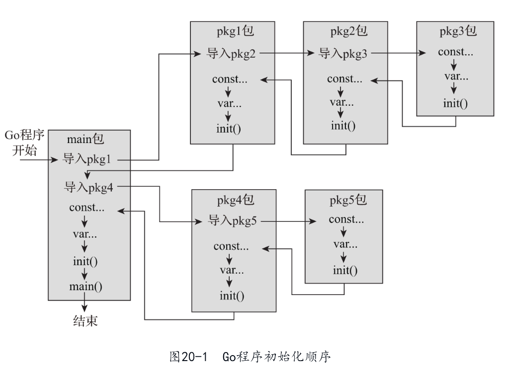

正如我们预期的那样，Go运行时按照pkg2→pkg1→pkg3→main的包顺序以及在包内常量→变量→init函数的顺序进行初始化。

空别名方式导入lib/pq的副作用就是Go运行时会将lib/pq作为main包的依赖包并会初始化pq包，于是pq包的init函数得以执行。
这种在init函数中注册自己的实现的模式降低了Go包对外的直接暴露，尤其是包级变量的暴露，避免了外部通过包级变量对包状态的改动。从database/sql的角度来看，这种注册模式实质是一种工厂设计模式的实现，sql.Open函数就是该模式中的工厂方法，它根据外部传入的驱动名称生产出不同类别的数据库实例句柄。

## 结构体

Go 中空结构体 `struct{} `是不占用内存空间，不像 C/C++ 中空结构体仍占用 1 字节。

```go
fmt.Println(unsafe.Sizeof(struct{}{})) // 输出为0
```

因为空结构体不占据内存空间，因此被广泛作为各种场景下的**占位符使用**。一是节省资源，二是空结构体本身就具备很强的语义，即这里不需要任何值，仅作为占位符，达到的代码即注释的效果。

**（1）实现集合Set。**
Go 语言标准库没有提供 Set 的实现，通常使用 map 来代替。事实上，对于集合来说，只需要 map 的键，而不需要值。即使是将值设置为 bool 类型，也会多占据 1 个字节，那假设 map 中有一百万条数据，就会浪费 1MB 的空间。因此呢，将 map 作为集合（Set）使用时，可以将值类型定义为空结构体，仅作为占位符使用即可。

**（2）不发送数据的信道**
有时候使用 channel 不需要发送任何的数据，只用来通知子协程（goroutine）执行任务，或只用来控制协程的并发。这种情况下，使用空结构体作为占位符就非常合适了。

```Go
func worker(ch chan struct{}) {
	<-ch
	fmt.Println("do something")
}

func main() {
	ch := make(chan struct{})
	go worker(ch)
	ch <- struct{}{}
	close(ch)
}
```

**（3）仅包含方法的结构体** 
在部分场景下，结构体只包含方法，不包含任何的字段。

## defer

延迟调用。defer语句经常用于对资源进行释放的场景，<u>比如释放数据库链接、解锁和关闭文件等</u>。因此，它在一些需要回收资源的场景非常有用，可以方便地在函数推出前做一些清理工作。

### 运作机制

defer将它们注册到其所在goroutine用于存放deferred函数的栈数据结构中，这些deferred函数将在执行defer的函数退出前被按**后进先出**（LIFO）的顺序调度执行（见图22-1）。

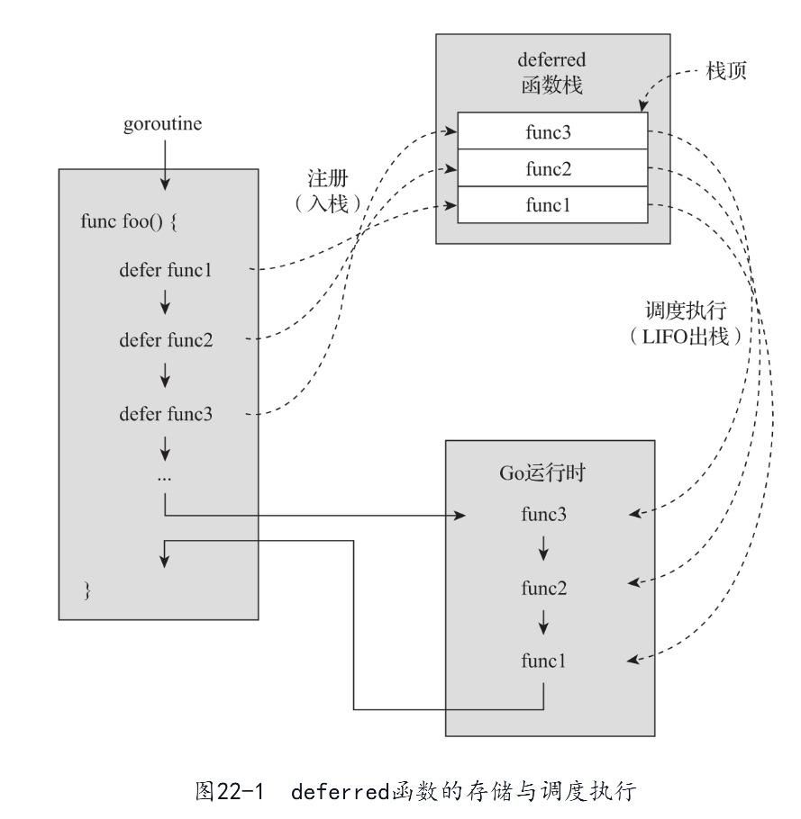

无论是执行到函数体尾部返回，还是在某个错误处理分支显式调用return返回，抑或出现panic，已经存储到deferred函数栈中的函数都会被调度执行。因此，deferred函数是一个在任何情况下都可以为函数进行收尾工作的好场合。

### 常见用法

1. 拦截panic

defer的第二个重要用途就是拦截panic，并按需要对panic进行处理，可以尝试从panic中恢复（这也是Go语言中唯一的从panic中恢复的手段）。

2. 修改函数的具名返回值

3. 输出调试信息
4. 还原变量旧值（较小众）

### 其他

对于自定义的函数或方法，defer可以给予无条件的支持，但是对于有返回值的自定义函数或方法，返回值会在deferred函数被调度执行的时候被自动丢弃。

defer关键字后面的表达式是在将deferred函数注册到deferred函数栈的时候进行求值的。

## 嵌入

一个类型使用**匿名字段**的方式保存到另一个struct类型中，被称为嵌入了struct。嵌入类型的方法会**提升**到外部类型。它们可以被调用，就像它们是在外部类型上定义的一样。

Go开发者使用组合设计模式，只需简单地将一个类型嵌入到另一个类型，就能复用所有的功能。

## 方法

Go使用接收器参数来代替self和this。两者有着巨大的不同，self和this是隐含的，而Go中是显式地声明一个接收器参数。receiver参数的基类型本身不能是指针类型或接口类型。
你只能为定义在当前包的类型定义方法。为一个像int一样全局定义的类型定义方法会导致编译错误。不能为原生类型（如int、float64、map等）添加方法，只能为自定义类型定义方法。

当你用一个非指针的变量调用一个需要指针的接收器的方法的时候，Go会自动为你将非指针类型转换为指针类型。同样指针类型也会自动转换为非指针类型，如果你调用一个要求值类型的接收器，Go会自动帮你获取指针指向的值，然后传递给方法。

```go
//Package, imports, type omitted
func (n *Number) Double() {
    *n *= 2
}
func main() {
    number := Number(4)
    fmt.Println("Original value of number:", number)
    number.Double()	//不需要改方法的调用
}
```

值接收者使用值的副本来调用方法，而指针接收者使用实际值来调用方法。 

---

<u>在C++语言中方法对应一个类对象的成员函数，是关联到具体对象上的虚表中的。但是Go语言的方法却是关联到类型的，这样可以在编译阶段完成方法的静态绑定。</u>

**Go语言中方法是编译时静态绑定的。如果需要虚函数的多态特性，我们需要借助Go语言接口来实现。**

Go方法的本质：一个以方法所绑定类型实例为第一个参数的普通函数。

```go
var t T
t.Get()
t.Set(1)
```

```go
var t T
T.Get(t)
(*T).Set(&t, 1)
```

方法和函数的等价变换公式：`func (t T) M1() <=> M1(t T)`, `func (t *T) M2() <=> M2(t *T)`
Go函数的参数采用的是值复制传递，也就是说M1函数体中的t是T类型实例的一个副本，这样在M1函数的实现中对参数t做任何修改都只会影响副本，而不会影响到原T类型实例。选择以`*T`作为receiver参数类型时，T的M2方法等价为`M2(t *T)`。我们传递给M2函数的t是T类型实例的地址，这样M2函数体中对参数t做的任何修改都会反映到原T类型实例上。

**无论是T类型实例还是\*T类型实例，都既可以调用receiver为T类型的方法，也可以调用receiver为\*T类型的方法。**实际上这都是Go语法糖，Go编译器在编译和生成代码时为我们自动做了转换。

```go
var t T
t.M1()	// ok
t.M2()	// <=> (&t).M2()
var pt = &T{}
pt.M1()	//<=> (*pt).M1()
pt.M2()	//ok
```

+ 如果要对类型实例进行修改，那么为receiver选择\*T类型。
+ 如果没有对类型实例修改的需求，那么为receiver选择T类型或\*T类型均可；但考虑到Go方法调用时，receiver是以值复制的形式传入方法中的，如果类型的size较大，以值形式传入会导致较大损耗，这时选择\*T作为receiver类型会更好些。
+ 关于receiver类型的选择其实还有一个重要因素，那就是类型是否要实现某个接口，这个考量因素将在下一条中详细说明。【也就是，是否支持将T类型实例赋值给某个接口类型变量。如果需要支持，我们就要实现receiver为T类型的接口类型方法集合中的所有方法。

## 接口

在Go中，一个接口被定义为特定值预期具有的**一组方法**。你可以把接口看作需要类型实现的一组行为。
接口类型并不描述是哪个值：它们不说它的基础类型是什么，或者数据是如何存储的。<u>它们仅仅描述了这个值能做什么：它有哪些方法。</u>

==**如果一个类型声明了指针接收器方法，你就只能将那个类型的指针传递给接口变量。**==

**Go语言的多态通过接口来实现。**接口类型变量在程序运行时可以被赋值为不同的动态类型变量，从而支持运行时多态。
对接口值方法的调用会执行接口值里存储的用户定义的类型的值对应的方法。因为任何用户定义的类型都可以实现任何接口，所以对接口值方法的调用自然就是一种**多态**。在这个关系里，用户定义的类型通常叫作**实体类型**，原因是如果离开内部存储的用户定义的类型的值的实现，接口值并没有具体的行为。

### 内部表示

```go
type iface struct{
    tab		*itab
    data	unsaf.Pointer
}
type eface struct{
    _type	*_type
    data	unsafe.Pointer
}
```

在运行时层面，接口类型变量有两种内部表示——eface和iface，这两种表示分别用于不同接口类型的变量。

+ eface：用于表示没有方法的空接口（empty interface）类型变量，即interface{}类型的变量。
+ iface：用于表示其余拥有方法的接口（interface）类型变量。

这两种结构的共同点是都有两个指针字段，并且第二个指针字段的功用相同，都指向当前赋值给该接口类型变量的动态类型变量的值。不同点在于eface所表示的空接口类型并无方法列表，因此其第一个指针字段指向一个_type类型结构，该结构为该接口类型变量的动态类型的信息。而iface除了要存储动态类型信息之外，还要存储接口本身的信息（接口的类型信息、方法列表信息等）以及动态类型所实现的方法的信息，因此iface的第一个字段指向一个itab类型结构。

```go
type itab struct{
    inter	*interfacetype
    _type	*_type
    hash	uint32
    _		[4]byte
    fun		[1]uintptr
}
```

上面itab结构中的第一个字段inter指向的interfacetype结构存储着该<u>接口类型自身</u>的信息。interfacetype类型定义如下，该interfacetype结构由类型信息（typ）、包路径名（pkgpath）和接口方法集合切片（mhdr）组成。itab结构中的字段_type则存储着该接口类型变量的动态类型的信息，字段fun则是动态类型已实现的接口方法的调用地址数组。

```go
type T struct{
    n	int
    s	string
}
func main(){
    var t = T {
        n: 17,
        s: "hello",
    }
    var ei interface = t
}
```

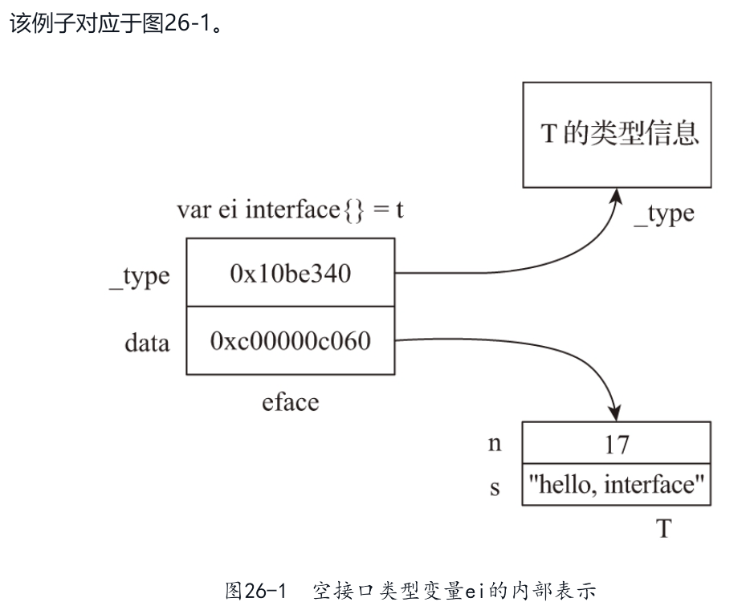

```go
type T struct{
    n	int
    s	string
}
func (T) M1(){}
func (T) M2(){}
type NonEmptyInterface interface{
    M1()
    M2()
}
func main(){
    var t = T {
        n: 18,
        s: "hello, interface",
    }
    var i NonEmptyInterface = t
}
```

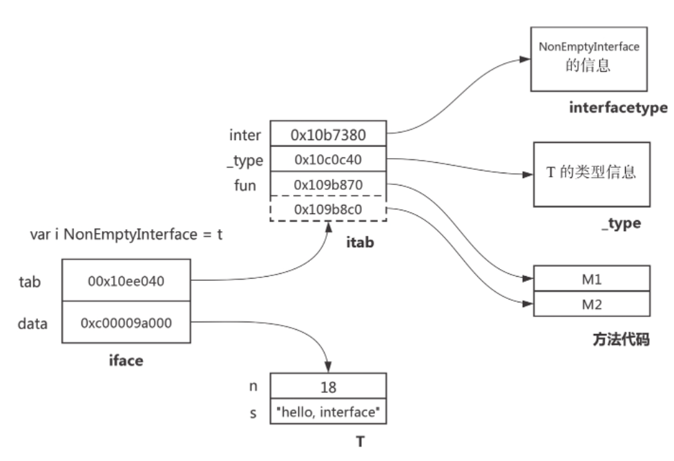

Go语言中每种类型都有唯一的\_type信息，无论是内置原生类型，还是自定义类型。我们要判断两个接口类型变量是否相同，只需判断\_type/tab是否相同以及data指针所指向的内存空间所存储的数据值是否相同（注意：不是data指针的值）。

1. nil接口变量

无论是空接口类型变量还是非空接口类型变量，一旦变量值为nil，那么它们内部表示均为(0x0,0x0)，即类型信息和数据信息均为空。

2. 空接口类型变量

对于空接口类型变量，只有在`_type`和`data`所指数据内容一致（注意：不是数据指针的值一致）的情况下，两个空接口类型变量之间才能画等号。Go在创建eface时一般会为data重新分配内存空间，将动态类型变量的值复制到这块内存空间，并将data指针指向这块内存空间。因此我们在多数情况下看到的data指针值是不同的。

3. 非空接口变量

即非空接口类型变量的类型信息并不为空，数据指针为空，因此它与nil(0x0,0x0)之间不能画等号。

4. 空接口类型变量与非空接口类型变量的等值比较

Go在进行等值比较时，类型比较使用的是eface的`_type`和iface的`tab._type`

### 接口类型值的形式

图 5-1 展示了在user 类型**值赋值**后接口变量的值的内部布局。接口值是一个两个字长度的数据结构，第一个字包含一个指向内部表的指针。这个内部表叫作`iTable`，包含了所存储的值的类型信息。iTable 包含了已存储的值的类型信息以及与这个值相关联的一组方法。第二个字是一个指向所存储值的指针。将类型信息和指针组合在一起，就将这两个值组成了一种特殊的关系。

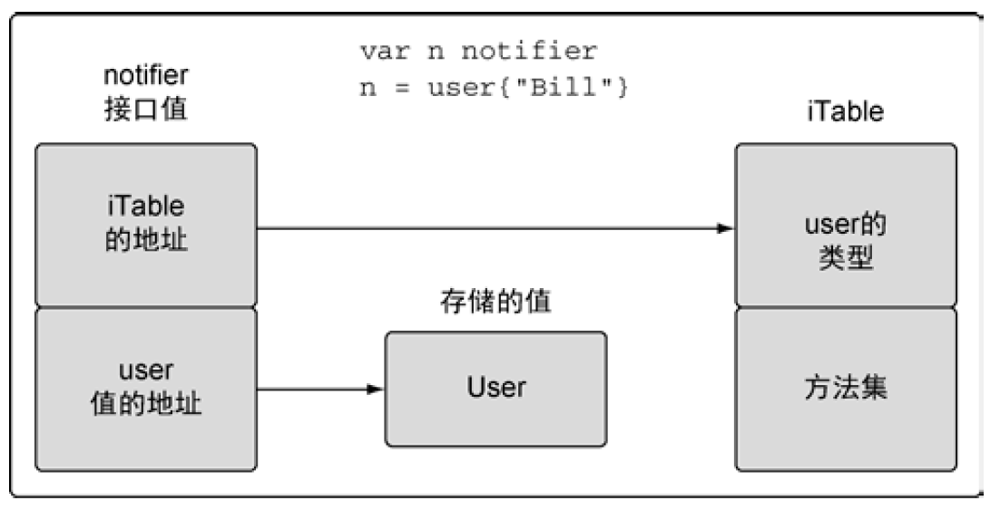

图 5-2 展示了一个**指针赋值**给接口之后发生的变化。在这种情况里，类型信息会存储一个指向保存的类型的指针，而接口值第二个字依旧保存指向实体值的指针。

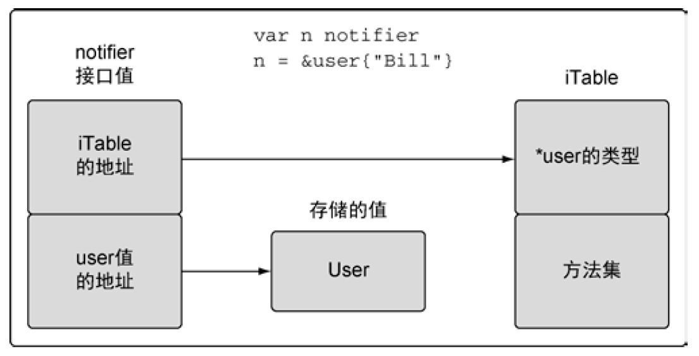

### 方法集

如果某个自定义类型T的方法集合是某个接口类型的方法集合的超集，那么就说类型T实现了该接口，并且类型T的变量可以被赋值给该接口类型的变量，即我们说的**方法集合决定接口实现**。

<u>对于非接口类型的自定义类型T，其方法集合由所有receiver为T类型的方法组成；而类型\*T的方法集合则包含所有receiver为T和\*T类型的方法。</u>

方法集定义了一组关联到给定类型的值或者指针的方法。定义方法时使用的接收者的类型决定了这个方法是关联到值，还是关联到指针，还是两个都关联。

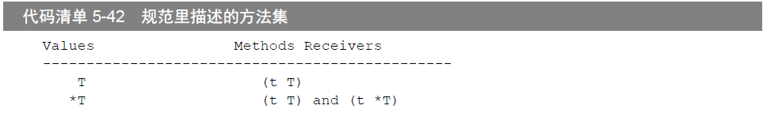

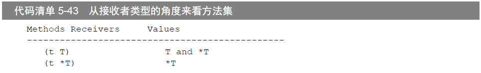

+ 如果使用**指针接收者**来实现一个接口，那么只有指向那个类型的**指针**才能够实现对应的接口。
+ 如果使用**值接收者**来实现一个接口，那么那个类型的**值和指针**都能够实现对应的接口。

> 为什么会有这种限制？

因为编译器并不能总是自动获得一个值的地址。

### 类型嵌入与方法集

### 装箱

在Go语言中，将任意类型赋值给一个接口类型变量都是装箱操作。接口类型的装箱实则就是创建一个eface或iface的过程。

由此我们也可以看出，经过装箱后，箱内的数据（存放在新分配的内存空间中）与原变量便无瓜葛了，除非是指针类型。接口类型变量的装箱操作由Go编译器和运行时共同完成。

### 接口水平组合

```go
func YourFuncName(param YourInterfaceType)
```

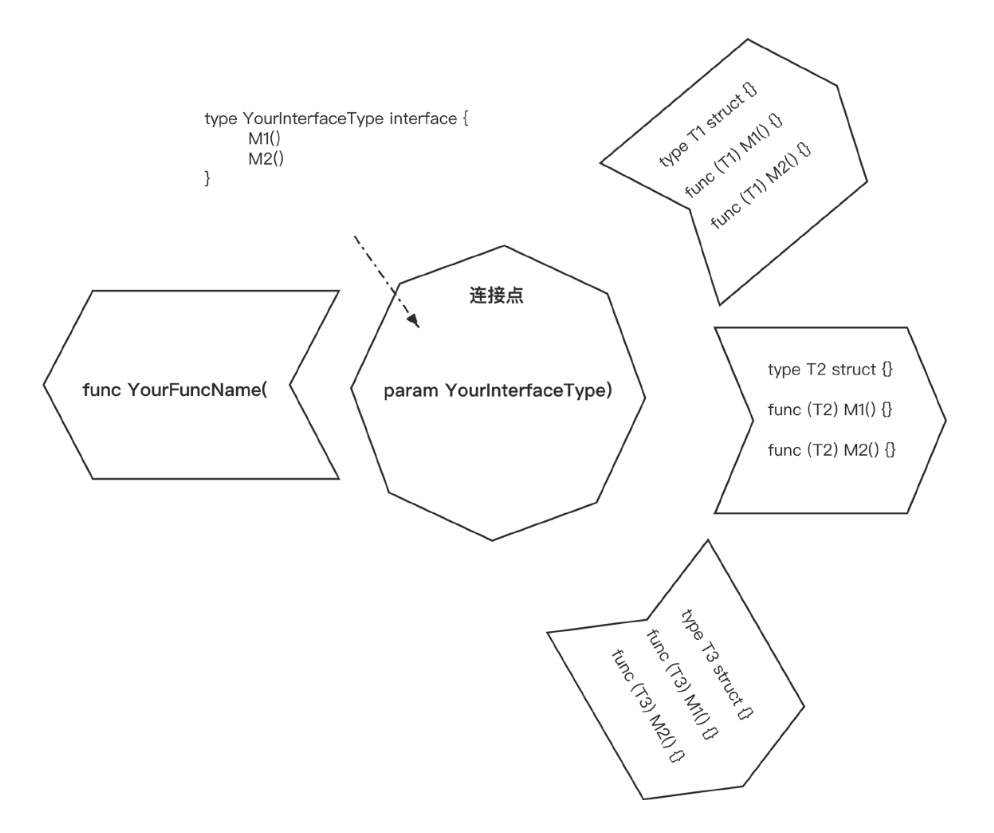

**包裹函数**

```go
func YourWrapperFunc(param YourInterfaceType) YourInterfaceType
```

通过包裹函数可以实现对输入数据的过滤、装饰、变换等操作，并将结果再次返回给调用者。
由于包裹函数的返回值类型与参数类型相同，因此我们可以将多个接受同一接口类型参数的包裹函数组合成一条链来调用，其形式如下:

```go
YourWrapperFunc1(YourWrapperFunc2(YourWrapperFunc3(...)))
```

**适配器类型**

最典型的适配器函数类型莫过于第21条提到过的http.HandlerFunc了。

**中间件**

这里的中间件就是包裹函数和适配器函数类型结合的产物。
我们看到所谓中间件（如logHandler、authHandler）本质上就是一个包裹函数（支持链式调用），但其内部利用了适配器函数类型（http.HandlerFunc）将一个普通函数（如例子中的几个匿名函数）转换为实现了http.Handler的类型的实例，并将其作为返回值返回。

# 并发

## goroutine

在Go语言中会使用同一个线程来执行多个goroutine，它占用的内存远少于线程，使用它需要的代码更少。

Go 语言的并发同步模型来自一个叫作通信顺序进程（Communicating Sequential Processes，**CSP**）的范型（paradigm）。CSP 是一种消息传递模型，通过在goroutine 之间传递数据来传递消息，而不是对数据进行加锁来实现同步访问。用于在goroutine 之间同步和传递数据的关键数据类型叫作通道（channel）。需要考虑通过CSP模型输入/输出原语的承载体channel在goroutine之间建立联系。为了满足这一需求，我们通常使用下面的方式来创建goroutine：

```go
type T struct {...}

func spawn(f func()) chan T {
    c := make(chan T)
    go func() {
        // 使用channel变量c（通过闭包方式）与调用spawn的goroutine通信
        ...
        f()
        ...
    }()
    return c
}
func main() {
    c := spawn(func(){})
}
```

以上方式在内部创建一个goroutine并返回一个channel类型变量的函数，这是Go中最常见的goroutine创建模式。spawn函数创建的新goroutine与调用spawn函数的goroutine之间通过一个channel建立起了联系：两个goroutine可以通过这个channel进行通信。

操作系统会在物理处理器上调度线程来运行，而Go 语言的运行时会在逻辑处理器上调度goroutine来运行。

## channel

channel通过blocking（阻塞）——暂停当前goroutine中的所有进一步操作来实现这一点。发送操作阻塞发送goroutine，直到另一个goroutine在同一channel上执行了接收操作。| channel可以帮用户避免其他语言里的共享内存访问的问题。

需要强调的是，通道并不提供跨goroutine的数据访问保护机制。如果通过通道传输数据的一份副本，那么每个goroutine都持有一份副本，各自对自己的副本修改是安全的。当传输的是指向数据的指针时，如果读和写是由不同的goroutine完成的，每个goroutine依旧需要额外的同步动作。

在Go 语言里，你不仅可以使用<u>原子函数</u>和<u>互斥锁</u>来保证对共享资源的安全访问以及消除竞争状态，还可以使用通道，**通过发送和接收需要共享的资源**，在goroutine 之间做同步。声明通道时，需要指定将要被共享的数据的类型。可以通过通道共享**内置类型、命名类型、结构类型和引用类型的值或者指针。**

```go
unbuffered := make(chan int)
buffered := make(chan string, 10)
```

可以看到使用内置函数make 创建了两个通道，一个无缓冲的通道，一个有缓冲的通道。make 的第一个参数需要是关键字chan，之后跟着允许通道交换的数据的
类型。如果创建的是一个有缓冲的通道，之后还需要在第二个参数指定这个通道的缓冲区的大小。

### 无缓冲

**无缓冲通道：**无缓冲的通道（unbuffered channel）是指在接收前没有能力保存任何值的通道。这种类型的通道要求**发送goroutine 和接收goroutine 同时准备好**，才能完成发送和接收操作。如果两个goroutine没有同时准备好，通道会导致先执行发送或接收操作的goroutine**阻塞等待**。这种对通道进行发送和接收的**交互行为本身就是同步的**。其中任意一个操作都无法离开另一个操作单独存在。

> 用途

（1）一对一通知

（2）一对多通知：关闭一个无缓冲channel会让所有阻塞在该channel上的接收操作返回，从而实现一种一对多的广播机制。【main goroutine通过close(groupSignal)向所有worker goroutine广播“开始工作”的信号，所有worker goroutine在收到groupSignal后一起开始工作，就像起跑线上的运动员听到了裁判员发出的起跑信号枪声起跑一样。

（3）用于替代锁机制：无缓冲channel具有同步特性，这让它在某些场合可以替代锁，从而使得程序更加清晰，可读性更好。

### 有缓冲

**有缓冲通道**：有缓冲的通道（buffered channel）是一种在被接收前能存储一个或者多个值的通道。这种类型的通道并不强制要求goroutine 之间必须同时完成发送和接收。通道会阻塞发送和接收动作的条件也会不同。<u>只有在通道中没有要接收的值时，接收动作才会阻塞。只有在通道没有可用缓冲区容纳被发送的值时，发送动作才会阻塞。</u>这导致有缓冲的通道和无缓冲的通道之间的一个很大的不同：**无缓冲的通道保证进行发送和接收的goroutine 会在同一时间进行数据交换；有缓冲的通道没有这种保证。**
当通道关闭后，<u>goroutine 依旧可以从通道接收数据，但是不能再向通道里发送数据</u>。能够从已经关闭的通道接收数据这一点非常重要，因为这允许通道关闭后依旧能取出其中缓冲的全部值，而不会有数据丢失。

（1）用作消息队列

（2）用作计数统计量：Go并发设计的一个惯用法是将带缓冲channel用作计数信号量（countingsemaphore）。带缓冲channel中的当前数据个数代表的是当前同时处于活动状态（处理业务）的goroutine的数量，而带缓冲channel的容量（capacity）代表允许同时处于活动状态的goroutine的最大数量。一个发往带缓冲channel的发送操作表示获取一个信号量槽位，而一个来自带缓冲channel的接收操作则表示释放一个信号量槽位。

<u>从一个已关闭的channel执行获取操作，不会阻塞。但对一个nil channel执行获取操作，该操作会被阻塞。</u> 

## 信号

《Go并发编程实战》P73：再看os/signal代码包中的Notify和Stop函数。它们都是以signal接收通道为唯一标识来对相应的信号集合进行处理的。在signal处理程序的内部，存在一个包级私有的字典，这个字典用于存放以signal接收通道为键并以信号集合的变体为元素的键值对。

## Sync包

### Sync.Mutex

**禁止复制**首次使用后的Mutex、RWMutex和Cond。

```go
type Mutex struct{
    state	int32
    sema	uint32
}
```

state：表示当前互斥锁的状态。sema：用于控制锁状态的信号量。对Mutex实例的复制即是对两个整型字段的复制。在初始状态下，Mutex实例处于Unlocked状态（state和sema均为0）。g2复制了处于初始状态的Mutex实例，副本的state和sema均为0，这与g2自定义一个新的Mutex实例无异，这决定了g2后续可以按预期正常运行。后续主程序调用了Lock方法，Mutex实例变为Locked状态（state字段值为sync.mutex-Locked），而此后g3创建时恰恰复制了处于Locked状态的Mutex实例（副本的state字段值亦为sync.mutexLocked），因此g3再对其实例副本调用Lock方法将会导致其进入阻塞状态（也是死锁状态，因为没有任何其他机会调用该副本的Unlock方法了，并且Go不支持递归锁）。

通过上述示例我们直观地看到，那些sync包中类型的实例在首次使用后被复制得到的副本一旦再被使用将导致不可预期的结果，为此<u>在使用sync包中类型时，推荐通过**闭包方式**或**传递类型实例（或包裹该类型的类型实例）的地址或指针**的方式进行，这是使用sync包最值得注意的事项。</u>

**读写锁：**
在并发量较小的情况下，互斥锁性能更好；随着并发量增大，互斥锁的竞争激烈，导致加锁和解锁性能下降。
读写锁的读锁性能并未随并发量的增大而发生较大变化，性能始终恒定在40ns左右。
在并发量较大的情况下，读写锁的写锁性能比互斥锁、读写锁的读锁都差，并且随着并发量增大，其写锁性能有继续下降的趋势。
由此我们可以看出，<u>读写锁适合应用在具有一定并发量且读多写少的场合</u>。

### Sync.Cond

sync.Cond是传统的条件变量原语概念在Go语言中的实现。一个条件变量可以理解为一个容器，这个容器中存放着一个或一组等待着某个条件成立的goroutine。当条件成立时，这些处于等待状态的goroutine将得到通知并被唤醒以继续后续的工作。这与百米飞人大战赛场上各位运动员等待裁判员的发令枪声十分类似。

条件变量是同步原语的一种，如果没有条件变量，开发人员可能需要在goroutine中通过连续轮询的方式检查是否满足条件。连续轮询非常消耗资源，因为goroutine在这个过程中处于活动状态但其工作并无进展。

我们看到sync.Cond实例的初始化需要一个满足实现了sync.Locker接口的类型实例，通常我们使用sync.Mutex。条件变量需要这个互斥锁来同步临界区，保护用作条件的数据。各个等待条件成立的goroutine在加锁后判断条件是否成立，如果不成立，则调用sync.Cond的Wait方法进入等待状态。Wait方法在goroutine挂起前会进行Unlock操作。在main goroutine将ready置为true并调用sync.Cond的Broadcast方法后，各个阻塞的goroutine将被唤醒并从Wait方法中返回。在Wait方法返回前，Wait方法会再次加锁让goroutine进入临界区。接下来goroutine会再次对条件数据进行判定，如果条件成立，则解锁并进入下一个工作阶段；如果条件依旧不成立，那么再次调用Wait方法挂起等待。

### Sync.Once

#### 简介

sync.Once 是 Go 标准库提供的使函数只执行一次的实现，常应用于单例模式，例如初始化配置、保持数据库连接等。作用与 init 函数类似，但有区别。

- `init`函数是当所在的 package 首次被加载时执行，若迟迟未被使用，则既浪费了内存，又延长了程序加载时间。
- `sync.Once`可以在代码的任意位置初始化和调用，因此可以延迟到使用时再执行，<u>并发场景下是线程安全的</u>。

在多数情况下，sync.Once 被用于控制变量的初始化，这个变量的读写满足如下三个条件：

- 当且仅当第一次访问某个变量时，进行初始化（写）；
- 变量初始化过程中，所有读都被阻塞，直到初始化完成；
- 变量仅初始化一次，初始化完成后驻留在内存里。

即便在函数f中出现panic，sync.Once原语也会认为once.Do执行完毕，后续对once.Do的调用将不再执行f。

#### 原理

sync.Once 用来保证函数只执行一次。要达到这个效果，需要做到两点：

- 计数器，统计函数执行次数；
- 线程安全，保障在多 Go 程的情况下，函数仍然只执行一次，比如锁。

##### 源码

下面看一下 sync.Once 结构，其有两个变量。使用`done`统计函数执行次数，使用锁`m`实现线程安全。果不其然，和上面的猜想一致。

```go
// Once is an object that will perform exactly one action.
//
// A Once must not be copied after first use.
type Once struct {
 // done indicates whether the action has been performed.
 // It is first in the struct because it is used in the hot path.
 // The hot path is inlined at every call site.
 // Placing done first allows more compact instructions on some architectures (amd64/386),
 // and fewer instructions (to calculate offset) on other architectures.
 done uint32
 m    Mutex
}
```

sync.Once 仅提供了一个导出方法 Do()，参数 f 是只会被执行一次的函数，一般为对象初始化函数。

```go
// go version go1.17 darwin/amd64

// Do calls the function f if and only if Do is being called for the
// first time for this instance of Once. In other words, given
//  var once Once
// if once.Do(f) is called multiple times, only the first call will invoke f,
// even if f has a different value in each invocation. A new instance of
// Once is required for each function to execute.
//
// Do is intended for initialization that must be run exactly once. Since f
// is niladic, it may be necessary to use a function literal to capture the
// arguments to a function to be invoked by Do:
//  config.once.Do(func() { config.init(filename) })
//
// Because no call to Do returns until the one call to f returns, if f causes
// Do to be called, it will deadlock.
//
// If f panics, Do considers it to have returned; future calls of Do return
// without calling f.
//
func (o *Once) Do(f func()) {
 // Note: Here is an incorrect implementation of Do:
 //
 // if atomic.CompareAndSwapUint32(&o.done, 0, 1) {
 //  f()
 // }
 //
 // Do guarantees that when it returns, f has finished.
 // This implementation would not implement that guarantee:
 // given two simultaneous calls, the winner of the cas would
 // call f, and the second would return immediately, without
 // waiting for the first's call to f to complete.
 // This is why the slow path falls back to a mutex, and why
 // the atomic.StoreUint32 must be delayed until after f returns.

	if atomic.LoadUint32(&o.done) == 0 {
  	// Outlined slow-path to allow inlining of the fast-path.
 		o.doSlow(f)
	}
}

func (o *Once) doSlow(f func()) {
	o.m.Lock()
	defer o.m.Unlock()
	if o.done == 0 {
 		defer atomic.StoreUint32(&o.done, 1)
  		f()
 	}
}
```

抛去大段的注释，可以看到 sync.Once 实现非常简洁。Do() 函数中，通过对成员变量 done 的判断，来决定是否执行传入的任务函数。执行任务函数前，通过锁保证任务函数的执行和 done 的修改是一个互斥操作。在执行任务函数前，对 done 做一个二次判断，来保证任务函数只会被执行一次，done 只会被修改一次。

##### **done 为什么是第一个字段**

从字段 done 前有一段注释，说明了done 为什么是第一个字段。

done 在热路径中，done 放在第一个字段，能够减少 CPU 指令，也就是说，这样做能够提升性能。

热路径（hot path）是程序非常频繁执行的一系列指令，sync.Once 绝大部分场景都会访问 o.done，在热路径上是比较好理解的。如果 hot path 编译后的机器码指令更少，更直接，必然是能够提升性能的。

为什么放在第一个字段就能够减少指令呢？因为结构体第一个字段的地址和结构体的指针是相同的，如果是第一个字段，直接对结构体的指针解引用即可。如果是其他的字段，除了结构体指针外，还需要计算与第一个值的偏移（calculate offset）。在机器码中，偏移量是随指令传递的附加值，CPU 需要做一次偏移值与指针的加法运算，才能获取要访问的值的地址。因为，访问第一个字段的机器代码更紧凑，速度更快。

#### 性能差异

我们以一个简单示例，来说明使用 sync.Once 保证函数只会被执行一次和多次执行，二者的性能差异。

考虑一个简单的场景，函数 ReadConfig 需要读取环境变量，并转换为对应的配置。环境变量在程序执行前已经确定，执行过程中不会发生改变。ReadConfig 可能会被多个协程并发调用，为了提升性能（减少执行时间和内存占用），使用 sync.Once 是一个比较好的方式。

```go
type Config struct {
 GoRoot string
 GoPath string
}

var (
	once   sync.Once
    config *Config
)

func ReadConfigWithOnce() *Config {
 once.Do(func() {
  config = &Config{
   GoRoot: os.Getenv("GOROOT"),
   GoPath: os.Getenv("GOPATH"),
  }
 })
 return config
}

func ReadConfig() *Config {
 return &Config{
  GoRoot: os.Getenv("GOROOT"),
  GoPath: os.Getenv("GOPATH"),
 }
}
```

我们看下二者的性能差异。

```go
func BenchmarkReadConfigWithOnce(b *testing.B) {
 for i := 0; i < b.N; i++ {
  _ = ReadConfigWithOnce()
 }
}

func BenchmarkReadConfig(b *testing.B) {
 for i := 0; i < b.N; i++ {
  _ = ReadConfig()
 }
}
```

```bash
go test -bench=. main/once
goos: darwin
goarch: amd64
pkg: main/once
cpu: Intel(R) Core(TM) i7-9750H CPU @ 2.60GHz
BenchmarkReadConfigWithOnce-12          670438965                1.732 ns/op
BenchmarkReadConfig-12                  13339154                87.46 ns/op
PASS
ok      main/once       3.006s
```

sync.Once 中保证了 Config 初始化函数仅执行了一次，避免了多次重复初始化，在并发环境下很有用。

### Sync.Pool

sync.Pool是一个数据对象缓存池，它具有如下特点：

+ 它是goroutine并发安全的，可以被多个goroutine同时使用；
+ 放入该缓存池中的数据对象的生命是暂时的，随时都可能被垃圾回收掉；
+ 缓存池中的数据对象是可以重复利用的，这样可以在一定程度上降低数据对象重新分配的频度，减轻GC的压力；
+ sync.Pool为每个P（goroutine调度模型中的P）单独建立一个local缓存池，进一步降低高并发下对锁的争抢。

## atomic包

atomic包提供了两大类原子操作接口：一类是针对整型变量的，包括有符号整型、无符号整型以及对应的指针类型；另一类是针对自定义类型的。

atomic通过Value类型的装拆箱操作实现了对任意自定义类型的原子操作（Load和Store），从而实现对共享自定义类型变量无锁读写的支持。

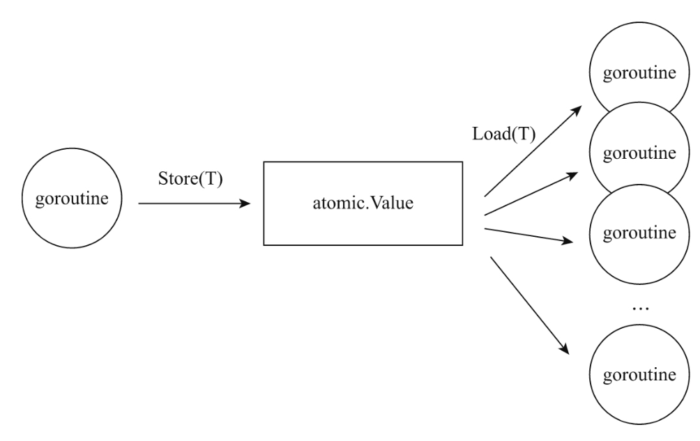

使用atomic实现的共享变量的并发读写性能表现更为稳定，尤其是原子读操作，这让atomic与sync包中的原语比起来表现出更好的伸缩性和更高的性能。由此可以看出atomic包更适合一些对性能十分敏感、并发量较大且读多写少的场合。但atomic原子操作可用来同步的范围有较大限制，仅是一个整型变量或自定义类型变量。如果要对一个复杂的临界区数据进行同步，那么首选依旧是sync包中的原语。

## Go mod

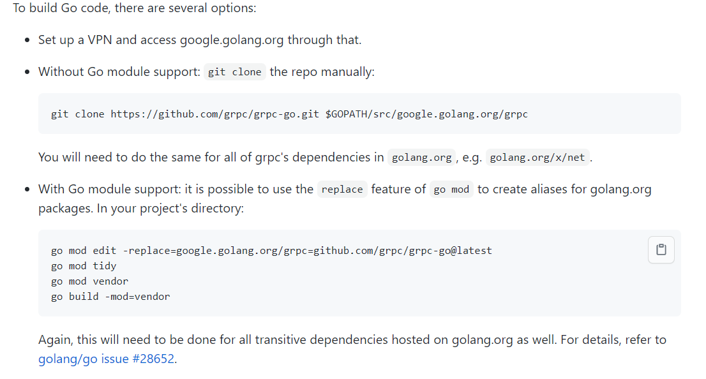

