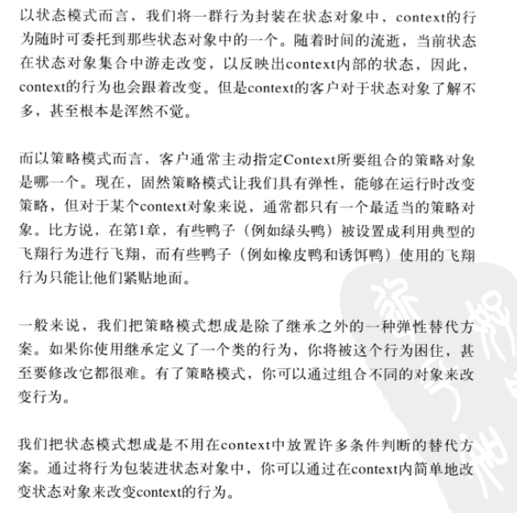

# 设计模式入门

> **设计原则**：找出应用中可能需要变化之处，把它们独立出来，不要和那些不需要变化的代码混在一起。

如果每次新的需求一来，都会使某方面的代码发生变化，那么你就可以确定，这部分的代码需要被抽出来，和其他稳定的代码有所区分。

> **设计原则：**针对接口编程，而不是针对实现编程

> **设计原则**：多用组合，少用继承

**策略模式定义了算法族，分别封装起来，让它们之间可以互相替换，此模式让算法的变化独立于使用算法的客户。**

# 观察者模式

出版者 + 订阅者= 观察者模式。出版者改称为“主题”，订阅者改称为“观察者”。

**观者者模式定义了对象之间的一对多一来，这样一来，当一个对象改变状态时，它的所有依赖者都会收到通知并自动更新。**

观察者模式提供了一种对象设计，让主题和观察者之间松耦合。 

> **设计原则：**为了交互对象之间的松耦合设计而努力

# 装饰者模式

> **设计原则**：开放-关闭原则，类应该对扩展开放， 对修改关闭。

装饰者和被装饰对象有相同的超类型。
可以用一个或多个装饰者包装一个对象。
装饰者可以在所委托被装饰者的行为之前与/或之后，加上自己的行为，以达到特定的目的。
对象可以在任何时候被装饰，所以可以在运行时动态地、不限量地被装饰。

**装饰者模式动态地将责任附加到对象上。若要扩展功能，装饰者提供了比继承更有弹性的替代方案。**

# 工厂模式

## 简单工厂模式

## 工厂方法模式

所有工厂模式都用来封装对象的创建。工厂方法模式通过让子类决定该创建的对象是什么，来达到将对象创建的过程封装的目的。

**工厂方法模式定义了一个创建对象的接口，但由子类决定要实例化的类是哪一个。工厂方法让类把实例化推迟到子类。**

简单工厂把全部的事情，在一个地方都处理完了，然而工厂方法却是创建一个框架，让子类决定要如何实现。

> **设计原则：**要依赖抽象，不要依赖具体类。（依赖倒置原则）

这个原则说明了：不能让高层次组件依赖于低层组件，而且，不管高层还是低层组件，“两者”都应该依赖于抽象。

为什么是“倒置”？体现在哪里？具体看书。

## 抽象工厂模式

**抽象工厂模式提供一个接口，用于创建相关或依赖对象的家族，而不需要明确指定具体类。**

抽象工厂允许客户使用抽象的接口来创建一组相关的产品，而不需要知道（或关心）实际产出的具体产品是什么。这样一来，客户就从具体的产品中被解耦。

抽象工厂：我是抽象工厂，当你需要创建产品家族和想让制造的相关产品集合起来时，你可以使用我。| 抽象工厂使用组合，对象的创建被实现在工厂接口所暴露出来的方法中。
工厂方法：我可以把你的客户代码从需要实例化的具体类中解耦。或者如果你目前还不知道将来需要实例化哪些具体类，也可以用我。我的使用方式很简单，只要把我继承成子类，并实现我的工厂方法就可以了。| 工厂方法使用继承，把对象的创建委托给子类，子类实现工厂方法来创建对象。

# 单件模式

**单件模式确保一个类只有一个实例，并提供一个全局访问点。 **

# 命令模式

Mary：使用这个模式，我们能够创建一个API，将这些命令对象加载到按钮插槽，让遥控器的代码尽量保持简单。而把家电自动化的工作和进行该工作的对象一起封装在命令对象中。

**命令模式将“请求”封装成对象，以便使用不同的请求、队列或日志来参数化其他对象。对象模式也支持可撤销的操作。**

一个命令对象通过在特定接收者上绑定一组动作来封装一个请求。要达到这一点，命令对象将动作和接收者包进对象中。这个对象只暴露出一个execute()方法，当此方法被调用的时候，接收者就会进行这些动作。

# 适配器模式

适配的角色：将一个接口转换成另一个接口，以符合客户的期望。

**适配器模式将一个类的接口，转换成客户期望的另一个接口。（把火鸡转为鸭子接口）适配器让原本接口不兼容的类可以合作无间。**

实际上有两种适配器：对象适配器和类适配器，前边这是对象适配器，使用组合的方式将请求传送给被适配者。而类适配器，使用多重继承的方式。

对象适配器使用组合，不仅可以适配某个类，也可以适配该类的任何子类。

装饰者模式vs适配器模式：当事情一涉及到装饰者时，就表示有一些新的行为或责任要加入到设计中。适配器说：我们一定会涉及到接口的转换，而你们“绝不会”这么做。

外观模式通过实现一个提供更合理的接口的外观类，可以将子系统变得容易使用。外观模式在提供简化的接口的同时，依然将系统完整的功能暴露出来，以供需要的人使用。外观和适配器模式可以包装许多类，但是外观的意图是简化接口，适配器的意图是将接口转换成不同接口。外观不只是简化了接口，也将客户从组件的子系统中解耦。

**外观模式提供了一个统一的接口，用来访问子系统中的一群接口。外观定义了一个高层接口，让子系统更容易使用。**

> **设计原则：（最少知识原则）只和你的密友谈话**

这个原则希望我们在设计中，不要让太多的类耦合在一起，免得修改系统中一部分，会影响到其他部分。

# 模板方法模式

模板方法定义了一个算法的步骤，并允许子类为一个或多个步骤提供实现。

**模板方法模式在一个方法中定义一个算法的骨架，而将一些步骤延迟到子类中。模板方法使得子类可以在不改变算法结构的情况下，重新定义算法中的某些步骤。**

让类实现一个算法，将一些步骤延迟到子类。

钩子（hook）是一种被声明在抽象类中的方法，但只有空的或者默认的实现。钩子 的存在，可以让子类有能力对算法的不同点进行挂钩。要不要挂钩，由子类自行决定。

> 好莱坞原则：别调用我们，我们会调用你。

高层组件对低层组件的方式是”别调用我们，我们会调用你“。由我们的超类控制一切，当它们需要的时候，自然会去调用子类。

# 迭代器模式

**迭代器模式提供一种方法顺序访问一个聚合对象中的各个元素，而又不暴露其内部的表示。**

把游走的任务放在迭代器上，而不是聚合上。这样简化了聚合的接口和实现，也让责任各得其所。

> **设计原则：**一个类应该只有一个引起变化的原因。

**组合模式允许你将对象组合成树形结构来表现”整体/部分“层次结构。组合能让客户以一致的方式处理个别对象以及对象组合。**

# 状态模式

**状态模式允许对象在内部状态改变时改变它的行为，对象看起来好像修改了它的类。**

这个模式将状态封装为独立的类，并将动作委托到代表当前状态的对象，我们知道行为会随着内部状态而改变。

# 代理模式

**代理模式为另一个对象提供一个替身或占位符以控制对这个对象的访问。**

使用代理模式创建代表，让代表对象控制某对象的访问，被代理的对象可以是远程的对象、创建开销较大的对象或需要安全控制的对象。 

虚拟代理作为创建开销大的对象的代表。虚拟代理经常直到我们真正需要一个对象的时候才创建它。当对象在创建前和创建中时，由虚拟代表来扮演对象的替身。对象创建后，代理就会将请求直接委托给对象。