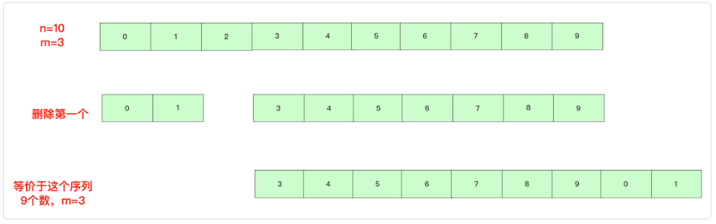
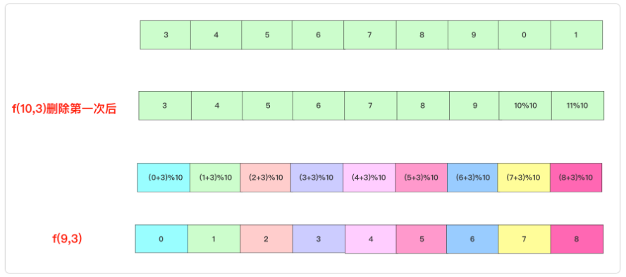

# Leetcode

## 约瑟夫环

**方法一：队列模拟**

**方法二：递归公式解决**

我们回顾上面的优化过程，上面用求余可以解决m比n大很多很多的情况(即理论上需要转很多很多圈的情况)。但是还可能存在n本身就很大的情况，无论是顺序表ArrayList还是链表LinkedList去频繁查询、删除都是很低效的。

所以聪明的人就开始从数据找一些规律或者关系。先抛出==公式==

```
f(n,m)=(f(n-1,m)+m)%n
f(n,m)指n个人，报第m个编号出列最终编号
```

下面要认真看一下我的分析过程：

我们举个例子，有`0 1 2 3 4 5 6 7 8 9`十个数字，假设m为3,最后结果可以先记成`f(10,3)`，即使我们不知道它是多少。

当进行第一次时候，找到元素2 删除，此时还剩9个元素，但**起始位置已经变成元素3**。等价成`3 4 5 6 7 8 9 0 1`这9个数字重写开始找。



此时这个序列最终剩下的一个值即为`f(10,3)`，这个序列的值和`f(9,3)`不同，**但是都是9个数且m等于3，所以其删除位置是相同的，即算法大体流程是一致的，只是各位置上的数字不一样。**所以我们需要做的事情是**找找这个序列上和`f(9,3)`值上有没有什么联系**。

寻找过程中别忘记两点，首先可通过**%符号**对数字有效扩充，即我们可以将`3 4 5 6 7 8 9 0 1`这个序列看成`(3,4,5,6,7,8,9,10,11)%10`.这里的10即为此时的n数值。

另外数值如果是连续的，那么最终一个结果的话是可以找到联系的(差值为一个定制)。所以我们可以就找到`f(10,3)`和`f(9,3)`值之间结果的关系，可以看下图：



所以f(10,3)的结果就可以转化为f(9,3)的表达,后面也是同理：

```
f(10,3)=(f(9,3)+3)%10
f(9,3)=(f(8,3)+3)%9
……
f(2,3)=(f(1,3)+3)%2
f(1,3)=0
```

## 剑指offer 60. n个骰子的点数

```c++
//超时，但是可以记录一下。nums用于存放n个骰子生成的数字和的次数，然后该次数除以总的能产生的结果(6^n)，得到概率
class Solution {
public:
    void proba(int n, int cur, int sum, vector<int>& nums) {
        if (cur == 0) {
            nums[sum - n]++;
            return;
        }
        for(int i = 1; i <= 6; ++i)
            proba(n, cur - 1, sum + i, nums);
    }
    vector<double> twoSum(int n) {
        vector<double> res(n * 6 - n + 1);
        vector<int> nums(6 * n - n + 1, 0);
        proba(n, n, 0, nums);
        double maxSum = pow(6.0, n);
        for(int i = 0; i < res.size(); ++i) {
            res[i] = nums[i] / maxSum;
        }
        return res;
    }
};
```

应当使用动态规划，想要用备忘录优化，但不知该如何优化。是不是可以从下向上进行循环，`for(int i = 0; i < n; ++i)`.
动态规划中，二维数组，可以进行空间优化，此时很多情况下都是**从后向前**进行遍历，因为可以保留前边的空间为上一状态留下来的，而如果从前往后，则状态进行了更新，无法获取上一状态前半部分的值了。
另外使用一维的空间优化时，有两个点需要注意，摘自评论区的一位大佬：

> 比较关键的两步，一步是`dp[j] = 0;`，一步是`if (j - cur < i-1)`。对于前一步，因为是从后往前逐个累加，在加到当前点数时，必须把原先存放的n-1个骰子的数据置0，否则累加出错。对于后一步，如果不加此判据，会取到n-2个骰子的数据，此时可认为是“脏数据”，会导致累加出错。从实际情况来分析，n-1个骰子的最小值就是n-1，不会比这再小，因此此处的判据是` i-1`，而不是0.

## 1024 视频拼接

二维数组进行sort排序的话，`sort(clips.begin(), clips.end());`会先根据第一维排，第一维相同的情况下，第二维也是有序的。

## 剑指offer 65. 不用加减乘除做加法

c++中负数不支持左移。

```c++
int add(int a, int b) {
        if (b == 0) return a;
        int carry;
        while (b != 0) {
            carry = (unsigned int)(a & b) << 1;
            a = a ^ b;
            b = carry;
        }
        return a;
    }
```

## 845 数组中最长的山脉

【于题解中】 对于动态规划中，可以考虑两个动态数组，比如分别向左和向右扩展，找到单侧的递推式，最后结果为两个数组的某种组合方式。

## 463 岛屿的周长

官方题解中用到了`constexpr`, <font color=#1685a9>需要学习一下</font>

## 349 两个数组的交集

官方题解中：

```c++
vector<int> getIntersection(unordered_set<int>& set1, unordered_set<int>& set2) {
        if (set1.size() > set2.size()) {
            return getIntersection(set2, set1);
        }
        // other code
    }
```

有时需要处理较短的一个，可采用这种传参的方法，做一个判断比较后，统一归到处理短的数组。 

## 剑指offer 40. 最小的k个数

`priority_queue`默认是大顶堆，最大堆。

## 973 最接近原点的K个点

掌握堆的用法
优先级队列可以以pair为元素`priority_queue<pair<int,int>> q;`使用的时候直接可以用`q.top().first;`或者`q.top().second`.
另外`q.emplace()`是原地构造一个元素并插入队列，`q.push()`是插入元素到队尾并排序。要学会利用前者。

## 222. 完全二叉树的节点个数

```c+
int level = 3;
int low = 1 << level;
```

这个的值是8，是1左移level次，相当于2^3，而`int low = level << 1;`的值是6，即level左移一位，扩大两倍。

```c++
bool exists(TreeNode* root, int level, int k) {
        int bits = 1 << (level - 1);
        TreeNode* node = root;
        while (node != nullptr && bits > 0) {
            if (!(bits & k)) {
                node = node->left;
            } else {
                node = node->right;
            }
            bits >>= 1;
        }
        return node != nullptr;
    }
```

这种写法也很巧妙。示例，k=12，level = 3，是为了判断除最高位外k的各位，只要是1，就取右节点，是0，就取左节点。而12的二进制表示为1100，此时相当于用bits，二进制表示为100，来一步一步取目标值1100的各位，判断是0是1.

## 164. 最大间距

基数排序，桶排序。这些都是线性时间复杂度的排序方法，是基于运算而不是基于比较。
`max_element(nums.begin(), nums.end())`返回的是数组中最大值的迭代器，要取值的话用`*max_element(nums.begin(), nums.end());`
基数排序，其中一部分用到计数排序（参照算法导论）。从最低位开始，直到最高位，用radix来指定每次用到的位数。用cnt数组存放0 - 10的计数，用buf存放本次的结果，然后在每次循环的最后，再传递给原数组。

```c++
int radix = 1;
vector<int> buf(n);
int maxVal = *max_element(nums.begin(), nums.end());
while (maxVal >= radix) {
	vector<int> cnt(10, 0);
    for (int i = 0; i < nums.size(); ++i) 
    	cnt[(nums[i] / radix) % 10]++;
    for(int i = 1; i < 10; ++i)
        cnt[i] = cnt[i - 1] + cnt[i];
    for (int i = n - 1; i >= 0; --i) {
        //小于等于当前数的有cnt[(nums[i] / radix) % 10]个数，包括nums[i]自己，所以索引值要减去1.
        buf[cnt[(nums[i] / radix) % 10] - 1] = nums[i];
        cnt[(nums[i] / radix) % 10]--;
    }
    for(int i = 0; i < n; ++i)
        nums[i] = buf[i];
        radix *= 10;
    }
```

## 34. 在排序数组中查找元素的第一个和最后一个位置

官方题解中：

> 两者的判断条件不同，为了代码的复用，定义了一个`binarySearch(nums, target, lower)`表示在nums数组中二分查找target的位置，根据lower是否为true进行不同的操作。

这里当两种情况很相似时，可以这样传入一个bool型参数，根据传值不同进行判定，达到代码复用。

## 62. 不同路径

组合数学。
$$
C_{m+n-2}^{m-1}=\begin{pmatrix}m+n-2 \\ m-1 \end{pmatrix}=\frac{(m+n-2)(m+n-3)\cdots n}{(m-1)!}=\frac{(m+n-2)!}{(m-1)!(n-1)!}
$$

```c++
int uniquePaths(int m, int n) {
        long long ans = 1;
        for (int x = n, y = 1; y < m; ++x, ++y) {
            ans = ans * x / y;
        }
        return ans;
    }
```

## 49. 字母异位词分组

记录了`unordered_map<string, vector<string>> mp`的用法。

## 738. 单调递增的数字

整数转字符串，用`to_string(int N)`，字符串转数字用`stoi(string str)`。

## 189. 旋转数组

该题要求不使用额外的空间，所以返回类型是void。但官方题解一中还是给出了使用额外空间的做法，也就是建立了一个新数组newArray（是个容器），newArray是符合题意的，但最后还要把结果再传递到nums里，所以最后使用了`nums.assign(newArray.begin(), newArray.end());`

## 697. 数组的度

哈希表可以把数字映射到一个数组`unordered_map<int, vector<int>> mp;`

## 395. 至少有K个重复字符的最长子串

该题目不能直接使用滑动窗口，但这类题目，有时候可以利用数组范围小（只有26个字母）这一特点，手动加一个限制条件，比如该题目在外围加了个答案中字符数量的枚举。

## 415. 字符串相加

像这种两个字符串相加的，我以前是先遍历两个共同的，然后加一个while循环看看字串1结束没，再加个while循环看看字串2结束没，再加个对于进位carry的判定。但其实可以合并到一个条件中，`while (i >= 0 || j >= 0 || carry > 0)`,这样对于已结束的，借用`= ? :`运算符来将已结束的子串赋上一个不影响的值，从而继续循环，直到两个都结束。

## 1985. 找出数组中的第K大整数

自定义优先级队列的比较函数（指现有的内置数据结构基础上自定义比较函数）

```c++
class Solution {
public:
    // 使用仿函数来自定义比较函数
    struct cmp {
        // 这里相当于重新定义了greater，重载的是大于号
        bool operator() (const string& a, const string& b) {
            if (a.size() > b.size()) return true;
            else if (a.size() < b.size()) return false;
            return a > b;
        }
    };
    string kthLargestNumber(vector<string>& nums, int k) {
        int n = nums.size();
        priority_queue<string, vector<string>, cmp> q;
        for (int i = 0; i < n; i++) {
            if (q.size() < k)
                q.push(nums[i]);
            else {
                // cmp()构建临时对象，后面的括号是真正的调用
                if (cmp()(nums[i], q.top())) {
                    q.pop();
                    q.push(nums[i]);
                }
            }
        }
        return q.top();
    }
};

```

## 729. 匹配子序列的单词

`upper_bound`函数的用法，`upper_bound(begin, end, num)`从数组的begin位置到end-1位置二分查找第一个**大于num**的数字，不存在则返回end。通过返回的地址减去起始地址begin,得到找到数字在数组中的下标。

**lower_bound**( begin,end,num)：从数组的begin位置到end-1位置二分查找**第一个大于或等于num**的数字，找到返回该数字的地址，不存在则返回end。通过返回的地址减去起始地址begin,得到找到数字在数组中的下标

https://blog.csdn.net/weixin_53225765/article/details/122798643

## 2129. 将标题首字母大写

大小写转换的函数：`toupper()`将小写字母转换为大写字母，`tolower()`将大写字母转换为小写字母。头文件是<stdio.h>。`str[i] = toupper(str[i]);`

另外对于字符串末尾空格不好处理的情况，可以手动在末尾添加一个空格，然后处理完成后，再删掉，这样就避免了将末尾无空格的情况进行单独讨论。

```c++
string title;
title.push_back(' ');
// xxxxxxxxxx
title.pop_back();
```

## 14. 最长公共前缀

对于`vector<string> strs`，进行sort排序，是按字典序进行排的。
如`vector<string> strs = {"dog", "cacesss", "car"};` sort后的结果是`{"cacesss","car","dog"}`.

> 问题：如何按照长度进行排序呢，同长度再按字典序排。

## 3. 无重复字符的最长子串

滑动窗口问题，记得再把滑动窗口的相关题目集中一块做一做。

## 808. 分汤

取整函数，向上取整函数ceil，向下取整函数floor。

```c++
 floor(10.5) == 10    floor(-10.5) == -11
 ceil(10.5) == 11    ceil(-10.5) ==-10
```

## labuladong笔记

数据结构，最底层来划分，其实就是分为了数组和链表。其它的一些都是在这些上延伸出来的。

对数据结构最常用的操作，无非就是遍历+访问，其实就是增删改查，可分为线性迭代和递归。

**前缀和主要适用的场景是原始数组不会被修改的情况下，频繁查询某个区间的累加和**。**差分数组的主要适用场景是频繁对原始数组的某个区间的元素进行增减**。

## 23. 合并k个升序链表

priority_queue默认是大顶堆。

```c++
// 升序
priority_queue<int, vector<int>, greater<int>> q;
// 降序
priority_queue<int, vector<int>, less<int>> q;

// greater和less是std实现的两个仿函数（就是使一个类的使用看上去像一个函数，其实现就是类中实现一个operater()，这个类就有了类似函数的行为，就是一个仿函数类了）
```

