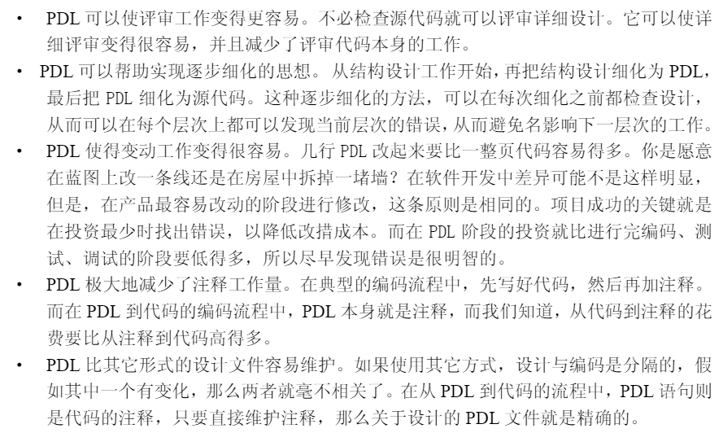

# 4. 建立子程序的步骤

## 程序设计语言（PDL）

> 类似于伪代码，不依赖于特定语言。描述基本框架和结构，要在写代码之前就想好和写出基本的骨架来，既清晰，也方便后续修改。

## 设计子程序

步骤：

- 给子程序命名
- 考虑效率
- 研究算法和数据结构
- 编写PDL
- 编写工作应该从抽象到具体，一个子程序最抽象的部分便是最开始的注释部分，如果感到编写抽象说明时有困难，应该想到可能是某一环节出了问题。
- 考虑数据
- 检查PDL，人们往往更愿意检查一个只有几行的PDL，而不愿意看好多行的子程序
  
- 逐步细化

## 子程序编码

把PDL当注释，在每一行注释下面编码。

## 检查子程序

> 这说的完全就是我……

> 也有点像我……

# 5. 高质量子程序特点

子程序是具有单一功能的可调用的函数或过程。

【模块】

模块的内聚性准则，与单个子程序的内聚性准则一样，都是十分简单的。一个模块应该提供一组相互联系的服务。

模块与程序其它部分间的耦合标准与子程序间的耦合标准也是类似的。模块应被设计成可以提供一整套功能，以便程序的其它部分与它清楚地相互作用。

信息隐蔽，每一个模块的最大特点都是通过设计和实现，使它对其它模块保密。模块的作用是将自己的信息隐蔽起来以保卫自己的隐私权。另一个称谓是“封装”。一个模块应该像是一座冰山，你只看到它的一角，而它其余7/8的部分则 藏在水下。常见需要隐含的信息：容易被改动的区域，复杂的数据，复杂的逻辑，在编程语言层次上的操作。

【设计】

软件结构设计、高层次模块设计和实现细节设计。设计的层次：1、划分成子系统，2、划分成模块，3、划分成子程序，4、子程序内部的设计。自顶向下分解&自底向上合成。设计是一个复杂、险恶、启发的过程。好的设计都是通过迭代逼近得到的、结构化设计比较适合于小规模的子程序组合，面向对象设计更适合于小规模的子程序组合，同时对于功能变化可能性比数据大的问题也是较适用的。

【数据】

数据结构在创建阶段能带来的收益大小，在某种程度上是由它对创建前的高层次工作影响大小决定的。好的数据结构所带来的收益往往是在需求分析和结构设计阶段体现出来的。为了尽可能地利用好的数据结构带来的收益,应在需求分析和结构设计阶段就定义主要数据结构。建立自己的数据类型，以增加程序的可变动性。表驱动法是一种编程模式，从表里面查找信息而不使用逻辑语句（if和case）。表提供了一种复杂逻辑和继承结构的替代方案。

【变量】

作用域准则：尽可能减小作用域，把对某一变量的引用集中放置。应尽量使变量成为局部或模块的，避免使用全局变量。使每个变量有且仅有一个功能。 阅读代码的次数远远多于编码，所以命名变量应该是阅读方便而不是编写方便
复杂数据结构：使用结构化数据来表明数据间的关系，使用结构化数据来简化对成块数据的操作，使用结构化数据来简化参数表，使用结构化数据来降低维护工作量。恰当的对数据进行结构化，可以使程序更简单、更容易理解也更容易维护。可以使用表来代替复杂的逻辑结构。

【顺序程序语句】

顺序语句指导：组织代码使它们间的依赖关系明显，子程序的名字应当清楚地表明依赖关系，使用子程序参数使依赖关系明显，注明不明确的依赖关系。
与顺序无关的程序语句：使代码能由上读到下，不要到处转移。使用一变量局部化。使变量存活时间尽可能短。相关语句组织在一起。

