# 一. 关键字

##  static

全局静态变量、局部静态变量、静态函数、类的静态成员、类的静态函数

初始化：未经初始化的全局静态变量会被自动初始化为0
全局静态变量的存活是从定义开始到文件结尾。
局部静态变量的作用域依旧是局部作用域，当定义它的函数或者语句块结束的时候，作用域结束。但是当局部静态变量离开作用域后，并没有销毁，而是仍然驻留在内存当中，只不过我们不能再对它进行访问，直到该函数再次被调用，并且值不变；
**函数的定义和声明在默认情况下都是extern的，但静态函数只是在声明他的文件当中可见，不能被其他文件所用。**
函数的实现使用static修饰，那么这个函数只可在本cpp内使用，不会同其他cpp中的同名函数引起冲突；
**在静态成员函数的实现中不能直接引用类中说明的非静态成员，可以引用类中说明的静态成员（这点非常重要）。**
<u>static成员函数不能被virtual修饰</u>，因为static成员不属于任何对象或实例，加上virtual没有任何实际意义。

1. 类的静态成员是该类所有实例的共用成员，int A::s_value = 0;// 注意，这里没有static的修饰！
2. 类的静态函数是在该类的范畴内的全局函数，不能访问类的私有成员，只能访问类的静态成员，实现的时候也不需要static的修饰，**因为static是声明性关键字。而inline是定义性的关键字。**
3. 全局变量，这个变量的含义是在该cpp内有效，但是其他的cpp文件不能访问这个变量；如果有两个cpp文件声明了同名的全局静态变量，那么他们实际上是独立的两个变量；
4. 全局函数，同上。

---

- 不考虑类的情况
  - 隐藏。所有不加static的全局变量和函数具有全局可见性，可以在其他文件中使用，加了之后只能在该文件所在的编译模块中使用
  - 默认初始化为0，包括未初始化的全局静态变量与局部静态变量，都存在全局未初始化区
  - 静态变量在函数内定义，始终存在，且只进行一次初始化，具有记忆性，其作用范围与局部变量相同，函数退出后仍然存在，但不能使用
- 考虑类的情况
  - static成员变量：只与类关联，不与类的对象关联。定义时要分配空间，不能在类声明中初始化，必须在类定义体外部初始化，初始化时不需要标示为static；可以被非static成员函数任意访问。
  - static成员函数：不具有this指针，无法访问类对象的非static成员变量和非static成员函数；**不能被声明为const、虚函数和volatile**；可以被非static成员函数任意访问

## const

### 常量

常量在C++里的定义就是一个top-level const加上对象类型，常量定义必须初始化。对于局部常量，存放在栈区；对于全局常量，编译期一般不分配内存，放在符号表中以提高访问效率；字面值常量，比如字符串，放在常量区。

### 作用

**const作用**：定义常量、类型检查？、防止修改、节省空间？

- 声明常量。
- 修饰指针，分为指向常量的指针（pointer to const）和自身是常量的指针（常量指针，const pointer）；
- 修饰引用，指向常量的引用（reference to const），用于形参类型，即避免了拷贝，又避免了函数对值的修改；
- 修饰成员函数，说明该成员函数内不能修改成员变量。
- 修饰成员变量，说明不可被修改。被const修饰的成员变量只能在构造函数的初始化列表中进行初始化。
- const 修饰成员函数，函数只能被 const this 调用。不能修改成员变量。除非成员变量被 mutable 修饰过。

**注意：**<font color=#1685a9>const 关键字不能与 static 关键字同时使用，因为 static 关键字修饰静态成员函数，静态成员函数不含有 this 指针，即不能实例化，const 成员函数必须具体到某一实例。</font>???

### 常量成员函数

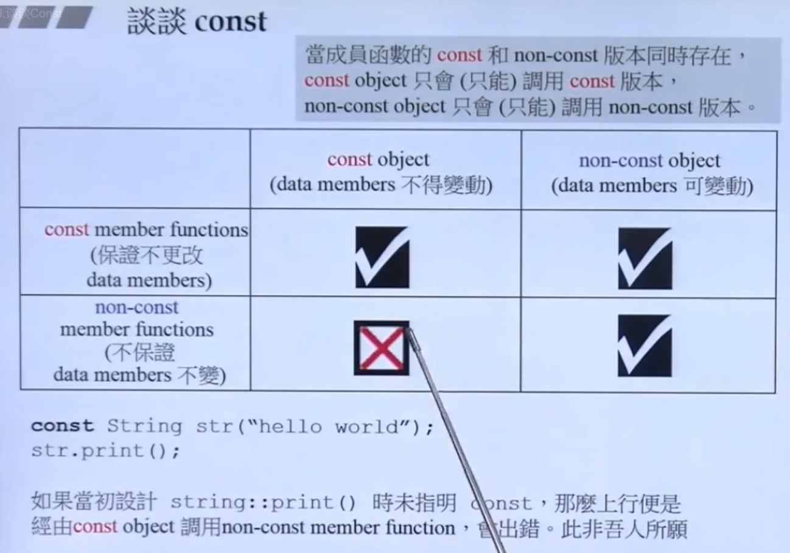

这个图纵向看，指常量对象调用非常量函数是不可以的。

**const 的指针与引用**

- 指针

- - 指向常量的指针（pointer to const）
  - 自身是常量的指针（常量指针，const pointer）

- 引用

- - 指向常量的引用（reference to const）
  - 没有 const reference，因为引用本身就是 const pointer

如果const位于`*`的左侧，则const就是用来修饰指针所指向的变量，即指针指向为常量；如果const位于`*`的右侧，*const*就是修饰指针本身，即指针本身是常量。

**const对象默认为文件局部变量，非const变量默认为extern。**
可以发现未被const修饰的变量不需要extern显式声明！而const常量需要显式声明extern，并且需要做初始化！因为常量在定义后就不能被修改，所以定义时必须初始化。

（1）传递过来的参数及指针本身在函数内不可变，无意义！

```
void func(const int var); // 传递过来的参数不可变
void func(int *const var); // 指针本身不可变
```

表明参数在函数体内不能被修改，但此处没有任何意义，var本身就是形参，在函数内不会改变。包括传入的形参是指针也是一样。
输入参数采用“值传递”，由于函数将自动产生临时变量用于复制该参数，该输入参数本来就无需保护，所以不要加const 修饰。

（2）参数指针所指内容为常量不可变

```
void StringCopy(char *dst, const char *src);
```

其中src 是输入参数，dst 是输出参数。给src加上const修饰后，如果函数体内的语句试图改动src的内容，编译器将指出错误。这就是加了const的作用之一。

（3) 引用。对于非内部数据类型的输入参数，应该将“值传递”的方式改为“const 引用传递”，目的是提高效率。例如将void func(A a) 改为void func(const A &a)。
对于内部数据类型的输入参数，不要将“值传递”的方式改为“const 引用传递”。否则既达不到提高效率的目的，又降低了函数的可理解性。例如void func(int x) 不应该改为void func(const int &x)。

对于类中的const成员变量必须通过**初始化列表进行初始化**

## this

(1) 一个对象的this指针并不是对象本身的一部分，不会影响sizeof(对象)的结果。
(2) this作用域是在类内部，当在类的非静态成员函数中访问类的非静态成员的时候，编译器会自动将对象本身的地址作为一个**隐含参数**传递给函数。也就是说，即使你没有写上this指针，编译器在编译的时候也是加上this的，它作为非静态成员函数的隐含形参，对各成员的访问均通过this进行。

- this 指针是一个隐含于每一个非静态成员函数中的特殊指针。它指向调用该成员函数的那个对象。
- 当对一个对象调用成员函数时，编译程序先将对象的地址赋给 this 指针，然后调用成员函数，每次成员函数存取数据成员时，都隐式使用 this 指针。
- 当一个成员函数被调用时，自动向它传递一个隐含的参数，该参数是一个指向这个成员函数所在的对象的指针。
- this 指针被隐含地声明为一个**常量**，即 className * const this，这意味着不能给  this 指针赋值；在 ClassName 类的 const 成员函数中，this 指针的类型为：const ClassName* const，即不能修改 this 指针指向的数据；
- **this 并不是一个常规变量，而是个右值，所以不能取得 this 的地址（不能 &this）。**

**类的this指针有以下特点**

(1）**this**只能在成员函数中使用，全局函数、静态函数都不能使用this。实际上，**成员函数默认第一个参数**为**T \* const this**。如：

```c++
class A{
public:
    int func(int p){}
};
```

其中，**func**的原型在编译器看来应该是：

**int func(A \* const this,int p);**

（2）由此可见，==**this**在成员函数的开始前构造，在成员函数的结束后清除==。这个生命周期同任何一个函数的参数是一样的，没有任何区别。当调用一个类的成员函数时，编译器将类的指针作为函数的this参数传递进去。如：

```c++
A a;
a.func(10);
//此处，编译器将会编译成：
A::func(&a,10);
```

看起来和静态函数没差别，对吗？不过，区别还是有的。编译器通常会对this指针做一些优化，因此，this指针的传递效率比较高，例如VC通常是通过ecx（计数寄存器）传递this参数的。

> this指针存放在何处？

this指针会因编译器不同而有不同的放置位置。可能是栈，也可能是寄存器，甚至全局变量。在汇编级别里面，一个值只会以3种形式出现：立即数、寄存器值和内存变量值。不是存放在寄存器就是存放在内存中，它们并不是和高级语言变量对应的。

### delete this合法吗？

==**合法，但：**==

1. 必须保证 this 对象是通过 `new`（不是 `new[]`、不是 placement new、不是栈上、不是全局、不是其他对象成员）分配的
2. 必须保证调用 `delete this` 的成员函数是最后一个调用 this 的成员函数
3. 必须保证成员函数的 `delete this` 后面没有调用 this 了
4. 必须保证 `delete this` 后没有人使用了

---

1、在类对象的内存空间中，只有数据成员和虚函数表指针，并不包含代码内容，类的成员函数单独放在代码段中。在调用成员函数时，隐含传递一个this指针，让成员函数知道当前是哪个对象在调用它。当调用delete this时，类对象的内存空间被释放。在delete this之后进行的其他任何函数调用，只要不涉及到this指针的内容，都能够正常运行。一旦涉及到this指针，如操作数据成员，调用虚函数等，就会出现不可预期的问题。

2、为什么是不可预期的问题？

delete this之后不是释放了类对象的内存空间了么，那么这段内存应该已经还给系统，不再属于这个进程。照这个逻辑来看，应该发生指针错误，无访问权限之类的令系统崩溃的问题才对啊？这个问题牵涉到操作系统的内存管理策略。delete this释放了类对象的内存空间，但是内存空间却并不是马上被回收到系统中，可能是缓冲或者其他什么原因，导致这段内存空间暂时并没有被系统收回。

此时这段内存是可以访问的，你可以加上100，加上200，但是其中的值却是不确定的。当你获取数据成员，可能得到的是一串很长的未初始化的随机数；访问虚函数表，指针无效的可能性非常高，造成系统崩溃。

3、 如果在类的析构函数中调用delete this，会发生什么？

**会导致堆栈溢出**。原因很简单，delete的本质是“为将被释放的内存调用一个或多个析构函数，然后，释放内存”。显然，delete this会去调用本对象的析构函数，而析构函数中又调用delete this，形成无限递归，造成堆栈溢出，系统崩溃。

## inline

inline 只是编程者给编译器的一个建议,在编译时未必会真正被编译为inline 函数。

- 相当于把内联函数里面的代码写在调用内联函数处；
- 相当于不用执行进入函数的步骤，直接执行函数体；
- 相当于宏，但是又具有函数的特性；
- 编译器一般不内联包含循环、递归、switch 等复杂操作的内联函数；
- 在类声明中定义的函数，除了虚函数的其他函数都会自动隐式地当成内联函数。

**编译器处理 inline 函数的步骤**

- 将 inline 函数体复制到 inline 函数调用点处；
- 为所用 inline 函数中的局部变量分配内存空间；
- 将 inline 函数的的输入参数和返回值映射到调用方法的局部变量空间中；
- 如果 inline 函数有多个返回点，将其转变为 inline 函数代码块末尾的分支（使用 GOTO）。

### **inline 函数优缺点**

- 优点（与宏比较）

- - 内联函数同宏函数一样将在被调用处进行代码展开，**省去了参数压栈、栈帧开辟与回收，结果返回等，从而提高程序运行速度。**
  - 内联函数相比宏函数来说，在代码展开时，会做安全检查或自动类型转换（同普通函数），而宏定义则不会。
  - 在类中声明同时定义的成员函数，自动转化为内联函数，因此内联函数可以访问类的成员变量，宏定义则不能。
  - 内联函数方便调试，而宏定义比较麻烦。

- 缺点

- - 代码膨胀。内联是以代码膨胀（复制）为代价，消除函数调用带来的开销。如果执行函数体内代码的时间，相比于函数调用的开销较大，那么效率的收获会很少。另一方面，每一处内联函数的调用都要复制代码，将使程序的总代码量增大，消耗更多的内存空间。
  - inline 函数无法随着函数库升级而升级。inline函数的改变需要重新编译，不像 non-inline 可以直接链接。
  - 是否内联，程序员不可控。内联函数只是对编译器的建议，是否对函数内联，决定权在于编译器。

### 构造、析构、虚函数是否可以是内联

首先，将这些函数声明为内联函数，在语法上没有错误。因为inline同register一样，只是个建议，编译器并不一定真正的内联。

> **构造函数和析构函数声明为内联函数是没有意义的**

《Effective C++》中所阐述的是：将构造函数和析构函数声明为inline是没有什么意义的，即编译器并不真正对声明为inline的构造和析构函数进行内联操作，因为编译器会在构造和析构函数中添加额外的操作（申请/释放内存，构造/析构对象等），致使构造函数/析构函数并不像看上去的那么精简。其次，class中的函数默认是inline型的，编译器也只是有选择性的inline，将构造函数和析构函数声明为内联函数是没有什么意义的。

> 虚函数与内联

如果虚函数在编译器就能够决定将要调用哪个函数时，就能够内联，那么什么情况下编译器可以确定要调用哪个函数呢，答案是当用对象调用虚函数（此时不具有多态性）时，就内联展开。综上，**当是指向派生类的指针（多态性）调用声明为inline的虚函数时，不会内联展开；当是对象本身调用虚函数时，会内联展开，当然前提依然是函数并不复杂的情况下**

### **virtual 与 inline**

- 虚函数可以是内联函数，内联是可以修饰虚函数的，但是当虚函数表现多态性的时候不能内联。

- **内联是在编译器建议编译器内联，而虚函数的多态性在运行期，编译器无法知道运行期调用哪个代码，因此虚函数表现为多态性时不可以内联。**

- inline virtual 唯一可以内联的时候是：编译器知道所调用的对象是哪个类（如 Base::who()），这只有在编译器具有实际对象而不是对象的指针或引用时才会发生。

inline要起作用, inline要与函数定义放在一起, inline是一种**“用于实现的关键字,而不是用于声明的关键字“** / 而static是声明性关键字。

### 内联与宏

https://www.cnblogs.com/2018shawn/p/10851779.html
这篇写的很好。

**内联与宏：**（参照上一小节内联的优点那里）

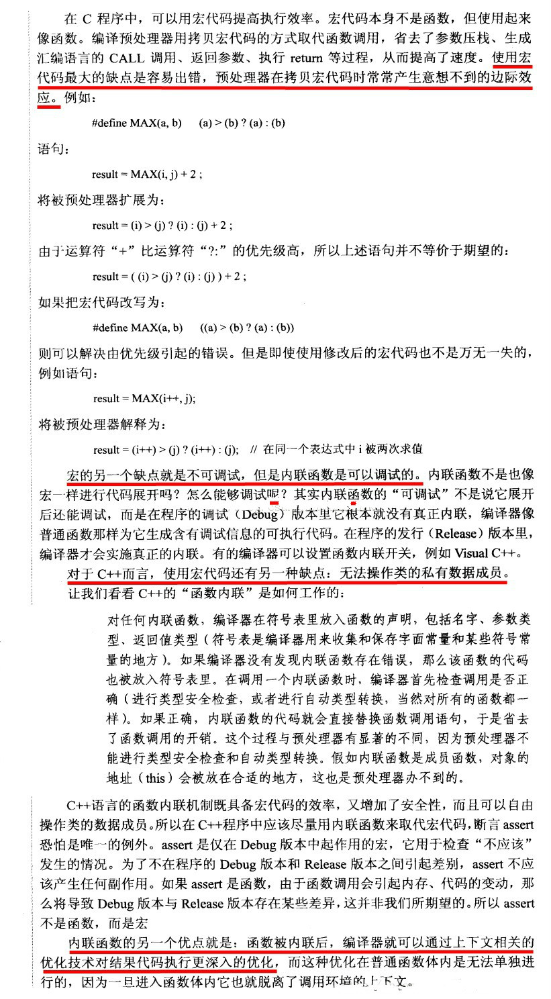

### 内联跨文件

**C++ inline函数是一种“用于实现的关键字”，而不是一种“用于声明的关键字”。**

> 内联跨文件？

**内联函数应该在头文件中定义，而不仅仅是声明。**这一点不同于其他函数。编译器在调用点内联展开函数的代码时，**必须能够找到 inline 函数的定义才能将调用函数替换为函数代码**，==而对于在头文件中仅有函数声明是不够的。==

当然内联函数定义也可以放在源文件中，但此时只有定义的那个源文件可以用它，而且必须为每个源文件拷贝一份定义(即每个源文件里的定义必须是完全相同的)，当然即使是放在头文件中，也是对每个定义做一份拷贝，只不过是编译器替你完成这种拷贝罢了。但相比于放在源文件中，放在头文件中既能够确保调用函数是定义是相同的，又能够保证在调用点能够找到函数定义从而完成内联(替换)。

## sizeof

- 空类的大小为1字节。这就是实例化的原因（空类同样可以被实例化），每个实例在内存中都有一个独一无二的地址，为了达到这个目的，编译器往往会给一个空类隐含的加一个字节，这样空类在实例化后在内存得到了独一无二的地址，所以空类所占的内存大小是1个字节。（有很多个函数，无成员变量也是大小为1字节）
- 一个类中，**虚函数本身、成员函数（包括静态与非静态）和静态数据成员都是不占用类对象的存储空间。**
- 对于包含虚函数的类，不管有多少个虚函数，只有一个虚指针,vptr的大小。
- 普通继承，派生类继承了所有基类的函数与成员，要按照字节对齐来计算大小
- 虚函数继承，不管是单继承还是多继承，都是继承了基类的vptr。(32位操作系统4字节，64位操作系统 8字节)！
- 虚继承,继承基类的vptr

- sizeof 对数组，得到整个数组所占空间大小。
- sizeof 对指针，得到指针本身所占空间大小。

成员函数不占用对象的内存。这是因为所有的函数都是存放在代码区的，不管是全局函数，还是成员函数。所有函数都存放在代码区，静态函数也不例外。所有有人一看到 static 这个单词就主观的认为是存放在全局数据区，那是不对的。

## volatile

>  A volatile specifier is a hint to a compiler that an object may change its value in ways not specified by the language so that aggressive optimizations must be avoided.

volatile提醒编译器它后面所定义的变量随时都有可能改变，因此编译后的程序每次需要存储或读取这个变量的时候，都会直接从变量地址中读取数据。如果没有volatile关键字，则编译器可能优化读取和存储，可能暂时使用寄存器中的值，如果这个变量由别的程序更新了的话，将出现不一致的现象。

---

## vptr和vtable

为了实现虚函数，C ++使用一种称为虚拟表的特殊形式的后期绑定。该虚拟表是用于解决在动态/后期绑定方式的函数调用函数的查找表。虚拟表有时会使用其他名称，例如“vtable”，“虚函数表”，“虚方法表”或“调度表”。
首先，**每个使用虚函数的类（或者从使用虚函数的类派生）都有自己的虚拟表**。该表只是编译器在编译时设置的静态数组。虚拟表包含可由类的对象调用的每个虚函数的一个条目。此表中的每个条目只是一个函数指针，指向该类可访问的派生函数。
其次，编译器还会添加一个隐藏指向基类的指针，我们称之为vptr。vptr在创建类实例时自动设置，以便指向该类的虚拟表。<u>与this指针不同，this指针实际上是编译器用来解析自引用的函数参数，vptr是一个真正的指针。</u>
因此，**它使每个类对象的分配大一个指针的大小。**这也意味着vptr由派生类继承，这很重要。

---

**虚表是属于类的，而不是属于某个具体的对象，一个类只需要一个虚表即可。同一个类的所有对象都使用同一个虚表。**为了指定对象的虚表，对象内部包含一个虚表的指针，来指向自己所使用的虚表。为了让每个包含虚表的类的对象都拥有一个虚表指针，编译器在类中添加了一个指针，`*__vptr`，用来指向虚表。这样，**当类的对象在创建时便拥有了这个指针，且这个指针的值会自动被设置为指向类的虚表。**

---

我们把对象从**首地址开始**的4个字节或者是8个字节，这个位置我们称之为**虚函数表指针**（vptr），它里面包含一个地址指向的就是**虚函数表**（vftable）的地址。

### volatile应用

**（1）并行设备的硬件寄存器（如状态寄存器）**

**（2）一个中断服务子程序中访问到的变量；**

**（3）多线程应用中被多个任务共享的变量**

有些变量是用volatile关键字声明的。当两个线程都要用到某一个变量且该变量的值会被改变时，应该用volatile声明，<u>该关键字的作用是防止优化编译器把变量从内存装入CPU寄存器中。如果变量被装入寄存器，那么两个线程有可能一个使用内存中的变量，一个使用寄存器中的变量，这会造成程序的错误执行。</u>volatile的意思是让编译器每次操作该变量时一定要从内存中真正取出，而不是使用已经存在寄存器中的值

### 常见问题

（1）一个参数既可以是const还可以是volatile吗？为什么？ 可以。一个例子是只读的状态寄存器。它是volatile因为它可能被意想不到地改变。它是const因为程序不应该试图去修改它。

（2）一个指针可以是volatile吗？为什么？ 可以。尽管这并不常见。一个例子是当一个中断服务子程序修该一个指向一个buffer的指针时。

### volatile使用

- volatile 关键字是一种类型修饰符，用它声明的类型变量表示可以被某些编译器未知的因素（操作系统、硬件、其它线程等）更改。所以使用 volatile 告诉编译器不应对这样的对象进行优化。
- volatile 关键字声明的变量，每次访问时都必须从内存中取出值（没有被 volatile 修饰的变量，可能由于编译器的优化，从 CPU 寄存器中取值）
- const 可以是 volatile （如只读的状态寄存器）
- 指针可以是 volatile

## assert断言

断言，**是宏，而非函数**。assert 宏的原型定义在 （C）、（C++）中，其作用是如果它的条件返回错误，则终止程序执行。可以通过定义 NDEBUG 来关闭 assert，但是需要在源代码的开头，include 之前。

断言主要用于检查逻辑上不可能的情况。例如，它们可用于检查代码在开始运行之前所期望的状态，或者在运行完成后检查状态。与正常的错误处理不同，断言通常在运行时被禁用。

忽略断言：
在代码开头加上：

```
#define NDEBUG          // 加上这行，则 assert 不可用
```

## union

联合（union）是一种**节省空间**的特殊的类，一个 union 可以有多个数据成员，**但是在任意时刻只有一个数据成员可以有值。**当某个成员被赋值后其他成员变为未定义状态。联合有如下特点：

- 默认访问控制符为 public
- 可以含有构造函数、析构函数
- 不能含有引用类型的成员
- 不能继承自其他类，不能作为基类
- 不能含有虚函数
- 匿名 union 在定义所在作用域可直接访问 union 成员
- 匿名 union 不能包含 protected 成员或 private 成员
- 全局匿名联合必须是静态（static）的

## mutable

mutable的中文意思是“**可变的，易变的**”，跟constant（既C++中的const）是反义词。在C++中，mutable也是为了突破const的限制而设置的。被mutable修饰的变量，将永远处于可变的状态，即使在一个const函数中。我们知道，如果类的成员函数不会改变对象的状态，那么这个成员函数一般会声明成const的。但是，有些时候，我们需要在const函数里面修改一些跟类状态无关的数据成员，那么这个函数就应该被mutable来修饰，并且放在函数后后面关键字位置。

## explicit

90%只用在构造函数前面，**避免其隐式转换。**

explicit关键字用来**修饰类的构造函数**，被修饰的构造函数的类，**不能发生相应的隐式类型转换**，只能以显示的方式进行类型转换，注意以下几点：

- explicit 关键字只能用于类内部的构造函数声明上
- explicit 关键字作用于**单个参数**的构造函数
- 被explicit修饰的构造函数的类，不能发生相应的隐式类型转换


## final

C++11的关键字final有两个用途。第一，它阻止了从类继承；第二，阻止一个虚函数的重写。

**1. 禁用继承**

C++11中允许将类标记为final，方法时直接在类名称后面使用关键字final，如此，意味着继承该类会导致编译错误。

```c++
class Super final
{
    //....
};
```

**禁用重写**

C++中还允许将方法标记为fianal，这意味着无法再子类中重写该方法。这时final关键字至于方法参数列表后面，如下

```c++
class Super
{
public:  
    Super();
    virtula void SomeMethod() final;
};
```

## final&override

override: 当在父类中使用了虚函数时候，你可能需要在某个子类中对这个虚函数进行重写。

final：当不希望某个类被继承，或不希望某个虚函数被重写，可以在类名和虚函数后添加final关键字，添加final关键字后被继承或重写，编译器会报错。

# 二、变量、指针、函数等

## 声明和定义

- 声明仅仅是把变量的声明的位置及类型提供给编译器，并不分配内存空间；定义要在定义的地方为其分配存储空间。
- 相同变量可以在多处声明（外部变量extern），但只能在一处定义。

---

如果是指**变量的声明和定义**
从编译原理上来说，声明是仅仅告诉编译器，有个某类型的变量会被使用，但是编译器并不会为它分配任何内存。而定义就是分配了内存。

如果是指**函数的声明和定义**
声明：一般在头文件里，对编译器说：这里我有一个函数叫function() 让编译器知道这个函数的存在。
定义：一般在源文件里，具体就是函数的实现过程 写明函数体。

## ifdef endif

1)  一般情况下，源程序中所有的行都参加编译。但是有时希望对其中一部分内容只在满足一定条件才进行编译，也就是对一部分内容指定编译的条件，这就是“条件编译”。有时，希望当满足某条件时对一组语句进行编译，而当条件不满足时则编译另一组语句。

2)  条件编译命令最常见的形式为：

```c++
\#ifdef 标识符 
 程序段1 
 \#else 
 程序段2 
 \#endif
```

它的作用是：当标识符已经被定义过(一般是用#define命令定义)，则对程序段1进行编译，否则编译程序段2。
其中#else部分也可以没有，即：

```
 \#ifdef 
 程序段1 
 \#denif
```

3)  在一个大的软件工程里面，可能会有多个文件同时包含一个头文件，当这些文件编译链接成一个可执行文件上时，就会出现大量“重定义”错误。

在头文件中使用#define、#ifndef、#ifdef、#endif能避免头文件重定义。

## 引用

引用可以实现动态绑定，引用在创建的时候**必须初始化**，在访问虚函数时，编译器会根据其所绑定的对象类型决定要调用哪个函数。注意只能调用虚函数。

引用一般用于声明**参数类型**和**返回类型**。

值得注意的是,因为引用传递参数和值传递参数的用法相同,所以两个函数的函数签名(signature)相同,不能同时存在.

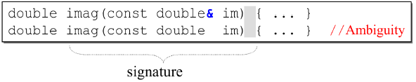

有意思的是,指示常量成员函数的const 也是函数签名的一部分,因此const 和non-const 的同名成员函数可以在同一类内共存.

## 指针vs引用

- 指针是一个变量，存储的是一个**地址**，引用跟原来的变量实质上是同一个东西，是原变量的**别名**
- 指针可以有多级，引用只有一级
- 指针可以为空，引用不能为NULL且在定义时必须初始化
- 指针在初始化后可以改变指向，而引用在初始化之后不可再改变
- sizeof指针得到的是本指针的大小，sizeof引用得到的是引用所指向变量的大小
- 当把指针作为参数进行传递时，也是将实参的一个拷贝传递给形参，两者指向的地址相同，但不是同一个变量，在函数中改变这个变量的指向不影响实参，而引用却可以。
- 引用只是别名，不占用具体存储空间，只有声明没有定义；指针是具体变量，需要占用存储空间。
- 引用在声明时必须初始化为另一变量，一旦出现必须为typename refname &varname形式；指针声明和定义可以分开，可以先只声明指针变量而不初始化，等用到时再指向具体变量。
- 引用一旦初始化之后就不可以再改变（变量可以被引用为多次，但引用只能作为一个变量引用）；指针变量可以重新指向别的变量。
- 不存在指向空值的引用，必须有具体实体；但是存在指向空值的指针。

## 类型转换

unsigned int与int型运算，把int型对象转换为unsigned int型。若该int为负数，按照primer 32页方法转。
C++中四种类型转换是：static_cast, dynamic_cast, const_cast, reinterpret_cast

+ reinterpret_cast：可以用于任意类型的指针之间的转换，对转换的结果不做任何保证。**它可以用于类型之间进行强制转换。**

+ const_cast：对于未定义const版本的成员函数，我们**通常需要使用const_cast来去除const引用对象的const，完成函数调用**。另外一种使用方式，结合static_cast，可以在非const版本的成员函数内添加const，调用完const版本的成员函数后，再使用const_cast去除const限定。|  该运算符用来修改类型的const或volatile属性。除了const或volatile修饰之外， type_id和expression的类型是一样的。

+ static_cast：完成基础数据类型；同一个继承体系中类型的转换；任意类型与空指针类型void* 之间的转换。|  static_cast < type-id > (expression)，该运算符把expression转换为type-id类型，但没有运行时类型检查来保证转换的安全性。它主要有如下几种用法：

  - **用于类层次结构中基类（父类）和派生类（子类）之间指针或引用引用的转换**
  - 进行**上行转换**（把派生类的指针或引用转换成基类表示）是安全的
  - 进行下行转换（把基类指针或引用转换成派生类表示）时，由于没有动态类型检查，所以是不安全的
  - 用于基本数据类型之间的转换，如把int转换成char，把int转换成enum。这种转换的安全性也要开发人员来保证。
  - 把空指针转换成目标类型的空指针
  - 把任何类型的表达式转换成void类型

  注意：static_cast不能转换掉expression的const、volatile、或者__unaligned属性。

+ dynamic_cast：这种其实也是不被推荐使用的，更多使用static_cast，dynamic本身只能用于存在虚函数的父子关系的强制类型转换，对于指针，转换失败则返回nullptr，对于引用，转换失败会抛出异常。| dynamic_cast运算符可以在执行期决定真正的类型，也就是说expression必须是多态类型。如果下行转换是安全的（也就说，如果基类指针或者引用确实指向一个派生类对象）这个运算符会传回适当转型过的指针。如果下行转换不安全，这个运算符会传回**空指针**（也就是说，基类指针或者引用没有指向一个派生类对象）**dynamic_cast主要用于类层次间的上行转换和下行转换，还可以用于类之间的交叉转换**

  > 在类层次间进行上行转换时，dynamic_cast和static_cast的效果是一样的
  > 在进行下行转换时，dynamic_cast具有类型检查的功能，比static_cast更安全

## 隐式转换

1、C++的基本类型中并非完全的对立，部分数据类型之间是可以进行隐式转换的。所谓隐式转换，是指不需要用户干预，编译器私下进行的类型转换行为。很多时候用户可能都不知道进行了哪些转换

2、C++面向对象的多态特性，就是通过父类的类型实现对子类的封装。通过隐式转换，你可以直接将一个子类的对象使用父类的类型进行返回。在比如，数值和布尔类型的转换，整数和浮点数的转换等。

某些方面来说，隐式转换给C++程序开发者带来了不小的便捷。C++是一门强类型语言，类型的检查是非常严格的。

3、 基本数据类型 基本数据类型的转换以取值范围的作为转换基础（保证精度不丢失）。隐式转换发生在从小->大的转换中。比如从char转换为int。从int->long。自定义对象 子类对象可以隐式的转换为父类对象。

4、 C++中提供了explicit关键字，在构造函数声明的时候加上explicit关键字，能够禁止隐式转换。

5、如果构造函数只接受一个参数，则它实际上定义了转换为此类类型的隐式转换机制。可以通过将构造函数声明为explicit加以制止隐式类型转换，关键字explicit只对一个实参的构造函数有效，需要多个实参的构造函数不能用于执行隐式转换，所以无需将这些构造函数指定为explicit。

## 函数调用栈

1、调用者函数把被调函数所需要的参数按照与被调函数的形参顺序相反的顺序压入栈中,即:从右向左依次把被调函数所需要的参数压入栈;
2、调用者函数使用call指令调用被调函数,并把call指令的下一条指令的地址当成返回地址压入栈中(这个压栈操作隐含在call指令中);
3、在被调函数中,被调函数会先保存调用者函数的栈底地址(push ebp),然后再保存调用者函数的栈顶地址,即:当前被调函数的栈底地址(mov ebp,esp);
4、在被调函数中,从ebp的位置处开始存放被调函数中的局部变量和临时变量,并且这些变量的地址按照定义时的顺序依次减小,即:这些变量的地址是按照栈的延伸方向排列的,先定义的变量先入栈,后定义的变量后入栈;

## 函数指针

C在编译时，每一个函数都有一个**入口地址**，该入口地址就是函数指针所指向的地址。有了指向函数的指针变量后，可用该指针变量调用函数，就如同用指针变量可引用其他类型变量一样，在这些概念上是大体一致的。

---

1)  什么是函数指针?

函数指针指向的是特殊的数据类型，函数的类型是由其返回的数据类型和其参数列表共同决定的，而函数的名称则不是其类型的一部分。

一个具体函数的名字，如果后面不跟调用符号(即括号)，则该名字就是该函数的指针(注意：大部分情况下，可以这么认为，但这种说法并不很严格)。

2)  函数指针的声明方法

int (*pf)(const int&, const int&); (1)

上面的pf就是一个函数指针，指向所有返回类型为int，并带有两个const int&参数的函数。注意*pf两边的括号是必须的，否则上面的定义就变成了：

int *pf(const int&, const int&); (2)

而这声明了一个函数pf，其返回类型为int *， 带有两个const int&参数。

3)  为什么有函数指针

函数与数据项相似，函数也有地址。我们希望在同一个函数中通过使用相同的形参在不同的时间使用产生不同的效果。

4)  一个函数名就是一个指针，它指向函数的代码。一个函数地址是该函数的进入点，也就是调用函数的地址。函数的调用可以通过函数名，也可以通过指向函数的指针来调用。函数指针还允许将函数作为变元传递给其他函数；

5)  两种方法赋值：

指针名 = 函数名； 指针名 = &函数名

## 指针参数传递与引用参数传递

1) 指针参数传递本质上是值传递，它所传递的是一个地址值。

值传递过程中，被调函数的形式参数作为被调函数的局部变量处理，会在栈中开辟内存空间以存放由主调函数传递进来的实参值，从而形成了实参的一个副本（替身）。

值传递的特点是，被调函数对形式参数的任何操作都是作为局部变量进行的，不会影响主调函数的实参变量的值（形参指针变了，实参指针不会变）。

2) 引用参数传递过程中，被调函数的形式参数也作为局部变量在栈中开辟了内存空间，但是这时存放的是由主调函数放进来的实参变量的地址。

被调函数对形参（本体）的任何操作都被处理成间接寻址，即通过栈中存放的地址访问主调函数中的实参变量（根据别名找到主调函数中的本体）。

因此，被调函数对形参的任何操作都会影响主调函数中的实参变量。

3) 引用传递和指针传递是不同的，虽然他们都是在被调函数栈空间上的一个局部变量，但是任何对于引用参数的处理都会通过一个间接寻址的方式操作到主调函数中的相关变量。

而对于指针传递的参数，如果改变被调函数中的指针地址，它将应用不到主调函数的相关变量。如果想通过指针参数传递来改变主调函数中的相关变量（地址），那就得使用指向指针的指针或者指针引用。

4) 从编译的角度来讲，程序在编译时分别将指针和引用添加到符号表上，符号表中记录的是变量名及变量所对应地址。

指针变量在符号表上对应的地址值为指针变量的地址值，而引用在符号表上对应的地址值为引用对象的地址值（与实参名字不同，地址相同）。

符号表生成之后就不会再改，因此指针可以改变其指向的对象（指针变量中的值可以改），而引用对象则不能修改。

## 重载和重写

重载（overload）：两个函数名相同，但是参数列表不同（个数，类型），返回值类型没有要求，在同一作用域中
重写（override，覆盖）：子类继承了父类，父类中的函数是虚函数，在子类中重新定义了这个虚函数，这种情况是重写

# 三、 内存

## 堆和栈的区别

- **申请方式不同**：栈由系统自动分配；堆是自己申请和释放的。
- **申请大小限制不同：**栈顶和栈底是之前预设好的，**栈是向栈底扩展**，大小固定，可以通过ulimit -a查看，由ulimit -s修改；**堆向高地址扩展**，是不连续的内存区域，大小可以灵活调整。
- **申请效率不同**：栈由系统分配，速度快，不会有碎片；堆由程序员分配，速度慢，且会有碎片。

## 内存

https://blog.csdn.net/qq_40840459/article/details/81268252


**栈**：在执行函数时，函数内局部变量的存储单元都可以在栈上创建，函数执行结束时这些存储单元自动被释放。栈内存分配运算内置于处理器的指令集中，效率很高，但是分配的内存容量有限

**堆**：就是那些由 `new`分配的内存块，他们的释放编译器不去管，由我们的应用程序去控制，一般一个`new`就要对应一个 `delete`。如果程序员没有释放掉，那么在程序结束后，操作系统会自动回收

**自由存储区**：就是那些由`malloc`等分配的内存块，它和堆是十分相似的，不过它是用`free`来结束自己的生命的

**全局/静态存储区**：全局变量和静态变量被分配到同一块内存中，在以前的C语言中，全局变量和静态变量又分为初始化的和未初始化的，在C++里面没有这个区分了，它们共同占用同一块内存区，在该区定义的变量若没有初始化，则会被自动初始化，例如int型变量自动初始为0

**常量存储区**：这是一块比较特殊的存储区，这里面存放的是常量，不允许修改

**代码区**：存放函数体的二进制代码

## 内存对齐

内存对齐,memory alignment.为了提高程序的性能，数据结构（尤其是栈）应该尽可能地在自然边界上对齐。原因在于，**为了访问未对齐的内存，处理器需要作两次内存访问；然而，对齐的内存访问仅需要一次访问。**

为什么需要内存对齐.
1、平台原因(移植原因)：不是所有的硬件平台都能访问任意地址上的任意数据的；某些硬件平台只能在某些地址处取某些特定类型的数据，否则抛出硬件异常。

2、性能原因：数据结构(尤其是栈)应该尽可能地在自然边界上对齐。原因在于，为了访问未对齐的内存，处理器需要作两次内存访问；而对齐的内存访问仅需要一次访问。

结构体的对齐看这篇回答https://www.zhihu.com/question/61116983/answer/485152504

## 类的对象存储空间

- 非静态成员的数据类型大小之和。
- 编译器加入的额外成员变量（如指向虚函数表的指针）。
- 为了边缘对齐优化加入的padding。

## set与map

都是红黑树，set的迭代器是const的，不允许修改元素的值；map允许修改value，但不允许修改key。因为都是根据关键字值排序，所以不允许你随意改动。

unordered_map底层是哈希表。

## new

new先分配内存，再调用构造函数。【一共三个动作：分配内存、转型、构造函数】

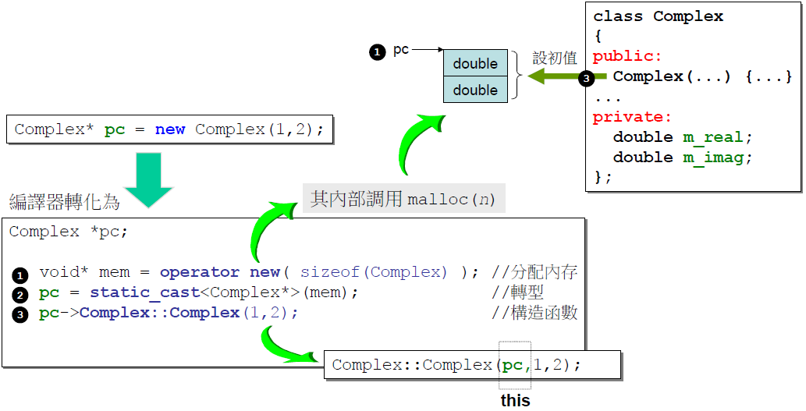

## delete

delete先调用析构函数，再释放内存。

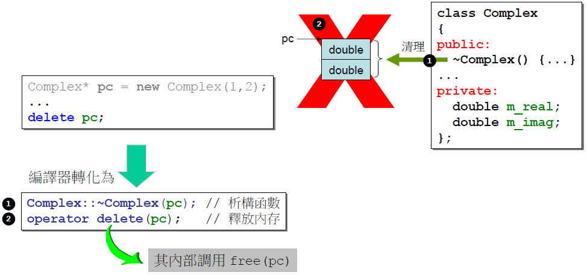

## new/delete malloc/free

### 区别

首先，new/delete是C++的关键字，而malloc/free是C语言的库函数，后者使用必须==<u>指明申请内存空间的大小</u>==，对于类类型的对象，后者不会调用构造函数和析构函数
malloc需要给定申请内存的大小，返回的指针需要强转。
new会调用构造函数，不用指定内存大小，返回的指针不用强转。

1. malloc/free是标准库函数，new/delete是C++运算符

2. malloc失败返回空，new失败抛异常（可以通过定位new操作，让它不抛异常）

3. new/delete会调用构造、析构函数，malloc/free不会，所以他们无法满足动态对象的要求。

4. new返回有类型的指针，malloc返回无类型的指针

   C++提供了new []和delete []用来专门处理数组类型。它会调用构造函数初始化每一个数组元素，然后释放对象时它会为每个对象调用析构函数，但是二者一定要配套使用；至于malloc，它并不知道你要在这块空间放置数组还是其他的东西，就只给一块原始的空间，再给一个内存地址就完事，如果要动态开辟一个数组的内存，还需要我们手动指定数组的大小。

```c++
A * ptr = new A[10];//分配10个A对象
delete [] ptr;
int * ptr = (int *) malloc( sizeof(int) * 10);//分配一个10个int元素的数组
```

5. new会先调用operator new函数，申请足够的内存（通常底层使用malloc实现）。然后调用类型的构造函数，初始化成员变量，最后返回自定义类型指针。delete先调用析构函数，然后调用operator delete函数释放内存（通常底层使用free实现）。malloc/free是库函数，只能动态的申请和释放内存，无法强制要求其做自定义类型对象构造和析构工作。
6. **分配内存的位置**malloc是从堆上动态分配内存，new是从**自由存储区**为对象动态分配内存。
   自由存储区的位置取决于operator new的实现。自由存储区不仅可以为堆，还可以是静态存储区，这都看operator new在哪里为对象分配内存。

在32位模式中，malloc返回的块的地址总是8的倍数；64位中是16的倍数。
malloc不初始化它分配的内存，想初始化的话可以用calloc，calloc是一个基于malloc的瘦包装函数，将分配的内存初始化为零。想要改变一个以前已分配块的大小，可以使用realloc函数。

### delete p、delete [] p、allocator都有什么作用？

1、 动态数组管理new一个数组时，[]中必须是一个整数，但是不一定是常量整数，普通数组必须是一个常量整数；

2、 new动态数组返回的并不是数组类型，而是一个元素类型的指针；

3、 delete[]时，数组中的元素按逆序的顺序进行销毁；

4、 new在内存分配上面有一些局限性，**new的机制是将内存分配和对象构造组合在一起，同样的，delete也是将对象析构和内存释放组合在一起的。allocator将这两部分分开进行，allocator申请一部分内存，不进行初始化对象，只有当需要的时候才进行初始化操作。**

### new和delete实现原理，delete是如何知道释放内存的大小的？

1、 new简单类型直接调用operator new分配内存；
而对于复杂结构，先调用operator new分配内存，然后在分配的内存上调用构造函数；
对于简单类型，new[]计算好大小后调用operator new；
对于复杂数据结构，new[]先调用operator new[]分配内存，然后在p的前四个字节写入数组大小n，然后调用n次构造函数，针对复杂类型，new[]会额外存储数组大小；
①  new表达式调用一个名为operator new(operator new[])函数，分配一块足够大的、原始的、未命名的内存空间；
②  编译器运行相应的构造函数以构造这些对象，并为其传入初始值；
③  对象被分配了空间并构造完成，返回一个指向该对象的指针。

2、 delete简单数据类型默认只是调用free函数；复杂数据类型先调用析构函数再调用operator delete；针对简单类型，delete和delete[]等同。假设指针p指向new[]分配的内存。因为要4字节存储数组大小，实际分配的内存地址为[p-4]，系统记录的也是这个地址。delete[]实际释放的就是p-4指向的内存。而delete会直接释放p指向的内存，这个内存根本没有被系统记录，所以会崩溃。

3、 需要在 new [] 一个对象数组时，需要保存数组的维度，C++ 的做法是<u>在分配数组空间时多分配了 4 个字节的大小，专门保存数组的大小，在 delete [] 时就可以取出这个保存的数，就知道了需要调用析构函数多少次了。</u>

### malloc和free实现原理

1、 在标准C库中，提供了malloc/free函数分配释放内存，这两个函数底层是由brk、mmap、munmap这些系统调用实现的;

2、 brk是将数据段(.data)的最高地址指针_edata往高地址推,mmap是在进程的虚拟地址空间中（堆和栈中间，称为文件映射区域的地方）找一块空闲的虚拟内存。这两种方式分配的都是虚拟内存，没有分配物理内存。在第一次访问已分配的虚拟地址空间的时候，发生缺页中断，操作系统负责分配物理内存，然后建立虚拟内存和物理内存之间的映射关系；

3、 malloc小于128k的内存，使用brk分配内存，将_edata往高地址推；malloc大于128k的内存，使用mmap分配内存，在堆和栈之间找一块空闲内存分配；brk分配的内存需要等到高地址内存释放以后才能释放，而mmap分配的内存可以单独释放。当最高地址空间的空闲内存超过128K（可由M_TRIM_THRESHOLD选项调节）时，执行内存紧缩操作（trim）。在上一个步骤free的时候，发现最高地址空闲内存超过128K，于是内存紧缩。

4、 malloc是从堆里面申请内存，也就是说函数返回的指针是指向堆里面的一块内存。操作系统中有一个记录空闲内存地址的链表。当操作系统收到程序的申请时，就会遍历该链表，然后就寻找第一个空间大于所申请空间的堆结点，然后就将该结点从空闲结点链表中删除，并将该结点的空间分配给程序。

### 几种类型的new

（1）plain new

言下之意就是普通的new，就是我们常用的new，在C++中定义如下：

```c++
void* operator new(std::size_t) throw(std::bad_alloc);
void operator delete(void *) throw();
```

因此**plain new**在空间分配失败的情况下，抛出异常**std::bad_alloc**而不是返回NULL，因此通过判断返回值是否为NULL是徒劳的。

```c++
#include <iostream>
#include <string>
using namespace std;
int main()
{
    try
    {
        char *p = new char[10e11];
        delete p;
    }
    catch (const std::bad_alloc &ex)
    {
        cout << ex.what() << endl;
    }
    return 0;
}
//执行结果：bad allocation
```

（2） nothrow new

nothrow new在空间分配失败的情况下是不抛出异常，而是返回NULL。

```c++
#include <iostream>
#include <string>
using namespace std;

int main()
{
    char *p = new(nothrow) char[10e11];
    if (p == NULL) 
    {
        cout << "alloc failed" << endl;
    }
    delete p;
    return 0;
}
//运行结果：alloc failed
```

（3） placement new

这种new允许在一块已经分配成功的内存上重新构造对象或对象数组。placement new不用担心内存分配失败，因为它根本不分配内存，它做的唯一一件事情就是调用对象的构造函数。

使用placement new需要注意两点：

- palcement new的主要用途就是反复使用一块较大的动态分配的内存来构造不同类型的对象或者他们的数组
- placement new构造起来的对象数组，要显式的调用他们的析构函数来销毁（析构函数并不释放对象的内存），千万不要使用delete，这是因为placement new构造起来的对象或数组大小并不一定等于原来分配的内存大小，使用delete会造成内存泄漏或者之后释放内存时出现运行时错误。


## 深拷贝 浅拷贝

1)  浅拷贝 ：只是拷贝了基本类型的数据，而引用类型数据，复制后也是会发生引用，我们把这种拷贝叫做“（浅复制）浅拷贝”，换句话说，浅复制仅仅是指向被复制的内存地址，如果原地址中对象被改变了，那么浅复制出来的对象也会相应改变。| 浅拷贝只是**拷贝一个指针，并没有新开辟一个地址**，拷贝的指针和原来的指针指向同一块地址，如果原来的指针所指向的资源释放了，那么再释放浅拷贝的指针的资源就会出现错误。

深拷贝 ：在计算机中开辟了一块新的内存地址用于存放复制的对象。| **深拷贝不仅拷贝值，还开辟出一块新的空间用来存放新的值**，即使原先的对象被析构掉，释放内存了也不会影响到深拷贝得到的值。在自己实现拷贝赋值的时候，如果有指针变量的话是需要自己实现深拷贝的。

2)  在某些状况下，类内成员变量需要动态开辟堆内存，如果实行位拷贝，也就是把对象里的值完全复制给另一个对象，如A=B。这时，如果B中有一个成员变量指针已经申请了内存，那A中的那个成员变量也指向同一块内存。这就出现了问题：当B把内存释放了（如：析构），这时A内的指针就是野指针了，出现运行错误。

## 零拷贝

零拷贝就是一种避免 CPU 将数据从一块存储拷贝到另外一块存储的技术。

零拷贝技术可以减少数据拷贝和共享总线操作的次数。

在C++中，vector的一个成员函数**emplace_back()**很好地体现了零拷贝技术，它跟push_back()函数一样可以将一个元素插入容器尾部，区别在于：**使用push_back()函数需要调用拷贝构造函数和转移构造函数，而使用emplace_back()插入的元素原地构造，不需要触发拷贝构造和转移构造**，效率更高。举个例子：

```c++
#include <vector>
#include <string>
#include <iostream>
using namespace std;

struct Person
{
    string name;
    int age;
    //初始构造函数
    Person(string p_name, int p_age): name(std::move(p_name)), age(p_age)
    {
         cout << "I have been constructed" <<endl;
    }
     //拷贝构造函数
     Person(const Person& other): name(std::move(other.name)), age(other.age)
    {
         cout << "I have been copy constructed" <<endl;
    }
     //转移构造函数
     Person(Person&& other): name(std::move(other.name)), age(other.age)
    {
         cout << "I have been moved"<<endl;
    }
};

int main()
{
    vector<Person> e;
    cout << "emplace_back:" <<endl;
    e.emplace_back("Jane", 23); //不用构造类对象

    vector<Person> p;
    cout << "push_back:"<<endl;
    p.push_back(Person("Mike",36));
    return 0;
}
//输出结果：
//emplace_back:
//I have been constructed
//push_back:
//I have been constructed
//I am being moved.
```

## 编译过程

对于C++源文件，从文本到可执行文件一般需要四个过程：

1. **预处理阶段：**

   对源代码文件中文件包含关系（头文件）、预编译语句（宏定义）进行分析和替换，生成预编译文件。主要处理源代码文件中的以“#”开头的预编译指令。

   1. 删除所有的#define，展开所有的宏定义。
   2. 处理所有的条件预编译指令，如“#if”、“#endif”、“#ifdef”、“#elif”和“#else”。
   3. 处理“#include”预编译指令，将文件内容替换到它的位置，这个过程是递归进行的，文件中包含其他
      文件。
   4. 删除所有的注释，“//”和“/**/”。
   5. 保留所有的#pragma 编译器指令，编译器需要用到他们，如：#pragma once 是为了防止有文件被重
      复引用。
   6. 添加行号和文件标识，便于编译时编译器产生调试用的行号信息，和编译时产生编译错误或警告是
      能够显示行号。

2. **编译阶段**：将经过预处理后的预编译文件转换成特定汇编代码，生成**汇编文件**。把预编译之后生成的xxx.i或xxx.ii文件，进行一系列词法分析、语法分析、语义分析及优化后，生成相应的汇编代码文件。

3. **汇编阶段**：将编译阶段生成的汇编文件转化成机器码，生成**可重定位目标文件**。经汇编之后，产生目标文件(与可执行文件格式几乎一样)xxx.o(Windows
   下)、xxx.obj(Linux下)。

4. **链接阶段**：将多个目标文件及所需要的库连接成最终的可执行目标文件

   链接分为静态链接和动态链接。

   **静态链接：**

   函数和数据被编译进一个二进制文件。在使用静态库的情况下，在编译链接可执行文件时，链接器从库中复制这些函数和数据并把它们和应用程序的其它模块组合起来创建最终的可执行文件。

   空间浪费：因为每个可执行程序中对所有需要的目标文件都要有一份副本，所以如果多个程序对同一个目标文件都有依赖，会出现同一个目标文件都在内存存在多个副本；

   更新困难：每当库函数的代码修改了，这个时候就需要重新进行编译链接形成可执行程序。

   运行速度快：但是静态链接的优点就是，在可执行程序中已经具备了所有执行程序所需要的任何东西，在执行的时候运行速度快。

   **动态链接：**

   动态链接的基本思想是把程序按照模块拆分成各个相对独立部分，在程序运行时才将它们链接在一起形成一个完整的程序，而不是像静态链接一样把所有程序模块都链接成一个单独的可执行文件。

   共享库：就是即使需要每个程序都依赖同一个库，但是该库不会像静态链接那样在内存中存在多分，副本，而是这多个程序在执行时共享同一份副本；

   更新方便：更新时只需要替换原来的目标文件，而无需将所有的程序再重新链接一遍。当程序下一次运行时，新版本的目标文件会被自动加载到内存并且链接起来，程序就完成了升级的目标。

   性能损耗：因为把链接推迟到了程序运行时，所以每次执行程序都需要进行链接，所以性能会有一定损失。

## 内存泄漏

**1. 堆内存泄漏：**new/malloc后没有对应的delete/free

```c++
class Complex {...};
...
{
    Complex *p = new Complex;
}
```

以上出现内存泄露，当作用域结束时，p已经结束销毁，但p指向的heap object还存在，在作用域之外再也看不到p（也就没机会delete p了）。

**2. 系统资源泄漏：**程序使用系统分配的资源如bitmap，handle，socket等使用后没有释放掉，导致系统资源的浪费。
**3. 基类指针指向子类，而其析构函数又不是virtual的情况。**

**避免内存泄漏的几种方式：**

- 计数法：使用new或者malloc时，让该数+1，delete或free时，该数-1，程序执行完打印这个计数，如果不为0则表示存在内存泄露
- 一定要将基类的析构函数声明为虚函数
- 对象数组的释放一定要用delete []
- 有new就有delete，有malloc就有free，保证它们一定成对出现

**检测工具**

- Linux下可以使用**Valgrind工具**
- Windows下可以使用**CRT库**

# 四、 面向对象

组合、委托、继承

组合：构造由内而外，析构由外到内
委托：composition by reference，指针可以灵活指向不同的实现，具有一定的弹性，因此又称为“编译防火墙”。
继承：构造时先基类，再派生类，析构时相反。

---

三大特性：继承，封装，多态。
继承：**让某种类型对象获得另一个类型对象的属性和方法。**
封装：数据和代码捆绑在一起，避免外界干扰和不确定性访问。封装，也就是**把客观事物封装成抽象的类**，并且类可以把自己的数据和方法只让可信的类或者对象操作，对不可信的进行信息隐藏。
多态：同一事物表现出不同事物的能力，即向不同对象发送同一消息，不同的对象在接收时会产生不同的行为**（重载实现编译时多态，虚函数实现运行时多态）**。

实现多态有二种方式：覆盖（override），重载（overload）。覆盖：是指子类重新定义父类的虚函数的做法。重载：是指允许存在多个同名函数，而这些函数的参数表不同（或许参数个数不同，或许参数类型不同，或许两者都不同）。例如：基类是一个抽象对象——人，那教师、运动员也是人，而使用这个抽象对象既可以表示教师、也可以表示运动员。

## 空类

 C++空类的大小不为0，不同编译器设置不一样，vs设置为1； 

**C++中要求对于类的每个实例都必须有独一无二的地址**,那么编译器自动为空类分配一个字节大小，这样便保证了每个实例均有独一无二的内存地址。

## 继承vs组合

一：继承

继承是Is a 的关系，比如说Student继承Person,则说明Student is a Person。继承的优点是子类可以重写父类的方法来方便地实现对父类的扩展。

继承的缺点有以下几点：

①：父类的内部细节对子类是可见的。

②：子类从父类继承的方法在编译时就确定下来了，所以无法在运行期间改变从父类继承的方法的行为。

③：如果对父类的方法做了修改的话（比如增加了一个参数），则子类的方法必须做出相应的修改。所以说子类与父类是一种高耦合，违背了面向对象思想。

二：组合

组合也就是设计类的时候把要组合的类的对象加入到该类中作为自己的成员变量。

组合的优点：

①：当前对象只能通过所包含的那个对象去调用其方法，所以所包含的对象的内部细节对当前对象时不可见的。

②：当前对象与包含的对象是一个低耦合关系，如果修改包含对象的类中代码不需要修改当前对象类的代码。

③：当前对象可以在运行时动态的绑定所包含的对象。可以通过set方法给所包含对象赋值。

组合的缺点：①：容易产生过多的对象。②：为了能组合多个对象，必须仔细对接口进行定义。

## 多态和虚函数

多态的实现主要分为静态多态和动态多态，静态多态主要是重载，在编译的时候就已经确定；动态多态是用虚函数机制实现的，在运行期间动态绑定。举个例子：一个父类类型的指针指向一个子类对象时候，使用父类的指针去调用子类中重写了的父类中的虚函数的时候，会调用子类重写过后的函数，在父类中声明为加了virtual关键字的函数，在子类中重写时候不需要加virtual也是虚函数。
虚函数的实现：在有虚函数的类中，类的**最开始部分**是一个虚函数表的指针，这个指针指向一个虚函数表，表中放了虚函数的地址，实际的虚函数在代码段(.text)中。当子类继承了父类的时候也会继承其虚函数表，当子类重写父类中虚函数时候，会将其继承到的虚函数表中的地址替换为重新写的函数地址。使用了虚函数，会增加访问内存开销，降低效率

<u>通过基类指针或基类的引用可以访问派生类对象中的基类部分，而不能访问派生类新增的成员。</u>但如果基类中的某个函数被定义为虚函数的话，则会有完全不同的效果，它表明该函数在派生类中可能有不同的实现，当用基类的指针调用该函数时，<u>首先会到派生类中去看一看这个函数有没有重新定义</u>。如果派生类重新定义了这个函数，则执行派生类中的函数，否则执行基类的函数。
如果从该基类派生出多个派生类，每个派生类都可以重新定义这个虚函数。当用基类的指针指向不同的派生类的对象时，就会调用不同的函数，这样就实现了多态性。而这个绑定要到运行时根据当时基类指针指向的是哪一个派生类的对象，才能决定调用哪一个函数，因为被称为运行时的多态性。

- 可以将派生类的对象赋值给基类的指针或引用，反之不可
- 普通函数（非类成员函数）不能是虚函数
- 静态函数（static）不能是虚函数

---

实现过程：

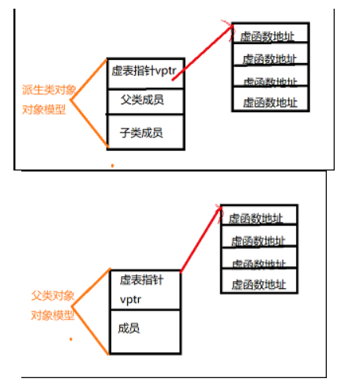

(1)编译器在发现基类中有虚函数时，会自动为每个含有虚函数的类生成一份虚表，该表是一个一维数组，虚表里保存了虚函数的入口地址

(2)编译器会在每个对象的前四个字节中保存一个虚表指针，即vptr，指向对象所属类的虚表。在构造时，根据对象的类型去初始化虚指针vptr，从而让vptr指向正确的虚表，从而在调用虚函数时，能找到正确的函数

(3)所谓的合适时机，在派生类定义对象时，程序运行会自动调用构造函数，在构造函数中创建虚表并对虚表初始化。在构造子类对象时，会先调用父类的构造函数，此时，编译器只“看到了”父类，并为父类对象初始化虚表指针，令它指向父类的虚表；当调用子类的构造函数时，为子类对象初始化虚表指针，令它指向子类的虚表

(4)当派生类对基类的虚函数没有重写时，派生类的虚表指针指向的是基类的虚表；当派生类对基类的虚函数重写时，派生类的虚表指针指向的是自身的虚表；当派生类中有自己的虚函数时，在自己的虚表中将此虚函数地址添加在后面

这样指向派生类的基类指针在运行时，就可以根据派生类对虚函数重写情况动态的进行调用，从而实现多态性。

### 静态绑定：

对于一般的非虚成员函数来说,其在内存中的地址是固定的,编译时只需将函数调用编译成`call`命令即可,这被称为**静态绑定**.


### 动态绑定：

对于虚成员函数,调用时根据虚表`vtbl`判断具体调用的实现函数,相当于先把函数调用翻译成`(* p->vptr[n])(p)`,这被称为**动态绑定**.

需要有三个条件：1）必须是通过指针来调用函数.（实测,通过`.`运算符调用不会触发动态绑定）。2）指针是向上转型的（往下指的）。指针new的时候是new了一只猪，不过该指针当时声明时指的是动物，类型是动物，这称为向上转型。3）调用的是虚函数。


### 虚函数表和虚函数表指针

为了实现虚函数，C++使用一种称为虚拟表的特殊形式的后期绑定。该虚拟表是用于解决在动态/后期绑定方式的函数调用函数的查找表。虚拟表有时会使用其他名称，例如“vtable”，“虚函数表”，“虚方法表”或“调度表”。
首先，**每个使用虚函数的类（或者从使用虚函数的类派生）都有自己的虚拟表**。该表只是编译器在编译时设置的静态数组。虚拟表包含可由类的对象调用的每个虚函数的一个条目。**此表中的每个条目只是一个函数指针，指向该类可访问的派生函数。**
其次，编译器还会添加一个隐藏指向基类的指针，我们称之为vptr。vptr在创建类实例时自动设置，以便指向该类的虚拟表。<u>与this指针不同，this指针实际上是编译器用来解析自引用的函数参数，vptr是一个真正的指针。</u>
因此，**它使每个类对象的分配大一个指针的大小。**这也意味着vptr由派生类继承，这很重要。

---

**虚表是属于类的，而不是属于某个具体的对象，一个类只需要一个虚表即可。同一个类的所有对象都使用同一个虚表。**为了指定对象的虚表，对象内部包含一个虚表的指针，来指向自己所使用的虚表。为了让每个包含虚表的类的对象都拥有一个虚表指针，编译器在类中添加了一个指针，`*__vptr`，用来指向虚表。这样，**当类的对象在创建时便拥有了这个指针，且这个指针的值会自动被设置为指向类的虚表。**

---

我们把对象从**首地址开始**的4个字节或者是8个字节，这个位置我们称之为**虚函数表指针**（vptr），它里面包含一个地址指向的就是**虚函数表**（vftable）的地址。

### 虚函数 析构

**C++默认的析构函数不是虚函数是因为虚函数需要额外的虚函数表和虚表指针，占用额外的内存。**而对于不会被继承的类来说，其析构函数如果是虚函数，就会浪费内存。因此C++默认的析构函数不是虚函数，而是只有当需要当作父类时，设置为虚函数。

派生类的析构函数在执行时会自动调用基类的析构函数。<u>如果继承层次树中的根类的析构函数是虚函数的话，所有派生类的析构函数都将是虚函数。</u>

## 菱形继承、虚继承、虚基类

https://blog.csdn.net/c_base_jin/article/details/86036185


## 构造函数

> 结论1：如果没有定义任何构造函数，C++编译器会自动创建一个默认构造函数。
> 结论2：如果已经定义了一个构造函数，编译器不会自动创建默认构造函数，只能显式调用该构造函数。

### 初始化

**方式：**

1)  赋值初始化，通过在函数体内进行赋值初始化；2）列表初始化，在冒号后使用初始化列表进行初始化。
这两种方式的主要区别在于：
对于在函数体中初始化,是在所有的数据成员被分配内存空间后才进行的。

列表初始化是给数据成员分配内存空间时就进行初始化,就是说分配一个数据成员只要冒号后有此数据成员的赋值表达式(此表达式必须是括号赋值表达式),那么分配了内存空间后<u>在进入函数体之前给数据成员赋值</u>，就是说初始化这个数据成员此时函数体还未执行。

**顺序：**

一个派生类构造函数的执行顺序如下：
①  虚拟基类的构造函数（多个虚拟基类则按照继承的顺序执行构造函数）。
②  基类的构造函数（多个普通基类也按照继承的顺序执行构造函数）。
③  类类型的成员对象的构造函数（按照初始化顺序）
④  派生类自己的构造函数。

**列表初始化：**

方法一是在构造函数当中做赋值的操作，而方法二是做纯粹的初始化操作。我们都知道，C++的赋值操作是会产生临时对象的。临时对象的出现会降低程序的效率。**如果是在构造函数体内进行赋值的话，等于是一次默认构造加一次赋值，而初始化列表只做一次赋值操作。**

必须使用成员初始化的四种情况：①当初始化一个引用成员时；② 当初始化一个常量成员时；③ 当调用一个基类的构造函数，而它拥有一组参数时；④ 当调用一个成员类的构造函数，而它拥有一组参数时；

成员初始化列表做了什么：①   编译器会一一操作初始化列表，以适当的顺序在构造函数之内安插初始化操作，并且在任何显示用户代码之前；②   list中的项目顺序是由类中的**成员声明顺序决定的**，不是由初始化列表的顺序决定的；

### 构造函数不能是虚函数

**1、 从存储空间角度，**虚函数相应一个指向vtable虚函数表的指针，这大家都知道，但是这个指向vtable的指针事实上是存储在对象的内存空间的。问题出来了，假设构造函数是虚的，就须要通过 vtable来调用，但是对象还没有实例化，也就是内存空间还没有，怎么找vtable呢？所以构造函数不能是虚函数。
**2、 从使用角度，**虚函数主要用于在信息不全的情况下，能使重载的函数得到相应的调用。构造函数本身就是要初始化实例，那使用虚函数也没有实际意义呀。所以构造函数没有必要是虚函数。虚函数的作用在于通过父类的指针或者引用来调用它的时候可以变成调用子类的那个成员函数。而构造函数是在创建对象时**自己主动调用**的，不可能通过父类的指针或者引用去调用，因此也就规定构造函数不能是虚函数。

> 构造函数或析构函数可以调用虚函数吗？

要结论：

- 从语法上讲，调用完全没有问题。
- 但是从效果上看，往往不能达到需要的目的。

《Effective C++》的解释是：
派生类对象构造期间进入基类的构造函数时，对象类型变成了基类类型，而不是派生类类型。同样，进入基类析构函数时，对象也是基类类型。

```c++
#include<iostream>
using namespace std;
class Base
{
public:
    Base()
    {
       Function();
    }
    virtual void Function()
    {
        cout << "Base::Fuction" << endl;
    }
    ~Base()
    {
        Function();
    }
};
class A : public Base
{
public:
    A()
    {
      Function();
    }

    virtual void Function()
    {
        cout << "A::Function" << endl;
    }
    ~A()
    {
        Function();
    }
};

int main()
{
    Base* a = new Base;
    delete a;
    cout << "-------------------------" <<endl;
    Base* b = new A;//语句1
    delete b;
}
//输出结果
//Base::Fuction
//Base::Fuction
//-------------------------
//Base::Fuction
//A::Function
//Base::Fuction
```

语句1讲道理应该体现多态性，执行类A中的构造和析构函数，从实验结果来看，语句1并没有体现，执行流程是先构造基类，所以先调用基类的构造函数，构造完成再执行A自己的构造函数，析构时也是调用基类的析构函数，也就是说构造和析构中调用虚函数并不能达到目的，应该避免。

### 构造函数不能是const

不同于其他成员函数，构造函数不能被声明成const的（参见7.1.2节，第231页）。当我们创建类的一个const对象时，直到构造函数完成初始化过程，对象才能真正取得其“常量”属性。因此，构造函数在const对象的构造过程中可以向其写值。

## 构造函数和析构函数可否抛出异常

1)  C++只会析构<u>已经完成</u>的对象，对象只有在其构造函数执行完毕才算是完全构造妥当。在构造函数中发生异常，控制权转出构造函数之外。因此，在对象b的构造函数中发生异常，对象b的析构函数不会被调用。因此会造成内存泄漏。

2)  用**auto_ptr对象**来取代指针类成员，便对构造函数做了强化，免除了抛出异常时发生资源泄漏的危机，不再需要在析构函数中手动释放资源；

3)  如果控制权基于异常的因素离开析构函数，而此时正有另一个异常处于作用状态，C++会调用terminate函数让程序结束；

4)  如果异常从析构函数抛出，而且没有在当地进行捕捉，那个析构函数便是执行不全的。如果析构函数执行不全，就是没有完成他应该执行的每一件事情。

## 对象移动

【性能效率】在程序当中，经常会发生对象的拷贝，某些情况下，对象拷贝完立马就被销毁（比如传参的时候），在这样的情况下，使用移动就可以大幅提升性能。
【有些不能共享，不能被拷贝】使用移动而不是拷贝的另一个原因源于IO类或unique_ptr这样的类。这些类都包含不能被共享的资源（如指针或IO缓冲）。因此，这些类型的对象不能拷贝但可以移动。
<u>标准库容器、string和shared_ptr类既支持移动也支持拷贝。IO类和unique_ptr类可以移动但不能拷贝。</u>

### 右值引用

变量都是左值，即使是右值引用，但也是变量，所以还是左值。？

右值引用就是必须绑定到右值（一个临时对象、将要销毁的对象）的引用，一般表示对象的值。
右值引用可实现转移语义（Move Sementics）和完美转发（Perfect Forwarding），它的主要目的有两个方面：

- **消除两个对象交互时不必要的对象拷贝，节省运算存储资源，提高效率。**

- 能够更简洁明确地**定义泛型函数。**

---

左值持久，右值短暂。move()函数。

右值引用构造中，需要将原指针打断，也就是设为null。如果不将其设为null，那么在执行下图插入语句时，由于是构建了一个临时对象，那么其内容被“偷走”后，会触发析构函数，此时析构函数发现指针并不是null，就会将相应内容delete掉，由于原指针和新指针都指向这一块地方，那么把原指针的内容delete掉，那新指针就会出错了。

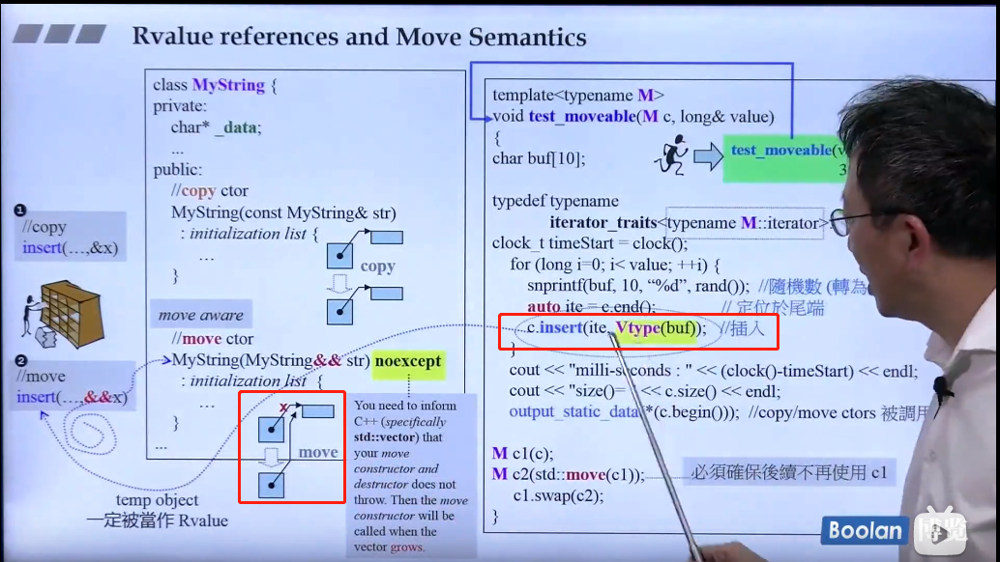

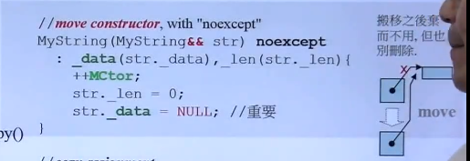

### 右值引用与函数模板

使用右值引用作为函数模板的参数时，与之前的用法有些不同：如果函数模板参数以右值引用作为一个模板参数，当对应位置提供左值的时候，模板会自动将其类型认定为左值引用；当提供右值的时候，会当做普通数据使用。可能有些口语化，来看几个例子吧。

考虑一下下面的函数模板：

```c++
template<typename T>
void foo(T&& t){}
```

随后传入一个右值，T的类型将被推导为：

```c++
foo(42);  // foo<int>(42)
foo(3.14159);  // foo<double><3.14159>
foo(std::string());  // foo<std::string>(std::string())
```

不过，向foo传入左值的时候，T会被推导为一个左值引用：

```c++
int i = 42;
foo(i);  // foo<int&>(i)
```

因为函数参数声明为`T&&`，所以就是引用的引用，可以视为是原始的引用类型。那么foo()就相当于：

```c++
foo<int&>(); // void foo<int&>(int& t);
```

这就允许一个函数模板可以即接受左值，又可以接受右值参数；这种方式已经被`std::thread`的构造函数所使用(2.1节和2.2节)，所以能够将可调用对象移动到内部存储，而非当参数是右值的时候进行拷贝。

### 移动构造函数

#### 设计初衷

我们用对象a初始化对象b，后对象a我们就不在使用了，但是对象a的空间还在呀（在析构之前），既然拷贝构造函数，实际上就是把a对象的内容复制一份到b中，那么为什么我们不能直接使用a的空间呢？这样就避免了新的空间的分配，大大降低了构造的成本。这就是移动构造函数设计的初衷；

---

移动构造函数的第一个参数是该类类型的一个引用，不过是右值引用，与拷贝构造函数一样，任何额外的参数都必须有默认实参。
与拷贝构造函数不同，**移动构造函数不分配任何新内存，而是接管。**

<u>移动赋值运算符执行与析构函数和移动构造函数相同的工作。</u>

当我们编写一个移动操作时，必须确保移后源对象进入一个可析构的状态。

如果一个类定义了自己的拷贝构造函数、拷贝赋值运算符或者析构函数，编译器不会为它合成移动构造函数和移动赋值运算符。**只有当一个类没有定义任何自己版本的拷贝控制成员，且类的每个非static数据成员都可以移动时，编译器才会为它合成移动构造函数或移动赋值运算符。**

移动右值，拷贝左值。如果没有移动构造函数，右值也被拷贝。

移动构造在 STL 当中非常的常用。使用移动构造可以节省大量的时间和空间开销，可以做一个小实验，还是用我们的 MyString 类，我们用普通的拷贝构造函数和移动构造函数分别进行 10000000 次的初始化操作，看看时间上的差距，时间的单位是秒，可以看到，使用移动构造进行初始化，效率提升了一倍！

### forward

完美转发实现了参数在传递过程中保持其值属性的功能，即若是左值，则传递之后仍然是左值，若是右值，则传递之后仍然是右值。C++11 lets us perform perfect forwarding, which means that we can forward the parameters passed to **a function template** to another function call inside it **without losing their own qualifiers (const-ref, ref, value, rvalue, etc.).**

move 可以直接调用：`std::move(i)` ，但 foward 要明确给出模板参数：`std::foward<int>(i)` 才能使用。forward 会模板参数类型的右值引用，也就是：`int&&` 。注意，如果我们这样使用：`std::forward<int&>(i)` 返回的就是 `int& &&` ，进而折叠为 `int&` 。

一般来说，<u>模板函数中的参数类型为右值引用的时候，就需要搭配 forward 来使用</u>，**通过 forward 和引用折叠**，就可以完美的保留参数类型了。

## 拷贝构造函数与赋值运算符重载的区别

- 拷贝构造函数是函数，赋值运算符是运算符重载。

- 拷贝构造函数会生成新的类对象，赋值运算符不能。

- 拷贝构造函数是直接构造一个新的类对象，所以在初始化对象前不需要检查源对象和新建对象是否相同；赋值运算符需要上述操作并提供两套不同的复制策略，另外赋值运算符中如果原来的对象有内存分配则需要先把内存释放掉。

- 形参传递是调用拷贝构造函数（调用的被赋值对象的拷贝构造函数），但并不是所有出现"="的地方都是使用赋值运算符，如下：

  Student s;
   Student s1 = s;   // 调用拷贝构造函数
   Student s2;
   s2 = s;   // 赋值运算符操作

注：类中有指针变量时要重写析构函数、拷贝构造函数和赋值运算符

## 拷贝构造传引用而不能传值

1) 拷贝构造函数的作用就是用来复制对象的，在使用这个对象的实例来初始化这个对象的一个新的实例。

2) 参数传递过程到底发生了什么？
 将地址传递和值传递统一起来，归根结底还是传递的是"值"(地址也是值，只不过通过它可以找到另一个值)！
i)值传递:
 对于内置数据类型的传递时，直接赋值拷贝给形参(注意形参是函数内局部变量)；
 对于类类型的传递时，需要首先调用该类的拷贝构造函数来初始化形参(局部对象)；

如void foo(class_type obj_local){}, 如果调用foo(obj); 首先class_type obj_local(obj) ,这样就定义了局部变量obj_local供函数内部使用

ii)引用传递:
 无论对内置类型还是类类型，传递引用或指针最终都是传递的地址值！而地址总是指针类型(属于简单类型), 显然参数传递时，按简单类型的赋值拷贝，而不会有拷贝构造函数的调用(对于类类型).
上述1) 2)回答了为什么拷贝构造函数使用值传递会产生无限递归调用，内存溢出。

==拷贝构造函数用来初始化一个非引用类类型对象，如果用传值的方式进行传参数，**那么构造实参需要调用拷贝构造函数，而拷贝构造函数需要传递实参**，所以会**一直递归**。==

## 继承

- public的变量和函数在类的内部外部都可以访问。
- protected的变量和函数只能在类的内部和其派生类中访问。
- private修饰的元素只能在类内访问。

（一）访问权限：

派生类可以继承基类中除了构造/析构、赋值运算符重载函数之外的成员，但是这些成员的访问属性在派生过程中也是可以调整的，三种派生方式的访问权限如下表所示：注意外部访问并不是真正的外部访问，而是在通过派生类的对象对基类成员的访问。


派生类对基类成员的访问形象有如下两种：

- 内部访问：由派生类中新增的成员函数对从基类继承来的成员的访问
- 外部访问：在派生类外部，通过派生类的对象对从基类继承来的成员的访问

（二）继承权限

**public继承**

公有继承的特点是基类的公有成员和保护成员作为派生类的成员时，都**保持原有的状态**，而基类的私有成员任然是私有的，不能被这个派生类的子类所访问

**protected继承**

保护继承的特点是基类的所有公有成员和保护成员**都成为派生类的保护成员**，并且只能被它的派生类成员函数或友元函数访问，基类的私有成员仍然是私有的.

**private继承**

私有继承的特点是基类的所有公有成员和保护成员**都成为派生类的私有成员**，并不被它的派生类的子类所访问，基类的成员只能由自己派生类访问，无法再往下继承

## 虚继承

由于C++支持多继承，除了public、protected和private三种继承方式外，还支持虚拟（virtual）继承，举个例子：

```c++
#include <iostream>
using namespace std;

class A{}
class B : virtual public A{};
class C : virtual public A{};
class D : public B, public C{};

int main()
{
    cout << "sizeof(A)：" << sizeof A <<endl; // 1，空对象，只有一个占位
    cout << "sizeof(B)：" << sizeof B <<endl; // 4，一个bptr指针，省去占位,不需要对齐
    cout << "sizeof(C)：" << sizeof C <<endl; // 4，一个bptr指针，省去占位,不需要对齐
    cout << "sizeof(D)：" << sizeof D <<endl; // 8，两个bptr，省去占位,不需要对齐
}
```

上述代码所体现的关系是，B和C虚拟继承A，D又公有继承B和C，这种方式是一种**菱形继承或者钻石继承**，可以用如下图来表示

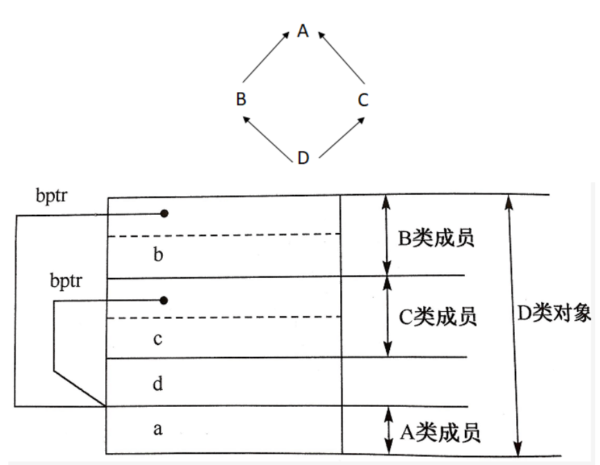

**虚拟继承的情况下，无论基类被继承多少次，只会存在一个实体。**虚拟继承基类的子类中，子类会增加某种形式的指针，或者指向虚基类子对象，或者指向一个相关的表格；表格中存放的不是虚基类子对象的地址，就是其偏移量，此类指针被称为bptr，如上图所示。如果既存在vptr又存在bptr，某些编译器会将其优化，合并为一个指针.

## 运算符重载

1、 我们只能重载已有的运算符，而无权发明新的运算符；对于一个重载的运算符，其优先级和结合律与内置类型一致才可以；不能改变运算符操作数个数；

2、  两种重载方式：成员运算符和非成员运算符，成员运算符比非成员运算符少一个参数；下标运算符、箭头运算符必须是成员运算符；

3、 引入运算符重载，是为了实现类的多态性；

4、 当重载的运算符是成员函数时，this绑定到左侧运算符对象。成员运算符函数的参数数量比运算符对象的数量少一个；至少含有一个类类型的参数；

5、 从参数的个数推断到底定义的是哪种运算符，当运算符既是一元运算符又是二元运算符（+，-，*，&）；

6、 下标运算符必须是成员函数，下标运算符通常以所访问元素的引用作为返回值，同时最好定义下标运算符的常量版本和非常量版本；

7、 箭头运算符必须是类的成员，解引用通常也是类的成员；重载的箭头运算符必须返回类的指针；

# 五、 新特性等

## 异常

常见的异常有：

- 数组下标越界
- 除法计算时除数为0
- 动态分配空间时空间不足
- …

**（1）try、throw和catch关键字**

C++中的异常处理机制主要使用**try**、**throw**和**catch**三个关键字，其在程序中的用法如下：

```c++
#include <iostream>
using namespace std;
int main()
{
    double m = 1, n = 0;
    try {
        cout << "before dividing." << endl;
        if (n == 0)
            throw - 1;  //抛出int型异常
        else if (m == 0)
            throw - 1.0;  //拋出 double 型异常
        else
            cout << m / n << endl;
        cout << "after dividing." << endl;
    }
    catch (double d) {
        cout << "catch (double)" << d << endl;
    }
    catch (...) {
        cout << "catch (...)" << endl;
    }
    cout << "finished" << endl;
    return 0;
}
//运行结果
//before dividing.
//catch (...)
//finished
```

代码中，对两个数进行除法计算，其中除数为0。可以看到以上三个关键字，程序的执行流程是先执行try包裹的语句块，如果执行过程中没有异常发生，则不会进入任何catch包裹的语句块。如果发生异常，则使用throw进行异常抛出，再由catch进行捕获，throw可以抛出各种数据类型的信息，代码中使用的是数字，也可以自定义异常class。

catch根据throw抛出的数据类型进行精确捕获（不会出现类型转换），如果匹配不到就直接报错，可以使用catch(…)的方式捕获任何异常（不推荐）。

当然，如果catch了异常，当前函数如果不进行处理，或者已经处理了想通知上一层的调用者，<u>可以在catch里面再throw异常</u>。

**（2）函数的异常声明列表**

有时候，程序员在定义函数的时候知道函数可能发生的异常，可以在函数声明和定义时，指出所能抛出异常的列表，写法如下：

```c++
int fun() throw(int,double,A,B,C){...};
```

这种写法表名函数可能会抛出int,double型或者A、B、C三种类型的异常，如果throw中为空，表明不会抛出任何异常，如果没有throw则可能抛出任何异常

**（3）C++标准异常类  exception**

C++ 标准库中有一些类代表异常，这些类都是从 exception 类派生而来的，如下图所示


- bad_typeid：使用typeid运算符，如果其操作数是一个多态类的指针，而该指针的值为 NULL，则会拋出此异常，例如：

```c++
#include <iostream>
#include <typeinfo>
using namespace std;

class A{
public:
  virtual ~A();
};

using namespace std;
int main() {
    A* a = NULL;
    try {
          cout << typeid(*a).name() << endl; // Error condition
      }
    catch (bad_typeid){
          cout << "Object is NULL" << endl;
      }
    return 0;
}
//运行结果：bject is NULL
```

- bad_cast：在用 dynamic_cast 进行从多态基类对象（或引用）到派生类的引用的强制类型转换时，如果转换是不安全的，则会拋出此异常
- bad_alloc：在用 new 运算符进行动态内存分配时，如果没有足够的内存，则会引发此异常
- out_of_range:用 vector 或 string的at 成员函数根据下标访问元素时，如果下标越界，则会拋出此异常

## 模板

**分类：**类模板、函数模板、成员模板。

在模板参数列表中，typename和class关键字的含义相同，可以互换使用，混着用也可。

1)  编译器并不是把函数模板处理成能够处理任意类的函数；**编译器从函数模板通过具体类型产生不同的函数**；编译器会对函数模板进行两次编译：在声明的地方对模板代码本身进行编译，在调用的地方对参数替换后的代码进行编译。【模板编译只是个半成品，等到使用时再编译一次】

2)  这是因为==**函数模板要被实例化后才能成为真正的函数，在使用函数模板的源文件中包含函数模板的头文件，如果该头文件中只有声明，没有定义，那编译器无法实例化该模板，最终导致链接错误。**==

### 模板编译

当编译器遇到一个模板定义时，**它并不生成代码**。只有当我们实例化出模板的一个特定版本时，**编译器才会生成代码。**
通常，当我们调用一个函数时，编译器只需要掌握函数的声明。类似的，当我们使用一个类类型的对象时，类定义必须是可用的，但成员函数的定义不必已经出现。因此，我们将类定义和函数声明放在头文件中，而普通函数和类的成员函数的定义放在源文件中。
**模板则不同：为了生成一个实例化版本，编译器需要掌握函数模板或类模板成员函数的定义。因此，与非模板代码不同，==模板的头文件通常既包括声明也包括定义。==**

模板直到实例化才会生成代码。

### 模板编译错误

模板直到实例化时才会生成代码，这一特性影响了我们何时才会获知模板内代码的编译错误。通常，编译器会在三个阶段报告错误：

+ 第一个阶段是编译模板本身时。在这个阶段，编译器通常不会发现很多错误。编译器可以检查语法错误，例如忘记分号或者变量名拼错等，但也就这么多了
+ 第二个阶段是编译器遇到模板使用时。在此阶段，编译器仍然没有很多可检查的。对于函数模板调用，编译器通常会检查实参数目是否正确。它还能检查参数类型是否匹配。对于类模板，编译器可以检查用户是否提供了正确数目的模板实参，但也仅限于此了。
+ 第三个阶段是模板实例化时，只有这个阶段才能发现类型相关的错误。依赖于编译器如何管理实例化，这类错误可能在链接时才报告。

## 动态内存与智能指针

全局对象在程序启动时分配，在程序结束时销毁；局部自动对象，进入其定义所在的程序块时被创建，在离开时销毁；局部static对象在第一次使用前分配，在程序结束时销毁。动态分配的对象的生存期与它们在哪里创建的无关，只有当显式地被释放时，这些对象才会销毁。
<u>静态内存用来存放局部static对象、类static数据成员以及定义在任何函数之外的变量。栈内存用来保存定义在函数内的非static对象。静态内存和栈内存的都由编译器自动创建和销毁。程序用堆来存储动态分配的对象。</u>

**为了更容易（同时也更安全）地使用动态内存**，新的标准库提供了两种**智能指针（smart pointer）**类型来管理动态对象。智能指针的行为类似常规指针，重要的区别是它负责**自动释放所指向的对象**。新标准库提供的这两种智能指针的区别在于管理底层指针的方式：**shared_ptr允许多个指针指向同一个对象；unique_ptr则“独占”所指向的对象。**标准库还定义了一个名为weak_ptr的伴随类，它是一种**弱引用，指向shared_ptr所管理的对象**。这三种类型都定义在memory头文件中。

### shared_ptr类

类似vector，智能指针也是模板。`shared_ptr<string> p1; shared_ptr<list<int>> p2;`默认初始化的智能指针中保存着一个空指针。

```c++
if (p1 && p1->empty()) *p1 = "hi";
```

#### make_shared函数

最安全的分配和使用动态内存的方法是调用一个名为make_shared的标准库函数。此函数在动态内存中分配一个对象并初始化它，返回指向此对象的shared_ptr。

```c++
shared_ptr<int> p3 = make_shared<int>(42);
shared_ptr<string> p4 = make_shared<string>(10, '9');
shared_ptr<int> p5 = make_shared<int>();
```

类似顺序容器的emplace成员（参见9.3.1节，第308页），make_shared用其参数来构造给定类型的对象。直接用auto更简单`auto p6 = make_shared<vector<string>>();`

---

我们可以认为每个shared_ptr都有一个关联的计数器，通常称其为引用计数。计数器为0之后，会自动销毁。

```c++
auto r = make_shared<int>(42);
r = q;//给r赋值，让它指向新的地址，递增q的对象的引用计数，递减r的对象的引用计数。r原来指向的对象已没有引用者，会自动释放。
```

通过析构函数来完成销毁工作。shared_ptr还会自动释放相关联的内存。
程序使用动态内存出于以下三种原因之一：
	1.程序不知道自己需要使用多少对象（如容器就是个典型的例子）
	2.程序不知道所需对象的准确类型
	3.程序需要在多个对象间共享数据

**用new分配const对象是合法的。**一个动态分配的const对象必须进行初始化。对于一个定义了默认构造函数（参见7.1.4节，第236页）的类类型，其const动态对象可以隐式初始化，而其他类型的对象就必须显式初始化。由于分配的对象是const的，new返回的指针是一个**指向const的指针。**

```c++
const int *pci = new const int(1024);
const string *pcs = new string;//分配并默认初始化了一个const的空的string。
```

如果new失败了，会抛出一个bad_alloc的异常，但是也可以让它改变方式。

```c++
int *p1 = new int;//失败就会异常std::bac_alloc
int *p2 = new (nothrow) int;//失败就会返回一个空指针。
```

这种形式的new称为**定位new（placement new）** ，其中nothrow那里放指针？定位new允许向new传递额外的参数。

使用new和delete常见的三个错误：

+ 忘记delete内存，引起内存泄漏的问题。只有当内存真正耗尽后，才能发现问题。
+ 使用已释放掉的对象，通过在释放内存后将指针置空，有时可以检测这种错误。
+ 同一内存释放两次。

当我们delete一个指针后，指针值就变为无效了。虽然指针已经无效，但在很多机器上指针仍然保存着（已经释放了的）动态内存的地址。在delete之后，指针就变成了人们所说的**空悬指针（dangling pointer）**，即，指向一块曾经保存数据对象但现在已经无效的内存的指针。

#### 悬浮指针

（1） c++中的悬浮指针：声明了但没有被赋值的指针？它指向任意一个空间，避免悬浮指针的一个方法就是一开始就赋值为NULL。

（2） 野指针不是NULL指针，而是指向“垃圾”内存的指针，此时用if语句检查不出错误，很危险。其成因主要有两种：

+ 指针变量没有被初始化，其值是随机的，会乱指一通。**所以，指针变量在创建的同时应当被初始化，要么将指针设置为NULL，要么让它指向合法的内存。**
+ 指针被free或delete之后，没有置为NULL，而后边又用了。free和delete只是把指针所指的内存给释放掉了，但并没有把指针本身干掉，用语句`if (p != NULL)`进行防错处理，但此时不起作用，检查不出来。

（3）另外一个要注意的问题时，<u>不要返回指向栈内存的指针或引用</u>， 因为栈内存在函数结束时会被释放掉。

可以用new初始化一个智能指针，但是必须要直接初始化，当函数返回时要显式绑定，具体看书。

### auto_ptr与unique_ptr

auto_ptr是C98里的，C11已经摒弃，没有所有权的概念，两个指向同一个，如A = B，再去访问B时会报错，会在运行时崩溃，可以用shared_ptr替代，让它们都允许指向，或者使用unique_ptr，则在编译时报错。unique_ptr不允许转让，**更安全。**
但如果试图将一个unique_ptr赋值给另一个时，源unique_ptr是个临时右值的话，编译器是允许的！若真的想把一个左值赋给另一个，可以用move()函数。
不能在容器中保存auto_ptr，也不能从函数中返回auto_ptr。
unique_ptr优于auto_ptr的另一个点是，可用于数组，auto_ptr使用的是delete而不是delete []，所以只能与new一起用，而unique_ptr都支持。

### weak_ptr

weak_ptr是一种不控制所指向对象生存期的智能指针，它指向由一个shared_ptr管理的对象。**将一个weak_ptr绑定到一个shared_ptr不会改变shared_ptr的引用计数。一旦最后一个指向对象的shared_ptr被销毁，对象就会被释放。即使有weak_ptr指向对象，对象也还是会被释放。当我们创建一个weak_ptr时，要用一个shared_ptr来初始化它。**
在使用 weak_ptr 的时候，千万不能直接用，因为 weak_ptr 指向的对象不一定还存在，从而需要先调用 lock。如果存在，lock 会返回一个指向共享对象的 shared_ptr。这个 shared_ptr 只要存在，那么底层对象也会一直存在。
我们可以将 weak_ptr 类型指针视为 shared_ptr 指针的一种辅助工具，借助 weak_ptr 类型指针，我们可以获取 shared_ptr 指针的一些状态信息，比如有多少指向相同的 shared_ptr 指针、shared_ptr 指针指向的堆内存是否已经被释放等等。

### 总结

#### **原理**

智能指针是一个类，用来存储指向动态分配对象的指针，负责自动释放动态分配的对象，防止堆内存泄漏。动态分配的资源，交给一个类对象去管理，当类对象声明周期结束时，自动调用析构函数释放资源

#### **常用的智能指针**

**(1) shared_ptr**
实现原理：采用引用计数器的方法，允许多个智能指针指向同一个对象，每当多一个指针指向该对象时，指向该对象的所有智能指针内部的引用计数加1，每当减少一个智能指针指向对象时，引用计数会减1，当计数为0的时候会自动的释放动态分配的资源。

- 智能指针将一个计数器与类指向的对象相关联，引用计数器跟踪共有多少个类对象共享同一指针
- 每次创建类的新对象时，初始化指针并将引用计数置为1
- 当对象作为另一对象的副本而创建时，拷贝构造函数拷贝指针并增加与之相应的引用计数
- 对一个对象进行赋值时，赋值操作符减少左操作数所指对象的引用计数（如果引用计数为减至0，则删除对象），并增加右操作数所指对象的引用计数
- 调用析构函数时，构造函数减少引用计数（如果引用计数减至0，则删除基础对象）

**(2) unique_ptr**
unique_ptr采用的是独享所有权语义，一个非空的unique_ptr总是拥有它所指向的资源。转移一个unique_ptr将会把所有权全部从源指针转移给目标指针，源指针被置空；所以unique_ptr**不支持普通的拷贝和赋值操作，不能用在STL标准容器中**；局部变量的返回值除外（因为编译器知道要返回的对象将要被销毁）；如果你拷贝一个unique_ptr，那么拷贝结束后，这两个unique_ptr都会指向相同的资源，造成在结束时对同一内存指针多次释放而导致程序崩溃。

**(3) weak_ptr**
weak_ptr：弱引用。引用计数有一个问题就是互相引用形成环（环形引用），这样两个指针指向的内存都无法释放。需要使用weak_ptr打破环形引用。weak_ptr是一个弱引用，它是为了配合shared_ptr而引入的一种智能指针，它指向一个由shared_ptr管理的对象而不影响所指对象的生命周期，也就是说，**它只引用，不计数**。如果一块内存被shared_ptr和weak_ptr同时引用，当所有shared_ptr析构了之后，不管还有没有weak_ptr引用该内存，内存也会被释放。所以weak_ptr不保证它指向的内存一定是有效的，在使用之前使用函数lock()检查weak_ptr是否为空指针。

**(4) auto_ptr**
主要是为了解决“有异常抛出时发生内存泄漏”的问题 。因为发生异常而无法正常释放内存。
**auto_ptr有拷贝语义，拷贝后源对象变得无效，这可能引发很严重的问题；而unique_ptr则无拷贝语义，但提供了移动语义，这样的错误不再可能发生，因为很明显必须使用std::move()进行转移。**
auto_ptr不支持拷贝和赋值操作，不能用在STL标准容器中。STL容器中的元素经常要支持拷贝、赋值操作，在这过程中auto_ptr会传递所有权，所以不能在STL中使用。

### 循环引用

循环引用是指使用多个智能指针share_ptr时，出现了指针之间相互指向，从而形成环的情况，有点类似于死锁的情况，这种情况下，智能指针往往不能正常调用对象的析构函数，从而造成内存泄漏。（比如两个节点的智能指针，前者的next指向后，后者的prev指向前，要析构时都等着对方释放资源而均无法析构。）

在实际编程过程中，应该尽量避免出现智能指针之间相互指向的情况，如果不可避免，可以使用弱指针—weak_ptr，它不增加引用计数，只要出了作用域就会自动析构。

## auto与for-range

### auto

首先看第一种情况，auto, 即for(auto x : range)。这一种用法将会为range的每一种元素都创建一份拷贝，所以当你不想改变range里面的元素而想拷贝时，使用这一种用法。这一种用法有两个特殊的情况

> 1. 用于`vector<bool>`时，可能结果会出乎你的意料。

vector<bool>是一个奇葩的存在，它的`[]`返回的不是bool，是一个表示单独bool引用的proxy class，于是你得到是这个引用（而你平常使用bool没事，是因为完成了一个隐式转换），而你用auto的话，想要得到意想中的类型，需要使用static_cast<bool>，再给auto。而这也不是特例，其适用于含有proxy class的class。
所以当你使用for(auto x : vector<bool>)时，你得到的x是一个__bit_reference proxy class，而这个class在进行赋值操作符=时，是返回的引用，于是当你对x操作时，你会改变vector<bool>本身的元素。这样的情况，你最好直接使用for(bool x : vector<bool>).

```c++
std::vector<bool> vec {false, false};
for(auto x : vec) {
  x = true; // all elements be true.
}

// change to --->
for(bool x : vec) {
  x = true; // won't change vec and work as you expected.
}
```

> 2. 不能用于含有std::unique_ptr等只有move语意的容器。

这一个很好理解，因为auto是在进行拷贝，而std::unique_ptr没有，若你尝试这样去做，会有编译错误.

### auto&

`for(auto& x : range)`，当你想要修改range(不含有proxy class reference处理时)里面的元素时，使用auto&**.** 而auto& 的使用同样有一种特殊情况，即括号那么绕口的内容：用于vector<bool>时，会产生编译错误。因为vector<bool>返回的是__bit_reference proxy class临时对象，而这个临时对象不能绑定在non-const l-value reference中。所以，你可能会想这时候刚好用for(auto x : vector<bool>)就好了。那么，有没有两全其美的办法？

### auto&&

当被左值初始化时，auto&&是左值引用(l-value reference)
当被右值初始化时，auto&&是右值引用(r-value reference)

### const auto &

for(const auto& x : range), **当你只想要读取range里面的元素时，使用const auto&.** 这种用法没有特殊情况，即使是`std::vector<bool>`, `std::vector<std::unique_ptr<int>>`. 而且它也没有进行拷贝，所以大多数情况下，这会是你的首选。

## lambda表达式

可调用对象：**函数**、**函数指针**、**重载了函数调用运算符的类**以及**lambda表达式**。

一个lambda表达式表示一个可调用的代码单元。我们可以将其理解为一个<u>未命名的内联函数</u>。与任何函数类似，一个lambda具有一个返回类型、一个参数列表和一个函数体。但与函数不同，lambda可能定义在函数内部。一个lambda表达式具有以下形式：

```
[capture list] (parameter list) -> return type {function body}
```

我们可以忽略参数列表和返回类型，但必须永远包含<u>捕获列表和函数体</u>。如果函数体只是一个return语句，则返回类型从返回的表达式的类型推断而来。否则，返回类型为void。如果lambda的函数体包含任何单一return语句之外的内容，且未指定返回类型，则返回void。

### 传参

与普通函数不同，lambda不能有默认参数。

### 编译器执行

当定义一个lambda时，**编译器生成一个与lambda对应的新的（未命名的）类类型。**目前，可以这样理解，当向一个函数传递一个lambda时，**同时定义了一个新类型和该类型的一个对象**：传递的参数就是此编译器生成的类类型的未命名对象。类似的，当使用auto定义一个用lambda初始化的变量时，定义了一个从lambda生成的类型的对象。

### 捕获列表

虽然一个lambda可以出现在一个函数中，使用其局部变量，但它只能使用那些明确指明的变量。一个lambda通过将局部变量包含在其捕获列表中来指出将会使用这些变量。捕获列表指引lambda在其内部包含访问局部变量所需的信息。

#### 值捕获

与传值参数类似，**采用值捕获的前提是变量可以拷贝**。与参数不同，**被捕获的变量的值是在lambda创建时拷贝，而不是调用时拷贝。**

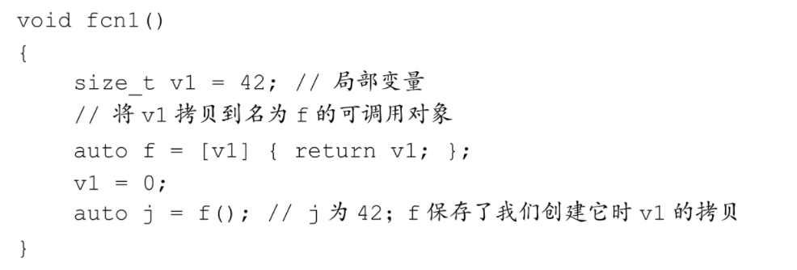

由于被捕获变量的值是在lambda创建时拷贝，因此随后对其修改不会影响到lambda内对应的值。

#### 引用捕获

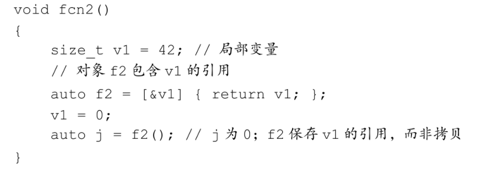

> 要注意的问题

如果我们采用引用方式捕获一个变量，就必须确保被引用的对象在lambda执行的时候是存在的。lambda捕获的都是局部变量，这些变量在函数结束后就不复存在了。如果lambda可能在函数结束后执行，捕获的引用指向的局部变量已经消失。

如果我们捕获一个指针或迭代器，或采用引用捕获方式，就**必须确保在lambda执行时，绑定到迭代器、指针或引用的对象仍然存在。**而且，需要保证对象具有预期的值。在lambda从创建到它执行的这段时间内，可能有代码改变绑定的对象的值。也就是说，在指针（或引用）被捕获的时刻，绑定的对象的值是我们所期望的，但在lambda执行时，该对象的值可能已经完全不同了。

#### 隐式捕获

除了显式列出我们希望使用的来自所在函数的变量之外，还可以让编译器根据lambda体中的代码来推断我们要使用哪些变量。为了指示编译器推断捕获列表，应在捕获列表中写一个&或=。&告诉编译器采用捕获引用方式，=则表示采用值捕获方式。

当混合使用隐式捕获和显式捕获时，<u>显式捕获的变量必须使用与隐式捕获不同的方式</u>。即，如果隐式捕获是引用方式（使用了&），则显式捕获命名变量必须采用值方式，因此不能在其名字前使用&。类似的，如果隐式捕获采用的是值方式（使用了=），则显式捕获命名变量必须采用引用方式，即，在名字前使用&。

## C++11新特性

auto，for-range，lambda表达式，右值引用&移动构造，统一的初始化列表等。

---

- nullptr替代 NULL
- 引入了 auto 和 decltype 这两个关键字实现了类型推导
- 基于范围的 for 循环for(auto& i : res){}
- 类和结构体的中初始化列表
- Lambda 表达式（匿名函数）
- std::forward_list（单向链表）
- 右值引用和move语义
- …

## 将字符串“hello world”从开始到打印到屏幕上的全过程?

1. 用户告诉操作系统执行HelloWorld程序（通过键盘输入等）

2．操作系统：找到helloworld程序的相关信息，检查其类型是否是可执行文件；并通过程序首部信息，确定代码和数据在可执行文件中的位置并计算出对应的磁盘块地址。

3．操作系统：创建一个新进程，将HelloWorld可执行文件映射到该进程结构，表示由该进程执行helloworld程序。

4．操作系统：为helloworld程序设置cpu上下文环境，并跳到程序开始处。

5．执行helloworld程序的第一条指令，发生缺页异常

6．操作系统：分配一页物理内存，并将代码从磁盘读入内存，然后继续执行helloworld程序

7．helloword程序执行puts函数（系统调用），在显示器上写一字符串

8．操作系统：找到要将字符串送往的显示设备，通常设备是由一个进程控制的，所以，操作系统将要写的字符串送给该进程

9．操作系统：控制设备的进程告诉设备的窗口系统，它要显示该字符串，窗口系统确定这是一个合法的操作，然后将字符串转换成像素，将像素写入设备的存储映像区

10．视频硬件将像素转换成显示器可接收和一组控制数据信号

11．显示器解释信号，激发液晶屏

12．OK，我们在屏幕上看到了HelloWorld

# 六、并发编程

## lock_guard()和unique_lock()

而 `std::unique_lock` 则相对于 `std::lock_guard` 出现的，`std::unique_lock` 更加灵活， `std::unique_lock` 的对象会以独占所有权（没有其他的 `unique_lock` 对象同时拥有某个 `mutex` 对象的所有权） 的方式管理 `mutex` 对象上的上锁和解锁的操作。所以在并发编程中，推荐使用 `std::unique_lock`。`std::lock_guard` 不能显式的调用 `lock` 和 `unlock`， 而 `std::unique_lock` 可以在声明后的任意位置调用， 可以缩小锁的作用范围，提供更高的并发度。如果你用到了条件变量 `std::condition_variable::wait` 则必须使用 `std::unique_lock` 作为参数。

```c++
#include <iostream>
#include <thread>
#include <mutex>
int v = 1;

void critical_section(int change_v) {
    static std::mutex mtx;
    std::unique_lock<std::mutex> lock(mtx);
    // 执行竞争操作
    v = change_v;
    std::cout << v << std::endl;
    // 将锁进行释放
    lock.unlock();

    // 在此期间，任何人都可以抢夺 v 的持有权

    // 开始另一组竞争操作，再次加锁
    lock.lock();
    v += 1;
    std::cout << v << std::endl;
}

int main() {
    std::thread t1(critical_section, 2), t2(critical_section, 3);
    t1.join();
    t2.join();
    return 0;
}
```

## future

Future表现为 `std::future`，它提供了一个访问异步操作结果的途径。

试想，如果我们的主线程 A 希望新开辟一个线程 B 去执行某个我们预期的任务，并返回我一个结果。 而这时候，线程 A 可能正在忙其他的事情，无暇顾及 B 的结果， 所以我们会很自然的希望能够在某个特定的时间获得线程 B 的结果。

在 C++11 的 `std::future` 被引入之前，通常的做法是： 创建一个线程 A，在线程 A 里启动任务 B，当准备完毕后发送一个事件，并将结果保存在全局变量中。 而主函数线程 A 里正在做其他的事情，当需要结果的时候，调用一个线程等待函数来获得执行的结果。

而 C++11 提供的 `std::future` 简化了这个流程，可以用来获取异步任务的结果。 自然地，我们很容易能够想象到把它作为一种简单的线程同步手段，即屏障（barrier）

---

std::async是一个函数模板，用来启动一个异步任务，它返回一个std::future类模板对象，future对象起到了**占位**的作用（记住这点就可以了），占位是什么意思？就是说该变量现在无值，但将来会有值（好比你挤公交瞧见空了个座位，刚准备坐下去就被旁边的小伙给拦住了：“这个座位有人了”，你反驳道：”这不是空着吗？“，小伙：”等会人就来了“）,刚实例化的future是没有储存值的，但在调用std::future对象的get()成员函数时，主线程会被阻塞直到异步线程执行结束，并把返回结果传递给std::future，即通过FutureObject.get()获取函数返回值。

```c++
#include <iostream>
#include <thread>
#include <mutex>
#include<future>
#include<Windows.h>
using namespace std;
double t1(const double a, const double b)
{
 double c = a + b;
 Sleep(3000);//假设t1函数是个复杂的计算过程，需要消耗3秒
 return c;
}

int main() 
{
 double a = 2.3;
 double b = 6.7;
 future<double> fu = async(t1, a, b);//创建异步线程线程，并将线程的执行结果用fu占位；
 cout << "正在进行计算" << endl;
 cout << "计算结果马上就准备好，请您耐心等待" << endl;
 cout << "计算结果：" << fu.get() << endl;//阻塞主线程，直至异步线程return
        //cout << "计算结果：" << fu.get() << endl;//取消该语句注释后运行会报错，因为future对象的get()方法只能调用一次。
 return 0;
}
```

### shared_future

std::future与std::shard_future的用途都是为了**占位**，但是两者有些许差别。std::future的get()成员函数是转移数据所有权;std::shared_future的get()成员函数是复制数据。 因此： **future对象的get()只能调用一次**；无法实现多个线程等待同一个异步线程，一旦其中一个线程获取了异步线程的返回值，其他线程就无法再次获取。 **std::shared_future对象的get()可以调用多次**；可以实现多个线程等待同一个异步线程，每个线程都可以获取异步线程的返回值。

## 条件变量

条件变量 `std::condition_variable` 是为了解决死锁而生，当互斥操作不够用而引入的。 比如，线程可能需要等待某个条件为真才能继续执行， 而一个忙等待循环中可能会导致所有其他线程都无法进入临界区使得条件为真时，就会发生死锁。 所以，`condition_variable` 实例被创建出现主要就是用于唤醒等待线程从而避免死锁。 `std::condition_variable`的 `notify_one()` 用于唤醒一个线程； `notify_all()` 则是通知所有线程。

## 生产者消费者

```c++
#include<iostream>
#include<thread>
#include<mutex>
#include<queue>
#include<condition_variable>

using namespace std;

struct Data{
    int id;
    string description;
};

queue<Data> q;
const int MAX_LENGTH = 10;

mutex m;
condition_variable condConsumer, condProducer;

void Consumer() {
    while(true) {
        unique_lock<mutex> lk(m);
        while (q.empty()) {
            condConsumer.wait(lk);
        }
        Data d = q.front();
        q.pop();
        condProducer.notify_one();
    }
}

void Producer() {
    while(true) {
        unique_lock<mutex> lk(m);
        while (q.size() >= MAX_LENGTH) {
            condProducer.wait(lk);
        }
        Data d;
        q.push(d);
        condConsumer.notify_one();
    }
}

void Dispatch(int numConsumer, int numProducer) {
    vector<thread> vecC;
    for (int i = 0; i < numConsumer; i++)
        vecC.push_back(thread(Consumer));

    vector<thread> vecP;
    for (int i = 0; i < numProducer; i++)
        vecP.push_back(thread(Producer));

    for (int i = 0; i < numConsumer; i++)
        if (vecC[i].joinable())
            vecC[i].join();
    for (int i = 0; i < numProducer; i++)
        if (vecP[i].joinable())
            vecP[i].join();

}

int main() {
    Dispatch(1, 5);
    return 0;
}
```


# 七、杂记


如果一个容器需要容纳不同大小的元素，可以用容器存放指针，然后指针去指向这些元素。