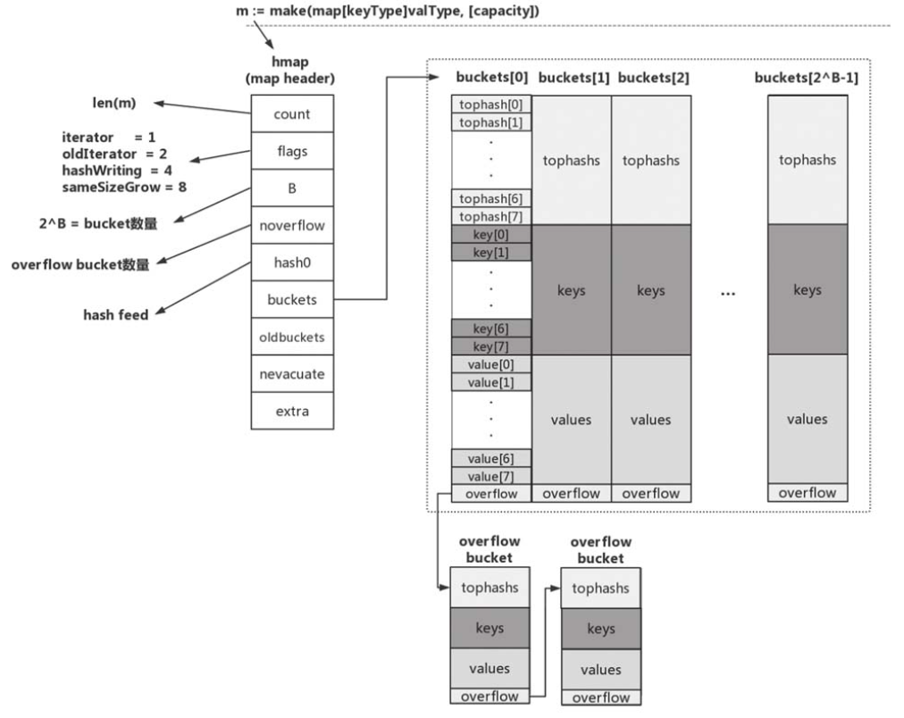

# GO语言

除了OOP外，近年出现了一些小众的编程哲学，Go语言对这些思想亦有所吸收。例如，Go语言接受了函数式编程的一些想法，支持匿名函数与闭包。再如，Go语言接受了以Erlang语言为代表的面向消息编程思想，支持goroutine和通道，并推荐使用消息而不是共享内存来进行并发编程。总体来说，Go语言是一个非常现代化的语言，精小但非常强大。

Go 语言最主要的特性：

- 自动垃圾回收
- 更丰富的内置类型
- 函数多返回值
- 错误处理
- 匿名函数和闭包
- 类型和接口
- 并发编程
- 反射
- 语言交互性

动态语言因为没有从编译代码到执行代码的中间过程，用动态语言写程序可以快速看到输出。代价是，动态语言不提供静态语言提供的类型安全特性。

## 类型推导和接口

Go语言支持`var a = 7`语法，这让Go语言有点像动态类型语言，但它实际上是**强类型语言**，只是变量a定义时会被自动推导出是整数类型。Go语言在代码风格上像动态语言，在运行效率上则像静态编译型语言。

## 包

使用包来封装不同语义单元的功能。
每个包都在一个单独的目录里。不能把多个包放到同一个目录中，也不能把同一个包的文件分拆到多个不同的目录中。这意味着，同一个目录下的所有.go文件必须声明为同一个包名。在Go语言中，命名为main的包具有特殊的含义。Go语言的编译程序会试图把这种名字的包编译为二进制可执行文件。所有用Go语言编一的可执行程序都必须有一个叫main的包。
import . 这个`.`的含义是，在调用包的函数时，可以省略包名。`_`只用于导入包，而并不需要这个包的其他函数、常量等资源，而是调用了该包的`init`函数。

## 数据类型

**字符串类型、数值类型和布尔类型在Go中是值类型，切片、channel、接口、函数和map属于引用类型。**结构体类型可以描述一组不同类型的值，这一组值本质上既可以是引用类型也可以是值类型。

Go 语言里的引用类型有如下几个：切片、映射、通道、接口和函数类型。当声明上述类型的变量时，创建的变量被称作**标头（header）值**。从技术细节上说，字符串也是一种引用类型。**每个引用类型创建的标头值是包含一个指向底层数据结构的指针。**每个引用类型还包含一组独特的字段，用于管理底层数据结构。因为标头值是为复制而设计的，所以永远不需要共享一个引用类型的值。**标头值里包含一个指针，因此通过复制来传递一个引用类型的值的副本，本质上就是在共享底层数据结构。**

类型的本质：使用值接收者还是指针接收者，不应该由方法是否修改了接收到的值来决定，这个决策应该基于该类型的本质。非原始的类型，应该用指针。这条规则的一个例外就是，需要让类型值符合某个接口的时候，即便类型的本质是非原始的，也可以选择使用值接收者声明方法。这样做完全符合接口值调用方法的机制。

Go语言中数组、字符串和切片三者是密切相关的数据结构。这3种数据类型，在底层原始数据有着相同的内存结构，在上层，因为语法的限制而有着不同的行为表现。首先，Go语言的数组是一种值类型，虽然数组的元素可以被修改，但是数组本身的赋值和函数传参都是以**整体复制**的方式处理的。Go语言**字符串底层数据也是对应的字节数组**，但是字符串的**只读属性**禁止了在程序中对底层字节数组的元素的修改。字符串赋值只是复制了数据地址和对应的长度，而不会导致底层数据的复制。切片的行为更为灵活，切片的结构和字符串结构类似，但是解除了只读限制。**切片的底层数据虽然也是对应数据类型的数组，但是每个切片还有独立的长度和容量信息，切片赋值和函数传参时也是将切片头信息部分按传值方式处理。**因为切片头含有底层数据的指针，所以它的赋值也不会导致底层数据的复制。其实Go语言的赋值和函数传参规则很简单，除闭包函数以引用的方式对外部变量访问之外，其他赋值和函数传参都是以传值的方式处理。要理解数组、字符串和切片这3种不同的处理方式的原因，需要详细了解它们的底层数据结构。					——《Go语言高级编程》

### 底层类型数据类型

Go要求，两个类型即便拥有相同的底层类型（underlying type），也仍然是不同的数据类型，不可以被相互比较或混在一个表达式中进行运算：

```go
type myInt int

func main() {
    var a int = 5
    var b myInt = 6
    fmt.Println(a + b) // 会报错，编译器提示invalid operation: a + b(mismatch types int and myInt)
}
```

我们看到，Go在处理不同类型的变量间的运算时不支持隐式的类型转换。

## 参数传递

Go语言中的函数参数都是**按值传递**的。

## 变量

分为包级变量和局部变量。
包级变量（package variable）：在package级别可见的变量。如果是导出变量，则该包级变量也可以被视为全局变量。
局部变量（local variable）：函数或方法体内声明的变量，仅在函数或方法体内可见。

包级变量只能使用带有var关键字的变量声明形式。虽然没有显式初始化，但Go语言会让这些变量拥有初始的“零值”。
对于声明且显式初始化的局部变量，建议使用短变量声明形式。尽量在分支控制时应用短变量声明形式。


## 常量

Go的const语法提供了“隐式重复前一个非空表达式”的机制，来看下面的代码：

```go
const (
    Apple, Banana = 11, 22
	Strawberry, Grape
	Pear, Watermelon
)
```

常量定义的后两行没有显式给予初始赋值，Go编译器将为其隐式使用第一行的表达式，这样上述定义等价于：

```go
const (
    Apple, Banana = 11, 22
	Strawberry, Grape = 11, 22
	Pear, Watermelon = 11, 22
)
```

**iota是Go语言的一个预定义标识符，它表示的是const声明块（包括单行声明）中每个常量所处位置在块中的偏移值（从零开始）。**

```go
const(
	_ = iota	// 0
    Pin1
    Pin2
    Pin3
    _			//相当于_ = iota, 略过了4这个枚举值
    Pin5		//5
)
```


## 零值

如果声明一个变量而没有给它赋值，该变量将包含其类型的零值。（也就是初始化？）
与变量一样，当创建一个数组时，它所包含的所有的值都初始化为该数组所保存类型的零值。
任何时候，创建一个变量并初始化为其零值，习惯是使用关键字`var`。<u>这种用法是为了更明确地表示一个变量被设置为零值</u>。如果变量被初始化为某个非零值，就配合结构字面量和短变量声明操作符来创建变量。

nil是预定义的一种标识符，代表指针、信道、函数、接口、映射或切片的零值。nil不能赋值给字符串、数值和布尔类型，否则会引发panic类型的错误。

+ 字符串：""
+ 数值：0
+ 布尔：false
+ 指针：nil
+ 数组：每个数组元素类型对应的零值
+ 信道、函数、切片、接口、映射：nil

### 零值可用

第一个例子是关于切片的：


Go中的切片类型具备零值可用的特性，我们可以直接对其进行append操作，而不会出现引用nil的错误。

第二个例子是通过nil指针调用方法：


我们声明了一个net.TCPAddr的指针变量，但并未对其显式初始化，指针变量p会被Go编译器赋值为nil。在标准输出上输出该变量，`fmt.Println`会调用`p.String()`。

在Go标准库和运行时代码中还有很多践行“零值可用”理念的好例子，最典型的莫过于sync.Mutex和bytes.Buffer了。

```go
var mu sync.Mutex
mu.Lock()
mu.Unlock()

var b bytes.Buffer
b.Write([]byte("Effective Go"))
fmt.Println(b.String()) // 输出Effective Go
```

可以看到，我们无须对bytes.Buffer类型的变量b进行任何显式初始化，即可直接通过b调用Buffer类型的方法进行写入操作。这是因为bytes.Buffer结构体用于存储数据的字段buf支持零值可用策略的切片类型：

## 布尔

布尔类型无法参与数值运算，也无法与其他类型进行转换。

## 数组

复制指针数组，只会复制指针的值，而不会复制指针所指向的值。复制之后，两个数组指向同一组字符串。Go语言实战Page 57。
Go语言中数组是值语义。**一个数组变量即表示整个数组**，它并不是隐式地指向第一个元素的指针（例如C语言的数组），**而是一个完整的值**。当一个数组变量被赋值或者被传递的时候，实际上会复制整个数组。如果数组较大的话，数组的赋值也会有较大的开销。**为了避免复制数组带来的开销，可以传递一个指向数组的指针，但是数组指针并不是数组。**		——《Go语言高级编程》

### 空数组 && 通道

我们还可以定义一个空的数组：

```go
var d [0]int		//定义一个长度为0的数组
var e = [0]int{}	//定义一个长度为0的数组
var f = [...]int{}	//定义一个长度为0的数组
```

长度为0的数组（空数组）在内存中并不占用空间。空数组虽然很少直接使用，但是可以用于强调某种特有类型的操作时避免分配额外的内存空间，例如用于通道的同步操作：

```go
c1 := make(chan [0]int)
go func() {
    fmt.Println("c1")
    c1 <- [0]int{}
}()
<-c1
```

在这里，我们并不关心通道中传输数据的真实类型，其中通道接收和发送操作只是用于消息的同步。对于这种场景，我们用空数组作为通道类型可以减少通道元素赋值时的开销。当然，一般更倾向于用无类型的匿名结构体代替空数组：

```go
c2 := make(chan struct{})
go func() {
    fmt.Println("c2")
    c2 <- struct{}{}	//struct{}部分是类型，{}表示对应的结构体值
}()
<-c2
```


### 多维数组：

```go
array := [4][2]int{{10, 11}, {20, 21}, {30, 31}, {40, 41}}
array := [4][2]int{1:{20, 21}, 3:{40,41}}
array := [4][2]int{1:{0:20}, 3:{1:41}}
```

### 在函数间传递数组

在函数间传递数组是一个开销很大的操作。在函数之间传递变量时，总是以值的方式传递的。如果这个变量是一个数组，意味着整个数组，不管有多长，都会完整复制，并传递给函数。

## 字符串

字符串是==**只读**==的字符片段。用单引号（'）括起来的是单个字符，用int32表示。反单引号（`）括起来的字符串不会被转义，而是按照原语输出。
string类型的零值为空字符串""，获取字符串中某个字符的地址是非法的，比如&msg[0]。

和数组不同的是，字符串的元素不可修改，是一个只读的字节数组。每个字符串的长度虽然也是固定的，但是字符串的长度并不是字符串类型的一部分。

Go语言字符串的底层结构在reflect.StringHeader中定义：

```go
type StringHeader struct {
    Data uintptr
    Len int
}
```

字符串结构由**两个信息组成：第一个是字符串指向的底层字节数组；第二个是字符串的字节的长度。**字符串其实是一个结构体，因此字符串的赋值操作也就是reflect.StringHeader结构体的复制过程，并不会涉及底层字节数组的复制。

## 切片

```go
var myArray [3]int	//数组
var mySlice []int	//切片
```

**不像数组变量，声明切片变量并不会自动创建一个切片。**使用make或字面量来创建和初始化切片。

```go
var notes []string
notes = make([]string, 7) //创建7个字符的切片
//或者使用短变量声明，长度和容量都为5
primes := make([]int, 5)
//长度为3，容量为5
slice := make([]int, 3, 5)
```

切片并不会自己保存任何数据，它仅仅是底层数组的元素的**视图**。由于切片只是底层数组内容的视图，如果你修改底层数组，这些变化也会反映到切片。给切片的一个元素赋一个新值也会修改底层数组相应的元素。

切片的底层数组并不能增长大小。如果数组没有足够的空间来保存新的元素，所有的元素会被拷贝至一个新的更大的数组，并且切片会被更新为引用这个新的数组。但是由于这些场景都发生在append函数内部，无法知道返回的切片与传入append函数的切片是否具有相同的底层数组。如果你保留了两个切片，会导致一些非预期的错误。


---

**切片有3个字段，分别是指向底层数组的指针、切片访问的元素的个数（即长度）和切片允许增长到的元素的个数（即容量）。**


---

在对切片本身进行赋值或参数传递时，和数组指针的操作方式类似，但是只复制**切片头信息**（reflect.SliceHeader），而不会复制底层的数据。对于类型，和数组的最大不同是，切片的类型和长度信息无关，只要是相同类型元素构成的切片均对应相同的切片类型。

### nil切片和空切片

在需要描述一个不存在的切片时，nil切片会很好用。`var a []int `nil切片，和nil相等。切片可以和nil进行比较，只有当切片底层数据指针为空时切片本身才为nil，<u>这时候切片的长度和容量信息将是无效的</u>。如果有切片的底层数据指针为空，但是长度和容量不为0的情况，那么说明切片本身已经被损坏了

空切片：

```go
// 空切片的两种方法
slice := make([]int, 0)
slice := []int{}
```

不管是使用nil切片还是空切片，对其调用内置的append、len和cap的效果都是一样的。

### append

切片增长：在切片容量小于1000时，成倍增长；在元素个数超过1000时，增长因子为1.25。 

```go
s1 := []int{1, 2}
s2 := []int{3, 4}
fmt.Printf("%v\n", append(s1, s2...)) //s2中的所有元素都添加到了s1之后。
```

以下来自《Go语言高级编程》

**末尾添加**：内置的泛型函数append()可以在切片的尾部追加N个元素：注意【解包】

```go
var a []int
a = append(a, 1)				//追加一个元素
a = append(a, 1, 2, 3)			//追加多个元素，手写解包方式
a = append(a, []int{1,2,3}...)	//追加一个切片，切片需要解包
```

**开头添加**：除了在切片的尾部追加，还可以在切片的开头添加元素：

```go
var a = []int{1,2,3}
a = append([]int{0}, a...)
a = append([]int{-3, -2, -1}, a...)
```

在开头一般都会导致内存的重新分配，而且会导致已有的元素全部复制一次。因此，从切片的开头添加元素的性能一般要比从尾部追加元素的性能差很多。

**中间添加**：由于append()函数返回新的切片，也就是它支持链式操作，因此我们可以将多个append ()操作组合起来，实现在切片中间插入元素：

```go
var a []int
a = append(a[:i], append([]int{x}, a[i:]...)...)		//在第i个位置插入x
a = append(a[:i], append([]int{1,2,3}, a[i:]...)...)	//在第i个位置插入切片
```

可以用copy和append结合的方式避免使用中间切片来进行在中间添加元素，具体看书1.3.3节。

在本节开头的数组部分我们提到过有类似[0]int的空数组，空数组一般很少用到。但是对于切片来说，len为0但是cap容量不为0的切片则是非常有用的特性。当然，如果len和cap都为0的话，则变成一个真正的空切片，虽然它并不是一个nil的切片。**在判断一个切片是否为空时，一般通过len获取切片的长度来判断，一般很少将切片和nil做直接的比较。**

### 在函数间传递切片

在函数间传递切片就是要在函数间以值的方式传递切片。由于切片尺寸很小，在函数间复制和传递切片成本也很低。<u>在64位架构的机器上，一个切片需要24字节的内存：指针字段需要8个字节，长度和容量分别需要8字节。</u>由于与切片关联的数据包含在底层数组里，不属于切片本身，所以将切片复制到任意函数的时候，对底层数组大小都不会有影响。复制时只会复制切片本身，不会涉及底层数组。

Go语言中，如果以切片为参数调用函数，有时候会给人一种参数采用了传引用的方式的假象：因为在被调用函数内部可以修改传入的切片的元素。其实，任何可以通过函数参数修改调用参数的情形，都是因为函数参数中显式或隐式传入了指针参数。函数参数传值的规范更准确说是只针对数据结构中固定的部分传值，例如字符串或切片对应结构体中的指针和字符串长度结构体传值，但是并不包含指针间接指向的内容。		因为切片中的底层数组部分通过隐式指针传递（指针本身依然是传值的，但是指针指向的却是同一份的数据），所以被调用函数可以通过指针修改调用参数切片中的数据。除数据之外，切片结构还包含了切片长度和切片容量信息，这两个信息也是传值的。<u>如果被调用函数中修改了Len或Cap信息，就无法反映到调用参数的切片中，这时候我们一般会通过返回修改后的切片来更新之前的切片。这也是内置的append ()必须要返回一个切片的原因。</u>   ——《Go语言高级编程》

## map

map对value的类型没有限制，但是对key的类型有严格要求：key的类型应该严格定义了作为“==”和“!=”两个操作符的操作数时的行为，因此**函数、map、切片不能作为map的key类型。**

map类型**不支持“零值可用”**，未显式赋初值的map类型变量的零值为nil。对处于零值状态的map变量进行操作将会导致运行时panic。

和切片一样，map也是引用类型，将map类型变量作为函数参数传入不会有很大的性能损耗，并且在函数内部对map变量的修改在函数外部也是可见的

---

**映射一个存储键值对的==无序集合==。**


在我们的例子里，键是字符串，代表颜色。这些字符串会转换为一个数值（散列值）。这个数值落在映射已有桶的序号范围内表示一个可以用于存储的桶的序号。之后，这个数值就被用于选择桶，用于存储或者查找指定的键值对。对Go 语言的映射来说，**生成的散列键的一部分，具体来说是低位（LOB），被用来选择桶。**
如果再仔细看看图4-24，就能看出桶的内部实现。映射使用两个数据结构来存储数据。第一个数据结构是一个数组，内部存储的是用于选择桶的散列键的高八位值。这个数组用于区分每个键值对要存在哪个桶里。第二个数据结构是一个字节数组，用于存储键值对。该字节数组先依次存储了这个桶里所有的键，之后依次存储了这个桶里所有的值。实现这种键值对的存储方式目的在于减少每个桶所需的内存。

**切片、函数以及包含切片的结构类型**这些类型由于具有引用语义，不能作为映射的键，使用这些类型会造成编译错误。

在函数间传递映射时，并不会制造出该映射的一个副本。

### 遍历（无序性

我们看到对同一map做多次遍历，遍历的元素次序并不相同。这是因为Go运行时在初始化map迭代器时对起始位置做了随机处理。因此千万不要依赖遍历map所得到的元素次序。如果你需要一个稳定的遍历次序，那么一个比较通用的做法是使用另一种数据结构来按需要的次序保存key，比如切片：

```go
// chapter3/sources/map_stable_iterate.go

import "fmt"

func doIteration(sl []int, m map[int]int) {
    fmt.Printf("{ ")
    for _, k := range sl { // 按切片中的元素次序迭代
        v, ok := m[k]
        if !ok {
            continue
        }
        fmt.Printf("[%d, %d] ", k, v)
    }
    fmt.Printf("}\n")
}

func main() {
    var sl []int
    m := map[int]int{
        1: 11,
        2: 12,
        3: 13,
    }

    for k, _ := range m {
        sl = append(sl, k) // 将元素按初始次序保存在切片中
    }

    for i := 0; i < 3; i++ {
        doIteration(sl, m)
    }
}

$go run map_stable_iterate.go
{ [1, 11] [2, 12] [3, 13] }
{ [1, 11] [2, 12] [3, 13] }
{ [1, 11] [2, 12] [3, 13] }
```

---

==无序的, map 因扩张⽽重新哈希时，各键值项存储位置都可能会发生改变，顺序自然也没法保证了，所以官方避免大家依赖顺序，直接打乱处理。就是 for range map 在开始处理循环逻辑的时候，就做了随机播种==

### 内部实现

#### 初始状态

和切片相比，map类型的内部实现要复杂得多。Go运行时使用一张哈希表来实现抽象的map类型。运行时实现了map操作的所有功能，包括查找、插入、删除、遍历等。在编译阶段，Go编译器会将语法层面的map操作重写成运行时对应的函数调用。



真正用来存储键值对数据的是bucket（桶），每个bucket中存储的是Hash值低bit位数值相同的元素，默认的元素个数为`BUCKETSIZE`（值为8，在$GOROOT/src/cmd/compile/internal/gc/reflect.go中定义，与runtime/map.go中常量bucketCnt保持一致）。当某个bucket（比如buckets[0]）的8个空槽（slot）都已填满且map尚未达到扩容条件时，运行时会建立`overflow bucket`，并将该`overflow bucket`挂在上面bucket（如buckets[0]）末尾的overflow指针上，这样两个bucket形成了一个链表结构，该结构的存在将持续到下一次map扩容。

每个bucket由三部分组成：tophash区域、key存储区域和value存储区域。

（1）tophash区域
当向map插入一条数据或从map按key查询数据的时候，运行时会使用哈希函数对key做哈希运算并获得一个哈希值hashcode。这个hashcode非常关键，运行时将hashcode“一分为二”地看待，<u>其中低位区的值用于选定bucket，高位区的值用于在某个bucket中确定key的位置。</u>


因此，**每个bucket的tophash区域是用于快速定位key位置的**，这样避免了逐个key进行比较这种代价较大的操作，尤其是当key是size较大的字符串类型时，这是一种以空间换时间的思路

（2）key存储区域
tophash区域下面是一块连续的内存区域，存储的是该bucket承载的所有key数据。运行时在分配bucket时需要知道key的大小。

（3）value存储区域
key存储区域下方是另一块连续的内存区域，该区域存储的是key对应的value。和key一样，该区域的创建也得到了maptype中信息的帮助。**Go运行时采用了将key和value分开存储而不是采用一个kv接着一个kv的kv紧邻方式存储，这带来的是算法上的复杂性，但却减少了因内存对齐带来的内存浪费。**

*另外还有一点要提及的是，如果key或value的数据长度大于一定数值，那么运行时不会在bucket中直接存储数据，而是会存储key或value数据的指针。*

#### 扩容

在插入元素个数超出一定数值后，map势必存在自动扩容的问题（<u>扩充bucket的数量</u>），并重新在bucket间均衡分配数据。

那么map在什么情况下会进行扩容呢？Go运行时的map实现中引入了一个LoadFactor（负载因子），当count > LoadFactor * 2^B或overflow bucket过多时，运行时会对map进行扩容。目前LoadFactor设置为6.5。

如果是因为overflow bucket过多导致的“扩容”，实际上运行时会新建一个和现有规模一样的bucket数组，然后在进行assign和delete操作时进行排空和迁移；如果是因为当前数据数量超出LoadFactor指定的水位的情况，那么运行时会建立一个两倍于现有规模的bucket数组，但真正的排空和迁移工作也是在进行assign和delete操作时逐步进行的。原bucket数组会挂在hmap的oldbuckets指针下面，直到原buckets数组中所有数据都迁移到新数组，原buckets数组才会被释放。结合图14-4来理解这个过程会更加深刻。


#### map与并发

从上面的实现原理来看，充当map描述符角色的hmap实例自身是有状态的（hmap.flags）且对状态的读写是没有并发保护的，因此map实例不是并发写安全的，**不支持并发读写**。如果对map实例进行并发读写，程序运行时会发生panic。

另外考虑到map可以自动扩容，map中数据元素的value位置可能在这一过程中发生变化，因此Go不允许获取map中value的地址，这个约束是在编译期间就生效的。

### nil map与空map

1）可以对未初始化的map进行取值，但取出来的东西是空：

```go
var m1 map[string]string
fmt.Println(m1["1"])
```

2）不能对未初始化的map进行赋值，这样将会抛出一个异常：

```go
var m1 map[string]string
m1["1"] = "1"
panic: assignment to entry in nil map
```

3) 通过fmt打印map时，空map和nil map结果是一样的，都为map[]。所以，这个时候别断定map是空还是nil，而应该通过map == nil来判断。


**nil map 未初始化，空map是长度为空**

## string

### 特性

（1）只读
string类型的数据是不可变的。一旦声明了一个string类型的标识符，无论是常量还是变量，该标识符所指代的数据在整个程序的生命周期内便无法更改。

对string进行切片化后，Go编译器会为切片变量重新分配底层存储而不是共用string的底层存储，因此对切片的修改并未对原string的数据产生任何影响。

（2）零值可用
Go string类型支持“零值可用”的理念。Go字符串无须像C语言中那样考虑结尾'\0'字符，因此其零值为""，长度为0。

（3）对非ASCII字符提供原生支持
Go语言源文件默认采用的Unicode字符集。Unicode字符集是目前市面上最流行的字符集，几乎囊括了所有主流非ASCII字符（包括中文字符）。Go字符串的每个字符都是一个Unicode字符，并且这些Unicode字符是以UTF-8编码格式存储在内存当中的。

### 内部表示

```go
// $GOROOT/src/runtime/string.go
type stringStruct struct {
    str unsafe.Pointer
    len int
}
```

string类型也是一个描述符，它本身并不真正存储数据，而仅是由一个指向底层存储的指针和字符串的长度字段组成.

### 字符串的高效构造

前面提到过，Go原生支持通过+/+=操作符来连接多个字符串以构造一个更长的字符串，并且通过+/+=操作符的字符串连接构造是最自然、开发体验最好的一种。但Go还提供了其他一些构造字符串的方法，比如：
使用fmt.Sprintf；
使用strings.Join；
使用strings.Builder；
使用bytes.Buffer。

### 字符串相关的高效转换

在前面的例子中，我们看到了string到[]rune以及string到[]byte的转换，这两个转换也是可逆的，也就是说string和[]rune、[]byte可以双向转换。无论是string转slice还是slice转string，转换都是要付出代价的，这些代价的根源在于string是不可变的，运行时要为转换后的类型分配新内存。

### 与for range

当string作为range表达式的类型时，由于string在Go运行时内部表示为struct {*byte, len}，并且string本身是不可改变的（immutable），因此其行为和消耗与切片作为range表达式时类似。<u>不过for range对于string来说，每次循环的单位是一个rune，而不是一个byte，返回的第一个值为迭代字符码点的第一字节的位置</u>：


## rune

https://www.jb51.net/article/240840.htm

`rune`类型是 Go 语言的一种特殊数字类型。在`builtin/builtin.go`文件中，它的定义：`type rune = int32`；官方对它的解释是：`rune`是类型`int32`的别名，在所有方面都等价于它，用来区分字符值跟整数值。使用单引号定义 ，返回采用 UTF-8 编码的 Unicode 码点。Go 语言通过`rune`处理中文，支持国际化多语言。

在 Go 语言中，字符可以被分成两种类型处理：对占 1 个字节的英文类字符，可以使用`byte`（或者`uint8`）；对占 1 ~ 4 个字节的其他字符，可以使用`rune`（或者`int32`），如中文、特殊符号等。

用途（只是举例子，不是局限于这些）：（1）统计字符串长度

```go
// 使用内置函数 len() 统计字符串长度
fmt.Println(len("Go语言编程"))  // 输出：14  
```

```go
// 转换成 rune 数组后统计字符串长度
fmt.Println(len([]rune("Go语言编程")))  // 输出：6
```

(2）截取带中文的字符串

```go
s := "Go语言编程"
// 8=2*1+2*3
fmt.Println(s[0:8])  // 输出：Go语言
```

```go
s := "Go语言编程"
// 转成 rune 数组，需要几个字符，取几个字符
fmt.Println(string([]rune(s)[:4])) // 输出：Go语言    
```

### string byte rune

在深入思考之前，我们需要首先弄清楚`string`、`byte`、`rune`三者间的关系。

字符串在底层的表示是由单个字节组成的一个不可修改的字节序列，字节使用UTF-8编码标识Unicode文本。Unicode 文本意味着`.go`文件内可以包含世界上的任意语言或字符，该文件在任意系统上打开都不会乱码。UTF-8 是 Unicode 的一种实现方式，是一种针对 Unicode 可变长度的字符编码，它定义了字符串具体以何种方式存储在内存中。UFT-8 使用 1 ~ 4 为每个字符编码。

Go 语言把字符分`byte`和`rune`两种类型处理。`byte`是类型`uint8`的别名，用于存放占 1 字节的 ASCII 字符，如英文字符，返回的是字符原始字节。`rune`是类型`int32`的别名，**用于存放多字节字符**，如占 3 字节的中文字符，返回的是字符 Unicode 码点值。如下图所示：

```go
s := "Go语言编程"
// byte
fmt.Println([]byte(s)) // 输出：[71 111 232 175 173 232 168 128 231 188 150 231 168 139]
// rune
fmt.Println([]rune(s)) // 输出：[71 111 35821 35328 32534 31243]
```


## **单引号，双引号，反引号的区别？**

单引号，表示byte类型或rune类型，对应 uint8和int32类型，默认是 rune 类型。byte用来强调数据是raw data，而不是数字；而rune用来表示Unicode的code point。

双引号，才是字符串，实际上是字符数组。可以用索引号访问某字节，也可以用len()函数来获取字符串所占的字节长度。

反引号，表示字符串字面量，但不支持任何转义序列。字面量 raw literal string 的意思是，你定义时写的啥样，它就啥样，你有换行，它就换行。你写[转义字符](https://www.zhihu.com/search?q=转义字符&search_source=Entity&hybrid_search_source=Entity&hybrid_search_extra={"sourceType"%3A"article"%2C"sourceId"%3A"519979757"})，它也就展示转义字符。

## struct

### 结构体是否可以比较

在 Go 语言中，Go 结构体有时候并不能直接比较，当其基本类型包含：slice、map、function 时，是不能比较的。若强行比较，就会导致出现例子中的直接报错的情况。

```go
type Value struct {
    Name   string
    GoodAt []string
}

func main() {
    v1 := Value{Name: "煎鱼", GoodAt: []string{"炸", "煎", "蒸"}}
    v2 := Value{Name: "煎鱼", GoodAt: []string{"炸", "煎", "蒸"}}
    if v1 == v2 {
        fmt.Println("脑子进煎鱼了")
        return
    }

    fmt.Println("脑子没进煎鱼")
}
```

```bash
# command-line-arguments
./main.go:15:8: invalid operation: v1 == v2 (struct containing []string cannot be compared)
```

如果我们被迫无奈，被要求一定要用结构体比较怎么办？这时候可以使用反射方法 `reflect.DeepEqual`

```go
func main() {
    v1 := Value{Name: "煎鱼", GoodAt: []string{"炸", "煎", "蒸"}}
    v2 := Value{Name: "煎鱼", GoodAt: []string{"炸", "煎", "蒸"}}
    if reflect.DeepEqual(v1, v2) {
        fmt.Println("脑子进煎鱼了")
        return
    }

    fmt.Println("脑子没进煎鱼")
}
```


## 代码块与作用域

Go规范定义了如下几种隐式代码块。

宇宙（Universe）代码块：所有Go源码都在该隐式代码块中，就相当于所有Go代码的最外层都存在一对大括号。
包代码块：每个包都有一个包代码块，其中放置着该包的所有Go源码。
文件代码块：每个文件都有一个文件代码块，其中包含着该文件中的所有Go源码。

每个if、for和switch语句均被视为位于其自己的隐式代码块中。switch或select语句中的每个子句都被视为一个隐式代码块。预定义标识符，make、new、cap、len等的作用域范围是宇宙块

## make与new

new一般用来获取类型对应的指针类型，而make只用来分配slice、map和channel的创建等。make返回的是传入的类型，而不是指针。

```go
// The new built-in function allocates memory. The first argument is a type,
// not a value, and the value returned is a pointer to a newly
// allocated zero value of that type.
func new(Type) *Type
```

```go
// The make built-in function allocates and initializes an object of type
// slice, map, or chan (only). Like new, the first argument is a type, not a
// value. Unlike new, make's return type is the same as the type of its
// argument, not a pointer to it. The specification of the result depends on
// the type:
// Slice: The size specifies the length. The capacity of the slice is
// equal to its length. A second integer argument may be provided to
// specify a different capacity; it must be no smaller than the
// length. For example, make([]int, 0, 10) allocates an underlying array
// of size 10 and returns a slice of length 0 and capacity 10 that is
// backed by this underlying array.
// Map: An empty map is allocated with enough space to hold the
// specified number of elements. The size may be omitted, in which case
// a small starting size is allocated.
// Channel: The channel's buffer is initialized with the specified
// buffer capacity. If zero, or the size is omitted, the channel is
// unbuffered.
func make(t Type, size ...IntegerType) Type
```

---

- make
  - 能够**分配并初始化**类型所需的内存空间和结构，返回引用类型的本身。
  - 具有使用范围的局限性，仅支持 `channel`、`map`、`slice` 三种类型。
  - 具有独特的优势，`make` 函数会对三种类型的内部数据结构（长度、容量等）赋值。
- new
  - 能够**分配**类型所需的内存空间，返回指针引用（**指向内存的指针**）。
  - 可被替代，能够通过字面值快速初始化。

## 函数

函数还可以返回一个函数。

### “一等公民”

可以正常创建、在函数内创建、作为类型、存储到变量中、作为参数传入函数、作为返回值从函数返回，Go中的函数可以像普通整型值那样被创建和使用。除了上面那些例子，函数还可以被放入数组、切片或map等结构中，可以像其他类型变量一样被赋值给interface{}，甚至我们可以建立元素为函数的channel

### 函数重载

Go简单地不支持函数重载。但可以用方法实现。

### 函数中的变量存储（堆栈）

栈是计算机内存中的一个区域，主要用于存储由函数创建的局部变量。当函数调用完成后，栈中存储的局部变量的内存会被自动清空，**操作系统可有效管理栈内内存空间，因此内存不会碎片化。**由于是内存连续的结构，因此存取数据也比较快。栈的内存大小限制取决于操作系统本身，且无法动态调整变量的内存大小。栈的内存是非常有限的，在栈上创建太多变量可能会增加栈溢出的风险。如果递归调用太多，就可能会导致栈内存溢出的情况。

堆是主要用来存储全局变量或大对象的地方。一般来说，所有全局变量都存储在堆内存空间中，它支持动态内存分配。堆中的变量一般会由垃圾回收机制来定期清理，但是如果语言本身没有自动垃圾回收，就需要程序员自行清理内存，否则比较容易造成内存泄漏。<u>堆中的内存结构往往不是连续的，因此读取数据的速度相对于栈来说慢一些。</u>堆内存管理比栈内存管理更加复杂，执行的时间也比栈更长。但是，堆可以进行全局变量操作，且能使用操作系可以提供的最大内存来存取变量。    

### 递归调用

Go语言中，函数还可以直接或间接地调用自己，也就是支持递归调用。Go语言函数的递归调用深度在逻辑上没有限制，**函数调用的栈是不会出现溢出错误的，因为Go语言运行时会根据需要动态地调整函数栈的大小。**

### init函数

每个包**可以包含任意多个init函数**，这些函数都会在程序执行开始的时候被调用。 所有被编译器发现的init函数都会安排在main函数之前执行。init函数用在设置包、初始化变量或者其他要在程序运行之前优先完成的引导工作。
函数init和main不能有任何的参数和返回值。init函数只能由Go程序自动调用，不可以被外部引用。
init函数可以在任意包中定义，并且可以重复定义多个。main函数只能用于main包中，且只能定义一个。 

#### 初始化顺序


深度优先。在main包中，Go运行时会按照**常量→变量→init函数的顺序**进行初始化，执行完这些初始化工作后才正式进入程序的入口函数main函数。

到这里，我们知道了init函数适合做包级数据的初始化及初始状态检查工作的前提条件是，init函数的执行顺位排在其所在包的包级变量之后。

### 变长参数函数

一个变长参数函数只能有一个“...T”类型形式参数，并且该**形式参数应该为函数参数列表中的最后一个形式参数**。

## 反射

> 在计算机科学中，反射是指计算机程序在运行时（Run time）可以访问、检测和修改它本身状态或行为的一种能力。用比喻来说，反射就是程序在运行的时候能够“观察”并且修改自己的行为。

实际上，它的本质是程序在运行期探知对象的类型信息和内存结构，不用反射能行吗？可以的！使用汇编语言，直接和内层打交道，什么信息不能获取？但是，当编程迁移到高级语言上来之后，就不行了！就只能通过`反射`来达到此项技能。

> Go 语言提供了一种机制在运行时更新变量和检查它们的值、调用它们的方法，但是在编译时并不知道这些变量的具体类型，这称为反射机制。

### 场景

需要反射的 2 个常见场景：

1. 有时你需要编写一个函数，但是并不知道传给你的参数类型是什么，可能是没约定好；也可能是传入的类型很多，这些类型并不能统一表示。这时反射就会用的上了。
2. 有时候需要根据某些条件决定调用哪个函数，比如根据用户的输入来决定。这时就需要对函数和函数的参数进行反射，在运行期间动态地执行函数。

在讲反射的原理以及如何用之前，还是说几点**不使用反射的理由**：

1. 与反射相关的代码，经常是难以阅读的。在软件工程中，代码可读性也是一个非常重要的指标。
2. Go 语言作为一门静态语言，编码过程中，编译器能提前发现一些类型错误，但是对于反射代码是无能为力的。所以包含反射相关的代码，很可能会运行很久，才会出错，这时候经常是直接 panic，可能会造成严重的后果。
3. 反射**对性能影响还是比较大**的，比正常代码运行速度慢一到两个数量级。所以，对于一个项目中处于运行效率关键位置的代码，尽量避免使用反射特性。

### 反射的基本函数

reflect 包里定义了一个接口和一个结构体，即 `reflect.Type` 和 `reflect.Value`，它们提供很多函数来获取存储在接口里的类型信息。`reflect.Type` 主要提供关于类型相关的信息，所以它和 `_type` 关联比较紧密；`reflect.Value` 则结合 `_type` 和 `data` 两者，因此程序员可以获取甚至改变类型的值。

reflect 包中提供了两个基础的关于反射的函数来获取上述的接口和结构体：

```go
func TypeOf(i interface{}) Type 
func ValueOf(i interface{}) Value
```

`TypeOf` 函数用来提取一个接口中值的类型信息。由于它的输入参数是一个空的 `interface{}`，调用此函数时，实参会先被转化为 `interface{}` 类型。这样，实参的类型信息、方法集、值信息都存储到 `interface{}` 变量里了。

---

另外，通过 `Type()` 方法和 `Interface()` 方法可以打通 `interface`、`Type`、`Value` 三者。Type() 方法也可以返回变量的类型信息，与 reflect.TypeOf() 函数等价。Interface() 方法可以将 Value 还原成原来的 interface。


### 反射三大定律

根据 Go 官方关于反射的博客，反射有三大定律：

1.  Reflection goes from interface value to reflection object.
2.  Reflection goes from reflection object to interface value.
3.  To modify a reflection object, the value must be settable.

第一条是最基本的：反射是一种检测存储在 `interface` 中的类型和值机制。这可以通过 `TypeOf` 函数和 `ValueOf` 函数得到。

第二条实际上和第一条是相反的机制，它将 `ValueOf` 的返回值通过 `Interface()` 函数反向转变成 `interface` 变量。

前两条就是说 `接口型变量` 和 `反射类型对象` 可以相互转化，反射类型对象实际上就是指的前面说的 `reflect.Type` 和 `reflect.Value`。

第三条不太好懂：如果需要操作一个反射变量，那么它必须是可设置的。反射变量可设置的本质是它存储了原变量本身，这样对反射变量的操作，就会反映到原变量本身；反之，如果反射变量不能代表原变量，那么操作了反射变量，不会对原变量产生任何影响，这会给使用者带来疑惑。所以第二种情况在语言层面是不被允许的。举一个经典的例子：

```go
var x float64 = 3.4
v := reflect.ValueOf(x)
v.SetFloat(7.1) // Error: will panic.
```

执行上面的代码会产生 panic，原因是反射变量 `v` 不能代表 `x` 本身，为什么？因为调用 `reflect.ValueOf(x)` 这一行代码的时候，传入的参数在函数内部只是一个拷贝，是值传递，所以 `v` 代表的只是 `x` 的一个拷贝，因此对 `v` 进行操作是被禁止的。

**可设置**是反射变量 `Value` 的一个性质，但不是所有的 `Value` 都是可被设置的。就像在一般的函数里那样，当我们想改变传入的变量时，使用指针就可以解决了。

```go
var x float64 = 3.4
p := reflect.ValueOf(&x)
fmt.Println("type of p:", p.Type())
fmt.Println("settability of p:", p.CanSet())
```

```go
type of p: *float64
settability of p: false
```

`p` 还不是代表 `x`，`p.Elem()` 才真正代表 `x`，这样就可以真正操作 `x` 了：

```go
v := p.Elem()
v.SetFloat(7.1)
fmt.Println(v.Interface()) // 7.1
fmt.Println(x) // 7.1
```


## 封装

Go中使用未导出的变量、struct字段、函数或方法，把数据封装在包中。 

## defer

延迟调用。defer语句经常用于对资源进行释放的场景，比如释放数据库链接、解锁和关闭文件等。因此，它在一些需要回收资源的场景非常有用，可以方便地在函数推出前做一些清理工作。

### 运作机制

defer将它们注册到其所在goroutine用于存放deferred函数的栈数据结构中，这些deferred函数将在执行defer的函数退出前被按后进先出（LIFO）的顺序调度执行（见图22-1）。


### 例子

#### defer后面跟方法、有参函数、无参函数：

```go
package main

import "fmt"

func test(a int) {//无返回值函数
	defer fmt.Println("1、a =", a) //方法
	defer func(v int) { fmt.Println("2、a =", v)} (a) //有参函数
	defer func() { fmt.Println("3、a =", a)} () //无参函数
	a++
}
func main() {
	test(1)
}

```

```go
3、a = 2
2、a = 1
1、a = 1
```

方法中的参数a，有参函数中的参数v，会请求参数，直接把参数代入，所以输出的都是1。a++变成2之后，3个defer语句以后声明先执行的顺序执行，无参函数中使用的a现在已经是2了，故输出2。

#### return返回机制

defer、return、返回值三者的执行逻辑应该是：
return最先执行，return负责将结果写入返回值中；
接着defer开始执行一些收尾工作；
最后函数携带**当前返回值**（可能和最初的返回值不相同）退出。

具体又分为无名返回值和有名返回值。
（1）无名返回值：

```go
package main

import (
	"fmt"
)

func a() int {
	var i int
	defer func() {
		i++
		fmt.Println("defer2:", i) 
	}()
	defer func() {
		i++
		fmt.Println("defer1:", i) 
	}()
	return i
}

func main() {
	fmt.Println("return:", a()) 
}

```

```go
defer1: 1
defer2: 2
return: 0
```

返回值由变量i赋值，相当于返回值=i=0。第二个defer中i++ = 1， 第一个defer中i++ = 2，所以最终i的值是2。但是返回值已经被赋值了，即使后续修改i也不会影响返回值。最终返回值返回，所以main中打印0。

（2）有名返回值

```go
package main

import (
	"fmt"
)

func b() (i int) {
	defer func() {
		i++
		fmt.Println("defer2:", i)
	}()
	defer func() {
		i++
		fmt.Println("defer1:", i)
	}()
	return i //或者直接写成return
}

func main() {
	fmt.Println("return:", b())
}
```

```go
defer1: 1
defer2: 2
return: 2
```


### 常见用法

1. 拦截panic

   defer的第二个重要用途就是拦截panic，并按需要对panic进行处理，可以尝试从panic中恢复（这也是Go语言中唯一的从panic中恢复的手段）

2. 修改函数的具名返回值

   ```go
   // chapter4/sources/deferred_func_5.go
   
   func foo(a, b int) (x, y int) {
       defer func() {
           x = x * 5
           y = y * 10
       }()
   
       x = a + 5
       y = b + 6
       return
   }
   
   func main() {
       x, y := foo(1, 2)
       fmt.Println("x=", x, "y=", y)
   }
   ```

   ```go
   $ go run deferred_func_5.go
   x= 30 y= 80
   ```

3. 输出调试信息

### 几个关键问题

> 明确哪些函数可以作为deferred函数

对于自定义的函数或方法，defer可以给予无条件的支持，但是对于有返回值的自定义函数或方法，返回值会在deferred函数被调度执行的时候被自动丢弃。

而对于内置函数，append、cap、len、make、new等内置函数是不可以直接作为deferred函数的，而close、copy、delete、print、recover等可以。对于那些不能直接作为deferred函数的内置函数，我们可以使用一个包裹它的匿名函数来间接满足要求。

> 把握好defer关键字后表达式的求值时机

牢记一点，**defer关键字后面的表达式是在将deferred函数注册到deferred函数栈的时候进行求值的。**

## 嵌入

一个类型使用匿名字段的方式保存到另一个struct类型中，被称为嵌入了struct。嵌入类型的方法会提升到外部类型。它们可以被调用，就像它们是在外部类型上定义的一样。

Go开发者使用组合设计模式，只需简单地将一个类型嵌入到另一个类型，就能复用所有的功能。

与接口类型和结构体类型相关的类型嵌入有三种组合：<u>在接口类型中嵌入接口类型、在结构体类型中嵌入接口类型及在结构体类型中嵌入结构体类型。</u>

## 方法

Go使用接收器参数来代替self和this。两者有着巨大的不同，self和this是隐含的，而Go中是显式地声明一个接收器参数。
你只能为定义在当前包的类型定义方法。为一个像int一样全局定义的类型定义方法会导致编译错误。

当你用一个非指针的变量调用一个需要指针的接收器的方法的时候，Go会自动为你将非指针类型转换为指针类型。同样指针类型也会自动转换为非指针类型，如果你调用一个要求值类型的接收器，Go会自动帮你获取指针指向的值，然后传递给方法。

```go
//Package, imports, type omitted
func (n *Number) Double() {
    *n *= 2
}
func main() {
    number := Number(4)
    fmt.Println("Original value of number:", number)
    number.Double()	//不需要改方法的调用
}
```

**值接收者使用值的副本来调用方法，而指针接收者使用实际值来调用方法。** 

---

在C++语言中方法对应一个类对象的成员函数，是关联到具体对象上的虚表中的。但是Go语言的方法却是关联到类型的，这样可以在编译阶段完成方法的静态绑定。

**Go语言中方法是编译时静态绑定的。如果需要虚函数的多态特性，我们需要借助Go语言接口来实现。**

---

Go语言没有类，方法与类型通过receiver联系在一起。

### receiver类型

有了上面对Go方法本质的分析，再来理解receiver并在定义方法时选择正确的receiver类型就简单多了。我们看一下方法和函数的等价变换公式：

```go
func (t T) M1() <=> M1(t T)
func (t *T) M2() <=> M2(t *T)
```

（1）当receiver参数的类型为T时，选择值类型的receiver选择以T作为receiver参数类型时，T的M1方法等价为M1(t T)。Go函数的参数采用的是值复制传递，也就是说M1函数体中的t是T类型实例的一个副本，这样在M1函数的实现中对参数t做任何修改都只会影响副本，而不会影响到原T类型实例。

（2）当receiver参数的类型为\*T时，选择指针类型的receiver选择以*T作为receiver参数类型时，T的M2方法等价为M2(t *T)。我们传递给M2函数的t是T类型实例的地址，这样M2函数体中对参数t做的任何修改都会反映到原T类型实例上。

无论是T类型实例还是\*T类型实例，都既可以调用receiver为T类型的方法，也可以调用receiver为*T类型的方法。实际上这都是Go语法糖，Go编译器在编译和生成代码时为我们自动做了转换。

### 方法集合与接口

对于非接口类型的自定义类型T，其方法集合由所有receiver为T类型的方法组成；而类型\*T的方法集合则包含所有receiver为T和\*T类型的方法。

到这里，我们完全明确了为receiver选择类型时需要考虑的第三点因素：<u>是否支持将T类型实例赋值给某个接口类型变量</u>。如果需要支持，我们就要实现receiver为T类型的接口类型方法集合中的所有方法。

## 接口

在Go中，一个接口被定义为特定值预期具有的**一组方法**。你可以把接口看作需要类型实现的一组行为。
接口类型并不描述是哪个值：它们不说它的基础类型是什么，或者数据是如何存储的。它们仅仅描述了这个值能做什么：它有哪些方法。

如果一个类型声明了指针接收器方法，你就只能将那个类型的指针传递给接口变量。

**Go语言的多态通过接口来实现。**对接口值方法的调用会执行接口值里存储的用户定义的类型的值对应的方法。因为任何用户定义的类型都可以实现任何接口，所以对接口值方法的调用自然就是一种**多态**。在这个关系里，用户定义的类型通常叫作**实体类型**，原因是如果离开内部存储的用户定义的类型的值的实现，接口值并没有具体的行为。

### 接口类型值的形式

图 5-1 展示了在user 类型**值赋值**后接口变量的值的内部布局。接口值是一个两个字长度的数据结构，第一个字包含一个指向内部表的指针。这个内部表叫作`iTable`，包含了所存储的值的类型信息。iTable 包含了已存储的值的类型信息以及与这个值相关联的一组方法。第二个字是一个指向所存储值的指针。将类型信息和指针组合在一起，就将这两个值组成了一种特殊的关系。


图 5-2 展示了一个**指针赋值**给接口之后发生的变化。在这种情况里，类型信息会存储一个指向保存的类型的指针，而接口值第二个字依旧保存指向实体值的指针。


### 方法集

方法集定义了一组关联到给定类型的值或者指针的方法。定义方法时使用的接收者的类型决定了这个方法是关联到值，还是关联到指针，还是两个都关联。


如果使用指针接收者来实现一个接口，那么只有指向那个类型的指针才能够实现对应的接口。如果使用值接收者来实现一个接口，那么那个类型的值和指针都能够实现对应的接口。

> 为什么会有这种限制？

因为编译器并不能总是自动获得一个值的地址。

### 内部实现

```go
// $GOROOT/src/runtime/runtime2.go
type iface struct {
    tab  *itab
    data unsafe.Pointer
}

type eface struct {
    _type *_type
    data  unsafe.Pointer
}
```

我们看到在运行时层面，接口类型变量有两种内部表示——`eface`和`iface`，这两种表示分别用于不同接口类型的变量。

`eface`：用于表示没有方法的空接口（empty interface）类型变量，即interface{}类型的变量。
`iface`：用于表示其余拥有方法的接口（interface）类型变量。
这两种结构的共同点是都有两个指针字段，并且第二个指针字段的功用相同，<u>都指向当前赋值给该接口类型变量的动态类型变量的值。</u>

不同点在于eface所表示的空接口类型并无方法列表，因此其第一个指针字段指向一个_type类型结构，该结构为该接口类型变量的动态类型的信息。而iface除了要存储动态类型信息之外，还要存储接口本身的信息（接口的类型信息、方法列表信息等）以及动态类型所实现的方法的信息，因此iface的第一个字段指向一个itab类型结构。

我们要判断两个接口类型变量是否相同，只需判断_type/tab是否相同以及data指针所指向的内存空间所存储的数据值是否相同（注意：不是data指针的值）。

## channel

channel是Go语言提供的一种重要的并发原语。从前文中我们了解到，它在Go语言的CSP模型中扮演着重要的角色：既可以实现goroutine间的通信，又可以实现goroutine间的同步。

```go
c := make(chan int)    // 创建一个无缓冲(unbuffered)的int类型的channel
c := make(chan int, 5) // 创建一个带缓冲的int类型的channel
c <- x        // 向channel c中发送一个值
<- c          // 从channel c中接收一个值
x = <- c      // 从channel c接收一个值并将其存储到变量x中
x, ok = <- c  // 从channel c接收一个值。若channel关闭了，ok将被置为false
for i := range c { ... } // 将for range与channel结合使用
close(c)      // 关闭channel c

c := make(chan chan int) // 创建一个无缓冲的chan int类型的channel
func stream(ctx context.Context, out chan<- Value) error // 将只发送(send-only) channel作为函数参数
func spawn(...) <-chan T // 将只接收(receive-only)类型channel作为返回值
```


channel通过blocking（阻塞）——暂停当前goroutine中的所有进一步操作来实现这一点。发送操作阻塞发送goroutine，直到另一个goroutine在同一channel上执行了接收操作。| channel可以帮用户避免其他语言里的共享内存访问的问题。

需要强调的是，通道并不提供跨goroutine的数据访问保护机制。如果通过通道传输数据的一份副本，那么每个goroutine都持有一份副本，各自对自己的副本修改是安全的。当传输的是指向数据的指针时，如果读和写是由不同的goroutine完成的，每个goroutine依旧需要额外的同步动作。

在Go 语言里，你不仅可以使用<u>原子函数</u>和<u>互斥锁</u>来保证对共享资源的安全访问以及消除竞争状态，还可以使用通道，**通过发送和接收需要共享的资源**，在goroutine 之间做同步。声明通道时，需要指定将要被共享的数据的类型。可以**通过通道共享内置类型、命名类型、结构类型和引用类型的值或者指针。**

```go
unbuffered := make(chan int)
buffered := make(chan string, 10)
```

可以看到使用内置函数make 创建了两个通道，一个无缓冲的通道，一个有缓冲的通道。make 的第一个参数需要是关键字chan，之后跟着允许通道交换的数据的
类型。如果创建的是一个有缓冲的通道，之后还需要在第二个参数指定这个通道的缓冲区的大小。

**无缓冲通道：**无缓冲的通道（unbuffered channel）是指在接收前没有能力保存任何值的通道。这种类型的通道**要求发送goroutine 和接收goroutine 同时准备好**，才能完成发送和接收操作。如果两个goroutine没有同时准备好，通道会导致先执行发送或接收操作的goroutine **阻塞等待**。这种对通道进行发送和接收的**交互行为本身就是同步的**。其中任意一个操作都无法离开另一个操作单独存在。

**有缓冲通道**：有缓冲的通道（buffered channel）是一种在被接收前能存储一个或者多个值的通道。这种类型的通道并不强制要求goroutine 之间必须同时完成发送和接收。通道会阻塞发送和接收动作的条件也会不同。只有在通道中没有要接收的值时，接收动作才会阻塞。只有在通道没有可用缓冲区容纳被发送的值时，发送动作才会阻塞。这导致有缓冲的通道和无缓冲的通道之间的一个很大的不同：**无缓冲的通道保证进行发送和接收的goroutine 会在同一时间进行数据交换；有缓冲的通道没有这种保证。**
当通道关闭后，<u>goroutine 依旧可以从通道接收数据，但是不能再向通道里发送数据</u>。能够从已经关闭的通道接收数据这一点非常重要，因为这允许通道关闭后依旧能取出其中缓冲的全部值，而不会有数据丢失。

### 无缓冲channel

对于同一个无缓冲channel，只有在对其进行接收操作的goroutine和对其进行发送操作的goroutine都存在的情况下，通信才能进行，否则单方面的操作会让对应的goroutine陷入阻塞状态。

1. 用作信号传递

（1）一对一通知信号。（2）一对多通知信号。关闭一个无缓冲channel会让所有阻塞在该channel上的接收操作返回，从而实现一种一对多的广播机制。

2. 用作替代锁机制

   无缓冲channel具有同步特性，这让它在某些场合可以替代锁，从而使得程序更加清晰，可读性更好。

### 带缓冲channel

由于带缓冲channel的运行时层实现带有缓冲区，因此对带缓冲channel的发送操作在缓冲区未满、接收操作在缓冲区非空的情况下是异步的（发送或接收无须阻塞等待）。也就是说，对一个带缓冲channel，在缓冲区无数据或有数据但未满的情况下，对其进行发送操作的goroutine不会阻塞；在缓冲区已满的情况下，对其进行发送操作的goroutine会阻塞；在缓冲区为空的情况下，对其进行接收操作的goroutine亦会阻塞。

1. 用作消息队列

2. 用作计数信号量
   Go并发设计的一个惯用法是将带缓冲channel用作计数信号量（counting semaphore）。带缓冲channel中的当前数据个数代表的是当前同时处于活动状态（处理业务）的goroutine的数量，而带缓冲channel的容量（capacity）代表允许同时处于活动状态的goroutine的最大数量。一个发往带缓冲channel的发送操作表示获取一个信号量槽位，而一个来自带缓冲channel的接收操作则表示释放一个信号量槽位。

3. len(channel)的应用

   len(s).当s为无缓冲channel时，len(s)总是返回0；当s为带缓冲channel时，len(s)返回当前channel s中尚未被读取的元素个数。

   不能使用len函数来实现带缓冲channel的判满、判有和判空逻辑。channel原语用于多个goroutine间的通信，一旦多个goroutine共同对channel进行收发操作，那么len(channel)就会在多个goroutine间形成竞态，单纯依靠len(channel)来判断channel中元素的状态，不能保证在后续对channel进行收发时channel的状态不变。

   因此，为了不阻塞在channel上，常见的方法是将判空与读取放在一个事务中，将判满与写入放在一个事务中，而这类事务我们可以通过select实现。

### 内部实现

通过var声明或者make函数创建的channel变量是一个存储在函数栈帧上的指针，占用8个字节，指向堆上的hchan结构体。源码包中`src/runtime/chan.go`定义了hchan的数据结构：


1. Channel本质上是由三个**FIFO**（First In FirstOut，先进先出）队列组成的用于协程之间传输数据的协程安全的通道；FIFO的设计是为了保障公平，让事情变得简单，原则是让等待时间最长的协程最有资格先从channel发送或接收数据；

2. 三个FIFO队列依次是**buf循环队列，sendq待发送者队列，recvq待接收者队列**。buf循环队列是**大小固定的用来存放channel接收的数据的队列**；sendq待发送者队列，用来存放等待发送数据到channel的goroutine的双向链表，recvq待接收者队列，用来存放等待从channel读取数据的goroutine的双向链表；sendq和recvq可以认为不限大小；

3. 跟函数调用传参本质都是传值一样，channel传递数据的本质就是值拷贝，引用类型数据的传递也是地址拷贝；有从缓冲区buf地址拷贝数据到接收者receiver栈内存地址，也有从发送者sender栈内存地址拷贝数据到缓冲区buf；

4. Channel里面参数的修改不是并发安全的，包括对三个队列及其他参数的访问，因此需要加锁，本质上，channel就是一个有锁队列；

创建channel实际上就是在内存中实例化了一个hchan的结构体，并返回一个ch指针，我们使用过程中channel在函数之间的传递都是用的这个指针，这就是为什么函数传递中无需使用channel的指针，而直接用channel就行了，因为channel本身就是一个指针。

### 3种模式

写操作模式：`make(chan<- int)`
读操作模式：`make(<-chan int)`
读写操作模式：`make(chan int)`

### nil channel

对没有初始化的channel（nil channel）进行读写操作将会发生阻塞。

### 线程安全

**channel是线程安全的！！**

Channel可以在多个goroutine之间传递数据，**因此它必须是线程安全的**，以防止不同的goroutine在同一时间读写同一个channel的数据。在实现上，channel使用了内部同步机制，确保同一时间只有一个goroutine可以访问它的数据。底层实现中，hchan结构体中采用Mutex锁来保证数据读写安全。在对循环数组buf中的数据进行入队和出队操作时，必须先获取互斥锁，才能操作channel数据。

### 与select结合的一些惯用法

1. 利用default分支避免阻塞
2. 实现超时机制
3. 实现心跳机制。结合time包的Ticker，我们可以实现带有心跳机制的select。

## select

### 基本概念

go 的 select 为 golang 提供了多路 IO 复用机制，和其他 IO 复用一样，用于检测是否有读写事件是否 ready。linux 的系统 IO 模型有 select，poll，epoll，go 的 select 和 linux 系统 select 非常相似。

golang中的select语句格式如下:

```go
select {
    case <-ch1:
        // 如果从 ch1 信道成功接收数据，则执行该分支代码
    case ch2 <- 1:
        // 如果成功向 ch2 信道成功发送数据，则执行该分支代码
    default:
        // 如果上面都没有成功，则进入 default 分支处理流程
}
```

select里的case后面并不带判断条件，而是一个信道的操作，不同于switch里的case，对于从其它语言转过来的开发者来说有些需要特别注意的地方。

golang 的 select 就是**监听 IO 操作**，当 IO 操作发生时，触发相应的动作每个case语句里必须是一个IO操作，确切的说，应该**是一个面向channel的IO操作。**

- select语句只能用于信道的读写操作
- select中的case条件(非阻塞)是并发执行的，select会选择先操作成功的那个case条件去执行，<u>如果多个同时返回，则随机选择一个执行，此时将无法保证执行顺序</u>。对于阻塞的case语句会直到其中有信道可以操作，如果有多个信道可操作，会随机选择其中一个 case 执行
- 对于case条件语句中，如果存在信道值为nil的读写操作，则该分支将被忽略，可以理解为从select语句中删除了这个case语句
- 如果有超时条件语句，判断逻辑为如果在这个时间段内一直没有满足条件的case,则执行这个超时case。如果此段时间内出现了可操作的case,则直接执行这个case。一般用超时语句代替了default语句
- 对于空的select{}，会引起死锁
- 对于for中的select{}, 也有可能会引起cpu占用过高的问题

### 场景

（1）竞争选举

```go
    select {
    case i := <-ch1:
        fmt.Printf("从ch1读取了数据%d", i)
    case j := <-ch2:
        fmt.Printf("从ch2读取了数据%d", j)
    case m := <- ch3
        fmt.Printf("从ch3读取了数据%d", m)
    ...
    }
```

这个是最常见的使用场景，多个通道，有一个满足条件可以读取，就可以“竞选成功”

（2）超时处理（保证不阻塞）

```go
select {
    case str := <- ch1
        fmt.Println("receive str", str)
    case <- time.After(time.Second * 5): 
        fmt.Println("timeout!!")
}
```

因为select是阻塞的，我们有时候就需要搭配超时处理来处理这种情况，超过某一个时间就要进行处理，保证程序不阻塞。

（3）判断有缓冲channel是否阻塞

```go
package main
import (
    "fmt" 
    "time"
)

func main()  {
    bufChan := make(chan int, 5)
    
    go func ()  {
        time.Sleep(time.Second)
        for {
            <-bufChan
            time.Sleep(5*time.Second)
        }
    }() 
    

    for {
        select {    
        case bufChan <- 1:  
            fmt.Println("add success")
            time.Sleep(time.Second)  
        default:        
            fmt.Println("资源已满，请稍后再试")
            time.Sleep(time.Second) 
        } 
    }
}
```

这个例子很经典，比如我们有一个有限的资源（这里用buffer channel实现），我们每一秒向bufChan传送数据，由于生产者的生产速度大于消费者的消费速度，故会触发default语句，这个就很像我们web端来显示并发过高的提示了，小伙伴们可以尝试删除go func中的time.Sleep(5*time.Second)，看看是否还会触发default语句

## 信号

《Go并发编程实战》P73：再看os/signal代码包中的Notify和Stop函数。它们都是以signal接收通道为唯一标识来对相应的信号集合进行处理的。在signal处理程序的内部，存在一个包级私有的字典，这个字典用于存放以signal接收通道为键并以信号集合的变体为元素的键值对。

## sync包

不要复制那些包含了此包中类型的值。

通过上述示例我们直观地看到，那些sync包中类型的实例在首次使用后被复制得到的副本一旦再被使用将导致不可预期的结果，为此在使用sync包中类型时，推荐通过<u>闭包方式或传递类型实例（或包裹该类型的类型实例）的地址或指针的方式进行</u>，这是使用sync包最值得注意的事项。

### 互斥锁vs读写锁

在并发量较小的情况下，互斥锁性能更好；随着并发量增大，互斥锁的竞争激烈，导致加锁和解锁性能下降。
读写锁的**读锁性能**并未随并发量的增大而发生较大变化，性能始终恒定在40ns左右。
在并发量较大的情况下，读写锁的**写锁性能**比互斥锁、读写锁的读锁都差，并且随着并发量增大，其写锁性能有继续下降的趋势。

由此我们可以看出，读写锁**适合应用在具有一定并发量且读多写少**的场合。

### 条件变量

一个条件变量可以理解为一个容器，这个容器中存放着一个或一组等待着某个条件成立的goroutine。当条件成立时，这些处于等待状态的goroutine将得到通知并被唤醒以继续后续的工作。这与百米飞人大战赛场上各位运动员等待裁判员的发令枪声十分类似。

### pool

1. sync.Pool 本质用途是增加**临时对象**的重用率，减少 GC 负担；
2. 不能对 Pool.Get 出来的对象做预判，有可能是新的（新分配的），有可能是旧的（之前人用过，然后 Put 进去的）；
3. 不能对 Pool 池里的元素个数做假定，你不能够；
4. sync.Pool 本身的 Get, Put 调用是并发安全的，`sync.New` 指向的初始化函数会并发调用，里面安不安全只有自己知道；
5. 当用完一个从 Pool 取出的实例时候，一定要记得调用 Put，否则 Pool 无法复用这个实例，通常这个用 defer 完成；

> 为什么 sync.Pool 不适合用于像 socket 长连接或数据库连接池?

因为，我们不能对 sync.Pool 中保存的元素做任何假设，以下事情是都可以发生的：

1. Pool 池里的元素**随时可能释放掉**，释放策略完全由 runtime 内部管理；
2. Get 获取到的元素对象可能是刚创建的，也可能是之前创建好 cache 住的。使用者无法区分；
3. Pool 池里面的元素个数你无法知道；

所以，只有的你的场景满足以上的假定，才能正确的使用 Pool 。sync.Pool 本质用途是增加**临时对象**的重用率，减少 GC 负担。**划重点：临时对象**。所以说，像 socket 这种带状态的，长期有效的资源是不适合 Pool 的。

---

chatgpt的回答

1. 对象池的作用是重用对象，避免反复创建和销毁，以提高程序性能。但是，对于长连接或数据库连接池这样的资源，它们的生命周期比较长，需要维护一段时间，而不是简单地重用几次就可以销毁了。因此，使用 `sync.Pool` 来维护长连接或数据库连接池并不能起到很好的效果。
2. 对于 socket 长连接或数据库连接池这样的资源，它们往往需要进行复杂的初始化和清理操作，例如建立连接、认证、设置参数等等，而不是简单地分配内存。而 `sync.Pool` 并不能保证在每次对象重用时都能正确地初始化和清理对象，这可能会导致程序出现问题。
3. 对于长连接或数据库连接池这样的资源，它们通常需要在多个 Goroutine 之间共享，而 `sync.Pool` 并不支持跨 Goroutine 的对象池共享，因此，使用 `sync.Pool` 维护长连接或数据库连接池也会带来线程安全的问题。

## atomic包

atomic包提供了两大类原子操作接口：一类是针对整型变量的，包括有符号整型、无符号整型以及对应的指针类型；另一类是针对自定义类型的。

## Go mod


## goroutine

在Go语言中会使用同一个线程来执行多个goroutine，它占用的内存远少于线程，使用它需要的代码更少。

Go 语言的并发同步模型来自一个叫作通信顺序进程（Communicating Sequential Processes，CSP）的范型（paradigm）。CSP 是一种消息传递模型，通过在goroutine 之间传递数据来传递消息，而不是对数据进行加锁来实现同步访问。用于在goroutine 之间同步和传递数据的关键数据类型叫作通道（channel）。

操作系统会在物理处理器上调度线程来运行，而Go 语言的运行时会在逻辑处理器上调度goroutine来运行。

### Goroutine ID

goroutine没有固定的id。chatgpt给出的原因如下，不是特别靠谱。。

1. 灵活性：Go 语言中的 goroutine 可以在不同的操作系统线程中运行，这意味着 goroutine 的实际执行情况可能是不可预测的。如果给每个 goroutine 分配一个固定的 ID，这个 ID 可能会因为 goroutine 的实际运行情况而发生变化，从而导致 ID 失效，无法正确识别特定的 goroutine。因此，Go 语言选择不为每个 goroutine 分配固定的 ID，而是使用其他方法来实现 goroutine 的识别和跟踪。
2. 性能：给每个 goroutine 分配固定的 ID 可能会带来额外的开销，包括内存和 CPU 时间。Go 语言设计者希望保持 goroutine 的轻量级，使得可以创建数以百万计的 goroutine，而不会带来过多的系统开销。因此，避免为每个 goroutine 分配固定的 ID 可以提高 goroutine 的性能和扩展性。
3. 安全性：在多线程编程中，使用固定的 ID 来识别线程可能会带来安全性问题。例如，如果在代码中使用了一个线程 ID，而另一个线程冒充了该 ID 来执行一些危险操作，那么就可能导致安全性问题。通过不为每个 goroutine 分配固定的 ID，Go 语言可以避免这种潜在的安全性问题。

### goroutine泄露

可能的原因集中在：

- Goroutine 内正在进行 channel/mutex 等读写操作，但由于逻辑问题，某些情况下会被一直阻塞。
- Goroutine 内的业务逻辑进入死循环，资源一直无法释放。
- Goroutine 内的业务逻辑进入长时间等待，有不断新增的 Goroutine 进入等待。

### 停止一个goroutine

通过关闭channel或者定期轮询channel的方式，从内部停止。

使用context进行非阻塞式停止。cancel函数和ctx.Done判定。

干掉另一个goroutine？“我想在 goroutineA 里去停止 goroutineB，有办法吗？” 答案是**不能**，因为在 Go 语言中，goroutine 只能自己主动退出，一般通过 channel 来控制，不能被外界的其他 goroutine 关闭或干掉，也没有 goroutine 句柄的显式概念。

## 逃逸分析

内存逃逸分析是go的编译器在**编译期**间，根据变量的类型和作用域，**确定变量是堆上还是栈上**

简单说就是编译器在编译期间，对代码进行分析，确定变量分配内存的位置。**如果变量需要分配在堆上，则称作内存逃逸了**。

> 为什么需要逃逸分析

因为go语言是自动自动内存管理的，也就是有GC的。开发者在写代码的时候不需要关心考虑内存释放的问题，这样编译器和go运行时（runtime）就需要准确分配和管理内存，所以编译器在编译期间要确定变量是放在堆空间和栈空间。

### 原则

go语言虽然没有明确说明逃逸分析原则，但是有以下几点准则，是可以参考的。

- 不同于JAVA JVM的运行时逃逸分析，Go的逃逸分析是在编译期完成的：编译期无法确定的参数类型必定放到堆中；
- 如果变量在<u>函数外部存在引用</u>，则必定放在堆中；
- 如果变量<u>占用内存较大</u>时，则优先放到堆中；
- 如果变量在函数外部没有引用，则优先放到栈中；

### 几种场景

go的编译器提供了逃逸分析的工具，只需要在编译的时候加上 `-gcflags=-m` 就可以看到逃逸分析的结果了

#### return 局部变量的指针

```go
package main

func main() {

}

func One() *int {
   i := 10
   return &i
}
```

```go
# command-line-arguments
.\main.go:3:6: can inline main
.\main.go:7:6: can inline One
.\main.go:8:2: moved to heap: i
```

可以看到变量 `i` 已经被分配到堆上了

#### interface{} 动态类型

当函数传递的变量类型是 `interface{}` 类型的时候，因为编译器无法推断运行时变量的实际类型，所以也会发生逃逸

```go
package main

import "fmt"

func main() {
   i := 10
   fmt.Println(i)
}
```

```go
.\main.go:11:13: inlining call to fmt.Println
.\main.go:11:13: i escapes to heap
.\main.go:11:13: []interface {} literal does not escape
<autogenerated>:1: .this does not escape
<autogenerated>:1: .this does not escape
```

可看到，`i` 也被分配到堆上了

#### 栈空间不足

因为栈的空间是有限的，所以在分配大块内存时，会考虑栈空间内否存下，如果栈空间存不下，会分配到堆上。

```go
package main

func main() {
   Make10()
   Make100()
   Make10000()
   MakeN(5)
}

func Make10() {
   arr10 := make([]int, 10)
   _ = arr10
}

func Make100() {
   arr100 := make([]int, 100)
   _ = arr100
}

func Make10000() {
   arr10000 := make([]int, 10000)
   _ = arr10000
}

func MakeN(n int) {
   arrN := make([]int, n)
   _ = arrN
}
```

```go
# command-line-arguments
.\main.go:10:6: can inline Make10
.\main.go:15:6: can inline Make100
.\main.go:20:6: can inline Make10000
.\main.go:25:6: can inline MakeN
.\main.go:3:6: can inline main
.\main.go:4:8: inlining call to Make10
.\main.go:5:9: inlining call to Make100
.\main.go:6:11: inlining call to Make10000
.\main.go:7:7: inlining call to MakeN
.\main.go:4:8: make([]int, 10) does not escape
.\main.go:5:9: make([]int, 100) does not escape
.\main.go:6:11: make([]int, 10000) escapes to heap
.\main.go:7:7: make([]int, n) escapes to heap
.\main.go:11:15: make([]int, 10) does not escape
.\main.go:16:16: make([]int, 100) does not escape
.\main.go:21:18: make([]int, 10000) escapes to heap
.\main.go:26:14: make([]int, n) escapes to heap
```

可以看到当需要分配长度为10，100的int类型的slice时，不需要逃逸到堆上，在栈上就可以，如果slice长度达到1000时，就需要分配到堆上了。

还有一种情况，当在编译期间长度不确定时，也需要分配到堆上。

#### 闭包

```go
package main

func main() {
   One()
}

func One() func() {
   n := 10
   return func() {
      n++
   }
}
```

在函数`One`中return了一个匿名函数，形成了一个闭包，看一下逃逸分析

```go
# command-line-arguments
.\main.go:3:6: can inline main
.\main.go:9:9: can inline One.func1
.\main.go:8:2: moved to heap: n
.\main.go:9:9: func literal escapes to heap
```

可以看到 变量 `n` 也分配到堆上了。

还有一种情况，`new` 出来的变量不一定分配到堆上

```go
package main

func main() {
   i := new(int)
   _ = i
}
```

像java C++等语言，new 出来的变量正常都会分配到堆上，但是在go里，new出来的变量不一定分配到堆上，至于分配到哪里，还是看编译器的逃逸分析来确定

```go
# command-line-arguments
.\main.go:3:6: can inline main
.\main.go:4:10: new(int) does not escape
```

可以看到 new出来的变量，并没有逃逸，还是在栈上。

## 调度模型

### GMP


P是一个“逻辑处理器”，每个G要想真正运行起来，首先需要被分配一个P，即进入P的本地运行队列（local runq）中，这里暂忽略全局运行队列（global runq）那个环节。对于G来说，P就是运行它的“CPU”，可以说在G的眼里只有P。但从goroutine调度器的视角来看，真正的“CPU”是M，只有将P和M绑定才能让P的本地运行队列中的G真正运行起来。这样的P与M的关系就好比Linux操作系统调度层面用户线程（user thread）与内核线程（kernel thread）的对应关系：多对多（N:M）。

G：代表goroutine，存储了goroutine的执行栈信息、goroutine状态及goroutine的任务函数等。另外G对象是可以重用的。
P：代表逻辑processor，P的数量决定了系统内最大可并行的G的数量（前提：系统的物理CPU核数>=P的数量）。P中最有用的是其拥有的各种G对象队列、链表、一些缓存和状态。
M：M代表着真正的执行计算资源。在绑定有效的P后，进入一个调度循环；而调度循环的机制大致是从各种队列、P的本地运行队列中获取G，切换到G的执行栈上并执行G的函数，调用goexit做清理工作并回到M。如此反复。M并不保留G状态，这是G可以跨M调度的基础。

---

- G：Goroutine，实际上我们每次调用 `go func` 就是生成了一个 G。
- P：Processor，处理器，一般 P 的数量就是**处理器的核数**，可以通过 `GOMAXPROCS` 进行修改。
- M：Machine，系统线程。

这三者交互实际来源于 Go 的 M: N 调度模型。也就是 **M 必须与 P 进行绑定**，然后不断地在 M 上循环寻找可运行的 G 来执行相应的任务。

1. 当我们执行 `go func()` 时，实际上就是创建一个全新的 Goroutine，我们称它为 G。
2. 新创建的 G 会被放入 P 的本地队列（Local Queue）或全局队列（Global Queue）中，准备下一步的动作。需要注意的一点，这里的 P 指的是创建 G 的 P。
3. 唤醒或创建 M 以便执行 G。
4. 不断地进行事件循环
5. 寻找在可用状态下的 G 进行执行任务
6. 清除后，重新进入事件循环

在描述中有提到**全局**和本地这两类队列，其实在功能上来讲都是用于存放正在等待运行的 G，但是不同点在于，**本地队列有数量限制，不允许超过 256 个**。并且在新建 G 时，会优先选择 P 的本地队列，如果本地队列满了，则将 P 的本地队列的一半的 G 移动到全局队列。这可以理解为调度资源的共享和再平衡。

虽然一个 P 绑定一个 M，但是 P 和 M 的数量并不一致。原因是**当 M 因陷入系统调用而长时间阻塞时，P 就会被监控线程抢占，去唤醒睡眠的 M 或新建 M 去执行 P 的本地任务队列，这样 M 的数量就会增长。**

每个 P 维护一个本地 G 队列，此外，还有一个全局 G 队列，那么新创建的 G 会放在哪里？新创建的 G 优先放在有空闲空间的 P 中（每个 P 的最大存储数量是 256个），如果所有 P 的存储空间都满了，则存放在全局 G 队列中。

#### 核心思想及机制

基于 GMP 模型的 Go 调度器的核心思想是：

\1. **尽可能复用线程 M**：避免频繁的线程创建和销毁；

\2. **利用多核并行能力**：限制同时运行（不包含阻塞）的 M 线程数为 N，N 等于 CPU 的核心数目，这里通过设置 P 处理器的个数为 GOMAXPROCS 来保证，GOMAXPROCS 一般为 CPU 核数，因为 M 和 P 是一一绑定的，没有找到 P 的 M 会放入空闲 M 列表，没有找到 M 的 P 也会放入空闲 P 列表；

\3. **Work Stealing 任务窃取机制**：M 优先执行其所绑定的 P 的本地队列的 G，如果本地队列为空，可以从全局队列获取 G 运行，也可以从其他 M 偷取 G 来运行；为了提高并发执行的效率，M 可以从其他 M 绑定的 P 的运行队列偷取 G 执行，这种 GMP 调度模型也叫**任务窃取调度模型，**这里，任务就是指 G；

\4. **Hand Off 交接机制**：M 阻塞，会将 M 上 P 的运行队列交给其他 M 执行，交接效率要高，才能提高 Go 程序整体的并发度；

\5. **基于协作的抢占机制**：每个真正运行的G，如果不被打断，将会一直运行下去，为了保证公平，防止新创建的 G 一直获取不到 M 执行造成饥饿问题，Go 程序会保证每个 G 运行10ms 就要让出 M，交给其他 G 去执行；| 为了保证公平性和防止 Goroutine 饥饿问题，Go 程序会保证每个 G 运行 10ms 就让出 M，交给其他 G 去执行，这个 G 运行 10ms 就让出 M 的机制，是由单独的系统监控线程通过 retake() 函数给当前的 G 发送抢占信号实现的，如果所在的 P 没有陷入系统调用且没有满，让出的 G 优先进入本地 P 队列，否则进入全局队列

\6. **基于信号的真抢占机制**：尽管基于协作的抢占机制能够缓解长时间 GC 导致整个程序无法工作和大多数 Goroutine 饥饿问题，但是还是有部分情况下，Go调度器有无法被抢占的情况，例如，for 循环或者垃圾回收长时间占用线程，为了解决这些问题， Go1.14 引入了基于信号的抢占式调度机制，能够解决 GC 垃圾回收和栈扫描时存在的问题。

\7.由于**数据局部性**，**新创建的 G** 优先放入本地队列，**在本地队列满了时，会将本地队列的一半 G 和新创建的 G 打乱顺序，一起放入全局队列**；本地队列如果一直没有满，也不用担心，全局队列的 G 永远会有 1/61 的机会被获取到，调度循环中，优先从本地队列获取 G 执行，不过每隔61次，就会直接从全局队列获取，至于为啥是 61 次，Dmitry 的视频讲解了，就是要一个既不大又不小的数，而且不能跟其他的常见的2的幂次方的数如 64 或 48 重合；

\8. M 的状态可以简化为只有两种：自旋和非自旋；**自旋状态，表示 M 绑定了 P 又没有获取 G**；非自旋状态，表示正在执行 Go 代码中，或正在进入系统调用，或空闲；

#### m0和g0

> 什么是 m0？

**m0 表示进程启动的第一个线程，也叫主线程。**它和其他的 m 没有什么区别，要说区别的话，它是进程启动通过汇编直接复制给 m0 的，m0 是个全局变量，而其他的 m 都是 runtime 内自己创建的。m0 的赋值过程，可以看前面 `runtime/asm_amd64.s` 的代码。一个 go 进程只有一个 m0。

> 什么是 g0？

首先要明确的是每个 m 都有一个 g0，因为每个线程有一个**系统堆栈**，g0 虽然也是 g 的结构，但和普通的 g 还是有差别的，最重要的差别就是栈的差别。g0 上的栈是系统分配的栈，在 linux 上栈大小默认固定 8M，不能扩展，也不能缩小。而普通 g 一开始只有 2K 大小，可扩展。在 g0 上也没有任何任务函数，也没有任何状态，并且它不能被调度程序抢占。**因为调度就是在 g0 上跑的。**

proc.go 中的全局变量 m0和g0

在 `runtime/proc.go` 的文件中声明了两个全局变量，**m0 表示主线程，这里的 g0 表示和 m0 绑定的 g0，也可以理解为 m0 线程的堆栈**，这两个变量的赋值是汇编实现的。

到这里我们应该知道了 g0 和 m0 是什么了？**m0 代表主线程、g0 代表了线程的堆栈。调度都是在系统堆栈上跑的，也就是一定要跑在 g0 上**，所以 mstart1 函数才检查是不是在 g0 上， 因为接下来就要执行调度程序了。

### 为什么需要P？只有G和M不行吗？

> 实现有如下的问题：
>
> 1）**全局锁、中心化状态带来的锁竞争导致的性能下降**； 2）M 会频繁交接 G，导致额外开销、性能下降；每个 M 都得能执行任意的 runnable 状态的 G； 3）每个 M 都需要处理内存缓存，导致大量的内存占用并影响数据局部性； 4）系统调用频繁阻塞和解除阻塞正在运行的线程，增加了额外开销；

- （1）存在单一的全局 mutex（Sched.Lock）和集中状态管理：

- - mutex 需要保护所有与 goroutine 相关的操作（创建、完成、重排等），导致锁竞争严重。

- （2）Goroutine 传递的问题：

- - goroutine（G）交接（G.nextg）：工作者线程（M's）之间会经常交接可运行的 goroutine。
  - 上述可能会导致延迟增加和额外的开销。每个 M 必须能够执行任何可运行的 G，特别是刚刚创建 G 的 M。

- （3）每个 M 都需要做内存缓存（M.mcache）：

- - 会导致资源消耗过大（每个 mcache 可以吸纳到 2M 的内存缓存和其他缓存），数据局部性差。

- （4）频繁的线程阻塞/解阻塞：

- - 在存在 syscalls 的情况下，线程经常被阻塞和解阻塞。这增加了很多额外的性能开销。

> 加了 P 之后会带来什么改变呢？我们再更显式的讲一下。

- 每个 P 有自己的本地队列，**大幅度的减轻了对全局队列的直接依赖，所带来的效果就是锁竞争的减少**。而 GM 模型的性能开销大头就是锁竞争。
- 每个 P 相对的平衡上，在 GMP 模型中也实现了 Work Stealing(任务窃取) 算法，如果 P 的本地队列为空，则会从全局队列或其他 P 的本地队列中窃取可运行的 G 来运行，减少空转，提高了资源利用率。

>  这时候就有小伙伴会疑惑了，如果是想实现本地队列、Work Stealing 算法，那**为什么不直接在 M 上加呢，M 也照样可以实现类似的功能**。

为什么又再加多一个 P 组件？结合 M（系统线程） 的定位来看，若这么做，有以下问题。

- 一般来讲，M 的数量都会多于 P。像在 Go 中，M 的数量最大限制是 10000，P 的默认数量的 CPU 核数。另外由于 M 的属性，也就是如果存在系统阻塞调用，阻塞了 M，又不够用的情况下，M 会不断增加。
- M 不断增加的话，如果本地队列挂载在 M 上，那就意味着本地队列也会随之增加。这显然是不合理的，因为本地队列的管理会变得复杂，且 Work Stealing 性能会大幅度下降。
- M 被系统调用阻塞后，我们是期望把他既有未执行的任务分配给其他继续运行的，而不是一阻塞就导致全部停止。

因此使用 M 是不合理的，那么引入新的组件 P，把本地队列关联到 P 上，就能很好的解决这个问题。

---

至于为什么不直接将本地队列放在 M 上、而是要放在 P 上呢？ 这是因为当一个线程 M 阻塞（可能执行系统调用或 IO请求）的时候，可以将和它绑定的 P 上的 G 转移到其他线程 M 去执行，如果直接把可运行 G 组成的本地队列绑定到 M，则万一当前 M 阻塞，它拥有的 G 就不能给到其他 M 去执行了。

### 单核CPU，一个goroutine死循环，怎么办

- go 1.14前，无法打断。有一个 Goroutine 是正在执行死循环，也就是说他肯定无法被抢占。单核 CPU，其只有唯一的 P。runtime.GOMAXPROCS的值为1，唯一的 P 又一直在打工不愿意下班（执行 for 死循环，被迫无限加班）。以这个 Go 程序自然也就一直阻塞在了执行死循环的 Goroutine 中，永远无法下班（执行完毕，退出程序）。

- go 1.14后，会正常使用。**在 Go1.14 实现了基于信号的抢占式调度**，以此来解决上述一些仍然无法被抢占解决的场景。同时在调度的 `runtime.sysmon` 方法会调用 `retake` 方法处理一下两种场景：

  - 抢占阻塞在系统调用上的 P。
  - 抢占运行时间过长的 G。

  该方法会检测符合场景的 P，当满足上述两个场景之一时，就会发送信号给 M。M 收到信号后将会休眠正在阻塞的 Goroutine，调用绑定的信号方法，并进行重新调度。以此来解决这个问题。

## 垃圾回收

### 标记清除法

Go v1.3之前的方法。**标记清除：**

1. 启动 STW，暂停程序的业务逻辑，找出不可达对象和可达对象。
2. 将所有可达对象做标记。
3. 清除未标记的对象。
4. 停止 STW，程序继续执行。
5. 循环往复，直到进程程序生命周期结束。

**标记清除的缺点：**

1. STW 需要暂停程序，导致程序卡顿。
2. 做标记需要扫描整个 heap（堆）。
3. 清除数据会产生 head（堆）碎片。

### 三色标记法

Go v1.5。所谓三色标记，实际上只是为了方便叙述而抽象出来的一种说法，三色对应垃圾回收过程中对象的三种状态：

- 白色：对象未被标记，`gcmarkBits` 对应位为 0，该对象将会在本次 GC 中被清理。
- 灰色：对象还在标记队列中等待被标记。
- 黑色：对象已被标记，`gcmarkBits` 对应位为 0，该对象将会在本次 GC 中被回收。

**三色标记：**

1. 新创建的对象，默认标记为白色。
2. 从根节点开始遍历所有白色对象，将遍历到的对象的颜色由白色改为灰色。
3. 将灰色对象作为根节点开始遍历所有白色对象，将遍历到的对象的颜色由白色改为灰色，并将作为根节点的灰色对象的颜色由灰色改为黑色。
4. 循环往复，直到所有灰色对象的颜色都变为黑色。
5. 将剩余的白色对象全部清除。

**三色标记的缺点：**

一个不被灰色对象可达的白色对象，如果被一个黑色对象引用，将会造成该白色对象丢失的问题。

**三色标记的优化：**

Golang 官方通过强/弱三色不变性，对三色标记做了优化。
**强三色不变性**，即强制性不允许黑色对象引用白色对象；**弱三色不变性**，即黑色对象可以引用白色对象，但是必须满足一个条件，该白色对象必须有灰色对象对它的直接引用，或者是可达链路中包含灰色对象。

#### 插入写屏障、删除写屏障

具体实现是通过写屏障（Write Barrier），即在 GC 的特定时间开启，开启后指针传递时会把指针标记，被标记的指针在本次 GC 过程中不会被清理，等到下次 GC 时，才会被清理。写屏障的目的就是为了缩短 STW 的时间，让 goroutine 和 GC 同时运行。Golang 语言中的写屏障分为**插入写屏障**和**删除写屏障**。

插入写屏障的含义：满足强三色不变性，即被引用对象，会被强制标记为灰色。
插入写屏障的缺点：结束时需要 **STW 重新扫描栈**，大约需要 10-100ms。

删除写屏障的含义：满足弱三色不变性，即被删除对象，如果自身为灰色或者白色，会被标记为灰色。
删除写屏障的缺点：**回收精度低**，即一个对象即使被删除了，最后一个指向该对象的指针也会等到**下一次** GC 回收中才被清理。

### 混合写屏障

混合写屏障：

1. 后续无需 STW，GC 在首次执行时，先将栈上的所有对象都标记为黑色。
2. GC 在执行过程中，在栈上新创建的对象，默认被标记为黑色。
3. 将被删除的对象标记为灰色。
4. 将被添加的对象标记为灰色。

混合写屏障的优点：混合写屏障，满足**弱三色不变性**，结合了插入写屏障和删除写屏障的优点。

## 笔试

### RPC流程

1. 创建一个客户端对象，该对象通过RPC协议与服务器端进行通信。客户端对象可以是通过IDL文件生成的代码，也可以是自己手动编写的代码。
2. 客户端构造RPC请求，即序列化请求参数。序列化是将请求参数从原始数据结构（如结构体、数组等）转换为字节流的过程。
3. 将RPC请求通过网络传输到服务器端。网络传输可以使用TCP、UDP、HTTP等协议。
4. 服务器接收到RPC请求后，对请求进行反序列化，得到请求参数。
5. 服务器端调用请求的函数，并传递请求参数。在服务器端，执行函数的过程与本地调用函数的过程类似。
6. 执行完函数后，服务器将结果序列化并返回给客户端。
7. 客户端接收到服务器端返回的结果后，进行反序列化，得到函数执行的结果。
8. 客户端完成对结果的处理，并关闭RPC连接。

总的来说，RPC的基本流程就是通过网络传输将请求发送到服务器端，服务器端执行相应的函数，并将结果返回给客户端，以完成远程调用。RPC框架可以大大简化分布式系统的开发，提高开发效率和可维护性。

### redis一致性和etcd一致性的区别

#### etcd

简而言之，etcd是一个开源的分布式键值存储，在架构中主要可以使用它来共享配置，做**服务注册与发现**等。etcd的最大特点在于它的**强一致性**

> 强一致性

在分布式系统中，CAP理论是架构师一定要知道的。CAP理论是指，在一个分布式系统中，**一致性（Consistency）、可用性（Availability）、分区容错性（Partition tolerance）**三者是不可兼顾的，最多只能做到两个。

基于这个理论，分布式存储就有很多种不同的选择，比如CA（保证一致性与可用性），CP（保证一致性与容错性），AP（保证可用性与容错性）。

更进一步举例说明CAP理论。

- • 如果一个分布式存储，访问或写入存储时，能快速获得响应而无非等待数据同步完成，这就满足了可用性。（A）
- • 对于任何写入的数据，都很快的及时的同步至所有节点，访问任何节点都是获得及时的数据，这就满足了一致性。（C）
- • 如果不同节点之间的网络出错中断，相互之间联系不上，但整个存储服务仍然能够基于某种策略提供正常的服务，这叫分区容错性。（P）

因此，不同的分布式存储框架，你就需要了解它是属于哪种角色的CAP实现，不同的业务关注的点不同，你的选择也就是不同。

etcd是**CP实现，它保证一致性与分区容错性，一定程度上牺牲了可用性。**

etcd强调一致性与分区容错性，这意味着当节点上的数据未达到一致性同步时，需要进行等待数据同步完成才可用。