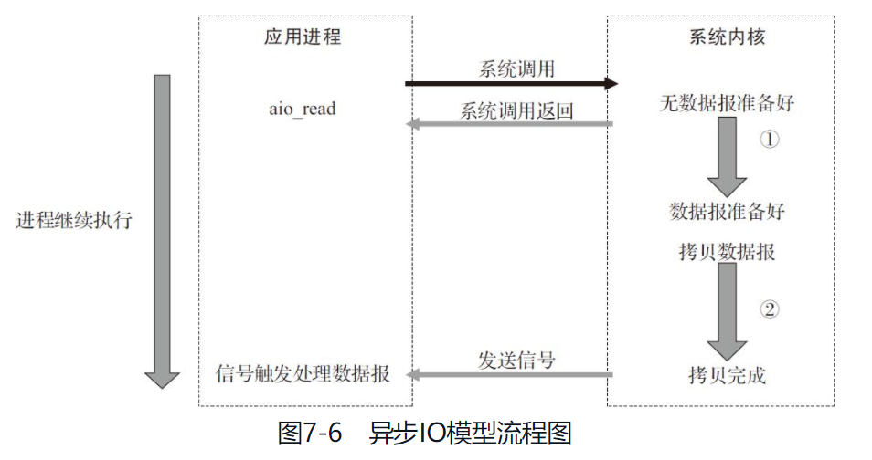
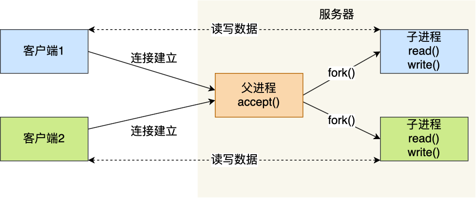
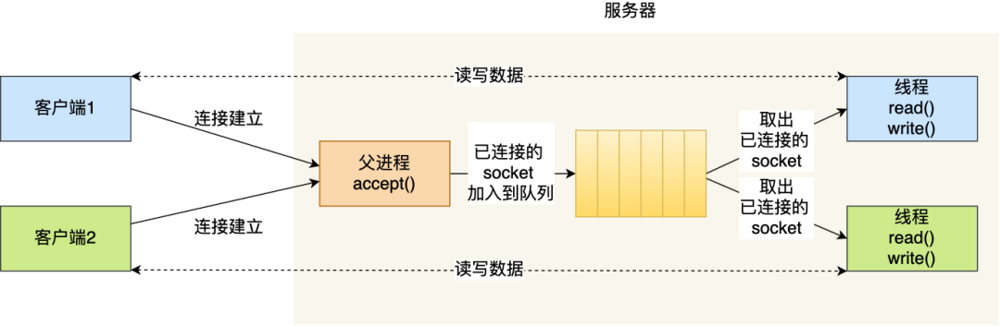
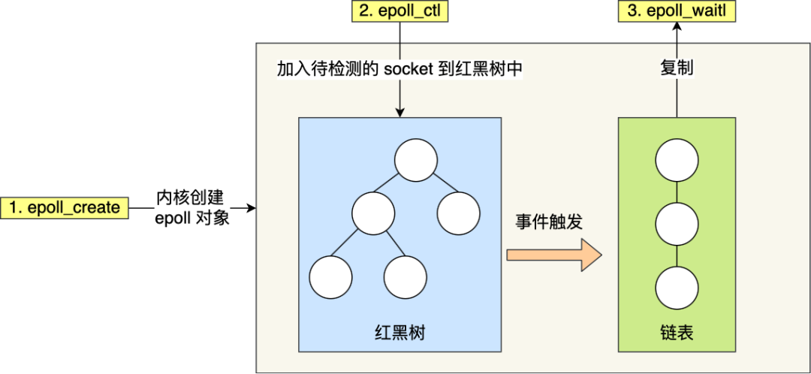

IO复用典型使用在下列场合：

+ 当客户处理多个描述符（通常是交互式输入和网络套接字）时，必须使用IO复用。
+ 如果一个TCP服务器既要处理套接字，又要处理已连接套接字，一般就要使用IO复用。
+ 一个服务器既要处理TCP，又要处理UDP。
+ 一个服务器处理多个服务或多个协议。

---

+ 客户端程序需要处理多个socket
+ 客户端程序需要同时处理用户输入和网络连接
+ TCP服务器要同时处理监听socket和连接socket，这是IO复用使用最多的场合。
+ 服务器要同时处理TCP请求和UDP请求。
+ 服务器要同时监听多个端口或者处理多种服务。

IO复用虽然能同时监听多个文件描述符，但它本身是阻塞的，当多个文件描述符同时就绪时，如果不采取额外的措施，就只能按顺序处理其中的每一个文件描述符。

---

当一个read操作发生时，它会经历两个阶段：①等待数据准备；②将数据从内核态拷贝到进程中。

在LInux中，默认情况下所有的socket都是阻塞的。

## IO模型

阻塞式IO、非阻塞式IO、IO复用、信号驱动IO、异步IO。前四种都属于同步IO。

### 同步和异步

“同步和异步是相对于应用和内核的交互方式来说的，**同步是应用程序只关注就绪事件，真正的IO读写是应用自己完成的，异步是应用程序关注完成事件，真正的IO是内核做的，IO完成后通知程序。**”

异步IO的读写操作总是立即返回，不论IO是否阻塞，因为真正的读写操作已经由内核接管，<u>也就是说，同步IO模型要求用户代码自行执行IO操作，而异步IO由内核来执行IO操作</u>。同步IO向应用程序通知的是IO就绪事件，异步是通知完成事件。

### 阻塞与非阻塞

阻塞是指IO操作需要**彻底完成**后才返回到用户空间；而非阻塞是指IO操作被调用后**立即返回**给用户一个状态值，不需要等到IO操作彻底完成。

### 分类

+ 阻塞式就是系统调用内核中，如果无数据准备好会一直在等待，直到有数据到达或发生错误时才返回（出现数据后将其从内核复制到用户空间），应用进程从调用recvfrom开始到返回之间是阻塞住的。
+ 非阻塞式IO当系统调用时不进入睡眠而是返回一个错误，然后一直调用一直调用，这种称谓轮询（polling），直到有数据了为止。这么做会耗费大量cpu时间。
+ IO复用。调用select/poll，阻塞在这两个系统调用之上，而不是阻塞在真正的IO系统调用上。使用select与阻塞式相比好像没啥优势甚至稍有劣势，但其优势在于可以等待多个描述符就绪。|  IO函数本身是阻塞的，它们能提高程序效率的原因是可以同时监听多个IO事件的能力。
+ 信号驱动式。准备好了发信号给我哈。让内核在描述符就绪时发送SIGIO信号通知我们。应用进程没有被阻塞。优势在于等待数据报到达时进程不被阻塞，主循环可以继续执行，只要等待来自信号处理函数的通知即可。
+ 异步。告知内核启动某个操作，并让内核在整个操作完成（包括将数据从内核复制到自己的缓冲区）后通知我们。与信号驱动的区别在于：信号驱动通知何时启动一个IO，异步由内核通知我们IO操作何时完成了。进程也不被阻塞。

---

## Socket编程

从socket编程引入。

---

### 阻塞IO模型

几乎所有的IO接口（包括socket接口）都是阻塞型的。这给网络编程带来了一个很大的问题，如再调用send()的同时，线程处于阻塞状态，则在此期间，线程将无法执行任何运算或响应任何网络请求。一个简单的改进方案是用多线程（多进程）。

>  一个socket如何可以accept多次？

实际上，accept()函数能够返回一个新的socket。这个新的socket句柄（是指fd？）即是后续readh和recv的输入参数。

### 非阻塞IO模型

其实就是不断地主动询问内核数据是否准备好，不断调用recvfrom()，这种做法绝不被推荐，因为会大幅度占用CPU使用率，应该用更高效的多路复用模式。

### 异步IO模型



用户进程发起read操作之后，立刻就可以开始去做其他的事；而另一方面，从内核的角度，当它收到一个异步的read请求操作之后，首先会立刻返回，所以不会对用户进程产生任何阻塞。然后，内核会等待数据准备完成，然后将数据拷贝到用户内存中，当这一切都完成之后，内核会给用户进程发送一个信号，返回read操作已完成的信息。

调用阻塞IO会一直阻塞住对应的进程直到操作完成，而非阻塞IO在内核还在准备数据的情况下会立刻返回。两者的区别就在于同步IO进行IO操作时会阻塞进程。按照这个定义，之前所述的阻塞IO、非阻塞IO及多路IO复用都属于同步IO。实际上，真实的IO操作，就是例子中的recvfrom这个系统调用。非阻塞IO在执行recvfrom这个系统调用的时候，如果内核的数据没有准备好，这时候不会阻塞进程。但是当内核中数据准备好时，recvfrom会将数据从内核拷贝到用户内存中，这个时候进程则被阻塞。而异步IO则不一样，当进程发起IO操作之后，就直接返回，直到内核发送一个信号，告诉进程IO已完成，则在这整个过程中，进程完全没有被阻塞。

<font color=#1685a9> 在非阻塞IO中，虽然进程大部分时间都不会被阻塞，但是它仍然要求进程去主动检查，并且当数据准备完成以后，也需要进程主动地再次调用recvfrom来将数据拷贝到用户内存中。而异步IO则完全不同，它就像是用户进程将整个IO操作交给了他人（内核）完成，然后内核做完后**发信号通知**。在此期间，用户进程不需要去检查IO操作的状态，也不需要主动地拷贝数据。</font>

## 服务更多的用户

对于 IPv4，客户端的 IP 数最多为 2 的 32 次方，客户端的端口数最多为 2 的 16 次方，也就是**服务端单机最大 TCP 连接数约为 2 的 48 次方**。但是服务器肯定承载不了那么大的连接数，主要会受两个方面的限制：

- **文件描述符**，Socket 实际上是一个文件，也就会对应一个文件描述符。在 Linux 下，单个进程打开的文件描述符数是有限制的，没有经过修改的值一般都是 1024，不过我们可以通过 ulimit 增大文件描述符的数目；
- **系统内存**，每个 TCP 连接在内核中都有对应的数据结构，意味着每个连接都是会占用一定内存的；

## 多进程模型

基于最原始的阻塞网络 I/O， 如果服务器要支持多个客户端，其中比较传统的方式，就是使用**多进程模型**，也就是为每个客户端分配一个进程来处理请求。
服务器的主进程负责监听客户的连接，一旦与客户端连接完成，accept() 函数就会返回一个「已连接 Socket」，这时就通过 `fork()` 函数创建一个子进程，实际上就把父进程所有相关的东西都**复制**一份，包括文件描述符、内存地址空间、程序计数器、执行的代码等。
这两个进程刚复制完的时候，几乎一摸一样。不过，会根据**返回值**来区分是父进程还是子进程，如果返回值是 0，则是子进程；如果返回值是其他的整数，就是父进程。
正因为子进程会**复制父进程的文件描述符**（你的东西我都有了，就不需要你了），于是就可以直接使用「已连接 Socket 」和客户端通信了，可以发现，子进程不需要关心「监听 Socket」，只需要关心「已连接 Socket」；父进程则相反，将客户服务交给子进程来处理，因此父进程不需要关心「已连接 Socket」，只需要关心「监听 Socket」。


这种用多个进程来应付多个客户端的方式，在应对 100 个客户端还是可行的，但是当客户端数量高达一万时，肯定扛不住的，因为每产生一个进程，必会占据一定的系统资源，而且进程间上下文切换的“包袱”是很重的，性能会大打折扣。

## 多线程模型

线程是运行在进程中的一个“逻辑流”，单进程中可以运行多个线程，同进程里的线程可以共享进程的部分资源的，比如**文件描述符列表、进程空间、代码、全局数据、堆、共享库**等，这些共享些资源在上下文切换时是不需要切换，而只需要切换线程的**私有数据、寄存器**等不共享的数据，因此同一个进程下的线程上下文切换的开销要比进程小得多。
如果每来一个连接就创建一个线程，线程运行完后，还得操作系统还得销毁线程，虽说线程切换的上写文开销不大，但是如果频繁创建和销毁线程，系统开销也是不小的。
那么，我们可以使用**线程池**的方式来避免线程的频繁创建和销毁，<u>所谓的线程池，就是提前创建若干个线程，这样当由新连接建立时，将这个已连接的 Socket 放入到一个队列里，然后线程池里的线程负责从队列中取出已连接 Socket 进程处理。</u>



## IO多路复用

一个进程虽然任一时刻只能处理一个请求，但是处理每个请求的事件时，耗时控制在 1 毫秒以内，这样 1 秒内就可以处理上千个请求，把时间拉长来看，<font color=#1685a9>**多个请求复用了一个进程**</font>，这就是多路复用，这种思想很类似一个 CPU 并发多个进程，所以也叫做时分多路复用。

我们熟悉的 select/poll/epoll 内核提供给用户态的多路复用系统调用，**进程可以通过一个系统调用函数==从内核中获取多个事件==**。

select/poll/epoll 是如何获取网络事件的呢？在获取事件时，先把所有连接（文件描述符）传给内核，再由内核返回产生了事件的连接，然后在用户态中再处理这些连接对应的请求即可。

### select

当用户进程调用了select，那么整个进程会被阻塞，而同时，内核会监视所有select负责的socket，当任何一个socket中的数据准备好了，select就会返回。这个时候用户进程再调用read操作，将数据从内核拷贝到用户进程。【还是用户自己来拷贝】。这种方式和阻塞模型IO其实并没有太大的不同，甚至还差，因为调用了两个select和recvfrom，而阻塞IO只调用了一个recvfrom，但select的优势在于可以同时处理多个连接。**优势不在快而在能处理的多。**

在多路复用IO模型中，对于每一个socket，一般都设置成为非阻塞的，但是，如图7-3所示，整个用户的进程其实是一直被阻塞的。只不过进程是被select这个函数阻塞，而不是被socket IO阻塞。因此使用select()的效果与非阻塞IO类似。

---

select函数允许进程指示内核等待多个事件中的任何一个发生，并只在有一个或多个事件发生或经历一段指定的时间后才唤醒它。
如，我们调用select，告知内核仅在下列情况发生时才返回：

+ 集合{1,4,5}中的任何描述符准备好**读**；
+ 集合{2,7}中的任何描述符准备好**写**；
+ 集合{1,4}中的任何描述符有**异常**条件待处理；
+ 已经历了10.2秒。（**超时**）

`int select(int maxfdp1,fd_set *readset,fd_set *writeset,fd_set *exceptset,const struct timeval *timeout);`

**【参数说明】**
 **int maxfdp1** 指定待测试的文件描述字个数，它的值是待测试的最大描述字加1。
` fd_set *readset , fd_set *writeset , fd_set *exceptset`
 `fd_set`可以理解为一个集合，这个集合中存放的是文件描述符(file descriptor)，即文件句柄。中间的三个参数指定我们要让内核测试读、写和异常条件的文件描述符集合。如果对某一个的条件不感兴趣，就可以把它设为空指针。| fd_set类型可以简单理解为**按bit位标记**句柄的队列，例如要在某fd_set中标记一个值为16的句柄，则该fd_set的第16个bit位被标记为1。
 **const struct timeval \*timeout** `timeout`告知内核等待所指定文件描述符集合中的任何一个就绪可花多少时间。其timeval结构用于指定这段时间的秒数和微秒数。

**【返回值】**
 **int** 若有就绪描述符返回其数目，若超时则为0，若出错则为-1

#### 运行机制

select()的机制中提供一种`fd_set`的数据结构，实际上是一个long类型的数组，每一个数组元素都能与一打开的文件句柄（不管是Socket句柄,还是其他文件或命名管道或设备句柄）建立联系，建立联系的工作由程序员完成，当调用select()时，由内核根据IO状态修改fd_set的内容，由此来通知执行了select()的进程哪一Socket或文件可读。| 一个socket就是一个文件，socket句柄就是一个文件描述符。

从流程上来看，使用select函数进行IO请求和同步阻塞模型没有太大的区别，甚至还多了添加监视socket，以及调用select函数的额外操作，效率更差。但是，使用select以后最大的优势是用户可以在一个线程内同时处理多个socket的IO请求。**用户可以注册多个socket，然后不断地调用select读取被激活的socket，即可达到在同一个线程内同时处理多个IO请求的目的。**而在同步阻塞模型中，必须通过多线程的方式才能达到这个目的。

---

select 实现多路复用的方式是，将已连接的 Socket 都放到一个**文件描述符集合**，然后调用 select 函数将文件描述符集合**拷贝**到**内核里，让内核来检查是否有网络事件产生**，检查的方式很粗暴，就是通过**遍历**文件描述符集合的方式，当检查到有事件产生后，将此 Socket 标记为可读或可写， 接着再把<u>整个文件描述符集合</u>**拷贝**回用户态里，然后用户态还需要再通过**遍历**的方法找到可读或可写的 Socket，然后再对其处理。

所以，对于 select 这种方式，需要进行 **2 次「遍历」文件描述符集合**，一次是在内核态里，一个次是在用户态里 ，而且还会发生 **2 次「拷贝」文件描述符集合**，先从用户空间传入内核空间，由内核修改后，再传出到用户空间中。

select 使用固定长度的 BitsMap，表示文件描述符集合，而且所支持的文件描述符的个数是有限制的，在 Linux 系统中，由内核中的 FD_SETSIZE 限制， 默认最大值为 `1024`，只能监听 0~1023 的文件描述符。

### poll

#### 与select不同点

1. 没有最大文件描述符的限制
2. <font color=#1685a9>select没有将文件描述符和事件绑定起来，而是单纯的一个集合，因为内核会对fd_set进行在线修改，下次调用select时会重置这3个fd_set集合。而poll把文件描述符和事件都定义在其中，任何事件都被统一处理，内核只修改revents成员，而events不变。</font>

poll的机制与select类似，与select在本质上没有多大差别，管理多个描述符也是进行轮询，根据描述符的状态进行处理，但是poll没有最大文件描述符数量的限制。也就是说，poll只解决了上面的问题3，并没有解决问题1，2的性能开销问题。

```c++
int poll(struct pollfd *fds, nfds_t nfds, int timeout);

typedef struct pollfd {
        int fd;                         // 需要被检测或选择的文件描述符
        short events;                   // 对文件描述符fd上感兴趣的事件
        short revents;                  // 文件描述符fd上当前实际发生的事件
} pollfd_t;
```

poll改变了文件描述符集合的描述方式，使用了`pollfd`结构而不是select的`fd_set`结构，使得poll支持的文件描述符集合限制远大于select的1024. |  <u>poll 不再用 BitsMap 来存储所关注的文件描述符，取而代之用动态数组，以链表形式来组织，突破了 select 的文件描述符个数限制，当然还会受到系统文件描述符限制。</u>

但是 poll 和 select 并没有太大的本质区别，**都是使用「线性结构」存储进程关注的 Socket 集合，因此都需要遍历文件描述符集合来找到可读或可写的 Socket，时间复杂度为 O(n)，而且也需要在用户态与内核态之间拷贝文件描述符集合**，这种方式随着并发数上来，性能的损耗会呈指数级增长。

### epoll

```c
int epoll_create(int size);
int epoll_ctl(int epfd, int op, int fd, struct epoll_event *event);
int epoll_wait(int epfd, struct epoll_event * events, int maxevents, int timeout);
```

epoll 通过两个方面，很好解决了 select/poll 的问题。

*第一点*，epoll 在内核里使用**红黑树来跟踪进程所有待检测的文件描述字**，把需要监控的 socket 通过 `epoll_ctl()` 函数加入内核中的红黑树里，红黑树是个高效的数据结构，增删查一般时间复杂度是 `O(logn)`，通过对这棵黑红树进行操作，<u>这样就不需要像 select/poll 每次操作时都传入整个 socket 集合，只需要传入一个待检测的 socket，减少了内核和用户空间大量的数据拷贝和内存分配。</u>

*第二点*， epoll 使用**事件驱动**的机制，内核里**维护了一个链表来记录就绪事件**，当某个 socket 有事件发生时，通过**回调函数**内核会将其加入到这个就绪事件列表中，当用户调用 `epoll_wait()` 函数时，<u>只会返回有事件发生的文件描述符的个数，不需要像 select/poll 那样轮询扫描整个 socket 集合，大大提高了检测的效率。</u>



### 水平触发 边缘触发

epoll 支持两种事件触发模式，分别是**边缘触发（*edge-triggered，ET*）**和**水平触发（*level-triggered，LT*）**。

- 使用边缘触发模式时，当被监控的 Socket 描述符上有可读事件发生时，**服务器端只会从 epoll_wait 中苏醒一次**，即使进程没有调用 read 函数从内核读取数据，也依然只苏醒一次，因此我们程序要保证一次性将内核缓冲区的数据读取完；（菜鸟驿站只发一次短信告诉你快递到了）
- 使用水平触发模式时，当被监控的 Socket 上有可读事件发生时，**服务器端不断地从 epoll_wait 中苏醒，直到内核缓冲区数据被 read 函数读完才结束**，目的是告诉我们有数据需要读取；（一直给你发短信告诉你快递到了直到你取出来）

如果使用边缘触发模式，I/O 事件发生时只会通知一次，而且我们不知道到底能读写多少数据，所以在收到通知后应尽可能地读写数据，以免错失读写的机会。因此，我们会**循环**从文件描述符读写数据，那么如果文件描述符是阻塞的，没有数据可读写时，进程会阻塞在读写函数那里，程序就没办法继续往下执行。所以，**边缘触发模式一般和非阻塞 I/O 搭配使用**，程序会一直执行 I/O 操作，直到系统调用（如 `read` 和 `write`）返回错误，错误类型为 `EAGAIN` 或 `EWOULDBLOCK`。

==select/poll 只有水平触发模式，epoll 默认的触发模式是水平触发，但是可以根据应用场景设置为边缘触发模式。==
**多路复用 API 返回的事件并不一定可读写的**，如果使用阻塞 I/O， 那么在调用 read/write 时则会发生程序阻塞，因此最好搭配非阻塞 I/O，以便应对极少数的特殊情况。

### 表格对比

|            |                       select                       |                       poll                       |                            epoll                             |
| :--------- | :------------------------------------------------: | :----------------------------------------------: | :----------------------------------------------------------: |
| 操作方式   |                        遍历                        |                       遍历                       |                             回调                             |
| 底层实现   |                        数组                        |                       链表                       |                            红黑树                            |
| IO效率     |      每次调用都进行线性遍历，时间复杂度为O(n)      |     每次调用都进行线性遍历，时间复杂度为O(n)     | 事件通知方式，每当fd就绪，系统注册的回调函数就会被调用，将就绪fd放到readyList里面，时间复杂度O(1) |
| 最大连接数 |              1024（x86）或2048（x64）              |                      无上限                      |                            无上限                            |
| fd拷贝     | 每次调用select，都需要把fd集合从用户态拷贝到内核态 | 每次调用poll，都需要把fd集合从用户态拷贝到内核态 | 调用epoll_ctl时拷贝进内核并保存，之后每次epoll_wait~~不拷贝~~（应该是也拷贝，源码并不是基于共享内存的） |
| 数据处理   |             从用户态拷贝fd_set到内核中             |                                                  |        直接在内核中建立起红黑树，让内核帮忙管理socket        |

epoll是Linux目前大规模网络并发程序开发的首选模型。在绝大多数情况下性能远超select和poll。目前流行的高性能web服务器Nginx正式依赖于epoll提供的高效网络套接字轮询服务。但是，在并发连接不高的情况下，多线程+阻塞I/O方式可能性能更好。


当活动连接比较多的时候，epoll_wait的效率未必比select和poll高，因为此时回调函数被触发得过于频繁，所以epoll_wait适合于**连接数量多，但活动连接比较少**的情况。

### epoll原理

面其实讨论了 select/poll 几个缺点，针对这几个缺点，就需要解决以下几件事：

+ 如何突破文件描述符数量的限制
+ 如何避免用户态和内核态对文件描述符集合的拷贝
+ socket 就绪后，如何避免线性遍历文件描述符集合

针对第一点：如何突破文件描述符数量的限制，其实 poll 已经解决了，poll 使用的是链表的方式管理 socket 描述符，但问题是不够高效，如果有百万级别的连接需要管理，如何快速的插入和删除就变得很重要，于是 epoll 采用了红黑树的方式进行管理，这样能保证在添加 socket 和删除 socket 时，有 O(log(n)) 的复杂度。

针对第二点：如何避免用户态和内核态对文件描述符集合的拷贝，其实对于 select 来说，由于这个集合是保存在用户态的，所以当调用 select 时需要屡次的把这个描述符集合拷贝到内核空间。所以如果要解决这个问题，<u>可以直接把这个集合放在内核空间进行管理</u>。没错，epoll 就是这样做的，epoll 在**内核空间**创建了一颗红黑树，应用程序直接把需要监控的 socket 对象添加到这棵树上，直接从用户态到内核态了，而且后续也不需要再次拷贝了。

针对第三点：socket就绪后，如何避免内核线性遍历文件描述符集合，这个问题就会比较复杂，要完整理解就得涉及到内核收包到应用层的整个过程。这里先简单讲一下，与 select 不同，epoll 使用了一个双向链表来保存就绪的 socket，这样当活跃连接数不多的情况下，应用程序只需要遍历这个就绪链表就行了，而 select 没有这样一个用来存储就绪 socket 的东西，导致每次需要线性遍历所有socket，以确定是哪个或者哪几个 socket 就绪了。这里需要注意的是，这个就绪链表保存活跃链接，数量是较少的，也需要从内核空间拷贝到用户空间。

从上面 3 点可以看到 epoll 的几个特点：

+ 程序在内核空间开辟一块缓存，用来管理 epoll 红黑树，高效添加和删除
+ 红黑树位于内核空间，用来直接管理 socket，减少和用户态的交互
+ 使用双向链表缓存就绪的 socket，数量较少
+ 只需要拷贝这个双向链表到用户空间，再遍历就行，注意这里也需要拷贝，没有共享内存

上面深入的分析了 epoll 的底层实现原理，现在回到文章开头提到的与 select/poll 对比的几个优点，是不是能理解了呢？

**简单总结一下:**

+ epoll 在内核开辟了一块缓存，用来创建 eventpoll 对象，并返回一个 file descriptor 代表 epoll instance
+ 这个 epoll instance 中**创建了一颗红黑树以及一个就绪的双向链表**（当然还有其他的成员）
+ 红黑树用来缓存所有的 socket，支持 O(log(n)) 的插入和查找，减少后续与用户空间的交互
+ socket 就绪后，会**回调一个回调函数**（添加到 epoll instance 上时注册到 socket 的）
+ **这个回调函数会把这个 socket 放到就绪链表，并唤醒 epoll_wait**
+ 应用程序**拷贝**就绪 socket 到用户空间，开始遍历处理就绪的 socket（不是共享内存，网上的好多错了的）
+ 如果有新的 socket，再添加到 epoll 红黑树上，重复这个过程

https://blog.csdn.net/u013051748/article/details/108804064

---

<u>第一个跟高效相关的问题来了，添加 fd 进池子也就算了，如果是修改、删除呢？</u>怎么做到快速？

这里就涉及到你怎么管理 fd 的数据结构了。有，红黑树。Linux 内核对于 epoll 池的内部实现就是用红黑树的结构体来管理这些注册进程来的句柄 fd。红黑树是一种平衡二叉树，时间复杂度为 O(log n)，就算这个池子就算不断的增删改，也能保持非常稳定的查找性能。

<u>现在思考第二个高效的秘密：怎么才能保证数据准备好之后，立马感知呢？</u>

`epoll_ctl` 这里会涉及到一点。**秘密就是：回调的设置**。在 `epoll_ctl `的内部实现中，除了把句柄结构用红黑树管理，另一个核心步骤就是设置 poll 回调。

`file_operations->poll`这个是定制监听事件的机制实现。通过 poll 机制让上层能直接告诉底层，我这个 fd 一旦读写就绪了，请底层硬件（比如网卡）回调的时候自动把这个 fd 相关的结构体放到指定队列中，并且唤醒操作系统。

举个例子：网卡收发包其实走的异步流程，操作系统把数据丢到一个指定地点，网卡不断的从这个指定地点掏数据处理。请求响应通过中断回调来处理，中断一般拆分成两部分：硬中断和软中断。poll 函数就是把这个软中断回来的路上再加点料，只要读写事件触发的时候，就会立马通知到上层，采用这种事件通知的形式就能把浪费的时间窗就完全消失了。

**划重点：这个 poll 事件回调机制则是 epoll 池高效最核心原理。**
**划重点：epoll 池管理的句柄只能是支持了** **`file_operations->poll` 的文件 fd。换句话说，如果一个“文件”所在的文件系统没有实现 poll 接口，那么就用不了 epoll 机制。**

**小结：**

1. 内部管理 fd 使用了高效的红黑树结构管理，做到了增删改之后性能的优化和平衡；
2. epoll 池添加 fd 的时候，调用 `file_operations->poll` ，把这个 fd 就绪之后的回调路径安排好。通过事件通知的形式，做到最高效的运行；
3. epoll 池核心的两个数据结构：红黑树和就绪列表。红黑树是为了应对用户的增删改需求，就绪列表是 fd 事件就绪之后放置的特殊地点，epoll 池只需要遍历这个就绪链表，就能给用户返回所有已经就绪的 fd 数组；

> 问题：单线程如何做到高并发？

IO 多路复用呗，今天讲的 epoll 池就是了。

> 问题：单线程实现并发的有开源的例子吗？

redis，nginx 都是非常好的学习例子。当然还有我们 Golang 的 runtime 实现也尽显高并发的设计思想。

**总结：**

1. IO 多路复用的原始实现很简单，就是一个 1 对多的服务模式，一个 loop 对应处理多个 fd ；
2. IO 多路复用想要做到真正的高效，**必须要内核机制提供**。因为 IO 的处理和完成是在内核，如果内核不帮忙，用户态的程序根本无法精确的抓到处理时机；
3. **fd 记得要设置成非阻塞的哦**，切记；
4. epoll 池通过高效的内部管理结构，并且结合操作系统提供的 **poll 事件注册机制**，实现了高效的 fd 事件管理，为高并发的 IO 处理提供了前提条件；
5. epoll 全名 eventpoll，在 Linux 内核下以一个文件系统模块的形式实现，所以有人常说 **epoll 其实本身就是文件系统**也是对的；
6. socketfd，eventfd，timerfd 这三种”文件“fd 实现了 poll 接口，所以网络 fd，事件fd，定时器fd 都可以使用 epoll_ctl 注册到池子里。我们最常见的就是网络fd的多路复用；
7. **ext2，ext4，xfs 这种真正意义的文件系统反倒没有提供 poll 接口实现，所以不能用 epoll 池来管理其句柄。**那文件就无法使用 epoll 机制了吗？不是的，有一个库叫做 libaio ，通过这个库我们可以间接的让文件使用 epoll 通知事件，以后详说，此处不表；

## select、poll和epoll比较（不清晰版）

**select、poll和epoll本质上都是==同步IO==，因为它们都需要在读写事件就绪后自己负责进行读写，即是阻塞的，而异步IO则无须自己负责进行读写，异步I/O的实现会负责把数据从内核拷贝到用户空间。**

下面对这3种多路IO复用进行对比。

（1）首先还是来看常见的select和poll。

对于网络编程来说，一般认为poll比select要高级一些，这主要源于以下几个原因。

+ poll不要求开发者在计算最大文件描述符时进行+1的操作。
+ poll在应付大数目的文件描述符的时候速度更快，因为对于select来说内核需要检查大量描述符对应的fd_set中的每一个比特位，比较费时。
+ select可以监控的文件描述符数目是固定的，相对来说也较少（1024或2048）。如果需要监控数值比较大的文件描述符，或是分布得很稀疏的较少的描述符，效率也会很低。而对于poll函数来说，就可以创建特定大小的数组来保存监控的描述符，而不受文件描述符值大小的影响，而且poll可以监控的文件数目远大于select。
+ 对于select来说，所监控的fd_set在select返回之后会发生变化，所以在下一次进入select之前都需要重新初始化需要监控的fd_set，poll函数将监控的输入和输出事件分开，允许被监控的文件数组被复用而不需要重新初始化。
+ select函数的超时参数在返回时也是未定义的，考虑到可移植性，每次在超时之后在下一次进入到select之前都需要重新设置超时参数。

（2）select的优点如下所述。

+ select的可移植性更好，在某些UNIX系统上不支持poll。
+ select对于超时值提供了更好的精度，而poll是精度较差。

（3）epoll的优点如下所述。

+ 支持一个进程打开大数目的socket描述符（FD）。select最不能忍受的是一个进程所打开的FD是有一定限制的，由FD_SETSIZE的默认值是1024/2048。对于那些需要支持上万连接数目的IM服务器来说显然太少了。这时候可以选择修改这个宏然后重新编译内核。不过epoll则没有这个限制，它所支持的FD上限是最大可以打开文件的数目，这个数字一般远大于2048。举个例子，在1GB内存的空间中这个数字一般是10万左右，具体数目可以使用cat/proc/sys/fs/file-max查看，一般来说这个数目和系统内存关系很大。
+ IO效率不随FD数目增加而线性下降。传统的select/poll另一个致命弱点就是当你拥有一个很大的socket集合，不过由于网络延迟，任一时间只有部分的socket是“活跃”的，但是select/poll每次调用都会线性扫描全部的集合，导致效率呈现线性下降。但是epoll不存在这个问题，它只会对“活跃”的socket进行操作——这是因为在内核中实现epoll是根据每个fd上面的callback函数实现的。那么，只有“活跃”的socket才会主动去调用callback函数，其他idle状态socket则不会，在这点上，epoll实现了一个“伪”AIO，因为这时候推动力由Linux内核提供。
+ 使用mmap加速内核与用户空间的消息传递。这点实际上涉及epoll的具体实现。无论是select、poll还是epoll都需要内核把fd消息通知给用户空间，如何避免不必要的内存拷贝就显得尤为重要。在这点上，epoll是通过内核与用户空间mmap处于同一块内存实现的。对于poll来说需要将用户传入的pollfd数组拷贝到内核空间，因为拷贝操作和数组长度相关，时间上来看，这是一个O（n）操作，当事件发生后，poll将获得的数据传送到用户空间，并执行释放内存和剥离等待队列等工作，向用户空间拷贝数据与剥离等待队列等操作的时间复杂度同样是O（n）。

## C10K问题

https://blog.csdn.net/wangtaomtk/article/details/51811011

# Reactor & Proactor

## 演进

当下开源软件能做到网络高性能的原因就是 I/O 多路复用吗？

是的，基本是基于 I/O 多路复用，用过 I/O 多路复用接口写网络程序的同学，肯定知道是面向过程的方式写代码的，这样的开发的效率不高。于是，大佬们基于面向对象的思想，对 I/O 多路复用作了一层封装，让使用者不用考虑底层网络 API 的细节，只需要关注应用代码的编写。大佬们还为这种模式取了个让人第一时间难以理解的名字：**Reactor 模式**。Reactor 翻译过来的意思是「反应堆」，可能大家会联想到物理学里的核反应堆，实际上并不是的这个意思。这里的反应指的是「**对事件反应**」，也就是**来了一个事件，Reactor 就有相对应的反应/响应**。

事实上，Reactor 模式也叫 `Dispatcher` 模式，我觉得这个名字更贴合该模式的含义，即 **I/O 多路复用监听事件，收到事件后，根据事件类型分配（Dispatch）给某个进程 / 线程**。

Reactor 模式主要由 Reactor 和处理资源池这两个核心部分组成，它俩负责的事情如下：

- **Reactor** 负责监听和分发事件，事件类型包含连接事件、读写事件；
- **处理资源池**负责处理事件，如 read -> 业务逻辑 -> send；

Reactor 模式是灵活多变的，可以应对不同的业务场景，灵活在于：

- Reactor 的数量可以只有一个，也可以有多个；
- 处理资源池可以是单个进程 / 线程，也可以是多个进程 /线程；

将上面的两个因素排列组设一下，理论上就可以有 4 种方案选择：

- 单 Reactor 单进程 / 线程；
- 单 Reactor 多进程 / 线程；
- 多 Reactor 单进程 / 线程；
- 多 Reactor 多进程 / 线程；

其中，「多 Reactor 单进程 / 线程」实现方案相比「单 Reactor 单进程 / 线程」方案，不仅复杂而且也没有性能优势，因此实际中并没有应用。

剩下的 3 个方案都是比较经典的，且都有应用在实际的项目中：

- 单 Reactor 单进程 / 线程；
- 单 Reactor 多线程 / 进程；
- 多 Reactor 多进程 / 线程；

方案具体使用进程还是线程，要看使用的编程语言以及平台有关：

- Java 语言一般使用线程，比如 Netty;
- C 语言使用进程和线程都可以，例如 Nginx 使用的是进程，Memcache 使用的是线程。

## Reactor

### 单Reactor 单进程/单线程

一般来说，C 语言实现的是「**单 Reactor \*单进程\***」的方案，因为 C 语编写完的程序，运行后就是一个独立的进程，不需要在进程中再创建线程。而 Java 语言实现的是「**单 Reactor \*单线程\***」的方案，因为 Java 程序是跑在 Java 虚拟机这个进程上面的，虚拟机中有很多线程，我们写的 Java 程序只是其中的一个线程而已。

我们来看看「**单 Reactor 单进程**」的方案示意图：


可以看到进程里有 **Reactor、Acceptor、Handler** 这三个对象：

- Reactor 对象的作用是监听和分发事件；
- Acceptor 对象的作用是获取连接；
- Handler 对象的作用是处理业务；

对象里的 select、accept、read、send 是系统调用函数，dispatch 和 「业务处理」是需要完成的操作，其中 dispatch 是分发事件操作。

接下来，介绍下「单 Reactor 单进程」这个方案：

- Reactor 对象通过 select （IO 多路复用接口） 监听事件，收到事件后通过 dispatch 进行分发，具体分发给 Acceptor 对象还是 Handler 对象，还要看收到的事件类型；
- 如果是连接建立的事件，则交由 Acceptor 对象进行处理，Acceptor 对象会通过 accept 方法 获取连接，并创建一个 Handler 对象来处理后续的响应事件；
- 如果不是连接建立事件， 则交由当前连接对应的 Handler 对象来进行响应；
- Handler 对象通过 read -> 业务处理 -> send 的流程来完成完整的业务流程。

单 Reactor 单进程的方案因为全部工作都在同一个进程内完成，所以实现起来比较简单，不需要考虑进程间通信，也不用担心多进程竞争。
但是，这种方案存在 2 个缺点：

- 第一个缺点，因为只有一个进程，**无法充分利用 多核 CPU 的性能**；
- 第二个缺点，Handler 对象在业务处理时，整个进程是无法处理其他连接的事件的，**如果业务处理耗时比较长，那么就造成响应的延迟**；

所以，单 Reactor 单进程的方案**不适用计算机密集型的场景，只适用于业务处理非常快速的场景**。

Redis 是由 C 语言实现的，在 Redis 6.0 版本之前采用的正是「单 Reactor 单进程」的方案，因为 Redis 业务处理主要是在内存中完成，操作的速度是很快的，性能瓶颈不在 CPU 上，所以 Redis 对于命令的处理是单进程的方案。

### 单Reactor 多线程/多进程

如果要克服「单 Reactor 单线程 / 进程」方案的缺点，那么就需要引入多线程 / 多进程，这样就产生了**单 Reactor 多线程 / 多进程**的方案。


详细说一下这个方案：

- Reactor 对象通过 select （IO 多路复用接口） 监听事件，收到事件后通过 dispatch 进行分发，具体分发给 Acceptor 对象还是 Handler 对象，还要看收到的事件类型；
- 如果是连接建立的事件，则交由 Acceptor 对象进行处理，Acceptor 对象会通过 accept 方法 获取连接，并创建一个 Handler 对象来处理后续的响应事件；
- 如果不是连接建立事件， 则交由当前连接对应的 Handler 对象来进行响应；

<u>上面的三个步骤和单 Reactor 单线程方案是一样的</u>，接下来的步骤就开始不一样了：

- Handler 对象不再负责业务处理，只负责数据的接收和发送，Handler 对象通过 read 读取到数据后，会将数据发给子线程里的 Processor 对象进行业务处理；
- 子线程里的 Processor 对象就进行业务处理，处理完后，将结果发给主线程中的 Handler 对象，接着由 Handler 通过 send 方法将响应结果发送给 client；

单 Reator 多线程的方案优势在于**能够充分利用多核 CPU 的能**，那既然引入多线程，那么自然就带来了多线程竞争资源的问题。例如，子线程完成业务处理后，要把结果传递给主线程的 Handler 进行发送，这里涉及共享数据的竞争。

要避免多线程由于竞争共享资源而导致数据错乱的问题，就需要在操作共享资源前加上互斥锁，以保证任意时间里只有一个线程在操作共享资源，待该线程操作完释放互斥锁后，其他线程才有机会操作共享数据。

聊完单 Reactor 多线程的方案，接着来看看单 Reactor 多进程的方案。事实上，单 Reactor 多进程相比单 Reactor 多线程实现起来很麻烦，主要因为要考虑子进程 <-> 父进程的双向通信，并且父进程还得知道子进程要将数据发送给哪个客户端。而多线程间可以共享数据，虽然要额外考虑并发问题，但是这远比进程间通信的复杂度低得多，**因此实际应用中也看不到单 Reactor 多进程的模式。**

> 单Reactor模式的问题

但是，「单 Reactor」的模式还有个问题，**因为一个 Reactor 对象承担所有事件的监听和响应，而且只在主线程中运行，在面对瞬间高并发的场景时，容易成为性能的瓶颈的地方**。

### 多Reactor 多进程/多线程

要解决「单 Reactor」的问题，就是将「单 Reactor」实现成「多 Reactor」，这样就产生了第 **多 Reactor 多进程 / 线程**的方案。


方案详细说明如下：

- 主线程中的 MainReactor 对象通过 select 监控连接建立事件，收到事件后通过 Acceptor 对象中的 accept 获取连接，将新的连接分配给某个子线程；
- 子线程中的 SubReactor 对象将 MainReactor 对象分配的连接加入 select 继续进行监听，并创建一个 Handler 用于处理连接的响应事件。
- 如果有新的事件发生时，SubReactor 对象会调用当前连接对应的 Handler 对象来进行响应。
- Handler 对象通过 read -> 业务处理 -> send 的流程来完成完整的业务流程。

**多 Reactor 多线程**的方案虽然看起来复杂的，但是实际实现时比单 Reactor 多线程的方案要简单的多，原因如下：

- 主线程和子线程分工明确，**主线程只负责接收新连接，子线程负责完成后续的业务处理。**
- 主线程和子线程的交互很简单，主线程只需要把新连接传给子线程，子线程无须返回数据，直接就可以在子线程将处理结果发送给客户端。

大名鼎鼎的两个开源软件 Netty 和 Memcache 都采用了「多 Reactor 多线程」的方案。采用了「多 Reactor 多进程」方案的开源软件是 Nginx，不过方案与标准的多 Reactor 多进程有些差异。

具体差异表现在主进程中仅仅用来初始化 socket，并没有创建 mainReactor 来 accept 连接，而是由子进程的 Reactor 来 accept 连接，通过锁来控制一次只有一个子进程进行 accept（防止出现惊群现象），子进程 accept 新连接后就放到自己的 Reactor 进行处理，不会再分配给其他子进程。

## Proactor

前面提到的 **Reactor 是非阻塞同步网络模式**，而 **Proactor 是异步网络模式**。

而真正的**异步 I/O** 是「内核数据准备好」和「数据从内核态拷贝到用户态」这**两个过程都不用等待**。当我们发起 `aio_read` （异步 I/O） 之后，就立即返回，内核自动将数据从内核空间拷贝到用户空间，这个拷贝过程同样是异步的，内核自动完成的，和前面的同步操作不一样，**应用程序并不需要主动发起拷贝动作**。过程如下图：


现在我们再来理解 Reactor 和 Proactor 的区别，就比较清晰了。

- **Reactor 是非阻塞同步网络模式，感知的是就绪可读写事件**。在每次感知到有事件发生（比如可读就绪事件）后，就需要应用进程主动调用 read 方法来完成数据的读取，也就是要应用进程主动将 socket 接收缓存中的数据读到应用进程内存中，这个过程是同步的，读取完数据后应用进程才能处理数据。
- **Proactor 是异步网络模式， 感知的是已完成的读写事件**。在发起异步读写请求时，需要传入数据缓冲区的地址（用来存放结果数据）等信息，这样系统内核才可以自动帮我们把数据的读写工作完成，这里的读写工作全程由操作系统来做，并不需要像 Reactor 那样还需要应用进程主动发起 read/write 来读写数据，操作系统完成读写工作后，就会通知应用进程直接处理数据。

因此，**Reactor 可以理解为「来了事件操作系统通知应用进程，让应用进程来处理」**，而 **Proactor 可以理解为「来了事件操作系统来处理，处理完再通知应用进程」**。这里的「事件」就是有新连接、有数据可读、有数据可写的这些 I/O 事件这里的「处理」包含从驱动读取到内核以及从内核读取到用户空间。

举个实际生活中的例子，Reactor 模式就是快递员在楼下，给你打电话告诉你快递到你家小区了，你需要自己下楼来拿快递。而在 Proactor 模式下，快递员直接将快递送到你家门口，然后通知你。

无论是 Reactor，还是 Proactor，都是一种基于「事件分发」的网络编程模式，区别在于 **Reactor 模式是基于「待完成」的 I/O 事件，而 Proactor 模式则是基于「已完成」的 I/O 事件**。

接下来，一起看看 Proactor 模式的示意图：


介绍一下 Proactor 模式的工作流程：

- Proactor Initiator 负责创建 Proactor 和 Handler 对象，并将 Proactor 和 Handler 都通过 Asynchronous Operation Processor 注册到内核；
- Asynchronous Operation Processor 负责处理注册请求，并处理 I/O 操作；
- Asynchronous Operation Processor 完成 I/O 操作后通知 Proactor；
- Proactor 根据不同的事件类型回调不同的 Handler 进行业务处理；
- Handler 完成业务处理；

可惜的是，在 Linux 下的异步 I/O 是不完善的， `aio` 系列函数是由 POSIX 定义的异步操作接口，不是真正的操作系统级别支持的，而是在用户空间模拟出来的异步，并且仅仅支持基于本地文件的 aio 异步操作，网络编程中的 socket 是不支持的，**这也使得基于 Linux 的高性能网络程序都是使用 Reactor 方案。**

而 Windows 里实现了一套完整的支持 socket 的异步编程接口，这套接口就是 `IOCP`，是由操作系统级别实现的异步 I/O，真正意义上异步 I/O，因此在 Windows 里实现高性能网络程序可以使用效率更高的 Proactor 方案。

## 总结

常见的 Reactor 实现方案有三种。

第一种方案单 Reactor 单进程 / 线程，不用考虑进程间通信以及数据同步的问题，因此实现起来比较简单，这种方案的缺陷在于无法充分利用多核 CPU，而且处理业务逻辑的时间不能太长，否则会延迟响应，所以不适用于计算机密集型的场景，适用于业务处理快速的场景，比如 Redis（6.0之前 ） 采用的是单 Reactor 单进程的方案。

第二种方案单 Reactor 多线程，通过多线程的方式解决了方案一的缺陷，但它离高并发还差一点距离，差在只有一个 Reactor 对象来承担所有事件的监听和响应，而且只在主线程中运行，在面对瞬间高并发的场景时，容易成为性能的瓶颈的地方。

第三种方案多 Reactor 多进程 / 线程，通过多个 Reactor 来解决了方案二的缺陷，主 Reactor 只负责监听事件，响应事件的工作交给了从 Reactor，Netty 和 Memcache 都采用了「多 Reactor 多线程」的方案，Nginx 则采用了类似于 「多 Reactor 多进程」的方案。

Reactor 可以理解为「来了事件操作系统通知应用进程，让应用进程来处理」，而 Proactor 可以理解为「来了事件操作系统来处理，处理完再通知应用进程」。

因此，真正的大杀器还是 Proactor，它是采用异步 I/O 实现的异步网络模型，感知的是已完成的读写事件，而不需要像 Reactor 感知到事件后，还需要调用 read 来从内核中获取数据。

不过，无论是 Reactor，还是 Proactor，都是一种基于「**事件分发**」的网络编程模式，区别在于 Reactor 模式是基于「待完成」的 I/O 事件，而 Proactor 模式则是基于「已完成」的 I/O 事件。