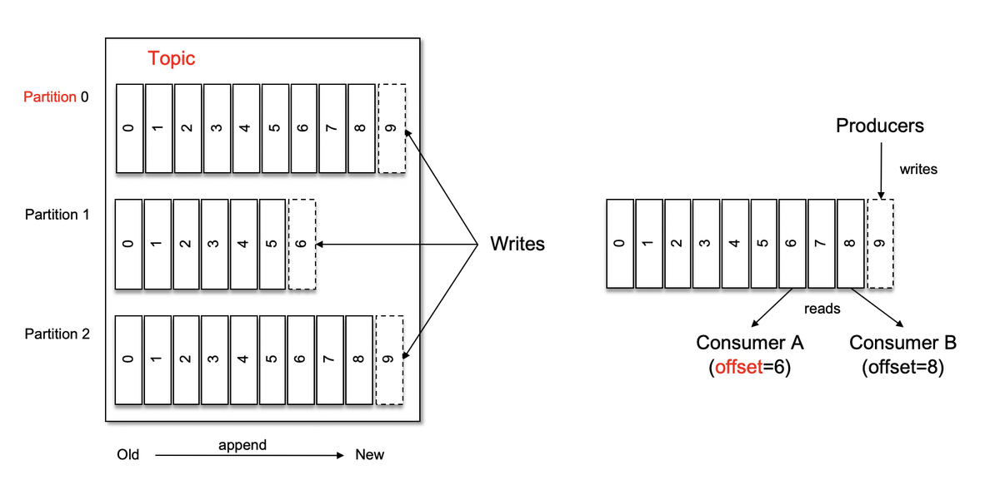
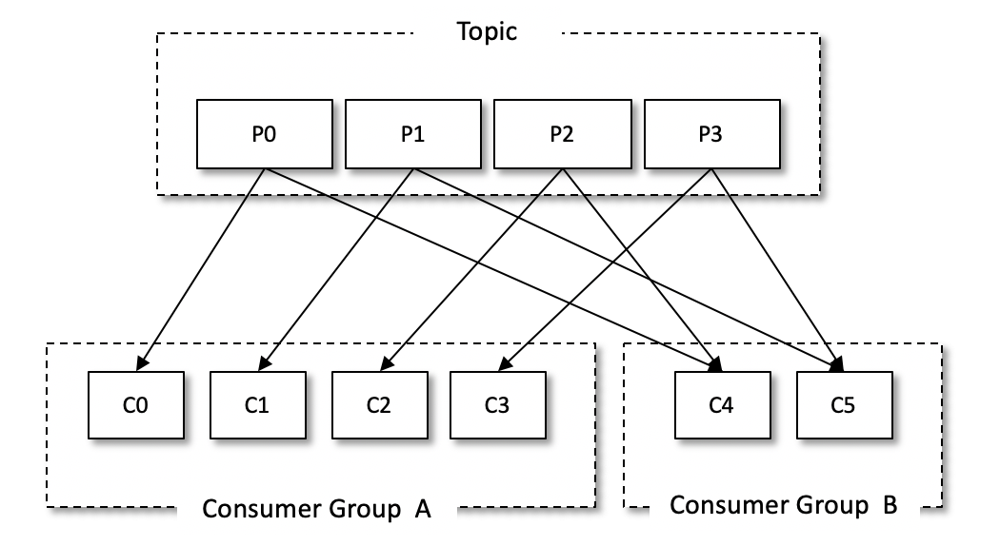
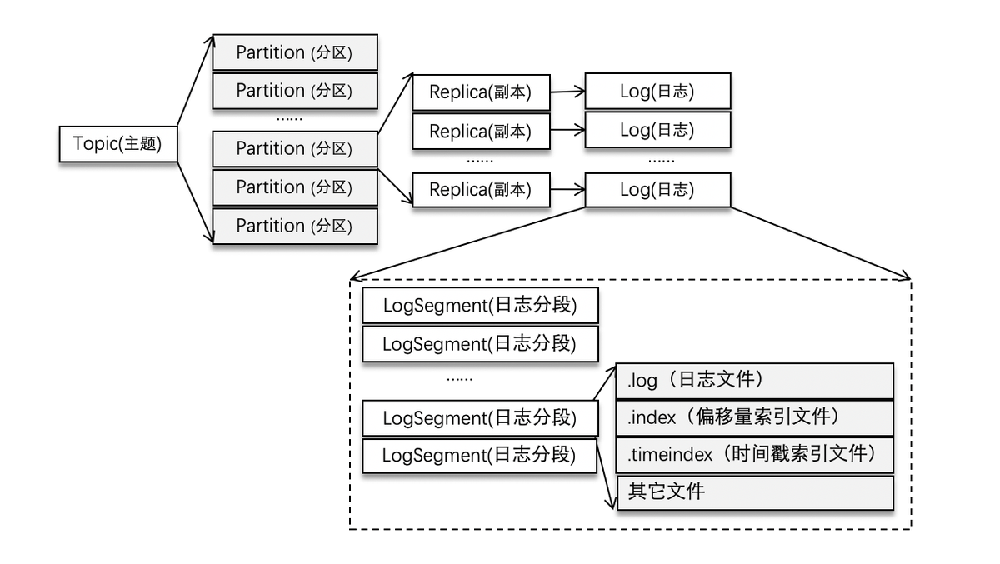
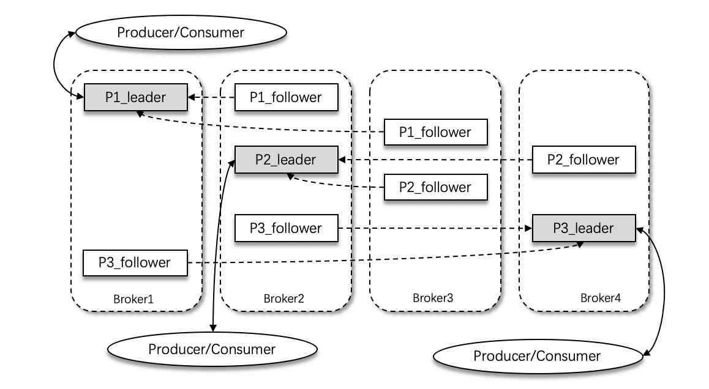
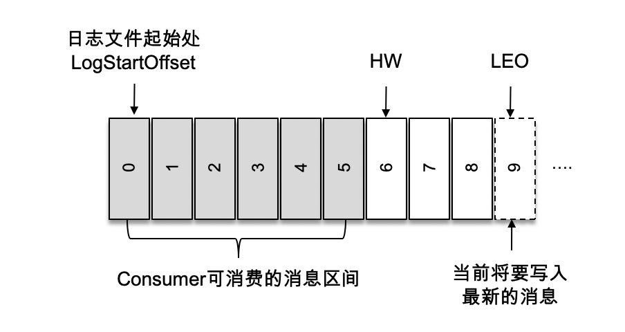
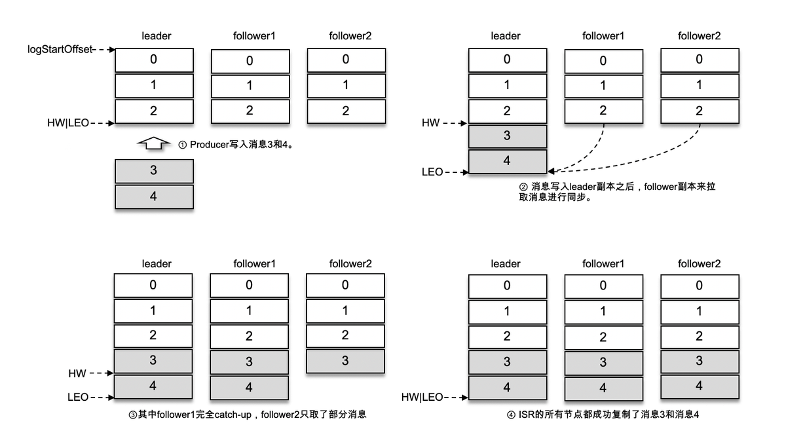

## kafka是什么？应用场景有哪些？

Kafka 是一个分布式流式处理平台。这到底是什么意思呢？

流平台具有三个关键功能：

1. **消息队列**：发布和订阅消息流，这个功能类似于消息队列，这也是 Kafka 也被归类为消息队列的原因。
2. **容错的持久方式存储记录消息流**： Kafka 会把消息持久化到磁盘，有效避免了消息丢失的风险。
3. **流式处理平台：** 在消息发布的时候进行处理，Kafka 提供了一个完整的流式处理类库。

Kafka 主要有两大应用场景：

1. **消息队列** ：建立实时流数据管道，以可靠地在系统或应用程序之间获取数据。
2. **数据处理：** 构建实时的流数据处理程序来转换或处理数据流。

## 和其他消息队列比，kafka优势在哪里？

我们现在经常提到 Kafka 的时候就已经默认它是一个非常优秀的消息队列了，我们也会经常拿它跟 RocketMQ、RabbitMQ 对比。我觉得 Kafka 相比其他消息队列主要的优势如下：

1. **极致的性能** ：基于 Scala 和 Java 语言开发，设计中大量使用了批量处理和异步的思想，最高可以每秒处理千万级别的消息。
2. **生态系统兼容性无可匹敌** ：Kafka 与周边生态系统的兼容性是最好的没有之一，尤其在大数据和流计算领域。

实际上在早期的时候 Kafka 并不是一个合格的消息队列，早期的 Kafka 在消息队列领域就像是一个衣衫褴褛的孩子一样，功能不完备并且有一些小问题比如丢失消息、不保证消息可靠性等等。当然，这也和 LinkedIn 最早开发 Kafka 用于处理海量的日志有很大关系，哈哈哈，人家本来最开始就不是为了作为消息队列滴，谁知道后面误打误撞在消息队列领域占据了一席之地。

随着后续的发展，这些短板都被 Kafka 逐步修复完善。所以，**Kafka 作为消息队列不可靠这个说法已经过时！**

## 消息模型

### 队列模型：早期的消息模型

[](https://camo.githubusercontent.com/198f39a9b4e964ccfb7e034c67cafe8d465f704c5f92254cdeb91ed54bffd181/68747470733a2f2f6d792d626c6f672d746f2d7573652e6f73732d636e2d6265696a696e672e616c6979756e63732e636f6d2f323031392d31312f25453925393825394625453525383825393725453625413825413125453525394525384232332e706e67)

**使用队列（Queue）作为消息通信载体，满足生产者与消费者模式，一条消息只能被一个消费者使用，未被消费的消息在队列中保留直到被消费或超时。** 比如：我们生产者发送 100 条消息的话，两个消费者来消费一般情况下两个消费者会按照消息发送的顺序各自消费一半（也就是你一个我一个的消费。）

**队列模型存在的问题：**

假如我们存在这样一种情况：我们需要将生产者产生的消息分发给多个消费者，并且每个消费者都能接收到完整的消息内容。

这种情况，队列模型就不好解决了。很多比较杠精的人就说：我们可以为每个消费者创建一个单独的队列，让生产者发送多份。这是一种非常愚蠢的做法，浪费资源不说，还违背了使用消息队列的目的。

### 发布-订阅模型:Kafka 消息模型

发布-订阅模型主要是为了解决队列模型存在的问题。

[](https://camo.githubusercontent.com/c9bb44fea3e49486fa9700d3eb273e424f3cf18e4ca77e4cdfaa0b2d1f2fa944/68747470733a2f2f6f73732e6a61766167756964652e636e2f6a6176612d67756964652d626c6f672f2545352538462539312545352542382538332545382541452541322545392539382538352545362541382541312545352539452538422e706e67)

发布订阅模型（Pub-Sub） 使用**主题（Topic）** 作为消息通信载体，类似于**广播模式**；发布者发布一条消息，该消息通过主题传递给所有的订阅者，**在一条消息广播之后才订阅的用户则是收不到该条消息的**。

**在发布 - 订阅模型中，如果只有一个订阅者，那它和队列模型就基本是一样的了。所以说，发布 - 订阅模型在功能层面上是可以兼容队列模型的。**

**Kafka 采用的就是发布 - 订阅模型。**

> **RocketMQ 的消息模型和 Kafka 基本是完全一样的。唯一的区别是 Kafka 中没有队列这个概念，与之对应的是 Partition（分区）。**

# 基本概念

Kafka 将生产者发布的消息发送到 **Topic（主题）** 中，需要这些消息的消费者可以订阅这些 **Topic（主题）**，如下图所示：


上面这张图也为我们引出了，Kafka 比较重要的几个概念：

1. **Producer（生产者）** : 产生消息的一方。
2. **Consumer（消费者）** : 消费消息的一方。
3. **Broker（代理）** : 可以看作是一个独立的 Kafka 实例。多个 Kafka Broker 组成一个 Kafka Cluster。

同时，你一定也注意到每个 Broker 中又包含了 Topic 以及 Partition 这两个重要的概念：

- **Topic（主题）** : Producer 将消息发送到特定的主题，Consumer 通过订阅特定的 Topic(主题) 来消费消息。
- **Partition（分区）** : Partition 属于 Topic 的一部分。一个 Topic 可以有多个 Partition ，并且同一 Topic 下的 Partition 可以分布在不同的 Broker 上，这也就表明一个 Topic 可以横跨多个 Broker 。这正如我上面所画的图一样。

> 划重点：**Kafka 中的 Partition（分区） 实际上可以对应成为消息队列中的队列。这样是不是更好理解一点？**

## 主题与分区




Kafka 中的消息以topic题为单位进行归类，生产者负责将消息发送到特定的topic (发送到 Kafka 集群中的每一条消息都要指定一个主题)，而消费者负责订阅主题并进行消费。

主题是一个**逻辑上的概念**，它还可以细分为多个分区，一个分区只属于单个主题，很多时候也会把分区称为主题分区(Topic-Partition)。同一主题下的不同分区包含的消息是不同的，**分区在存储层面可以看作一个可追加的日志(Log)文件**，消息在被追加到分区日志文件的时候都会分配一个特定的**偏移量(offset)**。**offset 是消息在分区中的唯一标识**，Kafka 通过它来保证消息在分区内的顺序性，不过offset 并不跨越分区，也就是说，**Kafka 保证的是分区有序而不是主题有序。**

如上图（左）所示，主题中有 3 个分区，消息被顺序追加到每个分区日志文件的尾部。Kafka 中的分区可以分布在不同的服务器(broker)上，也就是说，一个主题可以横跨多个 broker，以此来提供比单个 broker 更强大的性能。

## 消费者与消费者组



在Kafka的消费理念中还有一层消费组(Consumer Group) 的概念，每个消费者都有一个对应的消费组。当消息发布到主题后，只会被投递给订阅它的每个消费组中的一个消费者。换言之，**每一个分区只能被一个消费组中的一 个消费者所消费。**

## 存储视图



主题和分区都是提供给上层用户的抽象，而在副本层面或更加确切地说是 Log 层面才有实际物理上的存在。同一个分区中的多个副本必须分布在不同的 broker 中，这样才能提供有效的数据冗余。

为了防止 Log 过大， Kafka 又引入了**日志分段(LogSegment)**的概念，将 Log 切分为多个LogSegment，<u>相当于一个巨型文件被平均分配为多个相对较小的文件</u>，这样也便于消息的维护和清理。事实上，Log 和 LogSegment 也不是纯粹物理意义上的概念，**Log 在物理上只以文件夹的形式存储，而每个 LogSegment 对应于磁盘上的一个日志文件和两个索引文件，以及可能的其他文件(比如以 “.txnindex”为后缀的事务索引文件) 。**

向 Log 中追加消息时是**顺序写入**的，只有最后一个 LogSegment （activeSegment）才能执行写入操作，在此之前所有的 LogSegment 都不能写入数据。

# 高可用

## 多副本

Kafka 为分区引入了多副本(Replica)机制，通过增加副本数量可以提升容灾能力。同一分区的不同副本中保存的是相同的消息(在同一时刻，副本之间并非完全一样)，副本之间是一主多从的关系，**其中leader 副本负责处理读写请求，follower 副本只负责与 leader 副本的消息同步**。副本处于不同的broker 中，当 leader 副本出现故障时，从 follower 副本中重新选举新的 leader 副本对外提供服务。Kafka 通过多副本机制实现了故障的自动转移，当 Kafka 集群中某个 broker 失效时仍然能保证服务可用。

### AR & ISR & OSR



如上图所示，Kafka 集群中有 4 个 broker，某个主题中有 3 个分区，且副本因子(即副本个数)也为 3，如此每个分区便有 1 个 leader 副本和 2 个 follower 副本。生产者和消费者只与 leader 副本进行交互，而 follower 副本只负责消息的同步，很多时候 follower 副本中的消息相对 leader 副本而言会有一定的滞后。

分区中的所有副本统称为**AR** (Assigned Replicas)。所有与leader副本保持一定程度同步的副本(包括leader 副本在内)组成 **ISR (In-Sync Replicas)**，ISR 集合是 AR 集合中的一个子 集。消息会先发送到leader 副本，然后 follower 副本才能从 leader 副本中拉取消息进行同步， 同步期间内 follower 副本相对于 leader 副本而言会有一定程度的滞后。

前面所说的“一定程度的同步”是指可忍受的滞后范围，这个范围可以通过参数进行配置。与 leader副本同步滞后过多的副本(不包括 leader 副本)组成 **OSR** (Out-of-Sync Replicas)，由此可见，**AR=ISR+OSR**。 在正常情况下，所有的 follower 副本都应该与 leader 副本保持一定程度的同步，即AR=ISR， OSR 集合为空。

leader 副本负责维护和跟踪 ISR 集合中所有 follower 副本的滞后状态，当 follower 副本落后太多或失效时，leader 副本会把它从 ISR 集合中剔除。如果 OSR 集合中有 follower 副本“追上” 了 leader副本，那么 leader 副本会把它从 OSR 集合转移至 ISR 集合。默认情况下，当 leader 副本发生故障时，只有在 ISR 集合中的副本才有资格被选举为新的 leader，而在 OSR 集合中的副 本则没有任何机会(不过这个原则也可以通过修改相应的参数配置来改变)。

### HW & LEO



ISR 与 **HW** 和 **LEO** 也有紧密的关系。HW 是 High Watermark 的缩写，**俗称高水位**，它标识了一个特定的消息偏移量(offset)，**消费者只能拉取到这个 offset 之前的消息。**

如上图所示，它代表一个日志文件，这个日志文件中有 9 条消息，第一条消息的offset(LogStartOffset)为 0，最后一条消息的 offset 为 8，offset 为 9 的消息用虚线框表示，代表下一条待写入的消息。日志文件的 HW 为 6，表示消费者只能拉取到 offset 在 0 至 5 之间的消息， 而 offset 为6 的消息对消费者而言是不可见的。

**LEO 是 Log End Offset 的缩写**，**它标识当前日志文件中下一条待写入消息的 offset**，上图中 offset 为9 的位置即为当前日志文件的 LEO，LEO 的大小相当于当前日志分区中最后一条消息的 offset 值加1。分区 ISR 集合中的每个副本都会维护自身的 LEO，而 ISR 集合中最小的 LEO 即为分区的 HW，对消费者而言只能消费 HW 之前的消息。



### kafka为什么不支持读写分离

1、读写分离的话就会引入**数据一致性**的问题，这个是需要考虑的因素

2、kafka设计初衷是分布式日志系统，不是一个读多写少的场景，kafka的读写是对等的

3、mysql、redis为什么需要读写分离是因为这些在很多情况下都是单点机器提供读/写服务，请求集中。但是kafka 的partition 机制保证了 partition leader 的均匀分配的，这就起到了负载均衡的效果，避免了单点提供读/写服务

### 为什么分区数只能增加不能减少

当一个主题被创建之后，依然允许我们对其做一定的修改，比如修改分区个数、修改配置等，这个修改的功能就是由 kafka-topics.sh 脚本中的 alter 指令提供的。

按照 Kafka 现有的代码逻辑，此功能完全可以实现，不过也会使代码的复杂度急剧增大。 实现此功能需要考虑的因素很多，比如**删除的分区中的消息该如何处理?** 如果随着分区一起消失则消息的可靠性得不到保障；如果需要保留则又需要考虑如何保留。直接存储到现有分区的尾部，消息的时间戳就不会递增，如此对于 Spark、Flink 这类需要消息时间戳(事件时间)的组件将会受到影响; 如果分散插入现有的分区，那么在消息量很大的时候，内部的数据复制会占用很大的资源，而且在复制期间，此主题的可用性又如何得到保障?与此同时，顺序性问题、 事务性问题，以及分区和副本的状态机切换问题都是不得不面对的。

反观这个功能的收益点却 是很低的，如果真的需要实现此类功能，则完全可以重新创建一个分区数较小的主题，然后将现有主题中的消息按照既定的逻辑复制过去即可。

# 可靠性保证

## 生产者可靠性

而 Kafka 通过配置来指定 producer 生产者在发送消息时的 ack 策略：

```bash
Request.required.acks = -1 (全量同步确认，强可靠性保证)
Request.required.acks = 1(leader 确认收到, 默认)
Request.required.acks = 0 (不确认，但是吞吐量大)
```

## broker可靠性保证

## 消费者可靠性保证

Consumer 的可靠性策略集中在 consumer 的投递语义上，即：何时消费，消费到什么？按消费是否会丢？消费是否会重复？

这些语义场景，可以通过 kafka 消费者的而部分参数进行配置，简单来说有以下 3 中场景：

**1. AutoCommit（at most once, commit 后挂，实际会丢）**

```bash

```

配置如上的 consumer 收到消息就返回正确给 broker, 但是如果业务逻辑没有走完中断了，实际上这个消息没有消费成功。这种场景适用于**可靠性要求不高的业务**。其中 auto.commit.interval.ms 代表了自动提交的间隔。比如设置为 1s 提交 1 次，那么在 1s 内的故障重启，会从当前消费 offset 进行重新消费时，1s 内未提交但是已经消费的 msg, 会被重新消费到。

**2. 手动 Commit（at least once, commit 前挂，就会重复, 重启还会丢）**

配置为手动提交的场景下，业务开发者需要在消费消息到消息业务逻辑处理整个流程完成后进行手动提交。如果在流程未处理结束时发生重启，则之前消费到未提交的消息会**重新消费到，即消息显然会投递多次**。此处应用与业务逻辑明显实现了**幂等的场景下使用**。

**3. Exactly once, 很难，需要 msg 持久化和 commit 是原子的**

消息投递且仅投递一次的语义是**很难实现**的。首先要消费消息并且提交保证不会重复投递，其次提交前要完成整体的业务逻辑关于消息的处理。在 kafka 本身没有提供此场景语义接口的情况下，这几乎是不可能有效实现的。一般的解决方案，也是进行原子性的消息存储，业务逻辑异步慢慢的从存储中取出消息进行处理。