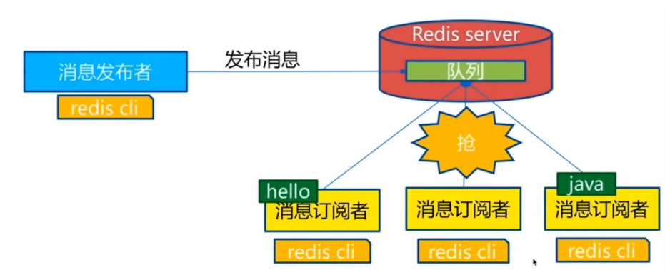

# Redis

针对采用内存存储数据的方案而言，难点一方面在于如何在不降低访问效率的情况下，充分利用有限的内存空间来存储尽可能多的数据，这个过程中少不了对**数据结构的选型、优化**（比如SDS，跳表、压缩列表等）；另一方面在于如何保证数据尽可能少的丢失，我们可以看到针对此问题的解决方案通常是快照+广泛意义的 wal 文件来解决。此类典型的代表就是 redis 啦。

# 一、Nosql概述

## 为什么使用Nosql

> 1、单机Mysql时代


90年代,一个网站的访问量一般不会太大，单个数据库完全够用。随着用户增多，网站出现以下问题

1. 数据量增加到一定程度，单机数据库就放不下了
2. 数据的索引（B+ Tree）,一个机器内存也存放不下
3. 访问量变大后（读写混合），一台服务器承受不住。

> 2、Memcached（缓存）+ Mysql + 垂直拆分（读写分离）

网站80%的情况都是在读，每次都要去查询数据库的话就十分的麻烦！所以说我们希望减轻数据库的压力，我们可以使用缓存来保证效率！


优化过程经历了以下几个过程：

	1. 优化数据库的数据结构和索引(难度大)
	2. 文件缓存，通过IO流获取比每次都访问数据库效率略高，但是流量爆炸式增长时候，IO流也承受不了
	3. MemCache,当时最热门的技术，通过在数据库和数据库访问层之间加上一层缓存，第一次访问时查询数据库，将结果保存到缓存，后续的查询先检查缓存，若有直接拿去使用，效率显著提升。

> 3、分库分表 + 水平拆分 + Mysql集群


> 4、如今最近的年代

 如今信息量井喷式增长，各种各样的数据出现（用户定位数据，图片数据等），大数据的背景下关系型数据库（RDBMS）无法满足大量数据要求。Nosql数据库就能轻松解决这些问题。

> 目前一个基本的互联网项目


> 为什么要用NoSQL

用户的个人信息，社交网络，地理位置。用户自己产生的数据，用户日志等等爆发式增长！
这时候我们就需要使用NoSQL数据库的，Nosql可以很好的处理以上的情况！

## 什么是NoSQL

==NoSQL = Not Only SQL（不仅仅是SQL）==

Not Only Structured Query Language

关系型数据库：列+行，同一个表下数据的结构是一样的。

非关系型数据库：数据存储没有固定的格式，并且可以进行横向扩展。

NoSQL泛指非关系型数据库，随着web2.0互联网的诞生，传统的关系型数据库很难对付web2.0时代！尤其是超大规模的高并发的社区，暴露出来很多难以克服的问题，NoSQL在当今大数据环境下发展的十分迅速，Redis是发展最快的。

## NoSQL特点

1. 方便扩展（数据之间没有关系，很好扩展！）
2. 大数据量高性能（Redis一秒可以写8万次，读11万次，NoSQL的缓存记录级，是一种细粒度的缓存，性能会比较高！）
3. 数据类型是多样型的！（不需要事先设计数据库，随取随用）
4. 传统的 RDBMS 和 NoSQL

```
传统的 RDBMS(关系型数据库)
- 结构化组织
- SQL
- 数据和关系都存在单独的表中 row col
- 操作，数据定义语言
- 严格的一致性
- 基础的事务
- ...
```

```
Nosql
- 不仅仅是数据
- 没有固定的查询语言
- 键值对存储，列存储，文档存储，图形数据库（社交关系）
- 最终一致性
- CAP定理和BASE
- 高性能，高可用，高扩展
- ...
```

> 了解 3V + 3高

大数据时代的3V ：主要是**描述问题**的

1. 海量Velume
2. 多样Variety
3. 实时Velocity

大数据时代的3高 ： 主要是**对程序的要求**

1. 高并发
2. 高可扩
3. 高性能

真正在公司中的实践：NoSQL + RDBMS 一起使用才是最强的。

## NoSQL的四大分类

### KV键值对

+ 新浪：Redis
+ 美团：Redis + Tair
+ 阿里、百度：Redis + Memcache

### 文档型数据库（bson数据格式）

+ MongoDB
  + 基于分布式文件存储的数据库。C++编写，用于处理大量文档。
  + MongoDB是RDBMS和NoSQL的中间产品。MongoDB是非关系型数据库中功能最丰富的，NoSQL中最像关系型数据库的数据库。

+ ConthDB

### 列存储数据库

+ HBase（大数据）

+ 分布式文件系统

### 图关系数据库

用于广告推荐，社交网络

- **Neo4j**、InfoGrid

### 对比

| 分类                    | 举例                                               | 典型应用场景                                                 | 数据模型                                        | 优点                                                         | 缺点                                                         |
| ----------------------- | -------------------------------------------------- | ------------------------------------------------------------ | ----------------------------------------------- | ------------------------------------------------------------ | ------------------------------------------------------------ |
| **键值对（key-value）** | Tokyo Cabinet/Tyrant, Redis, Voldemort, Oracle BDB | 内容缓存，主要用于处理大量数据的高访问负载，也用于一些日志系统等等。 | Key 指向 Value 的键值对，通常用hash table来实现 | 查找速度快                                                   | 数据无结构化，通常只被当作字符串或者二进制数据               |
| **列存储数据库**        | Cassandra, HBase, Riak                             | 分布式的文件系统                                             | 以列簇式存储，将同一列数据存在一起              | 查找速度快，可扩展性强，更容易进行分布式扩展                 | 功能相对局限                                                 |
| **文档型数据库**        | CouchDB, MongoDb                                   | Web应用（与Key-Value类似，Value是结构化的，不同的是数据库能够了解Value的内容） | Key-Value对应的键值对，Value为结构化数据        | 数据结构要求不严格，表结构可变，不需要像关系型数据库一样需要预先定义表结构 | 查询性能不高，而且缺乏统一的查询语法。                       |
| **图形(Graph)数据库**   | Neo4J, InfoGrid, Infinite Graph                    | 社交网络，推荐系统等。专注于构建关系图谱                     | 图结构                                          | 利用图结构相关算法。比如最短路径寻址，N度关系查找等          | 很多时候需要对整个图做计算才能得出需要的信息，而且这种结构不太好做分布式的集群 |

# 二、Redis入门

## 概述

> Redis是什么？

Redis（Remote Dictionary Server )，即远程字典服务。

是一个开源的使用ANSI C语言编写、支持网络、可基于内存亦可持久化的日志型、Key-Value数据库，并提供多种语言的API。

与memcached一样，为了保证效率，数据都是缓存在内存中。区别的是redis会周期性的把更新的数据写入磁盘或者把修改操作写入追加的记录文件，并且在此基础上实现了master-slave(主从)同步。

> Redis能干什么？

1. 内存存储、持久化，内存是断电即失的，所以需要持久化（RDB、AOF）
2. 高效率、用于高速缓冲
3. 发布订阅系统
4. 地图信息分析
5. 计时器、计数器(eg：浏览量)
6. 。。。

> 特性

1. 多样的数据类型

2. 持久化

3. 集群

4. 事务

   …

## 基础知识

Redis默认有16个数据库

![[外链图片转存失败,源站可能有防盗链机制,建议将图片保存下来直接上传(img-v2S3n3Si-1597890996516)(狂神说 Redis.assets/image-20200813114158322.png)]](https://img-blog.csdnimg.cn/20200820104357466.png?x-oss-process=image/watermark,type_ZmFuZ3poZW5naGVpdGk,shadow_10,text_aHR0cHM6Ly9ibG9nLmNzZG4ubmV0L0RERERlbmdf,size_16,color_FFFFFF,t_70#pic_center)

默认使用的第0个;

16个数据库为：DB 0~DB 15
默认使用DB 0 ，可以使用`select n`切换到DB n，`dbsize`可以查看当前数据库的大小，与key数量相关。

```bash
127.0.0.1:6379> config get databases # 命令行查看数据库数量databases
1) "databases"
2) "16"

127.0.0.1:6379> select 8 # 切换数据库 DB 8
OK
127.0.0.1:6379[8]> dbsize # 查看数据库大小
(integer) 0

# 不同数据库之间 数据是不能互通的，并且dbsize 是根据库中key的个数。
127.0.0.1:6379> set name sakura 
OK
127.0.0.1:6379> SELECT 8
OK
127.0.0.1:6379[8]> get name # db8中并不能获取db0中的键值对。
(nil)
127.0.0.1:6379[8]> DBSIZE
(integer) 0
127.0.0.1:6379[8]> SELECT 0
OK
127.0.0.1:6379> keys *
1) "counter:__rand_int__"
2) "mylist"
3) "name"
4) "key:__rand_int__"
5) "myset:__rand_int__"
127.0.0.1:6379> DBSIZE # size和key个数相关
(integer) 5
```

`keys *` ：查看当前数据库中所有的key。

`flushdb`：清空当前数据库中的键值对。

`flushall`：清空所有数据库的键值对。

## 单线程

> **Redis是单线程的，Redis是基于内存操作的。**

所以Redis的性能瓶颈不是CPU,而是机器内存和网络带宽。

那么为什么Redis的速度如此快呢，性能这么高呢？QPS达到10W+

> **Redis为什么单线程还这么快？**

- 误区1：高性能的服务器一定是多线程的？
- 误区2：多线程（CPU上下文会切换！）一定比单线程效率高！

核心：Redis是将所有的数据放在内存中的，所以说使用单线程去操作效率就是最高的，多线程（CPU上下文会切换：耗时的操作！），==对于内存系统来说，如果没有上下文切换效率就是最高的，多次读写都是在一个CPU上的==，在内存存储数据情况下，单线程就是最佳的方案。

---

单线程指的是从**网络IO处理到实际的读写命令处理**都是由单个线程完成的，并不是说整个redis只有一个主线程。你可能听到在redis6.0版本支持多线程，不过**这个并不是指多个线程同时处理读写命令，而是使用多线程来处理socket的读写**，最终执行读写命令的过程还是**只在主线程。**

## 应用场景

### 1. 缓存——热点数据

热点数据（经常会被查询，但是不经常被修改或者删除的数据），首选是使用redis缓存，毕竟强大到冒泡的QPS和极强的稳定性不是所有类似工具都有的，而且相比于memcached还提供了丰富的数据类型可以使用，另外，内存中的数据也提供了AOF和RDB等持久化机制可以选择，要冷、热的还是忽冷忽热的都可选。

### 2. 计数

诸如统计点击数等应用。**由于单线程，可以避免并发问题**，保证不会出错，而且100%毫秒级性能！爽。

命令：INCRBY

当然爽完了，别忘记**持久化**，毕竟是redis只是存了内存！

### 3. 分布式锁

- 验证前端的重复请求（可以自由扩展类似情况），可以通过redis进行过滤：每次请求将request Ip、参数、接口等hash作为key存储redis（幂等性请求），设置多长时间有效期，然后下次请求过来的时候先在redis中检索有没有这个key，进而验证是不是一定时间内过来的重复提交

### 4. 排行榜

关系型数据库在排行榜方面查询速度普遍偏慢，所以可以借助redis的SortedSet进行热点数据的排序。

在奶茶活动中，我们需要展示各个部门的点赞排行榜， 所以我针对每个部门做了一个SortedSet,然后以用户的openid作为上面的username,以用户的点赞数作为上面的score, 然后针对每个用户做一个hash,通过zrangebyscore就可以按照点赞数获取排行榜，然后再根据username获取用户的hash信息，这个当时在实际运用中性能体验也蛮不错的。

# 三、五大数据类型

Redis是一个开源（BSD许可），内存存储的数据结构服务器，可用作数据库，高速缓存和消息队列代理。它支持字符串、哈希表、列表、集合、有序集合，位图，hyperloglogs等数据类型。内置复制、Lua脚本、LRU收回、事务以及不同级别磁盘持久化功能，同时通过Redis Sentinel提供高可用，通过Redis Cluster提供自动分区。

## Redis-key

**在redis中无论什么数据类型，在数据库中都是以key-value形式保存，通过进行对Redis-key的操作，来完成对数据库中数据的操作。**

下面学习的命令：

- `exists key`：判断键是否存在
- `del key`：删除键值对
- `move key db`：将键值对移动到指定数据库
- `expire key second`：设置键值对的过期时间
- `type key`：查看value的数据类型

关于`TTL`命令

Redis的key，通过TTL命令返回key的过期时间，一般来说有3种：

1. 当前key没有设置过期时间，所以会返回-1.
2. 当前key有设置过期时间，而且key已经过期，所以会返回-2.
3. 当前key有设置过期时间，且key还没有过期，故会返回key的正常剩余时间.

关于重命名`RENAME`和`RENAMENX`

- `RENAME key newkey`修改 key 的名称
- `RENAMENX key newkey`仅当 newkey 不存在时，将 key 改名为 newkey 。

## 1. String（字符串）

### 结构

```c
struct sdshdr{
  int len;
  int free;
  char buf[];
};
```

- `len`：buf数组中字符串的实际使用量。
- `free`：buf数组中空闲量。
- `buf`：存储字符的数组。

### SDS

#### 优点

**1. 获取字符串长度效率高**：只需要O(1)的时间。

**2. 避免了缓冲区溢出**：与C字符串不同，SDS的空间分配策略完全杜绝了发生缓冲区溢出的可能性：当SDS API需要对SDS进行修改时，API会<u>先检查SDS的空间是否满足修改所需的要求</u>，如果不满足的话，API会自动将SDS的空间扩展至执行修改所需的大小，然后才执行实际的修改操作，所以使用SDS既不需要手动修改SDS的空间大小，也不会出现前面所说的缓冲区溢出问题。

**3. 减少内存重分配：**

- 当我们使用append扩充字符串时，我们首先要扩充当前字符数组的内存，然后再将第二个字符数组中的值一一复制进来，否则就有可能出现『缓冲区溢出』。这个过程就是『内存重分配』。
- 当我们需要截取字符串后，我们需要释放已经不被使用的内存空间，否则就可能出现『内存泄露』。这个过程也是『内存重分配』。

内存重分配过程会涉及复杂的算法和系统调用，较为耗时。如果像C字符串那样，每次修改字符串都要进行一次内存重分配，那么效率是极底的，所以SDS使用了『空间预分配』和『惰性空间释放』降低了重分配的频率，从而提升效率。

> 空间预分配

当需要扩展SDS长度的时候，Redis不仅会给它分配所需的内存空间，还会分配一段额外的空间作为备用。  备用空间大小按照如下公式计算： 

- 如果扩展之后，SDS字符数组的长度小于1M，那么就使得备用空间的大小和字符串实际长度保持一致，即：len==free；
- 如果扩展之后，SDS字符数组的长度大于1M，那么备用空间的大小就设置成1M。  那么这样的话，当要append时，直接使用备用空间即可，无需再次扩容啦，从而减少了内存重分配的次数。SDS将连续增长N次字符串所需的内存重分配次数从『必定N次』减少到了『最多N次』。

> 惰性空间释放  

当需要缩短字符串时，SDS不会立即释放多于的内存空间，而是将其保留，修改free值。这样的话，当下次需要扩容时，直接使用这部分内存空间即可，减少了内存重分配的次数。

**4. 二进制安全：**

​		所谓『二进制安全』就是：往SDS里面放什么数据，取出来还是什么数据。SDS不会对存储的这些数据做任何修改、限制、过滤等。

​		C字符串中的字符必须符合某种编码（比如ASCII），并且除了字符串的末尾之外，字符串里面不能包含空字符，否则最先被程序读入的空字符将被误认为是字符串结尾，这些限制使得C字符串只能保存文本数据，而不能保存像图片、音频、视频、压缩文件这样的二进制数据。举个例子，如果有一种使用空字符来分割多个单词的特殊数据格式，如图2-17所示，那么这种格式就不能使用C字符串来保存，因为C字符串所用的函数只会识别出其中的"Redis"，而忽略之后的"Cluster"。


​		使用空字符来分割单词的特殊数据格式虽然数据库一般用于保存文本数据，但使用数据库来保存二进制数据的场景也不少见，因此，为了确保Redis可以适用于各种不同的使用场景，SDS的API都是二进制安全的（binary-safe），**所有SDS API都会以处理二进制的方式来处理SDS存放在buf数组里的数据，程序不会对其中的数据做任何限制、过滤、或者假设，数据在写入时是什么样的，它被读取时就是什么样。**这也是我们将SDS的buf属性称为字节数组的原因——Redis不是用这个数组来保存字符，而是用它来保存一系列二进制数据。

#### 与C字符串对比

|                 C字符串                  |                   SDS                    |
| :--------------------------------------: | :--------------------------------------: |
|      获取字符串长度时间复杂度为O(n)      |      获取字符串长度时间复杂度为O(1)      |
|   API是不安全的，可能会造成缓冲区溢出    |     API是安全的，不会造成缓冲区溢出      |
| 修改字符串长度N次必然会造成N次内存重分配 | 修改字符串长度N次最多会造成N次内存重分配 |
|             只能保存文本数据             |         可以保存文本或二进制数据         |
|      可以使用所有<string.h>中的函数      |      可以使用部分<string.h>中的函数      |


### 命令

普通的set、get直接略过。

|                 命令                 |                             描述                             |
| :----------------------------------: | :----------------------------------------------------------: |
|          `APPEND key value`          |                向指定的key的value后追加字符串                |
|           `DECR/INCR key`            |          将指定key的value数值进行+1/-1(仅对于数字)           |
|        `INCRBY/DECRBY key n`         |                  按指定的步长对数值进行加减                  |
|         `INCRBYFLOAT key n`          |                     为数值加上浮点型数值                     |
|             `STRLEN key`             |                  获取key保存值的字符串长度                   |
|       `GETRANGE key start end`       |         按起止位置获取字符串（闭区间，起止位置都取）         |
|     `SETRANGE key offset value`      |            用指定的value 替换key中 offset开始的值            |
|          `GETSET key value`          |  将给定 key 的值设为 value ，并返回 key 的旧值(old value)。  |
|          `SETNX key value`           |                    仅当key不存在时进行set                    |
|      `SETEX key seconds value`       |                   set 键值对并设置过期时间                   |
|  `MSET key1 value1 [key2 value2..]`  |                        批量set键值对                         |
| `MSETNX key1 value1 [key2 value2..]` |      批量设置键值对，仅当参数中所有的key都不存在时执行       |
|         `MGET key1 [key2..]`         |                   批量获取多个key保存的值                    |
|    `SETEX key milliseconds value`    |   和 SETEX 命令相似，但它以毫秒为单位设置 key 的生存时间，   |
|          `getset key value`          | 如果不存在值，则返回nil，如果存在值，获取原来的值，并设置新的值 |

### 场景

String类似的使用场景：<u>value除了是字符串还可以是数字</u>，用途举例：

- 计数器
- 统计多单位的数量：uid:123666：follow 0
- 粉丝数
- 对象存储缓存

## 2. List（列表）

>  Redis列表是简单的字符串列表，按照插入顺序排序。你可以添加一个元素到列表的头部（左边）或者尾部（右边）

一个列表最多可以包含 232 - 1 个元素 (4294967295, 每个列表超过40亿个元素)。

首先我们列表，可以经过规则定义将其变为队列、栈、双端队列等

![[外链图片转存失败,源站可能有防盗链机制,建议将图片保存下来直接上传(img-VPvbIltc-1597890996518)(狂神说 Redis.assets/image-20200813114255459.png)]](https://img-blog.csdnimg.cn/20200820104440398.png?x-oss-process=image/watermark,type_ZmFuZ3poZW5naGVpdGk,shadow_10,text_aHR0cHM6Ly9ibG9nLmNzZG4ubmV0L0RERERlbmdf,size_16,color_FFFFFF,t_70#pic_center)

正如图Redis中List是可以进行双端操作的，所以命令也就分为了LXXX和RLLL两类，有时候L也表示List例如LLEN

### 结构

节点：

```c
typedef struct listNode{
  struct listNode *prev;
  struct listNode *next;
  void *value;
}listNode;
```

- `prev`：链表节点的前驱
- `next`：链表节点的后继
- `value`：节点中的值

链表：

```c
typedef struct list{
  listNode *head;
  listNode *tail;
  unsigned long len;
}list;
```

- `head`：链表头节点
- `tail`：链表尾节点
- `len`：链表中节点个数

**Redis链表的特点**

- 双向链表
- 无环
- 带头节点 和 尾节点
- 带链表长度计数器：程序使用list结构的`len`属性来对list持有的链表节点进行计数，程序获取链表中节点数量的复杂度为O（1）。
- 多态：采用`void*`保存节点值，并且可以通过list结构的dup、free、match三个属性为节点值设置类型特定函数，所以链表可以用于保存各种不同类型的值。

### 命令

|                  命令                   |                             描述                             |
| :-------------------------------------: | :----------------------------------------------------------: |
|   `LPUSH/RPUSH key value1[value2..]`    |          从左边/右边向列表中PUSH值(一个或者多个)。           |
|         `LRANGE key start end`          |          获取list 起止元素==（索引从左往右 递增）==          |
|        `LPUSHX/RPUSHX key value`        |            向已存在的列名中push值（一个或者多个）            |
| `LINSERT key BEFORE|AFTER pivot value`  |               在指定列表元素的前/后 插入value                |
|               `LLEN key`                |                         查看列表长度                         |
|           `LINDEX key index`            |                     通过索引获取列表元素                     |
|         `LSET key index value`          |                      通过索引为元素设值                      |
|             `LPOP/RPOP key`             |                 从最左边/最右边移除值 并返回                 |
|     `RPOPLPUSH source destination`      | 将列表的尾部(右)最后一个值弹出，并返回，然后加到另一个列表的头部 |
|          `LTRIM key start end`          |                 通过下标截取指定范围内的列表                 |
|         `LREM key count value`          | List中是允许value重复的 `count > 0`：从头部开始搜索 然后删除指定的value 至多删除count个 `count < 0`：从尾部开始搜索… `count = 0`：删除列表中所有的指定value。 |
|     `BLPOP/BRPOP key1[key2] timout`     | 移出并获取列表的第一个/最后一个元素， 如果列表没有元素会阻塞列表直到等待超时或发现可弹出元素为止。 |
| `BRPOPLPUSH source destination timeout` | 和`RPOPLPUSH`功能相同，如果列表没有元素会阻塞列表直到等待超时或发现可弹出元素为止。 |

> 小结

- list实际上是一个链表，before Node after , left, right 都可以插入值
- **如果key不存在，则创建新的链表**
- 如果key存在，新增内容
- 如果移除了所有值，空链表，也代表不存在
- 在两边插入或者改动值，效率最高！修改中间元素，效率相对较低

应用：

**消息排队！消息队列（Lpush Rpop）,栈（Lpush Lpop）**

## 3. Set（集合）

Redis的Set是string类型的无序集合。集合成员是唯一的，这就意味着集合中不能出现重复的数据。Redis 中 集合是通过哈希表实现的，所以添加，删除，查找的复杂度都是O(1)。集合中最大的成员数为 232 - 1 (4294967295, 每个集合可存储40多亿个成员)。

|                   命令                    |                             描述                             |
| :---------------------------------------: | :----------------------------------------------------------: |
|       `SADD key member1[member2..]`       |                向集合中无序增加一个/多个成员                 |
|                `SCARD key`                |                       获取集合的成员数                       |
|              `SMEMBERS key`               |                     返回集合中所有的成员                     |
|          `SISMEMBER key member`           |         查询member元素是否是集合的成员,结果是无序的          |
|         `SRANDMEMBER key [count]`         |          随机返回集合中count个成员，count缺省值为1           |
|            `SPOP key [count]`             |       随机移除并返回集合中count个成员，count缺省值为1        |
|     `SMOVE source destination member`     |        将source集合的成员member移动到destination集合         |
|       `SREM key member1[member2..]`       |                   移除集合中一个/多个成员                    |
|           `SDIFF key1[key2..]`            |              返回所有集合的差集 key1- key2 - …               |
|   `SDIFFSTORE destination key1[key2..]`   | 在SDIFF的基础上，将结果保存到集合中==(覆盖)==。不能保存到其他类型key噢！ |
|          `SINTER key1 [key2..]`           |                      返回所有集合的交集                      |
|  `SINTERSTORE destination key1[key2..]`   |           在SINTER的基础上，存储结果到集合中。覆盖           |
|          `SUNION key1 [key2..]`           |                      返回所有集合的并集                      |
|  `SUNIONSTORE destination key1 [key2..]`  |           在SUNION的基础上，存储结果到及和张。覆盖           |
| `SSCAN KEY [MATCH pattern] [COUNT count]` |   在大量数据环境下，使用此命令遍历集合中元素，每次遍历部分   |

## 4. Hash（哈希）

> Redis hash 是一个string类型的field和value的映射表，**hash特别适合用于存储对象。**
>
> Set就是一种简化的Hash,只变动key,而value使用默认值填充。可以将一个Hash表作为一个对象进行存储，表中存放对象的信息。

典型应用：做购物车

|                       命令                       |                             描述                             |
| :----------------------------------------------: | :----------------------------------------------------------: |
|              `HSET key field value`              | 将哈希表 key 中的字段 field 的值设为 value 。重复设置同一个field会覆盖,返回0 |
|   `HMSET key field1 value1 [field2 value2..]`    | 同时将多个 field-value (域-值)对设置到哈希表 key 中。<br />（Redis4.0以上不再推荐使用，用hset替代） |
|             `HSETNX key field value`             |       只有在字段 field 不存在时，设置哈希表字段的值。        |
|               `HEXISTS key field`                |           查看哈希表 key 中，指定的字段是否存在。            |
|              `HGET key field value`              |                获取存储在哈希表中指定字段的值                |
|          `HMGET key field1 [field2..]`           |                     获取所有给定字段的值                     |
|                  `HGETALL key`                   |                获取在哈希表key 的所有字段和值                |
|                   `HKEYS key`                    |                  获取哈希表key中所有的字段                   |
|                    `HLEN key`                    |                    获取哈希表中字段的数量                    |
|                   `HVALS key`                    |                      获取哈希表中所有值                      |
|           `HDEL key field1 [field2..]`           |              删除哈希表key中一个/多个field字段               |
|              `HINCRBY key field n`               | 为哈希表 key 中的指定字段的整数值加上增量n，并返回增量后结果 一样只适用于整数型字段 |
|            `HINCRBYFLOAT key field n`            |       为哈希表 key 中的指定字段的浮点数值加上增量 n。        |
| `HSCAN key cursor [MATCH pattern] [COUNT count]` |                    迭代哈希表中的键值对。                    |

Hash变更的数据user name age，尤其是用户信息之类的，经常变动的信息！**Hash更适合于对象的存储，String更加适合字符串存储！**

## 5. Zset（有序集合）

不同的是每个元素都会关联一个double类型的分数（score）。redis正是通过分数来为集合中的成员进行从小到大的排序。score相同：按字典顺序排序
有序集合的成员是唯一的，但分数(score)却可以重复。

|                       命令                        |                             描述                             |
| :-----------------------------------------------: | :----------------------------------------------------------: |
|     `ZADD key score member1 [score2 member2]`     |    向有序集合添加一个或多个成员，或者更新已存在成员的分数    |
|                    `ZCARD key`                    |                     获取有序集合的成员数                     |
|               `ZCOUNT key min max`                |            计算在有序集合中指定区间score的成员数             |
|              `ZINCRBY key n member`               |             有序集合中对指定成员的分数加上增量 n             |
|                `ZSCORE key member`                |                  返回有序集中，成员的分数值                  |
|                `ZRANK key member`                 |                 返回有序集合中指定成员的索引                 |
|              `ZRANGE key start end`               |          通过索引区间返回有序集合成指定区间内的成员          |
|             `ZRANGEBYLEX key min max`             |                通过字典区间返回有序集合的成员                |
|            `ZRANGEBYSCORE key min max`            | 通过分数返回有序集合指定区间内的成员==-inf 和 +inf分别表示最小最大值，只支持开区间()== |
|              `ZLEXCOUNT key min max`              |            在有序集合中计算指定字典区间内成员数量            |
|          `ZREM key member1 [member2..]`           |                 移除有序集合中一个/多个成员                  |
|           `ZREMRANGEBYLEX key min max`            |            移除有序集合中给定的字典区间的所有成员            |
|         `ZREMRANGEBYRANK key start stop`          |            移除有序集合中给定的排名区间的所有成员            |
|          `ZREMRANGEBYSCORE key min max`           |            移除有序集合中给定的分数区间的所有成员            |
|             `ZREVRANGE key start end`             |     返回有序集中指定区间内的成员，通过索引，分数从高到底     |
|          `ZREVRANGEBYSCORRE key max min`          |      返回有序集中指定分数区间内的成员，分数从高到低排序      |
|           `ZREVRANGEBYLEX key max min`            |       返回有序集中指定字典区间内的成员，按字典顺序倒序       |
|               `ZREVRANK key member`               | 返回有序集合中指定成员的排名，有序集成员按分数值递减(从大到小)排序 |
| `ZINTERSTORE destination numkeys key1 [key2 ..]`  | 计算给定的一个或多个有序集的交集并将结果集存储在新的有序集合 key 中，numkeys：表示参与运算的集合数，将score相加作为结果的score |
|  `ZUNIONSTORE destination numkeys key1 [key2..]`  | 计算给定的一个或多个有序集的交集并将结果集存储在新的有序集合 key 中 |
| `ZSCAN key cursor [MATCH pattern\] [COUNT count]` |        迭代有序集合中的元素（包括元素成员和元素分值）        |

应用案例：

- set排序 存储班级成绩表 工资表排序！
- 普通消息，1.重要消息 2.带权重进行判断
- 排行榜应用实现，取Top N测试

# 四、三种特殊数据类型

## Geospatial

使用经纬度定位地理坐标并用一个**有序集合zset保存**，所以zset命令也可以使用

|                             命令                             |                             描述                             |
| :----------------------------------------------------------: | :----------------------------------------------------------: |
|    `geoadd key longitud(经度) latitude(纬度) member [..]`    |              将具体经纬度的坐标存入一个有序集合              |
|                `geopos key member [member..]`                |                获取集合中的一个/多个成员坐标                 |
|             `geodist key member1 member2 [unit]`             |        返回两个给定位置之间的距离。默认以米作为单位。        |
| `georadius key longitude latitude radius m|km|mi|ft [WITHCOORD][WITHDIST] [WITHHASH] [COUNT count]` | 以给定的经纬度为中心， 返回集合包含的位置元素当中， 与中心的距离不超过给定最大距离的所有位置元素。 |
|           `GEORADIUSBYMEMBER key member radius...`           | 功能与GEORADIUS相同，只是中心位置不是具体的经纬度，而是使用结合中已有的成员作为中心点。 |
|              `geohash key member1 [member2..]`               | 返回一个或多个位置元素的Geohash表示。使用Geohash位置52点整数编码。 |

**有效的经纬度：**

- 有效的经度从-180度到180度。
- 有效的纬度从-85.05112878度到85.05112878度。

指定单位的参数 **unit** 必须是以下单位的其中一个：

- **m** 表示单位为米。
- **km** 表示单位为千米。
- **mi** 表示单位为英里。
- **ft** 表示单位为英尺。

**关于GEORADIUS的参数**

通过`georadius`就可以完成 **附近的人**功能

withcoord:带上坐标

withdist:带上距离，单位与半径单位相同

COUNT n : 只显示前n个(按距离递增排序)

## Hyperloglog

Redis HyperLogLog 是用来做**基数统计**的算法，HyperLogLog 的优点是，在输入元素的数量或者体积非常非常大时，计算基数所需的空间总是固定的、并且是很小的。花费 12 KB 内存，就可以计算接近 2^64 个不同元素的基数。因为 HyperLogLog 只会根据输入元素来计算基数，而不会储存输入元素本身，所以 HyperLogLog 不能像集合那样，返回输入的各个元素。其底层使用string数据类型

> 什么是基数

数据集中不重复的元素的个数。

**应用场景：**
网页的访问量（UV）：一个用户多次访问，也只能算作一个人。
传统实现，存储用户的id,然后每次进行比较。当用户变多之后这种方式及其浪费空间，而我们的目的只是**计数**，Hyperloglog就能帮助我们利用最小的空间完成。

|                   命令                    |                   描述                    |
| :---------------------------------------: | :---------------------------------------: |
|     `PFADD key element1 [elememt2..]`     |       添加指定元素到 HyperLogLog 中       |
|            `PFCOUNT key [key]`            |    返回给定 HyperLogLog 的基数估算值。    |
| `PFMERGE destkey sourcekey [sourcekey..]` | 将多个 HyperLogLog 合并为一个 HyperLogLog |

```bash
----------PFADD--PFCOUNT---------------------
127.0.0.1:6379> PFADD myelemx a b c d e f g h i j k # 添加元素
(integer) 1
127.0.0.1:6379> type myelemx # hyperloglog底层使用String
string
127.0.0.1:6379> PFCOUNT myelemx # 估算myelemx的基数
(integer) 11
127.0.0.1:6379> PFADD myelemy i j k z m c b v p q s
(integer) 1
127.0.0.1:6379> PFCOUNT myelemy
(integer) 11

----------------PFMERGE-----------------------
127.0.0.1:6379> PFMERGE myelemz myelemx myelemy # 合并myelemx和myelemy 成为myelemz
OK
127.0.0.1:6379> PFCOUNT myelemz # 估算基数
(integer) 17
```

如果允许容错，那么一定可以使用Hyperloglog !

如果不允许容错，就使用set或者自己的数据类型即可 ！

## Bitmaps

使用位存储，信息状态只有 0 和 1。Bitmap是一串连续的2进制数字（0或1），每一位所在的位置为偏移(offset)，在bitmap上可执行AND,OR,XOR,NOT以及其它位操作。

**应用场景**：签到统计、状态统计

|                 命令                  |                             描述                             |
| :-----------------------------------: | :----------------------------------------------------------: |
|       `setbit key offset value`       |                  为指定key的offset位设置值                   |
|          `getbit key offset`          |                       获取offset位的值                       |
|      `bitcount key [start end]`       |     统计字符串被设置为1的bit数，也可以指定统计范围按字节     |
| `bitop operration destkey key[key..]` | 对一个或多个保存二进制位的字符串 key 进行位元操作，并将结果保存到 destkey 上。 |
|    `BITPOS key bit [start] [end]`     | 返回字符串里面第一个被设置为1或者0的bit位。start和end只能按字节,不能按位 |

# 五、Redis设计与实现

## 过期

Redis有四个不同的命令可以用于设置键的生存时间（键可以存在多久）或过期时间（键什么时候会被删除）：

+ `EXPIRE<key> <ttl>`命令用于将键key的生存时间设置为ttl秒。
+ `PEXPIRE<key> <ttl>`命令用于将键key的生存时间设置为ttl毫秒。
+ `EXPIREAT<key> <timestamp>`命令用于将键key的过期时间设置为timestamp所指定的秒数时间戳。
+ `PEXPIREAT<key> <timestamp>`命令用于将键key的过期时间设置为timestamp所指定的毫秒数时间戳。

虽然有多种不同单位和不同形式的设置命令，但实际上EXPIRE、PEXPIRE、EXPIREAT三个命令都是使用PEXPIREAT命令来实现的：无论客户端执行的是以上四个命令中的哪一个，经过转换之后，最终的执行效果都和执行`PEXPIREAT`命令一样。

### 保存过期时间

数据库主要由dict和expires两个字典构成，其中dict字典负责保存键值对，而expires字典则负责保存键的过期时间。因为数据库由字典构成，所以对数据库的操作都是建立在字典操作之上的。

redisDb结构的expires字典保存了数据库中所有键的过期时间，我们称这个字典为过期字典：

+ ❑过期字典的键是一个指针，这个指针指向键空间中的某个键对象（也即是某个数据库键）。
+ ❑过期字典的值是一个long long类型的整数，这个整数保存了键所指向的数据库键的过期时间——一个毫秒精度的UNIX时间戳。

图9-12展示了一个带有过期字典的数据库例子，在这个例子中，键空间保存了数据库中的所有键值对，而过期字典则保存了数据库键的过期时间。
为了展示方便，图9-12的键空间和过期字典中重复出现了两次alphabet键对象和book键对象。在实际中，键空间的键和过期字典的键都指向同一个键对象，所以不会出现任何重复对象，也不会浪费任何空间。


### 移除过期时间

`PERSIST`命令就是PEXPIREAT命令的反操作：**PERSIST命令在过期字典中查找给定的键，并解除键和值（过期时间）在过期字典中的关联。**

### 定期删除策略

#### 可供选择的策略

+ 定时删除：在设置键的过期时间的同时，创建一个定时器（timer），让定时器在键的过期时间来临时，立即执行对键的删除操作。
+ 惰性删除：放任键过期不管，但是每次从键空间中获取键时，都检查取得的键是否过期，如果过期的话，就删除该键；如果没有过期，就返回该键。
+ 定期删除：每隔一段时间，程序就对数据库进行一次检查，删除里面的过期键。至于要删除多少过期键，以及要检查多少个数据库，则由算法决定。

在这三种策略中，第一种和第三种为主动删除策略，而第二种则为被动删除策略。

> 定时删除

定时删除策略对内存是最友好的：通过使用定时器，定时删除策略可以保证过期键会尽可能快地被删除，并释放过期键所占用的内存。

另一方面，定时删除策略的缺点是，它对CPU时间是最不友好的：在过期键比较多的情况下，删除过期键这一行为可能会占用相当一部分CPU时间，在内存不紧张但是CPU时间非常紧张的情况下，将CPU时间用在删除和当前任务无关的过期键上，无疑会对服务器的响应时间和吞吐量造成影响。

例如，如果正有大量的命令请求在等待服务器处理，并且服务器当前不缺少内存，那么服务器应该优先将CPU时间用在处理客户端的命令请求上面，而不是用在删除过期键上面。

除此之外，创建一个定时器需要用到Redis服务器中的时间事件，而当前时间事件的实现方式——无序链表，查找一个事件的时间复杂度为O（N）——并不能高效地处理大量时间事件。**因此，要让服务器创建大量的定时器，从而实现定时删除策略，在现阶段来说并不现实。**

> 惰性删除

惰性删除策略对CPU时间来说是最友好的：程序只会在取出键时才对键进行过期检查，这可以保证删除过期键的操作只会在非做不可的情况下进行，并且删除的目标仅限于当前处理的键，这个策略不会在删除其他无关的过期键上花费任何CPU时间。

惰性删除策略的缺点是，它对内存是最不友好的：如果一个键已经过期，而这个键又仍然保留在数据库中，那么只要这个过期键不被删除，它所占用的内存就不会释放。

在使用惰性删除策略时，如果数据库中有非常多的过期键，而这些过期键又恰好没有被访问到的话，那么它们也许永远也不会被删除（除非用户手动执行FLUSHDB），我们甚至可以将这种情况看作是一种**内存泄漏**——无用的垃圾数据占用了大量的内存，而服务器却不会自己去释放它们，这对于运行状态非常依赖于内存的Redis服务器来说，肯定不是一个好消息。

举个例子，对于一些和时间有关的数据，**比如日志（log）**，在某个时间点之后，对它们的访问就会大大减少，甚至不再访问，如果这类过期数据大量地积压在数据库中，用户以为服务器已经自动将它们删除了，但实际上这些键仍然存在，而且键所占用的内存也没有释放，那么造成的后果肯定是非常严重的。

> 定期删除

从上面对定时删除和惰性删除的讨论来看，这两种删除方式在单一使用时都有明显的缺陷：

+ 定时删除占用太多CPU时间，影响服务器的响应时间和吞吐量。
+ 惰性删除浪费太多内存，有内存泄漏的危险。

定期删除策略是前两种策略的一种整合和折中：

+ 定期删除策略每隔一段时间执行一次删除过期键操作，并通过<u>限制删除操作执行的时长和频率来减少删除操作对CPU时间的影响</u>。
+ 除此之外，通过定期删除过期键，定期删除策略有效地减少了因为过期键而带来的内存浪费。

#### Redis的过期删除策略

**Redis服务器实际使用的是惰性删除和定期删除两种策略**：通过配合使用这两种删除策略，服务器可以很好地在合理使用CPU时间和避免浪费内存空间之间取得平衡。

# 六、事务

==Redis的单条命令是保证原子性的，但是redis事务不能保证原子性==

Redis事务本质：一组命令的集合。事务中每条命令都会被序列化，执行过程中按顺序执行，不允许其他命令进行干扰。
一次性、顺序性、排他性

```
-----------队列  set set set 执行----------
```

**Redis事务没有隔离级别的概念**。事务中的命令在加入时都没有被执行，直到提交时才会开始执行(Exec)一次性完成。

## 事务操作过程

+ 开启事务（multi）
+ 命令入队
+ 执行事务（exec）

```bash
127.0.0.1:6379> multi # 开启事务
OK
127.0.0.1:6379> set k1 v1 # 命令入队
QUEUED
127.0.0.1:6379> set k2 v2 # ..
QUEUED
127.0.0.1:6379> get k1
QUEUED
127.0.0.1:6379> set k3 v3
QUEUED
127.0.0.1:6379> keys *
QUEUED
127.0.0.1:6379> exec # 事务执行
1) OK
2) OK
3) "v1"
4) OK
5) 1) "k3"
   2) "k2"
   3) "k1"
```

> 命令入队

+ 如果客户端发送的命令为EXEC、DISCARD、WATCH、MULTI四个命令的其中一个，那么服务器立即执行这个命令。、
+ 与此相反，如果客户端发送的命令是EXEC、DISCARD、WATCH、MULTI四个命令以外的其他命令，那么服务器并不立即执行这个命令，而是将这个命令放入一个事务队列里面，然后向客户端返回QUEUED回复。


### 取消事务

```bash
127.0.0.1:6379> multi
OK
127.0.0.1:6379> set k1 v1
QUEUED
127.0.0.1:6379> set k2 v2
QUEUED
127.0.0.1:6379> DISCARD # 放弃事务
OK
127.0.0.1:6379> EXEC 
(error) ERR EXEC without MULTI # 当前未开启事务
127.0.0.1:6379> get k1 # 被放弃事务中命令并未执行
(nil)
```

### 事务错误

Redis的事务和传统的关系型数据库事务的最大区别在于，**Redis不支持事务回滚机制（rollback）**，即使事务队列中的某个命令在执行期间出现了错误，整个事务也会继续执行下去，直到将事务队列中的所有命令都执行完毕为止。

> 1. 代码语法错误（编译型错误），所有的命令都不执行

```bash
127.0.0.1:6379> multi
OK
127.0.0.1:6379> set k1 v1
QUEUED
127.0.0.1:6379> set k2 v2
QUEUED
127.0.0.1:6379> error k1 # 这是一条语法错误命令
(error) ERR unknown command `error`, with args beginning with: `k1`, # 会报错但是不影响后续命令入队 
127.0.0.1:6379> get k2
QUEUED
127.0.0.1:6379> EXEC
(error) EXECABORT Transaction discarded because of previous errors. # 执行报错
127.0.0.1:6379> get k1 
(nil) # 其他命令并没有被执行
```

> 2. 代码逻辑错误（运行时错误），**其他命令可以正常执行 ** >>> 所以不保证事务原子性

```bash
127.0.0.1:6379> multi
OK
127.0.0.1:6379> set k1 v1
QUEUED
127.0.0.1:6379> set k2 v2
QUEUED
127.0.0.1:6379> INCR k1 # 这条命令逻辑错误（对字符串进行增量）
QUEUED
127.0.0.1:6379> get k2
QUEUED
127.0.0.1:6379> exec
1) OK
2) OK
3) (error) ERR value is not an integer or out of range # 运行时报错
4) "v2" # 其他命令正常执行

# 虽然中间有一条命令报错了，但是后面的指令依旧正常执行成功了。
# 所以说Redis单条指令保证原子性，但是Redis事务不能保证原子性。
```

## WATCH 监控 实现乐观锁

**悲观锁：**很悲观，认为什么时候都会出现问题，无论做什么都会加锁

**乐观锁：**

+ 很乐观，认为什么时候都不会出现问题，所以不会上锁！更新数据的时候去判断一下，在此期间是否有人修改过这个数据。
+ 获取version
+ 更新的时候比较version。

使用watch key监控指定数据，相当于**乐观锁**加锁。

**正常执行时**

```bash
127.0.0.1:6379> set money 100 # 设置余额:100
OK
127.0.0.1:6379> set use 0 # 支出使用:0
OK
127.0.0.1:6379> watch money # 监视money (上锁)
OK
127.0.0.1:6379> multi
OK
127.0.0.1:6379> DECRBY money 20
QUEUED
127.0.0.1:6379> INCRBY use 20
QUEUED
127.0.0.1:6379> exec # 监视值没有被中途修改，事务正常执行
1) (integer) 80
2) (integer) 20
```

**测试多线程修改值，使用watch可以当做redis的乐观锁操作（相当于getversion）**

我们启动另外一个客户端模拟插队线程。

线程1：

```bash
127.0.0.1:6379> watch money # money上锁
OK
127.0.0.1:6379> multi
OK
127.0.0.1:6379> DECRBY money 20
QUEUED
127.0.0.1:6379> INCRBY use 20
QUEUED
127.0.0.1:6379> 	# 此时事务并没有执行
```

模拟线程插队，线程2：

```bash
127.0.0.1:6379> INCRBY money 500 # 修改了线程一中监视的money
(integer) 600
```

回到线程1，执行事务：

```bash
127.0.0.1:6379> EXEC # 执行之前，另一个线程修改了我们的值，这个时候就会导致事务执行失败
(nil) # 没有结果，说明事务执行失败

127.0.0.1:6379> get money # 线程2 修改生效
"600"
127.0.0.1:6379> get use # 线程1事务执行失败，数值没有被修改
"0"
```

解锁获取最新值，然后再加锁进行事务。`unwatch`进行解锁。

==注意：每次提交执行exec后都会自动释放锁，不管是否成功==

### 原理

每个Redis数据库都**保存着一个watched_keys字典**，这个字典的键是某个被WATCH命令监视的**数据库键**，而字典的值则是一个**链表**，链表中记录了所有监视相应数据库键的客户端。

所有对数据库进行修改的命令，比如SET、LPUSH、SADD、ZREM、DEL、FLUSHDB等等，在执行之后都会调用multi.c/touchWatchKey函数对watched_keys字典进行检查，查看是否有客户端正在监视刚刚被命令修改过的数据库键，如果有的话，那么touchWatchKey函数会将监视被修改键的客户端的`REDIS_DIRTY_CAS`标识打开，表示该客户端的事务安全性已经被破坏。

当服务器接收到一个客户端发来的EXEC命令时，服务器会根据这个客户端是否打开了`REDIS_DIRTY_CAS`标识来决定是否执行事务：

+ 如果客户端的`REDIS_DIRTY_CAS`标识已经被打开，那么说明客户端所监视的键当中，至少有一个键已经被修改过了，在这种情况下，客户端提交的事务已经不再安全，所以服务器会拒绝执行客户端提交的事务。
+ 如果客户端的`REDIS_DIRTY_CAS`标识没有被打开，那么说明客户端监视的所有键都没有被修改过（或者客户端没有监视任何键），事务仍然是安全的，服务器将执行客户端提交的这个事务。


# 七、持久化——RDB

Redis是内存数据库，如果不将内存中的数据保存到磁盘，那么一旦服务器进程退出，服务器中的数据状态也会消失。所以Redis提供了持久化服务。

RDB：Redis Database。 **持久化方式默认是RDB**


在指定时间间隔后，将内存中的数据集快照写入数据库，也就是Snapshots ；在恢复时候，直接读取快照文件，进行数据的恢复 。
默认情况下， Redis 将数据库快照保存在名字为 `dump.rdb`的二进制文件中。文件名可以在配置文件中进行自定义。

## RDB文件的创建

有两个Redis命令可以用于生成RDB文件，一个是`SAVE`，另一个是`BGSAVE`。

`SAVE`命令会阻塞Redis服务器进程，直到RDB文件创建完毕为止，在服务器进程阻塞期间，服务器不能处理任何命令请求。


和`SAVE`命令直接阻塞服务器进程的做法不同，`BGSAVE`命令会派生出一个**子进程**，然后由子进程负责创建RDB文件，服务器进程（父进程）继续处理命令请求。在`BGSAVE`命令执行期间，客户端发送的SAVE命令会被服务器拒绝，服务器禁止SAVE命令和BGSAVE命令同时执行是为了避免父进程（服务器进程）和子进程同时执行两个rdbSave调用，防止产生竞争条件。


BGSAVE和SAVE对比：

|  命令  |        SAVE        |               BGSAVE               |
| :----: | :----------------: | :--------------------------------: |
| IO类型 |        同步        |                异步                |
| 阻塞？ |         是         | 是（阻塞发生在fock()，通常非常快） |
| 复杂度 |        O(n)        |                O(n)                |
|  优点  | 不会消耗额外的内存 |          不阻塞客户端命令          |
|  缺点  |   阻塞客户端命令   |      需要fock子进程，消耗内存      |

### bgsave

> 为什么是子进程不是子线程

因为如果是线程，**多线程之间会共享内存，那么在修改共享内存数据的时候，就需要通过互斥锁来保证数据的安全，而这样就会降低性能。**而使用子进程，创建子进程时，父子进程是共享数据的，不过这个共享的是只读的方式，当父子进程任意一方修改了该共享内存，就会发生**写时复制**，于是父子进程就会拥有独立的数据副本，不用加锁来保证安全，减少了锁的开销和死锁的发生。

### 何时用save？


## 触发持久化条件


## 载入

和使用SAVE命令或者BGSAVE命令创建RDB文件不同，RDB文件的载入工作是在服务器启动时自动执行的，所以Redis并没有专门用于载入RDB文件的命令，只要Redis服务器在启动时检测到RDB文件存在，它就会自动载入RDB文件。因为AOF文件的更新频率通常比RDB文件的更新频率高，所以：**如果服务器开启了AOF持久化功能，那么服务器会==优先使用AOF文件==来还原数据库状态。**只有在AOF持久化功能处于关闭状态时，服务器才会使用RDB文件来还原数据库状态。**服务器在载入RDB文件期间，会一直处于阻塞状态，直到载入工作完成为止。**

## 优缺点

**优点：**

1. 适合大规模的数据恢复
2. 对数据的完整性要求不高

**缺点：**

1. 需要一定的时间间隔进行操作，如果redis意外宕机了，这个最后一次修改的数据就没有了。
2. fork进程的时候，会占用一定的内容空间。

# 八、持久化——AOF

AOF（Append Only File），与RDB持久化通过保存数据库中的键值对来记录数据库状态不同，AOF持久化是通过保存Redis服务器所执行的写命令来记录数据库状态的。


以日志的形式来记录每个写的操作，将Redis执行过的所有指令记录下来（读操作不记录），只许追加文件但不可以改写文件，redis启动之初会读取该文件重新构建数据，换言之，redis重启的话就根据日志文件的内容将写指令从前到后执行一次以完成数据的恢复工作。

## 什么是AOF

快照功能（RDB）并不是非常耐久（durable）： 如果 Redis 因为某些原因而造成故障停机， 那么服务器将丢失最近写入、以及未保存到快照中的那些数据。 从 1.1 版本开始， Redis 增加了一种完全耐久的持久化方式： AOF 持久化。

如果要使用AOF，需要修改配置文件：


如果这个aof文件有错位，这时候redis是启动不起来的，我需要修改这个aof文件。redis给我们提供了一个工具`redis-check-aof --fix`

## AOF的实现

AOF持久化功能的实现可以分为命令追加（append）、文件写入、文件同步（sync）三个步骤。

> 命令追加

当AOF持久化功能处于打开状态时，服务器在执行完一个写命令之后，会以协议格式将被执行的写命令追加到服务器状态的aof_buf缓冲区的末尾。

> 文件写入与同步

flushAppendOnlyFile函数的行为由服务器配置的appendfsync选项的值来决定，各个不同值产生的行为如下

| appendfsync选项的值 |                flushAppendOnlyFile函数的行为                 |
| :-----------------: | :----------------------------------------------------------: |
|       always        |        将aof_buf缓冲区中的所有内容写入并同步到AOF文件        |
|      everysec       | 将aof_buf缓冲区中的所有内容写入到AOF文件中，如果上次同步AOF文件的时间距离现在超过一秒钟，那么再次对AOF文件进行同步，并且这个同步是由一个线程专门负责执行的。 |
|         no          | 将aof_buf缓冲区的所有内容写入到AOF文件中， 但并不对AOF文件进行同步，何时同步由操作系统决定。 |

如果用户没有主动为appendfsync选项设置值，那么appendfsync选项的默认值为everysec。

## 载入


当这些命令都执行完毕之后，服务器的数据库就被还原到之前的状态了。

## 重写

**为了解决AOF文件体积膨胀的问题**，Redis提供了AOF文件重写（rewrite）功能。通过该功能，Redis服务器可以创建一个新的AOF文件来替代现有的AOF文件，新旧两个AOF文件所保存的数据库状态相同，但新AOF文件不会包含任何浪费空间的冗余命令，所以新AOF文件的体积通常会比旧AOF文件的体积要小得多。

虽然Redis将生成新AOF文件替换旧AOF文件的功能命名为“AOF文件重写”，但实际上，AOF文件重写并不需要对现有的AOF文件进行任何读取、分析或者写入操作，==<u>这个功能是通过读取服务器当前的数据库状态来实现的。</u>==

首先从数据库中读取键现在的值，然后用一条命令去记录键值对，代替之前记录这个键值对的多条命令，这就是AOF重写功能的实现原理。

### 后台重写

上面介绍的AOF重写程序aof_rewrite函数可以很好地完成创建一个新AOF文件的任务，但是，因为这个函数会进行大量的写入操作，所以调用这个函数的线程将被长时间阻塞，因为Redis服务器使用单个线程来处理命令请求，所以如果由服务器直接调用aof_rewrite函数的话，那么在重写AOF文件期间，服务期将无法处理客户端发来的命令请求。

很明显，作为一种辅佐性的维护手段，Redis不希望AOF重写造成服务器无法处理请求，所以**Redis决定将AOF重写程序放到子进程里执行**，这样做可以同时达到两个目的：

+ 子进程进行AOF重写期间，服务器进程（父进程）可以继续处理命令请求。
+ 子进程带有服务器进程的数据副本，使用子进程而不是线程，可以在避免使用锁的情况下，保证数据的安全性。

不过，使用子进程也有一个问题需要解决，因为子进程在进行AOF重写期间，服务器进程还需要继续处理命令请求，而新的命令可能会对现有的数据库状态进行修改，从而使得服务器当前的数据库状态和重写后的AOF文件所保存的数据库状态不一致。

为了解决这种数据不一致问题，Redis服务器设置了一个AOF重写缓冲区，这个缓冲区在服务器创建子进程之后开始使用，当Redis服务器执行完一个写命令之后，它会同时将这个写命令发送给AOF缓冲区和AOF重写缓冲区，如图11-4所示。


当子进程完成AOF重写工作之后，它会向父进程发送一个信号，父进程在接到该信号之后，会调用一个信号处理函数，并执行以下工作：
1）将AOF重写缓冲区中的所有内容写入到新AOF文件中，这时新AOF文件所保存的数据库状态将和服务器当前的数据库状态一致。
2）对新的AOF文件进行改名，原子地（atomic）覆盖现有的AOF文件，完成新旧两个AOF文件的替换。
这个信号处理函数执行完毕之后，父进程就可以继续像往常一样接受命令请求了。

以上就是AOF后台重写，也即是`BGREWRITEAOF`命令的实现原理。

### 何时重写

如果AOF文件大于64M，太大了，fork一个新进程来将文件重写。

## 优缺点


**优点**

1. 每一次修改都会同步，文件的完整性会更加好 always
2. 没秒同步一次，可能会丢失一秒的数据 everysec
3. 从不同步，效率最高 no

**缺点**

1. 相对于数据文件来说，aof远远大于rdb，修复速度比rdb慢！
2. AOF运行效率也要比RDB慢，所以我们redis默认的配置就是RDB持久化

# 九、Redis发布与订阅

## 介绍

Redis 发布订阅(pub/sub)是一种消息通信模式：发送者(pub)发送消息，订阅者(sub)接收消息。



当有新消息通过 PUBLISH 命令发送给频道 channel1 时， 这个消息就会被发送给订阅它的三个客户端：


## 命令

|                   命令                   |                描述                |
| :--------------------------------------: | :--------------------------------: |
|     `PSUBSCRIBE pattern [pattern..]`     | 订阅一个或多个符合给定模式的频道。 |
|    `PUNSUBSCRIBE pattern [pattern..]`    | 退订一个或多个符合给定模式的频道。 |
| `PUBSUB subcommand [argument[argument]]` |      查看订阅与发布系统状态。      |
|        `PUBLISH channel message`         |         向指定频道发布消息         |
|     `SUBSCRIBE channel [channel..]`      |     订阅给定的一个或多个频道。     |
|  `UNSUBSCRIBE [channel [channel ...]]`   |         指退订给定的频道。         |

```bash
------------订阅端----------------------
127.0.0.1:6379> SUBSCRIBE sakura # 订阅sakura频道
Reading messages... (press Ctrl-C to quit) # 等待接收消息
1) "subscribe" # 订阅成功的消息
2) "sakura"
3) (integer) 1
1) "message" # 接收到来自sakura频道的消息 "hello world"
2) "sakura"
3) "hello world"
1) "message" # 接收到来自sakura频道的消息 "hello i am sakura"
2) "sakura"
3) "hello i am sakura"

--------------消息发布端-------------------
127.0.0.1:6379> PUBLISH sakura "hello world" # 发布消息到sakura频道
(integer) 1
127.0.0.1:6379> PUBLISH sakura "hello i am sakura" # 发布消息
(integer) 1

-----------------查看活跃的频道------------
127.0.0.1:6379> PUBSUB channels
1) "sakura"
```

## 原理

每个 Redis 服务器进程都维持着一个表示服务器状态的 redis.h/redisServer 结构， 结构的 pubsub_channels 属性是一个**字典**， 这个字典就用于保存订阅频道的信息，其中，**字典的键为正在被订阅的频道， 而字典的值则是一个链表， 链表中保存了所有订阅这个频道的客户端。（：和WATCH的机制差不多）**


客户端订阅，就被链接到对应频道的链表的尾部，退订则就是将客户端节点从链表中移除。

## 应用

1. **消息订阅**：公众号订阅，微博关注等等（起始更多是使用消息队列来进行实现）
2. 多人在线聊天室。

稍微复杂的场景，我们就会使用消息中间件MQ处理。

# 十、Redis主从复制

主从复制，是指将一台Redis服务器的数据，复制到其他的Redis服务器。前者称为主节点（Master/Leader）,后者称为从节点（Slave/Follower）， 数据的复制是单向的！只能由主节点复制到从节点（主节点以写为主、从节点以读为主）。

默认情况下，每台Redis服务器都是主节点，一个主节点可以有0个或者多个从节点，但每个从节点只能由一个主节点。

 1 . redis的复制功能是支持多个数据库之间的数据同步。一类是主数据库（master）一类是从数据库（slave），主数据库可以进行读写操作，当发生写操作的时候自动将数据同步到从数据库，而从数据库一般是只读的，并接收主数据库同步过来的数据，一个主数据库可以有多个从数据库，而一个从数据库只能有一个主数据库。

 2 . 通过redis的复制功能可以很好的实现数据库的读写分离，提高服务器的负载能力。主数据库主要进行写操作，而从数据库负责读操作。

## 过程


 1：当一个从数据库启动时，会向主数据库发送sync命令，
 2：主数据库接收到sync命令后会开始在后台保存快照（执行rdb操作），并将保存期间接收到的命令缓存起来
 3：当快照完成后，redis会将快照文件和所有缓存的命令发送给从数据库。
 4：从数据库收到后，会载入快照文件并执行收到的缓存的命令。

 注意：redis2.8之前的版本：当主从数据库同步的时候从数据库因为网络原因断开重连后会重新执行上述操作，不支持断点续传。
 redis2.8之后支持断点续传。

### 详细过程

在客户端输入建立主从关系的命令之后，建立过程分为3阶段：**连接建立阶段（即准备阶段）、数据同步阶段、命令传播阶段**；

```javascript
阶 段 一 、连接建立阶段
   [该阶段的主要作用是在主从节点之间建立连接，为数据同步做好准备。]
   --> 步骤1：保存主节点信息
         从节点服务器内部维护masterhost和masterport字段，用于存储主节点的ip和port信息。
         slaveof是异步命令，从节点完成主节点ip和port的保存后，立即回复客户端ok信息，实际复制才刚开始；
   --> 步骤2：建立socket连接   
         从节点每秒1次调用复制定时函数replicationCron()，如果发现指定主节点可以连接，便会根据主节点的ip和port，创建socket连接。
         如果连接成功，则：
            从节点：为该socket建立一个专门处理复制工作的文件事件处理器，负责后续的复制工作，如接收RDB文件、接收命令传播等。
            主节点：接收到从节点的socket连接后（即accept之后），为该socket创建相应的客户端状态，并将从节点看做是连接到主节点的一个客户端。[后面的数据同步操作会以从节点向主节点发送命令请求的形式来进行]
   --> 步骤3：发送ping命令检查链接    
         从节点成为主节点的客户端之后，发送ping命令进行首次请求，目的是检查socket连接是否可用，以及主节点当前是否能够处理请求。
         从节点发送ping命令后，可能出现3种情况：
             （1）返回pong：说明socket连接正常，且主节点当前可以处理请求，复制过程继续。
             （2）超时：一定时间后从节点仍未收到主节点的回复，说明socket连接不可用，则从节点断开socket连接，并重连。
             （3）返回pong以外的结果：如果主节点返回其他结果，如正在处理超时运行的脚本，说明主节点当前无法处理命令，则从节点断开socket连接，并重连。[socket暂时不可用]
   --> 步骤4：身份验证 
       [如果从节点设置masterauth选项，则从节点需要向主节点提交身份验证；]
         · 从节点向主节点发送auth命令，auth命令的参数即为配置文件中的masterauth的值。
         · 如果主节点设置密码的状态，与从节点masterauth的状态一致（一致是指都存在，且密码相同，或者都不存在），则身份验证通过，复制过程继续；如果不一致，则从节点断开socket连接，并重连。
   --> 步骤5：从向主发送自身端口信息
       该端口信息除了在主节点中执行info Replication时显示以外，没有其他作用

       
阶 段 二 、数据同步阶段[核心阶段]
 【该阶段可以理解为从节点数据的初始化。】
  过程：从节点向主节点发送psync命令（Redis2.8以前是sync命令），开始同步。
      根据主从节点当前状态的不同，可以分为全量复制和部分复制。
            [全量复制和部分复制原理见对应笔记]
  注意：数据同步阶段之前，从是主的客户端，主不是从的客户端；而到了这一阶段及以后，主从互为客户端。
        原因在于：在此之前，主节点只需要响应从节点的请求即可，不需要主动发请求，而在数据同步阶段和后面的命令传播阶段，主节点需要主动向从节点发送请求（如推送缓冲区中的写命令），才能完成复制。

        
阶 段 三 、命令传播阶段
【在这个阶段主节点将自己缓冲区内的写命令发送给从节点，从节点接收命令并执行，从而保证主从节点数据的一致性。】
   此阶段是最终阶段，主从节点开始维持心跳机制：PING和REPLCONF ACK
   --> 此阶段问题：一致性延迟；
       命令传播是异步的过程，即主节点发送写命令后并不会等待从节点的回复；
       数据不一致的程度，与主从节点之间的网络状况、主节点写命令的执行频率、以及主节点中的repl-disable-tcp-nodelay配置等有关。
        repl-disable-tcp-nodelay no：    
          默认no，即不开启延迟发送。设置为yes时，TCP会对包进行合并从而减少带宽，但是命令发送的频率会降低，从节点数据延迟增加，一致性变差；具体发送频率与Linux内核的配置有关，默认配置为40ms。
          只有当应用对Redis数据不一致的容忍度较高，且主从节点之间网络状况不好时，才会设置为yes；多数情况使用默认值no。
```

## 复制

为了解决旧版复制功能在处理断线重复制情况时的低效问题，Redis从2.8版本开始，使用PSYNC命令代替SYNC命令来执行复制时的同步操作。

PSYNC命令具有完整重同步（full resynchronization）和部分重同步（partialresynchronization）两种模式：

+ 其中完整重同步用于处理**初次复制情况**：完整重同步的执行步骤和SYNC命令的执行步骤基本一样，它们都是通过让主服务器创建并发送RDB文件，以及向从服务器发送保存在缓冲区里面的写命令来进行同步。
+ 而部分重同步则用于处理**断线后重复制情况**：当从服务器在断线后重新连接主服务器时，如果条件允许，主服务器可以将主从服务器连接断开期间执行的写命令发送给从服务器，从服务器只要接收并执行这些写命令，就可以将数据库更新至主服务器当前所处的状态。【若网络中断时间过长，或主节点未能完整保存中断期间自身所执行的写命令，则无法进行部分复制，只能全量复制】

PSYNC命令的部分重同步模式解决了旧版复制功能在处理断线后重复制时出现的低效情况，表15-3展示了如何使用PSYNC命令高效地处理上一节展示的断线后复制情况。对比一下SYNC命令和PSYNC命令处理断线重复制的方法，不难看出，虽然SYNC命令和PSYNC命令都可以让断线的主从服务器重新回到一致状态，但执行部分重同步所需的资源比起执行SYNC命令所需的资源要少得多，完成同步的速度也快得多。执行SYNC命令需要生成、传送和载入整个RDB文件，而部分重同步只需要将从服务器缺少的写命令发送给从服务器执行就可以了。

### 全量复制

1. 执行bgsave，fork出子进程，用于在后台生成RDB文件，并使用一个缓冲区（称为复制缓冲区）记录从现在开始执行的所有写命令；
   【此过程十分消耗CPU，内存(页表复制)，硬盘IO；bgsave的性能可以通过更复杂的方式进行调优】

2. 主节点的bgsave执行完成后，将RDB文件发送给从节点；从节点接收到RDB文件，存放在本机磁盘中；
   【此过程对主从节点的带宽都会带来很大的消耗】

3. 从节点先清除自己内存中的旧数据，然后载入接收的RDB文件到内存中，将数据库状态更新至主节点执行bgsave时的数据库状态；
   【从节点清空老数据、载入新RDB文件的过程是阻塞的，无法响应客户端的命令；】

4. 主节点将复制缓冲区中所有写命令发送从节点，从节点执行这些写命令，将数据库状态更新至主节点的最新状态；

   【如果从节点开启了AOF，则会在数据恢复完成后，触发bgrewriteaof的执行，保证从节点AOF文件更新至主节点的最新状态；这会带来很大的CPU、磁盘IO消耗】

### 部分复制

部分复制的实现，依赖于三个重要的概念：

**复制偏移量：**
		主节点和从节点分别维护一个复制偏移量（offset），代表主节点向从节点传递的字节数；主节点每次向从节点传播N个字节数据时，主节点的offset增加N；从节点每次收到主节点传来的N个字节数据时，从节点的offset增加N。
		offset用于判断主从节点的数据库状态是否一致：如果二者offset相同，则一致；如果offset不同，则不一致，此时可以根据两个offset找出从节点缺少的那部分据。

**复制积压缓冲区：**
		复制积压缓冲区是由主节点维护的、固定长度的、先进先出(FIFO)队列，默认大小1MB。
		**创建：**当主节点成功拥有第一个从节点时，创建复制积压缓冲区；
		作用：备份主节点最近发送给从节点的数据。【无论主节点有一个还是多个从节点，都只需要一个复制积压缓冲区。】
		复制积压缓冲区作为写命令的备份，还存储了每个命令的复制偏移量（offset），时间较早的写命令会被挤出缓冲区，<u>故当主从节点offset的差距过大超过缓冲区长度时，将无法执行部分复制，只能执行全量复制。</u>

**服务器运行ID：**
		每个Redis节点(无论主从)，在启动时都会自动生成一个随机ID(每次启动都不一样)；
		**作用：**run ID用来唯一识别一个Redis节点。[info server命令可以查看]
		主从节点初次复制时，主节点将自己的run ID发送给从节点，从节点将这个run ID保存起来；当断线重连时，从节点会将这个run ID发送给主节点；主节点根据run ID判断能否进行部分复制：
		---> 如果从节点保存的run ID与主节点现在的run ID相同，说明主从节点之前同步过，主节点会继续尝试使用**部分复制**(到底能不能部分复制还要看offset和复制积压缓冲区的情况)；
		---> 如果从节点保存的run ID与主节点现在的run ID不同，说明从节点在断线前同步的Redis节点并不是当前的主节点，只能进行**全量复制**。

**总结：从节点保留的主节点run ID与当前主节点的run ID相同，并且主从offset值差之间的所有命令都在主节点的复制积压缓冲区中，则进行部分复制，任何一个条件不达标则进行全量复制；**    

## 心跳机制

> 主 -> 从：PING

每隔指定的时间，主节点会向从节点发送PING命令，这个PING命令的作用，主要是为了让主节点进行超时判断。

PING发送的频率由repl-ping-slave-period参数控制，单位是秒，默认值是10s。关于该PING命令究竟是由主节点发给从节点，还是相反，有一些争议；因为在Redis的官方文档中，对该参数的注释中说明是从节点向主节点发送PING命令；但是根据其源码的实现逻辑，是主节点发给从节点的。

> 从 -> 主： REPLCONF ACK

在命令传播阶段，从节点会向主节点发送REPLCONF ACK命令，即向主节点报告自己的复制偏移量是多少，频率是每秒1次；
 命令格式为：REPLCONF ACK {offset}；其中offset指从节点保存的复制偏移量

 REPLCONF ACK命令的作用包括：

  （1）**实时监测主从节点网络状态：**该命令会被主节点用于复制超时的判断。
	此外，在主节点中使用info Replication，可以看到其从节点的状态中的lag值，代表的是主节点上次收到该REPLCONF ACK命令的时间间隔，在正常情况下，该值应该是0或1；【此消息正常情况下应该一秒收一个】

  （2）**检测命令丢失：**从节点发送了自身的offset，主节点会与自己的offset对比，如果从节点数据缺失（如网络丢包），主节点会推送缺失的数据（这里会利用复制积压缓冲区内的数据备份）。offset和复制积压缓冲区，不仅可以用于部分复制，也可以用于处理命令丢失等情形；

  （3）**用来判断延迟时间：**Redis主节点中使用min-slaves-to-write和min-slaves-max-lag参数，来保证主节点在不安全的情况下不会执行写命令；
        所谓不安全，是指从节点数量太少，或延迟过高。例如min-slaves-to-write和min-slaves-max-lag分别是3和10，含义是如果从节点数量小于3个，或所有从节点的延迟值都大于10s，则主节点拒绝执行写命令。而这里从节点延迟值的获取，就是通过主节点接收到REPLCONF ACK命令之后的时间来判断的，即前面所说的info Replication中的lag值。    

## 作用及缺点

1. 数据冗余：主从复制实现了数据的热备份，是持久化之外的一种数据冗余的方式。
2. 故障恢复：当主节点故障时，从节点可以暂时替代主节点提供服务，是一种服务冗余的方式
3. 负载均衡：在主从复制的基础上，配合读写分离，由主节点进行写操作，从节点进行读操作，分担服务器的负载；尤其是在多读少写的场景下，通过多个从节点分担负载，提高并发量。
4. 高可用基石：主从复制还是哨兵和集群能够实施的基础。

>  缺点

1. 故障恢复无法自动化
2. 写操作无法负载均衡
3. 存储能力受到单机的限制

# 十一、哨兵模式

主从复制是高可用的基石，主服务器如果挂了，那么将无法进行写操作，总不能进行手动主从切换。

哨兵是 Redis 的一种运行模式，它专注于**对 Redis 实例（主节点、从节点）运行状态的监控，并能够在主节点发生故障时通过一系列的机制实现选主及主从切换，实现故障转移，确保整个 Redis 系统的可用性**。可以知道 Redis 哨兵具备的能力有如下几个：

- **监控**：持续监控 master 、slave 是否处于预期工作状态。
- **自动切换主库**：当 Master 运行故障，哨兵启动自动故障恢复流程：从 slave 中选择一台作为新 master。
- **通知**：让 slave 执行 replicaof ，与新的 master 同步；并且通知客户端与新 master 建立连接。

哨兵也是一个 Redis 进程，只是不对外提供读写服务，通常哨兵要配置成**单数**。


## 监控

### 主观下线

哨兵利用 **PING 命令**来检测主机、 slave 的生命状态。如果是无效回复，就将其标记为**主观下线**。但是容易出现误判，误判一般会发生在集群网络压力较大、网络拥塞，或者是主库本身压力较大的情况下。

**既然一个人容易误判，那就多个人一起投票判断。哨兵机制也是类似的，采用多实例组成的集群模式进行部署**，这就是**哨兵集群**。

### 客观下线

判断 master 是否下线不能只有一个「哨兵」说了算，只有过半的哨兵判断 master 已经「主观下线」，这时候才能将 master 标记为「客观下线」。只有 master 被判定为「客观下线」，才会进一步触发哨兵开始主从切换流程。


## 自主切换主库

筛选 + 打分。


打分规则：

1. slave 优先级，通过 slave-priority 配置项，给不同的从库设置不同优先级（后台有人没办法），优先级高的直接晋级为新 master 掌门。
2. `slave_repl_offset`与 `master_repl_offset`进度差距（谁的武功与之前掌门的功夫越接近谁就更牛逼），如果都一样，那就继续下一个规则。其实就是比较 slave 与旧 master 复制进度的差距；
3. slave runID，在优先级和复制进度都相同的情况下，ID 号最小的从库得分最高，会被选为新主库。（论资排辈，根据 runID 的创建时间来判断，时间早的上位）；

## 通知

最后一个任务，「哨兵」将新 「master 掌门」的连接信息发送给其他 slave 武当弟子，并且让 slave 执行 replacaof 命令，和新「master 掌门」建立连接，并进行数据复制学习新掌门的所有武功。

## 哨兵集群

「哨兵」部门并不是一个人，多个人共同组成一个「哨兵集群」。在配置哨兵集群的时候，哨兵配置中只设置了监控的 master IP 和 port，并没有配置其他哨兵的连接信息。哨兵之间是如何知道彼此的？如何知道 slave 并监控他们的？由哪一个「哨兵」执行主从切换呢？==pub/sub 实现哨兵间通信和发现 slave==

哨兵之间可以相互通信约会搞事情，主要归功于 Redis 的 `pub/sub` 发布/订阅机制。哨兵与 master 建立通信，利用 master 提供发布/订阅机制**发布**自己的信息，比如身高体重、是否单身、IP、端口……
master 有一个 `__sentinel__:hello` 的专用通道，用于哨兵之间发布和订阅消息。**这就好比是 `__sentinel__:hello` 微信群，哨兵利用 master 建立的微信群发布自己的消息，同时关注其他哨兵发布的消息**。

哨兵之间建立连接形成集群还不够，还需要跟 slave 建立连接，不然没法监控他们，无法对主从库进行心跳判断。

关键**还是利用 master 来实现**，哨兵向 master 发送 `INFO` 命令， master 掌门自然是知道自己门下所有的 salve 小弟的。所以 master 接收到命令后，便将 slave 列表告诉哨兵。哨兵根据 master 响应的 slave 名单信息与每一个 salve 建立连接，并且根据这个连接持续监控。

## 小总结

**哨兵主要任务**

Redis 哨兵机制是实现 Redis 不间断服务的高可用手段之一。[主从架构集群的数据同步](https://mp.weixin.qq.com/s?__biz=MzU3NDkwMjAyOQ==&mid=2247486453&idx=1&sn=8c073df56600ac992c8a5a742b255703&scene=21#wechat_redirect)，是数据可靠的基础保障；主库宕机，自动执行主从切换是服务不间断的关键支撑。

Redis 哨兵机制实现了主从库的自动切换，再也不怕跟女盆友么么哒的时候 master 宕机了：

- 监控 master 与 slave 运行状态，判断是否客观下线；
- master 客观下线后，选择一个 slave 切换成 master；
- 通知 slave 和客户端新 master 信息。

**哨兵集群原理**

为了避免单个哨兵故障后无法进行主从切换，以及为了减少误判率，又引入了哨兵集群；哨兵集群又需要有一些机制来支撑它的正常运行：

- 基于 pub/sub 机制实现哨兵集群之间的通信（借助于master）；
- 基于 INFO 命令获取 slave 列表，帮助 哨兵与 slave 建立连接；
- 通过哨兵的 pub/sub，实现了与客户端和哨兵之间的事件通知。

主从切换，并不是随意选择一个哨兵就可以执行，而是通过投票仲裁，选择一个 Leader，由这个 Leader 负责主从切换。、

# 十二、缓存异常

