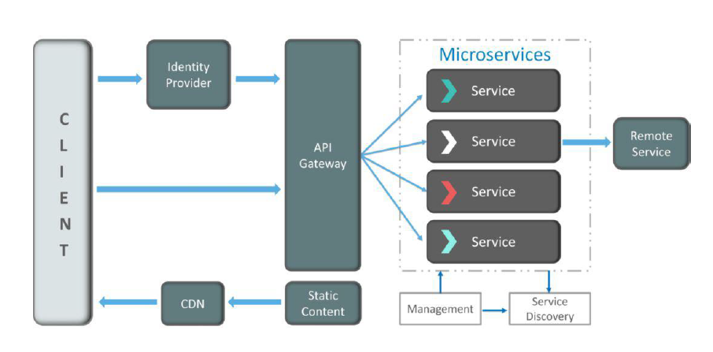
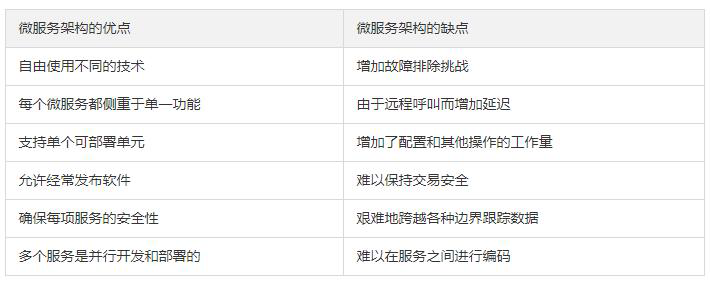
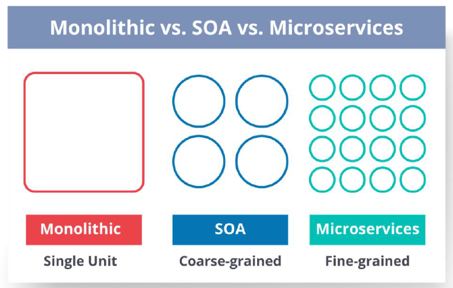

# 微服务

## 对微服务有何了解

微服务，又称微服务架构，是一种**架构风格**，它将应用程序构建为以业务领域为模型的**小型自治服务集合**。
微服务是一种用于构建应用的架构方案，它将一个复杂的应用拆分成多个独立自治的服务，服务与服务之间通过松耦合的形式交互。

## 优势

独立开发、独立部署、隔离、混合技术堆栈。

**独立开发** – 所有微服务都可以根据各自的功能轻松开发
**独立部署** – 基于其服务，可以在任何应用程序中单独部署它们
**故障隔离** – 即使应用程序的一项服务不起作用，系统仍可继续运行
**混合技术堆栈** – 可以使用不同的语言和技术来构建同一应用程序的不同服务

## 特点

+ **解耦** – 系统内的服务很大程度上是分离的。因此，整个应用程序可以轻松构建，更改和扩展
+ **组件化** – 微服务被视为可以轻松更换和升级的独立组件
+ **业务能力** – 微服务非常简单，专注于单一功能
+ **自治** – 开发人员和团队可以彼此独立工作，从而提高速度
+ **持续交付** – 通过软件创建，测试和批准的系统自动化，允许频繁发布软件
+ **责任** – 微服务不关注应用程序作为项目。相反，他们将应用程序视为他们负责的产品
+ **分散治理**– 重点是使用正确的工具来做正确的工作。这意味着没有标准化模式或任何技术模式。开发人员可以自由选择最有用的工具来解决他们的问题
+ **敏捷** – 微服务支持敏捷开发。任何新功能都可以快速开发并再次丢弃

## 典型架构

+ 服务注册与发现
+ 服务网关：身份认证、路由服务、限流防刷、日志统计
+ 服务通信：服务技术方案：RPC vs REST
+ 可靠性：服务优雅降级，容灾，断路器。

## 如何运作

 **客户端**– 来自不同设备的不同用户发送请求。
 **身份提供商**– 验证用户或客户身份并颁发安全令牌。
 **API 网关**– 处理客户端请求。
 静态内容– 容纳系统的所有内容。
 管理– 在节点上平衡服务并识别故障。
 **服务发现**– 查找微服务之间通信路径的指南。
 内容交付网络– 代理服务器及其数据中心的分布式网络。
 **远程服务**– 启用驻留在IT 设备网络上的远程访问信息。

## 优缺点

## 单片、SOA和微服务区别

**单片架构**类似于大容器，其中应用程序的所有软件组件组装在一起并紧密封装。

**一个面向服务的架构**是一种相互通信服务的集合。通信可以涉及简单的数据传递，也可以涉及两个或多个协调某些活动的服务。

**微服务架构**是一种架构风格，它将应用程序构建为以业务域为模型的小型自治服务集合。

# RPC

## RPC架构

Client，Server，Client Stub以及Server Stub

**流行的RPC框架：**

gRPC、Thrift、Dubbo

## RPC与RESTful

RPC主要是基于TCP/IP协议的，而HTTP服务主要是基于HTTP协议的，我们都知道HTTP协议是在传输层协议TCP之上的，所以效率来看的话，RPC当然是要更胜一筹啦！下面来具体说一说RPC服务和HTTP服务。

**RPC**

RPC主要是用在**大型企业里面**，因为大型企业里面系统繁多，业务线复杂，而且效率优势非常重要的一块，这个时候RPC的优势就比较明显了。

**RESTful**

的确，对于在接口不多、系统与系统交互较少的情况下，解决信息孤岛初期常使用的一种通信手段；优点就是简单、直接、开发方便。利用现成的http协议进行传输。我们记得之前本科实习在公司做后台开发的时候，主要就是进行接口的开发，还要写一大份接口文档，严格地标明输入输出是什么？说清楚每一个接口的请求方法，以及请求参数需要注意的事项等。

接口可能返回一个**JSON字符串或者是XML文档**。然后客户端再去处理这个返回的信息，从而可以比较快速地进行开发。

**比较：**

**RPC优势：**但是对于大型企业来说，内部子系统较多、接口非常多的情况下，RPC框架的好处就显示出来了，首先就是**长链接**，不必每次通信都要像http一样去3次握手什么的，**减少了网络开销**；其次就是RPC框架一般都有**注册中心**，有丰富的**监控管理**、发布、下线接口、动态扩展等，对调用方来说是无感知、统一化的操作。

# Protobuf

protocol buffers 是一种语言无关、平台无关、可扩展的序列化结构数据的方法，它可用于（数据）通信协议、数据存储等。
Protocol Buffers 是一种灵活，高效，自动化机制的结构数据序列化方法－可类比 XML，但是比 XML 更小（3 ~ 10倍）、更快（20 ~ 100倍）、更为简单。

简单来讲， ProtoBuf 是结构数据**序列化[1]** 方法，可简单**类比于 XML[2]**，其具有以下特点：

- **语言无关、平台无关**。即 ProtoBuf 支持 Java、C++、Python 等多种语言，支持多个平台
- **高效**。即比 XML 更小（3 ~ 10倍）、更快（20 ~ 100倍）、更为简单
- **扩展性、兼容性好**。你可以更新数据结构，而不影响和破坏原有的旧程序

## 与Json xml的比较

个人认为如果要将 ProtoBuf、XML、JSON 三者放到一起去比较，应该区分两个维度。一个是**数据结构化**，一个是**数据序列化**。
这里的数据结构化主要面向开发或业务层面，数据序列化面向通信或存储层面，当然数据序列化也需要“结构”和“格式”，所以这两者之间的区别主要在于**面向领域和场景不同**，一般要求和侧重点也会有所不同。<u>数据结构化侧重人类可读性甚至有时会强调语义表达能力，而数据序列化侧重效率和压缩。</u>

ProtoBuf 重点侧重于**数据序列化** 而非数据结构化。

1. XML、JSON、ProtoBuf 都具有**数据结构化**和**数据序列化**的能力

2. XML、JSON 更注重**数据结构化**，关注人类可读性和语义表达能力。ProtoBuf 更注重**数据序列化**，关注效率、空间、速度，人类可读性差，语义表达能力不足（为保证极致的效率，会舍弃一部分元信息）

3. ProtoBuf 的应用场景更为明确，XML、JSON 的应用场景更为丰富。

# Elastic Search

## 介绍

+ 反向索引又叫倒排索引，是根据文章内容中的关键字建立索引。
+ 搜索引擎原理就是建立反向索引。
+ Elasticsearch 在 Lucene 的基础上进行封装，实现了分布式搜索引擎。
+ Elasticsearch 中的索引、类型和文档的概念比较重要，类似于 MySQL 中的数据库、表和行。
+ Elasticsearch 也是 Master-slave 架构，也实现了**数据的分片和备份**。
+ Elasticsearch 一个典型应用就是 ELK 日志分析系统。

倒排索引，前→床前明月光；索引量爆炸，因此可以只记录标题，前→静夜思；

搜索：倒排索引 + 网页爬取 + 停顿词过滤。停顿词是没有建立索引的必要的。其实就是分词。因此网络搜索的步骤：爬取内容、分词、建立倒排索引。

## 应用场景

ES应用场景：**日志实时分析**、**搜索服务**

而Elasticsearch是专门做**搜索**的，就是为了解决上面所讲的问题而生的，换句话说：

+ Elasticsearch<u>对模糊搜索非常擅长</u>（搜索速度很快）
+ 从Elasticsearch搜索到的数据可以根据**评分**过滤掉大部分的，只要返回评分高的给用户就好了（原生就支持排序）
+ 没有那么准确的关键字也能搜出相关的结果（能匹配有相关性的记录） 

使用哪种产品作为数据仓库完全取决于具体的应用场景，如果**信息获取及分析的能力**是你的首要需求，那么无疑ES是一个好的选择。

# 难点

1. 学习内容多
2. 接入公司规范，不仅要完成代码，更要完成的漂亮。接入流水线规范，比如圈复杂度、单元测试覆盖率等，在写单元测试时，就遇到了打桩、gomonkey内联优化等问题。

