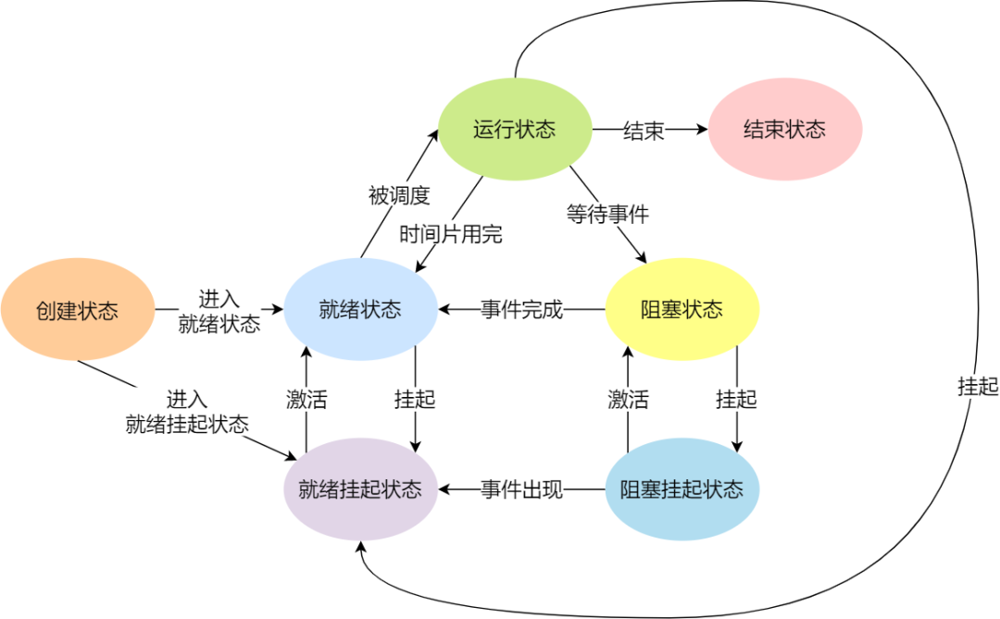

## 基本特征

并发：区分并发与并行
共享：互斥共享，同时共享。互斥共享的资源成为临界资源。
虚拟：一个物理实体转为多个逻辑实体。
异步：进程走走停停，以不可知的速度前进。

## 基本功能

进程管理、内存管理、文件管理、设备管理

## 中断

外中断：CPU指令以外的事件引起，如I/O中断
异常
陷入：用户程序中使用系统调用。

## 编译

对于C++源文件，从文本到可执行文件一般需要四个过程：
**预处理阶段：**对源代码文件中文件包含关系（头文件）、预编译语句（宏定义）进行分析和替换，生成预编译文件。是以.i作为文件扩展名。主要处理源文件中以“#”开头的预编译指令。保留所有的#progma编译器指令，因为编译器需要使用它们。
**编译阶段：**将经过预处理后的预编译文件转换成特定汇编代码，生成汇编文件。会进行一系列的词法分析、语法分析、语义分析等，很复杂。
**汇编阶段：**将编译阶段生成的汇编文件转化成机器码，生成**可重定位目标文件**，hello.o，是一个二进制文件。
**链接阶段：**将多个目标文件及所需要的库连接成最终的<u>可执行目标文件</u>.

## Linux内核与Windows内核

### Linux内核

#### Multitask，多任务

Linux 是一个多任务的操作系统。多任务意味着可以有多个任务同时执行，这里的「同时」可以是并发或并行。

#### SMP，对称多处理

SMP 的意思是**对称多处理**，代表着每个 CPU 的地位是相等的，对资源的使用权限也是相同的，多个 CPU 共享同一个内存，每个 CPU 都可以访问完整的内存和硬件资源。这个特点决定了 Linux 操作系统不会有某个 CPU 单独服务应用程序或内核程序，而是每个程序都可以被分配到任意一个 CPU 上被执行。

#### ELF，可执行文件链接格式

ELF 的意思是**可执行文件链接格式**，它是 Linux 操作系统中可执行文件的存储格式，你可以从下图看到它的结构：


ELF 把文件分成了一个个分段，每一个段都有自己的作用。另外，ELF 文件有两种索引，Program header table 中记录了「运行时」所需的段，而 Section header table 记录了二进制文件中各个「段的首地址」。

> ELF文件怎么生成的呢？

我们编写的代码，首先通过「编译器」编译成汇编代码，接着通过「汇编器」变成目标代码，也就是目标文件，最后通过「链接器」把多个目标文件以及调用的各种函数库链接起来，形成一个可执行文件，也就是 ELF 文件。

> ELF文件怎么执行？

执行 ELF 文件的时候，会通过「装载器」把 ELF 文件装载到内存里，CPU 读取内存中的指令和数据，于是程序就被执行起来了。

#### Monolithic Kernel，宏内核

Monolithic Kernel 的意思是**宏内核**，**Linux 内核架构就是宏内核**，意味着 Linux 的内核是一个完整的可执行程序，且拥有最高的权限。
宏内核的特征是系统内核的所有模块，比如进程调度、内存管理、文件系统、设备驱动等，都运行在**内核态。**
不过，Linux 也实现了动态加载内核模块的功能，例如大部分设备驱动是以可加载模块的形式存在的，与内核其他模块解藕，让驱动开发和驱动加载更为方便、灵活。

与宏内核相反的是**微内核**，微内核架构的内核只保留最基本的能力，比如进程调度、虚拟机内存、中断等，把一些应用放到了用户空间，比如驱动程序、文件系统等。这样服务与服务之间是隔离的，单个服务出现故障或者完全攻击，也不会导致整个操作系统挂掉，提高了操作系统的稳定性和可靠性。 
微内核内核功能少，可移植性高，相比宏内核有一点不好的地方在于，由于驱动程序不在内核中，而且驱动程序一般会频繁调用底层能力的，于是**驱动和硬件设备交互就需要频繁切换到内核态，这样会带来性能损耗。华为的鸿蒙操作系统的内核架构就是微内核。**

还有一种内核叫**混合类型内核**，它的架构有点像微内核，内核里面会有一个最小版本的内核，然后其他模块会在这个基础上搭建，然后实现的时候会跟宏内核类似，也就是把整个内核做成一个完整的程序，大部分服务都在内核中，这就像是宏内核的方式包裹着一个微内核。

### Windows内核

Windows 和 Linux 一样，同样支持 **MultiTask** 和 **SMP**。Windows内核设计是**混合型内核。**

Windows 的可执行文件格式叫 PE，称为**可移植执行文件**，扩展名通常是`.exe`、`.dll`、`.sys`等。

### 总结：
对于内核的架构一般有这三种类型：

- 宏内核，包含多个模块，整个内核像一个完整的程序；
- 微内核，有一个最小版本的内核，一些模块和服务则由用户态管理；
- 混合内核，是宏内核和微内核的结合体，内核中抽象出了微内核的概念，也就是内核中会有一个小型的内核，其他模块就在这个基础上搭建，整个内核是个完整的程序；

<u>Linux 的内核设计是采用了宏内核，Windows 的内核设计则是采用了混合内核。</u>

这两个操作系统的可执行文件格式也不一样， Linux 可执行文件格式叫作 ELF，Windows 可执行文件格式叫作 PE。

# 内核态与用户态

那内核态到底是什么呢？其实从本质上说就是我们所说的内核，它是一种**特殊的软件程序**，特殊在哪儿呢？**控制计算机的硬件资源，例如协调CPU资源，分配内存资源，并且提供稳定的环境供应用程序运行**。

用户态就是提供应用程序运行的空间，为了使应用程序访问到内核管理的资源例如CPU，内存，I/O。内核必须提供一组通用的访问接口，这些接口就叫**系统调用。**

往往我们的系统的资源是固定的，例如内存2G，CPU固定，磁盘2TB，网络接口固定。所以就<u>需要操作系统对资源进行有效的利用</u>。假设某个应用程序过分的访问这些资源，就会导致整个系统的资源被占用，如果不对这种行为进行限制和区分，就会导致资源访问的冲突。所以，Linux的设计的初衷：**给不同的操作给与不同的“权限”**。Linux操作系统就将权限等级分为了2个等级，分别就是内核态和用户态。各位有没有发现，前面讲了这么多内核态和用户态什么不同，其实用一句话就能概括：**它们权限不同**。一个进程可以运行在用户态也可以运行在内核态，那它们之间肯定存在用户态和内核态切换的过程。打一个比方：**C库接口malloc申请动态内存，malloc的实现内部最终还是会调用brk（）或者mmap（）系统调用来分配内存。**

Due to the complexity of developing and maintaining the kernel, only the most essential and performance-critical code are placed in the kernel. Other things, such as GUI, management and control code, typically are programmed as user-space applications. This practice of splitting the implementation of certain features between kernel and user space is quite common in Linux.

## 切换

**那为问题又来了，从用户态到内核态到底怎么进入？只能通过系统调用吗？还有其他方式吗？**

从用户态到内核态切换可以通过三种方式：

1. **系统调用**，这个上面已经讲解过了，其实系统调用本身就是中断，但是软件中断，跟硬中断不同。
2. **异常**：如果当前进程运行在用户态，如果这个时候发生了异常事件，就会触发切换。例如：**缺页异常**。
3. **外设中断**：当外设完成用户的请求时，会向CPU发送中断信号。

# 1. 进程管理

## 进程

### 状态

进程的状态：就绪态、运行态、阻塞态、创建态、终止态、挂起态。


另外，还有一个状态叫**挂起状态**，它表示<u>进程没有占有物理内存空间。</u>这跟阻塞状态是不一样，阻塞状态是等待某个事件的返回。
由于虚拟内存管理原因，进程的所使用的空间可能并没有映射到物理内存，而是在硬盘上，这时进程就会出现挂起状态，另外调用 sleep 也会被挂起。


挂起状态可以分为两种：

- 阻塞挂起状态：进程在外存（硬盘）并等待某个事件的出现；
- 就绪挂起状态：进程在外存（硬盘），但只要进入内存，即刻立刻运行；

这两种挂起状态加上前面的五种状态，就变成了七种状态变迁（留给我的颜色不多了），见如下图：



### 进程的控制结构

进程的实体：程序、数据集合、进程控制块（PCB）
进程控制块又分为：进程描述信息、进程控制信息、资源管理信息、处理机现场保护信息。
进程队列：进程的组织：链接、索引表。

**PCB 是进程存在的唯一标识**，这意味着一个进程的存在，必然会有一个 PCB，如果进程消失了，那么 PCB 也会随之消失。

> PCB 具体包含什么信息呢？

<font color=#1685a9>进程描述信息：</font>

- 进程标识符：标识各个进程，每个进程都有一个并且唯一的标识符；
- 用户标识符：进程归属的用户，用户标识符主要为共享和保护服务；

<font color=#1685a9>进程控制和管理信息：</font>

- 进程当前状态，如 new、ready、running、waiting 或 blocked 等；
- 进程优先级：进程抢占 CPU 时的优先级；

<font color=#1685a9>资源分配清单：</font>

- 有关内存地址空间或虚拟地址空间的信息，所打开文件的列表和所使用的 I/O 设备信息。

<font color=#1685a9>CPU 相关信息：</font>

- CPU 中各个寄存器的值，当进程被切换时，CPU 的状态信息都会被保存在相应的 PCB 中，以便进程重新执行时，能从断点处继续执行。

> PCB如何组织的？

通常是通过**链表**的方式进行组织，把具有**相同状态的进程链在一起，组成各种队列**。比如：

- 将所有处于就绪状态的进程链在一起，称为**就绪队列**；
- 把所有因等待某事件而处于等待状态的进程链在一起就组成各种**阻塞队列**；
- 另外，对于运行队列在单核 CPU 系统中则只有一个运行指针了，因为单核 CPU 在某个时间，只能运行一个程序。

那么，就绪队列和阻塞队列链表的组织形式如下图：


除了链接的组织方式，还有**索引方式**，它的工作原理：将同一状态的进程组织在一个索引表中，索引表项指向相应的 PCB，不同状态对应不同的索引表。
**一般会选择链表，因为可能面临进程创建，销毁等调度导致进程状态发生变化，所以链表能够更加灵活的插入和删除。**

### 进程的控制

进程控制：
	进程控制原语
	进程的创建：UNIX - fork()，程序仅能通过fork()系统调用返回值的不同来判断父子进程。
	进程的撤销、阻塞、唤醒
**Unix下的进程控制**：在父进程中返回子进程的PID，在子进程中返回0。子进程getpid()得到自己的pid，getppid()得到父进程的pid。子进程继承父进程打开的所有文件及资源，对父进程的当前目录和所有已打开系统文件表项中的引用记数加1。

**创建进程的方式：**
	系统初始化，正在运行的程序执行了创建进程的系统调用（如fork()），用户请求创建一个新进程，初始化一个批处理工作。
	操作系统允许一个进程创建另一个进程，而且允许子进程继承父进程所拥有的资源，当子进程被终止时，其在父进程处继承的资源应当还给父进程。同时，终止父进程时同时也会终止其所有的子进程。

​	<font color=#1685a9>创建进程的过程如下：</font>

- 为新进程分配一个唯一的进程标识号，并申请一个空白的 PCB，PCB 是有限的，若申请失败则创建失败；
- 为进程分配资源，此处如果资源不足，进程就会进入等待状态，以等待资源；
- 初始化 PCB；
- 如果进程的调度队列能够接纳新进程，那就将进程插入到就绪队列，等待被调度运行；

**进程终止：**
	正常退出（自愿的）、错误退出（自愿的）、严重错误（非自愿的）、被其他进程杀死（非自愿的）

​    <font color=#1685a9>终止进程的过程如下：</font>

- 查找需要终止的进程的 PCB；
- 如果处于执行状态，则立即终止该进程的执行，然后将 CPU 资源分配给其他进程；
- 如果其还有子进程，则应将其所有子进程终止；
- 将该进程所拥有的全部资源都归还给父进程或操作系统；
- 将其从 PCB 所在队列中删除；

**阻塞进程：**
    当进程需要等待某一事件完成时，它可以调用阻塞语句把自己阻塞等待。而一旦被阻塞等待，它只能由另一个进程唤醒。

<font color=#1685a9>阻塞进程的过程如下：</font>

- 找到将要被阻塞进程标识号对应的 PCB；
- 如果该进程为运行状态，则保护其现场，将其状态转为阻塞状态，停止运行；
- 将该 PCB 插入的阻塞队列中去；

**唤醒进程：**

进程由「运行」转变为「阻塞」状态是由于进程必须等待某一事件的完成，所以处于阻塞状态的进程是绝对不可能叫醒自己的。

如果某进程正在等待 I/O 事件，需由别的进程发消息给它，则只有当该进程所期待的事件出现时，才由发现者进程用唤醒语句叫醒它。

<font color=#1685a9>唤醒进程的过程如下：</font>

- 在该事件的阻塞队列中找到相应进程的 PCB；
- 将其从阻塞队列中移出，并置其状态为就绪状态；
- 把该 PCB 插入到就绪队列中，等待调度程序调度；

进程的阻塞和唤醒是一对功能相反的语句，如果某个进程调用了阻塞语句，则必有一个与之对应的唤醒语句。

**进程层次：**
	在UNIX中， 进程和它的所有子进程以及子进程的子进程共同组成一个进程组。UNIX初始化时，init进程，读取一个文件，文件告诉它有多少个终端，然后为每个终端创建一个新进程，等待用户登录。如果登陆成功，该登录进程就创建一个shell等待输入命令，然后创建更多的进程。**CASPP中linux那一节**
	相反，windows中没有进程层次的概念，所有进程都是平等的。句柄。

#### fork()与vfork()

fork和vfork的区别:

1. fork( )的子进程拷贝父进程的**数据段和代码段**; vfork( )的子进程与父进程**共享数据段**
2. fork( )的父子进程的执行次序不确定; vfork( )**保证子进程先运行**，在调用exec或exit之前与父进程数据是共享的，在它调用exec或exit之后父进程才可能被调度运行。
3. vfork( )保证子进程先运行，在它调用exec或exit之后父进程才可能被调度运行。如果在调用这两个函数之前子进程依赖于父进程的进一步动作， 则会导致死锁。
4. 当需要改变共享数据段中变量的值，则拷贝父进程。(写时复制)

### 守护进程：

守护进程（daemon）是生存期长的一种进程，没有控制终端。它们常常在系统引导装入时启动，仅在系统关闭时才终止。UNIX系统有很多守护进程，守护进程程序的名称通常以字母“d”结尾：例如，[syslogd](https://link.zhihu.com/?target=https%3A//zh.wikipedia.org/wiki/Syslog) 就是指管理系统日志的守护进程。

**特点：**1）后台服务程序；2）独立于终端控制；3）周期性执行任务；4）不受用户登录注销的影响；5）通常以d结尾的名字。

---

基于进程的操作系统中最底层的是中断和调度处理，在该层次之上是顺序进程。操作系统的最底层的就是调度程序，在它上面有许多进程。操作系统为了执行进程间的切换，会维护着一张表格，这张表就是进程表。每个进程占用一个进程表项。

### 僵尸进程，孤儿进程

**孤儿进程:**

一个父进程退出，而它的一个或多个子进程还在运行，那么那些子进程将成为孤儿进程。孤儿进程将被init进程(进程号为1)所收养，并由init进程对它们完成状态收集工作。孤儿进程是没有父进程的进程，管理孤儿进程这个重任就落到了init 进程身上，因此孤儿进程并不会有什么危害。

**僵尸进程:**

一个进程使用fork创建子进程，如果子进程退出，而父进程并没有调用wait或waitpid获取子进程的状态信息，那么子进程的进程描述符仍然保存在系统中。这种进程称之为僵死进程。

unix提供了一种机制可以保证只要父进程想知道子进程结束时的状态信息，就可以得到。这种机制就是:在每个进程退出的时候,内核释放该进程所有的资源包括打开的文件,占用的内存等。但是**仍然为其保留一定的信息**(包括进程号the process ID,退出状态the termination status of the process,运行时间the amount of CPU time taken by the process等)。直到父进程通过wait / waitpid来取时才释放。但这样就导致了问题，如果进程不调用wait / waitpid的话，那么保留的那段信息就不会释放， 其进程号就会一直被占用，但是系统所能使用的进程号是有限的，<u>如果大量的产生僵死进程，将因为没有可用的进程号而导致系统不能产生新的进程.此即为僵尸进程的危害</u>，应当避免。**任何一个子进程（init除外）在exit()之后，并非马上就消失掉，而是留下一个僵尸进程的数据结构，等待父进程处理。**

其实，僵尸进程是有危害的。进程的退出状态必须被维持下去，因为它要告诉关心它的进程（父进程），你交给我的任务，我办的怎么样了。可父进程如果一直不读取，那子进程就一直处于Z状态。维护退出状态本身就是要用数据维护，也属于进程基本信息，所以保存在task_struct(PCB)中，换句话说，当一个进程一直处于Z状态，那么它的PCB也就一直都要被维护。因为PCB本身就是一个结构体会占用空间，僵尸进程也就会造成资源浪费，所以我们应该避免僵尸进程的产生

## 线程

进程是资源的基本单位，线程是调度的基本单位。进程用于把资源集中在一起，而线程是CPU上调度执行的实体。

线程的引入：进程数量太多的话，频繁的创建、撤销与切换带来了不小的系统开销。
引入<u>进程</u>的目的是为了使多个程序**并发执行**，以**改善资源利用率、提高系统吞吐量**。引入<u>线程</u>则是为了**减少**实现程序并发执行所需的**系统开销**，**提高并发**执行实现的系统**效率**。

**同一进程中的多个线程共享代码段(代码和常量)，数据段(全局变量和静态变量)，扩展段(堆存储)**。但是每个线程拥有自己的栈段，栈段又叫运行时段，用来存放所有局部变量和临时变量。同一个进程内多个线程之间可以共享**代码段、数据段、打开的文件等资源**，但每个线程都有独立一套的**寄存器**和**栈**，这样可以确保线程的控制流是相对独立的。线程自己基本不拥有系统资源，只拥有少量必不可少的资源：**程序计数器、一组寄存器、栈**。线程可与同属一个进程的其它线程共享进程所拥有的全部资源。


**在同一个进程中的各个线程，都可以共享该进程所拥有的资源，它们具有相同的地址空间(进程的地址空间)，可以访问该空间中的每一个虚地址，还可以访问进程所拥有的已打开文件、定时器、信号量等。**

### 线程通信与同步

线程间通信主要通过**进程内公共存储空间(全局变量)**的形式，<u>直接读写进程的数据段即可完成通信。</u>

线程间的同步：采用与进程间同步一样的方式，比如信号量、互斥锁(短期/预期互斥锁定，目的是保护)、条件变量(不确定时间长度的等待、目的是触发与通知)等。

### 线程切换

同一个进程内的线程切换比进程切换快，<u>因为线程具有相同的地址空间（虚拟内存共享），这意味着同一个进程的线程都具有同一个页表，那么在切换的时候不需要切换页表。</u>而对于进程之间的切换，切换的时候要把页表给切换掉，而页表的切换过程开销是比较大的；由于同一进程的各线程间共享内存和文件资源，那么在线程之间数据传递的时候，就不需要经过内核了，这就使得线程之间的数据交互效率更高了。

> 线程上下文切换的是什么？

这还得看线程是不是属于同一个进程：

- 当两个线程不是属于同一个进程，则切换的过程就跟进程上下文切换一样；
- **当两个线程是属于同一个进程，因为虚拟内存是共享的，所以在切换时，虚拟内存这些资源就保持不动，只需要切换线程的私有数据、寄存器等不共享的数据**；

所以，线程的上下文切换相比进程，开销要小很多。

### 线程池

我们可以看到多线程提高了CPU的使用率和程序的工作效率，但是如果有大量的线程，就会影响性能，因为要大量的创建与销毁，因为CPU需要在它们之间切换。线程池可以想象成一个池子，它的作用就是**让每一个线程结束后， 并不会销毁，而是放回到线程池中成为空闲状态，等待下一个对象来使用。**

> 如何实现线程池?

1. 设置一个生产者消费者队列，作为临界资源
2. 初始化n个线程，并让其运行起来,加锁去队列取任务运行
3. 当任务队列为空的时候，所有线程阻塞
4. 当生产者队列来了一个任务后，先对队列加锁，把任务挂在到队列上，然后使用条件变量去通知阻塞中的一个线程。

### 线程实现

在用户空间中实现线程：线程在运行时系统之上运行，运行时系统是管理线程过程的集合。每个进程需要有其专用的线程表，用来跟踪该进程中的线程。优势：(1)保存线程的状态和调度程序都是本地的，启动它们比内核调用效率要高，线程调度便捷，效率高。（2）每个进程允许有自己的调度算法。劣势：(1)如何实现阻塞系统调用。（2）缺页中断。当进程中某线程执行一个系统调用而被阻塞时，会导致本进程的其它线程也阻塞。
在内核空间中实现线程：采用可循环利用的方式回收线程，先标记为不可用，但内部结构不受影响。
在用户和内核空间中混合实现线程。

---

主要有三种线程的实现方式：

- **用户线程（\*User Thread\*）**：在用户空间实现的线程，不是由内核管理的线程，是由用户态的线程库来完成线程的管理；
- **内核线程（\*Kernel Thread\*）**：在内核中实现的线程，是由内核管理的线程；
- **轻量级进程（\*LightWeight Process\*）**：在内核中来支持用户线程；

#### 用户线程

用户线程是基于用户态的线程管理库来实现的，那么**线程控制块（\*Thread Control Block, TCB\*）** 也是在库里面来实现的，对于操作系统而言是看不到这个 TCB 的，它只能看到整个进程的 PCB。

所以，**用户线程的整个线程管理和调度，操作系统是不直接参与的，而是由用户级线程库函数来完成线程的管理，包括线程的创建、终止、同步和调度等。**

用户级线程的模型，也就类似前面提到的**多对一**的关系，即多个用户线程对应同一个内核线程，如下图所示：


用户线程的**优点**：

- 每个进程都需要有它私有的线程控制块（TCB）列表，用来跟踪记录它各个线程状态信息（PC、栈指针、寄存器），TCB 由用户级线程库函数来维护，可用于不支持线程技术的操作系统；
- 用户线程的切换也是由线程库函数来完成的，**无需用户态与内核态的切换**，所以速度特别快；

用户线程的**缺点**：

- 由于操作系统不参与线程的调度，如果一个线程发起了系统调用而<u>阻塞，那进程所包含的用户线程都不能执行了</u>。
- 当一个线程开始运行后，除非它主动地交出 CPU 的使用权，否则它所在的进程当中的其他线程无法运行，因为用户态的线程没法打断当前运行中的线程，它没有这个特权，只有操作系统才有，但是用户线程不是由操作系统管理的。【无法打断】
- 由于时间片分配给进程，故与其他进程比，在多线程执行时，每个线程得到的时间片较少，执行会比较慢。

#### 内核级线程

**内核线程是由操作系统管理的，线程对应的 TCB 自然是放在操作系统里的，这样线程的创建、终止和管理都是由操作系统负责。**

内核线程的模型，也就类似前面提到的**一对一**的关系，即一个用户线程对应一个内核线程，如下图所示：


内核线程的**优点**：

- 在一个进程当中，如果某个内核线程发起系统调用而被阻塞，并不会影响其他内核线程的运行；
- 分配给线程，多线程的进程获得更多的 CPU 运行时间；

内核线程的**缺点**：

- 在支持内核线程的操作系统中，由内核来维护进程和线程的上下问信息，如 PCB 和 TCB；
- 线程的创建、终止和切换都是通过系统调用的方式来进行，因此对于系统来说，系统开销比较大；

#### 轻量级线程

**轻量级进程（\*Light-weight process，LWP\*）是内核支持的用户线程，一个进程可有一个或多个 LWP，每个 LWP 是跟内核线程一对一映射的，也就是 LWP 都是由一个内核线程支持。**

另外，LWP 只能由内核管理并像普通进程一样被调度，Linux 内核是支持 LWP 的典型例子。

在大多数系统中，**LWP与普通进程的区别也在于它只有一个最小的执行上下文和调度程序所需的统计信息**。一般来说，一个进程代表程序的一个实例，而 LWP 代表程序的执行线程，因为一个执行线程不像进程那样需要那么多状态信息，所以 LWP 也不带有这样的信息。

在 LWP 之上也是可以使用用户线程的，那么 LWP 与用户线程的对应关系就有三种：

- `1 : 1`，即一个 LWP 对应 一个用户线程；
- `N : 1`，即一个 LWP 对应多个用户线程；
- `N : N`，即多个 LMP 对应多个用户线程；

### C++多线程

#### atomic

原子操作指“不可分割的操作”，也就是说这种操作状态要么是完成的，要么是没完成的,不存在"操作完成了一半”这种状况。互斥量的加锁一般是针对一个代码段,而原子操作针对的一般都是一个变量(操作变量时加锁防止他人 干扰)。std::atomic<> 是一个**模板类**， 使用该模板类实例化的对象，提供了一些保证原子性的成员函数来实现共享数据的常用操作。可以这样理解:在以前，定义了一个共享的变量(int i=0)，多个线程会用到这个变量,那么每次操作这个变量时，都需要lock加锁，操作完毕unlock解锁， 以保证线程之间不会冲突;但是这样每次加锁解锁、加锁解锁就显得很麻烦，那怎么办呢?现在，实例化了一个类对象(std::atomic<int> |=0)来代替以前的那个变量(这里的对象I你就把它看作一个变量,看作对象反而难以理解了)， 每次操作这个对象时，就不用lock与unlock,这个对象自身就具有原子性(相当于加锁解锁操作不用你写代码实现，能自动加锁解锁了)，以保证线程之间不会冲突。提到std::atomic<>,你脑海里就想到一-点就可以了: std::atomic<> 用来**定义一个自动加锁解锁的共享变量(“定义”"变量” 用词在这里是不准确的，但是更加贴切它的实际功能)，供多个线程访问而不发生冲突。**

## 进程线程的区别

1进程和线程区别:
a)**地位：**进程是资源分配的最小单位，线程是任务执行的最小单位。
b)**开销：**进程有自己的独立地址空间，每启动一一个进程，系统就会为它分配地址空间，建立数据表来维护代码段、堆栈段和数据段,这种操作非常昂贵。而线程是共享进程中的数据的，使用相同的地址空间，因此CPU切换一个线程的花费远比进程要小很多，同时创建一个线程的开销也比进程要小很多。
c) **通信：**线程之间的通信更方便，同一进程下的线程共享全局变量、静态变量等数据，而进程之间的通信需要以通信的方式(IPC)进行。不过如何处理好同步与互斥是编写多线程程序的难点。
d)**所处环境:**在操作系统中能同时运行多个进程(程序) ;而在同一个进程(程序)中有多个线程同时执行(通过CPU调度,在每个时间片中只有一个线程执行)
e)但是多进程程序更健壮,多线程程序只要有一个线程死掉，整个进程也死掉了,而一个进程死掉并不会对另外一个进程造成影响，因为进程有自己独立的地址空间。

## 进程同步与互斥准则

进程同步：
**空闲则入、忙则等待、有限等待、让权等待。**
同步机制是指用于保证多个进程间在执行次序上的协调关系的相应机制，哪个先运行，哪个后运行。

## 锁

### 自旋锁与互斥锁

特点：
	用于临界区互斥
	在任何时刻最多只有一个执行单元获得锁
	占用时间尽可能短
	等待锁的进程处于忙循环

加锁的目的就是保证共享资源在任意时间里，只有一个线程访问，这样就可以避免多线程导致共享数据错乱的问题。
当已经有一个线程加锁后，其他线程加锁则就会失败，互斥锁和自旋锁对于加锁失败后的处理方式是不一样的：

- **互斥锁**加锁失败后，线程会**释放 CPU** ，给其他线程；
- **自旋锁**加锁失败后，线程会**忙等待**，直到它拿到锁；

互斥锁是一种「独占锁」，比如当线程 A 加锁成功后，此时互斥锁已经被线程 A 独占了，只要线程 A 没有释放手中的锁，线程 B 加锁就会失败，于是就会释放 CPU 让给其他线程，**既然线程 B 释放掉了 CPU，自然线程 B 加锁的代码就会被阻塞**。
**对于互斥锁加锁失败而阻塞的现象，是由操作系统内核实现的**。当加锁失败时，内核会将线程置为「睡眠」状态，等到锁被释放后，内核会在合适的时机唤醒线程，当这个线程成功获取到锁后，于是就可以继续执行。如下图：


所以，<u>互斥锁加锁失败时，==会从用户态陷入到内核态==</u>，**让内核帮我们切换线程**，虽然简化了使用锁的难度，但是存在一定的性能开销成本。那这个开销成本是什么呢？会有**两次线程上下文切换的成本**：

- 当线程加锁失败时，内核会把线程的状态从「运行」状态设置为「睡眠」状态，然后把 CPU 切换给其他线程运行；
- 接着，当锁被释放时，之前「睡眠」状态的线程会变为「就绪」状态，然后内核会在合适的时间，把 CPU 切换给该线程运行。

上下切换的耗时有大佬统计过，大概在几十纳秒到几微秒之间，如果你锁住的代码执行时间比较短，那可能上下文切换的时间都比你锁住的代码执行时间还要长。（此时应该用自旋锁而不是互斥锁）

自旋锁是通过 CPU 提供的 `CAS` 函数（*Compare And Swap*），**在「用户态」完成加锁和解锁操作，不会主动产生线程上下文切换**，所以相比互斥锁来说，会快一些，开销也小一些。一般加锁的过程，包含两个步骤：

- 第一步，查看锁的状态，如果锁是空闲的，则执行第二步；
- 第二步，将锁设置为当前线程持有；

CAS 函数就把这两个步骤合并成一条硬件级指令，形成**原子指令**，这样就保证了这两个步骤是不可分割的，要么一次性执行完两个步骤，要么两个步骤都不执行。
使用自旋锁的时候，当发生多线程竞争锁的情况，加锁失败的线程会「忙等待」，直到它拿到锁。这里的「忙等待」可以用 `while` 循环等待实现，不过最好是使用 CPU 提供的 `PAUSE` 指令来实现「忙等待」，因为可以减少循环等待时的耗电量。

自旋锁是最比较简单的一种锁，一直自旋，利用 CPU 周期，直到锁可用。**需要注意，在单核 CPU 上，需要抢占式的调度器（即不断通过时钟中断一个线程，运行其他线程）。否则，自旋锁在单 CPU 上无法使用，因为一个自旋的线程永远不会放弃 CPU。**

自旋锁开销少，在多核系统下一般不会主动产生线程切换，适合异步、协程等在用户态切换请求的编程方式，但如果被锁住的代码执行时间过长，自旋的线程会长时间占用 CPU 资源，所以自旋的时间和被锁住的代码执行的时间是成「正比」的关系，我们需要清楚的知道这一点。

自旋锁与互斥锁使用层面比较相似，但实现层面上完全不同：**当加锁失败时，互斥锁用「线程切换」来应对，自旋锁则用「忙等待」来应对**。<u>它俩是锁的最基本处理方式，更高级的锁都会选择其中一个来实现，比如读写锁既可以选择互斥锁实现，也可以基于自旋锁实现。</u>

### 读写锁

所以，**读写锁适用于能明确区分读操作和写操作的场景**。读写锁的工作原理是：

- 当「写锁」没有被线程持有时，多个线程能够并发地持有读锁，这大大提高了共享资源的访问效率，因为「读锁」是用于读取共享资源的场景，所以多个线程同时持有读锁也不会破坏共享资源的数据。
- 但是，一旦「写锁」被线程持有后，读线程的获取读锁的操作会被阻塞，而且其他写线程的获取写锁的操作也会被阻塞。

所以说，写锁是独占锁，因为任何时刻只能有一个线程持有写锁，类似互斥锁和自旋锁，而读锁是共享锁，因为读锁可以被多个线程同时持有。知道了读写锁的工作原理后，我们可以发现，**读写锁在读多写少的场景，能发挥出优势**。

### 乐观锁，悲观锁

**悲观锁：**
前面提到的互斥锁、自旋锁、读写锁，都是属于悲观锁。悲观锁做事比较悲观，它认为**多线程同时修改共享资源的概率比较高，于是很容易出现冲突，所以访问共享资源前，先要上锁**。

**乐观锁：**
那相反的，如果多线程同时修改共享资源的概率比较低，就可以采用乐观锁。乐观锁做事比较乐观，它假定冲突的概率很低，它的工作方式是：**先修改完共享资源，再验证这段时间内有没有发生冲突，如果没有其他线程在修改资源，那么操作完成，如果发现有其他线程已经修改过这个资源，就放弃本次操作**。可见，乐观锁的心态是，不管三七二十一，先改了资源再说。另外，你会发现**乐观锁全程并没有加锁，所以它也叫无锁编程**。
这里举一个场景例子：在线文档。我们都知道在线文档可以同时多人编辑的，如果使用了悲观锁，那么只要有一个用户正在编辑文档，此时其他用户就无法打开相同的文档了，这用户体验当然不好了。<u>那实现多人同时编辑，实际上是用了乐观锁</u>，它允许多个用户打开同一个文档进行编辑，编辑完提交之后才验证修改的内容是否有冲突。
实际上，我们常见的 SVN 和 **Git** 也是用了乐观锁的思想，先让用户编辑代码，然后提交的时候，通过版本号来判断是否产生了冲突，发生了冲突的地方，需要我们自己修改后，再重新提交。乐观锁虽然去除了加锁解锁的操作，但是一旦发生冲突，重试的成本非常高，所以**只有在冲突概率非常低，且加锁成本非常高的场景时，才考虑使用乐观锁。**

## 协程

https://www.liaoxuefeng.com/wiki/897692888725344/923057403198272

看起来A、B的执行有点像多线程，但协程的特点在于是一个线程执行，那和多线程比，协程有何优势？
最大的优势就是协程极高的执行效率。<u>因为子程序切换不是线程切换，而是由程序自身控制</u>，因此，**没有线程切换的开销**，和多线程比，线程数量越多，协程的性能优势就越明显。
第二大优势就是不需要多线程的锁机制，因为只有一个线程，也不存在同时写变量冲突，在协程中控制共享资源不加锁，只需要判断状态就好了，所以执行效率比多线程高很多。

最重要的是，协程不是被操作系统内核所管理，而完全是由程序所控制（也就是在用户态执行）。这样带来的好处就是性能得到了很大的提升，不会像线程切换那样消耗资源。

---

**协程的注意事项**

实际上协程并不是什么银弹，协程只有在等待IO的过程中才能重复利用线程，上面我们已经讲过了，线程在等待IO的过程中会陷入阻塞状态，意识到问题没有？

假设协程运行在线程之上，并且协程调用了一个阻塞IO操作，这时候会发生什么？实际上操作系统并不知道协程的存在，它只知道线程，**因此在协程调用阻塞IO操作的时候，操作系统会让线程进入阻塞状态，当前的协程和其它绑定在该线程之上的协程都会陷入阻塞而得不到调度，这往往是不能接受的。**

因此在协程中不能调用导致线程阻塞的操作。也就是说，协程只有和异步IO结合起来，才能发挥最大的威力。

那么如何处理在协程中调用阻塞IO的操作呢？一般有2种处理方式：

1. **在调用阻塞IO操作的时候，重新启动一个线程去执行这个操作，等执行完成后，协程再去读取结果。这其实和多线程没有太大区别。**
2. **对系统的IO进行封装，改成异步调用的方式，这需要大量的工作，最好寄希望于编程语言原生支持。**

协程对计算密集型的任务也没有太大的好处，计算密集型的任务本身不需要大量的线程切换，因此协程的作用也十分有限，反而还增加了协程切换的开销。

## 管程

我理解的，是封装的思想。
管程是程序、变量和数据结构等组成的一个集合，组成了一个特殊的模块或包，进程可以在需要的时候调用管程中的程序，但它们不能从管程的外部访问数据结构和程序。
在任何时候，管程中只能有一个活跃的进程。管程是编程语言的特性。
编写管程的程序员无需关心编译器是怎么实现互斥的，他只需要将所有的临界区转换为管程过程即可。
管程实现了简单的互斥，引入了**条件变量**以及wait和signal两个操作来管理阻塞。

## 消息传递

在分布式系统，多个CPU中，它们通过网络相连，之前的操作原语将失效：信号量太低级，管程只适用于少数几个语言，所以引入了消息传递。（像TCP那样）
这种进程间通信使用两个原语send和receive，像信号量而不像管程，是系统调用而不是语言级别。
直接通信、间接通信（信箱）。

消息队列是保存在**内核**中的消息链表，**会涉及到用户态跟内核态到来回切换**，双方约定好消息体到数据结构，然后发送数据时将数据分成一个个独立的数据单元消息体，需注意消息队列及单个消息都有上限，日常我们到[RabbitMQ](http://mp.weixin.qq.com/s?__biz=MzI4NjI1OTI4Nw==&mid=2247490325&idx=1&sn=ab7cfedc7b8f2361cc1fab9418b314b8&chksm=ebdefa2ddca9733b76cffbcba2d5f8c0c61bd36d5ebba20aaecb07148aa0fd7a5781e16ab03e&scene=21#wechat_redirect)、[Redis ](http://mp.weixin.qq.com/s?__biz=MzI4NjI1OTI4Nw==&mid=2247488832&idx=1&sn=5999893d7fe773f54f7d097ac1c2074d&chksm=ebdef478dca97d6e2433abdeecf600669ffbb1b68eb2b744e7ed72aac4cd5c4cabf19b0d8f19&scene=21#wechat_redirect)都涉及到消息队列。

## 进程通信

低级通信：仅传递状态和控制信息，如信号量及其P/V操作操作原语、互斥锁、读写锁、软中断信号signal等，交换的信息量少，主要用于进程之间的同步、互斥、终止、挂起等**控制信息**的传递。

既然共享内存容易造成数据紊乱，那为了简单的实现共享数据在任意时刻只能被一个进程访问，此时需要信号量。
**信号量其实是一个整型的计数器，主要用于实现进程间的互斥与同步，而不是用于缓存进程间通信的数据**。

高级通信：高效的传送批量数据，共享内存、管道、消息队列。
共享内存：一块被同时映射到多个进程中的虚拟地址空间的内存区域，最高效的，但缺少保护和触发机制。
管道通信：一个共享文件，基于文件系统形式的一种通信方式，单向传送。半双工。一般**父子进程之间**进行管道通信。管道没有实体，也就是**没有管道文件，不会涉及到文件系统**。日常Linux系统中的`|`就是匿名管道。需注意Shell执行匿名管道 a | b其实是通过Shell父进程fork出了两个子进程来实现通信的，而ab之间是不存在父子进程关系的。**而命名管道是可以直接在不相关进程间通信的，因为有管道文件。**

---

==每个进程的用户地址空间都是独立的，一般而言是不能互相访问的，但内核空间是每个进程都共享的，所以**进程之间要通信必须通过内核。**==

### 管道

**所谓的管道，就是内核里面的一串缓存**。**单向传送，半双工。**从管道的一段写入的数据，实际上是缓存在内核中的，另一端读取，也就是从内核中读取这段数据。另外，管道传输的数据是无格式的流且大小受限。在 shell 里面执行 `A | B`命令的时候，A 进程和 B 进程都是 shell 创建出来的子进程，A 和 B 之间不存在父子关系，它俩的父进程都是 shell。


我们可以得知，**对于匿名管道，它的通信范围是存在父子关系的进程**。因为管道没有实体，也就是没有管道文件，只能通过 fork 来复制父进程 fd 文件描述符，来达到通信的目的。
另外，**对于命名管道，它可以在不相关的进程间也能相互通信**。因为命令管道，提前创建了一个类型为管道的设备文件，在进程里只要使用这个设备文件，就可以相互通信。
不管是匿名管道还是命名管道，进程写入的数据都是缓存在内核中，另一个进程读取数据时候自然也是从内核中获取，同时通信数据都遵循**先进先出**原则，不支持 lseek 之类的文件定位操作。

### 消息队列

前面说到管道的通信方式是效率低的，因此**管道不适合进程间频繁地交换数据。**
对于这个问题，**消息队列**的通信模式就可以解决。比如，A 进程要给 B 进程发送消息，A 进程把数据放在对应的消息队列后就可以正常返回了，B 进程需要的时候再去读取数据就可以了。同理，B 进程要给 A 进程发送消息也是如此。（~~异步？~~）
再来，**消息队列是保存在内核中的消息链表**，在发送数据时，会分成一个一个独立的数据单元，也就是消息体（数据块），消息体是用户自定义的数据类型，消息的发送方和接收方要约定好消息体的数据类型，<font color=#1685a9>所以每个消息体都是固定大小的存储块，不像管道是无格式的字节流数据。</font>如果进程从消息队列中读取了消息体，内核就会把这个消息体删除。

**一是通信不及时，二是附件也有大小限制**，这同样也是消息队列通信不足的点。
**消息队列不适合比较大数据的传输**，因为在内核中每个消息体都有一个最大长度的限制，同时所有队列所包含的全部消息体的总长度也是有上限。在 Linux 内核中，会有两个宏定义 `MSGMAX` 和 `MSGMNB`，它们以字节为单位，分别定义了一条消息的最大长度和一个队列的最大长度。
**消息队列通信过程中，存在用户态与内核态之间的数据拷贝开销**，因为进程写入数据到内核中的消息队列时，会发生从用户态拷贝数据到内核态的过程，同理另一进程读取内核中的消息数据时，会发生从内核态拷贝数据到用户态的过程。

### 共享内存

**共享内存的机制，就是拿出一块虚拟地址空间来，映射到相同的物理内存中**。这样这个进程写入的东西，另外一个进程马上就能看到了，都<u>不需要拷贝来拷贝去，传来传去，大大提高了进程间通信的速度</u>。最高效的IPC机制，因为**不涉及到进程之间的任何数据传输**。这种高效率带来的问题是，必须用其他辅助手段来同步进程对共享内存的访问，否则会产生竞态条件。**往往加锁。**

### 信号量

用了共享内存通信方式，带来新的问题，那就是如果多个进程同时修改同一个共享内存，很有可能就冲突了。例如两个进程都同时写一个地址，那先写的那个进程会发现内容被别人覆盖了。为了防止多进程竞争共享资源，而造成的数据错乱，所以需要保护机制，使得共享的资源，在任意时刻只能被一个进程访问。正好，**信号量**就实现了这一保护机制。

### 信号

上面说的进程间通信，都是常规状态下的工作模式。**对于异常情况下的工作模式，就需要用「信号」的方式来通知进程。**

信号是进程间通信机制中**唯一的异步通信机制**，因为可以在任何时候发送信号给某一进程，一旦有信号产生，我们就有下面这几种，用户进程对信号的处理方式。
**1.执行默认操作**。Linux 对每种信号都规定了默认操作，例如，上面列表中的 SIGTERM 信号，就是终止进程的意思。Core 的意思是 Core Dump，也即终止进程后，通过 Core Dump 将当前进程的运行状态保存在文件里面，方便程序员事后进行分析问题在哪里。
**2.捕捉信号**。我们可以为信号定义一个信号处理函数。当信号发生时，我们就执行相应的信号处理函数。
**3.忽略信号**。当我们不希望处理某些信号的时候，就可以忽略该信号，不做任何处理。有两个信号是应用进程无法捕捉和忽略的，即 `SIGKILL` 和 `SEGSTOP`，它们用于在任何时候中断或结束某一进程。

### Socket编程

前面提到的管道、消息队列、共享内存、信号量和信号都是在同一台主机上进行进程间通信，**那要想跨网络与不同主机上的进程之间通信，就需要 Socket 通信**。


1. 服务端和客户端初始化 `socket`，得到文件描述符。
2. 服务端调用`bind`，将绑定在 **IP 地址和端口**。
3. 服务端调用 `listen`，进行监听。
4. 服务端调用 `accept`，等待客户端连接。
5. 客户端调用 `connect`，向服务器端的地址和端口发起连接请求。
6. 服务端 `accept` 返回用于传输的 `socket` 的文件描述符。
7. 客户端调用 `write` 写入数据，服务端调用 `read` 读取数据。
8. 客户端断开连接时，会调用 `close`，那么服务端 `read` 读取数据的时候，就会读取到了`EOF`，待处理完数据后，服务端调用 close，表示连接关闭。
9. 服务端调用 `accept`时，连接成功会返回一个已完成连接的 `socket`，后续用来传输数据。服务端有俩`socket`，一个叫作监听 `socket`，一个叫作已完成连接`socket`。
10. 成功连接建立之后双方开始通过 read 和 write 函数来读写数据。

`int socket(int domain, int type, int protocol)`

三个参数分别代表：

- domain 参数用来指定协议族，比如 AF_INET 用于 IPV4、AF_INET6 用于 IPV6、AF_LOCAL/AF_UNIX 用于本机；
- type 参数用来指定通信特性，比如 SOCK_STREAM 表示的是字节流，对应 TCP、SOCK_DGRAM  表示的是数据报，对应 UDP、SOCK_RAW 表示的是原始套接字；
- protocol 参数原本是用来指定通信协议的，但现在基本废弃。因为协议已经通过前面两个参数指定完成，protocol 目前一般写成 0 即可；

根据创建 socket 类型的不同，通信的方式也就不同：

- 实现 TCP 字节流通信：socket 类型是 AF_INET 和 SOCK_STREAM；
- 实现 UDP 数据报通信：socket 类型是 AF_INET 和 SOCK_DGRAM；
- 实现本地进程间通信：「本地字节流 socket 」类型是 AF_LOCAL 和 SOCK_STREAM，「本地数据报 socket 」类型是 AF_LOCAL 和 SOCK_DGRAM。另外，AF_UNIX 和 AF_LOCAL 是等价的，所以 AF_UNIX 也属于本地 socket；

**UDP:**


UDP 是没有连接的，所以不需要三次握手，也就不需要像 TCP 调用 listen 和 connect，但是 UDP 的交互仍然需要 IP 地址和端口号，因此也**需要 bind**。对于 UDP 来说，不需要维护连接，那么也就没有所谓的发送方和接收方，甚至都不存在客户端和服务端的概念，只要有一个 socket 多台机器就可以任意通信，因此每一个 UDP 的 socket 都需要 bind。另外，每次通信时，调用 sendto 和 recvfrom，都要传入目标主机的 IP 地址和端口。

## 死锁

产生的原因：系统资源不足，分配不合理，推进的顺序不合适。
产生的四个必要条件：**互斥，不剥夺，保持而请求，循环等待（环路）。**
处理方法：预防、避免、检测、解除。
安全状态和不安全状态，分别对应于可以避免死锁和产生死锁的情况。

## 调度算法

抢占式和非抢占式。进行抢占式调度需要在时钟间隔结束时发生时钟中断，如果没有可用时钟，只能选择非抢占式。
另外，如果硬件时钟提供某个频率的周期性中断，那么可以根据如何处理时钟中断，把调度算法分为两类：

- **非抢占式调度算法**挑选一个进程，然后让该进程运行直到被阻塞，或者直到该进程退出，才会调用另外一个进程，也就是说不会理时钟中断这个事情。
- **抢占式调度算法**挑选一个进程，然后让该进程只运行某段时间，如果在该时段结束时，该进程仍然在运行时，则会把它挂起，接着调度程序从就绪队列挑选另外一个进程。这种抢占式调度处理，需要在时间间隔的末端发生**时钟中断**，以便把 CPU 控制返回给调度程序进行调度，也就是常说的**时间片机制**。

**原则：**

- **CPU 利用率**：调度程序应确保 CPU 是始终匆忙的状态，这可提高 CPU 的利用率；
- **系统吞吐量**：吞吐量表示的是单位时间内 CPU 完成进程的数量，长作业的进程会占用较长的 CPU 资源，因此会降低吞吐量，相反，短作业的进程会提升系统吞吐量；
- **周转时间**：周转时间是进程运行和阻塞时间总和，一个进程的周转时间越小越好；
- **等待时间**：这个等待时间不是阻塞状态的时间，而是进程处于就绪队列的时间，等待的时间越长，用户越不满意；
- **响应时间**：用户提交请求到系统第一次产生响应所花费的时间，在交互式系统中，响应时间是衡量调度算法好坏的主要标准。

说白了，这么多调度原则，目的就是要使得进程要「快」。

分类：批处理、交互式、实时。
批处理：多用于商业，以非抢占式或者周期比较长的抢占式算法，减少线程切换因此提升性能
交互式：抢占式。
批处理的系统指标：吞吐量、周转时间和CPU利用率。交互式系统则是要尽可能减少响应时间。实时系统要满足截止时间。
批处理：先来先服务，最短作业优先，最短剩余时间优先
交互式：轮询（时间片轮转），优先级，多级队列，最短作业优先（估算有多短），……
高响应比优先，前面的「先来先服务调度算法」和「最短作业优先调度算法」都没有很好的权衡短作业和长作业。
那么，**高响应比优先 （\*Highest Response Ratio Next, HRRN\*）调度算法**主要是权衡了短作业和长作业。
**每次进行进程调度时，先计算「响应比优先级」，然后把「响应比优先级」最高的进程投入运行**，「响应比优先级」的计算公式：


**多级反馈队列（\*Multilevel Feedback Queue\*）调度算法**是「时间片轮转算法」和「最高优先级算法」的综合和发展。顾名思义：

- 「多级」表示有多个队列，每个队列优先级从高到低，同时优先级越高时间片越短。
- 「反馈」表示如果有新的进程加入优先级高的队列时，立刻停止当前正在运行的进程，转而去运行优先级高的队列；


来看看，它是如何工作的：

- 设置了多个队列，赋予每个队列不同的优先级，每个**队列优先级从高到低**，同时**优先级越高时间片越短**；
- 新的进程会被放入到第一级队列的末尾，按先来先服务的原则排队等待被调度，如果在第一级队列规定的时间片没运行完成，则将其转入到第二级队列的末尾，以此类推，直至完成；
- 当较高优先级的队列为空，才调度较低优先级的队列中的进程运行。如果进程运行时，有新进程进入较高优先级的队列，则停止当前运行的进程并将其移入到原队列末尾，接着让较高优先级的进程运行；

可以发现，对于短作业可能可以在第一级队列很快被处理完。对于长作业，如果在第一级队列处理不完，可以移入下次队列等待被执行，虽然等待的时间变长了，但是运行时间也会更长了，所以该算法很好的**兼顾了长短作业，同时有较好的响应时间。**

#### 线程调度

用户级线程：CPU交给进程后，进程自己的线程运行。调度算法可以是上面任何一种， 从实用方面考虑，轮转调度和优先级调度更常用。可能A1，A2，A3，A1，A2，A3，不可能A1，B1，A2，B2，A3，B3
内核级线程：由CPU挑选，上面俩都有可能。
两者差别主要在性能上，用户级线程的切换需要少量的机器指令，而内核级线程切换需要上下文切换、修改内存映像，使高速缓存失效

## 生产者-消费者问题

```c
#define N 100
typedef int semaphore;
semaphore mutex = 1;
semaphore full = 0;
semaphore empty = N;

void producer() {
    int item;
    while (true) {
        item = produce_item();
        down(&empty);   //可以生产吗
        down(&mutex);
        insert_item(item);
        up(&mutex);
        up(&full);
    }
}
void consumer() {
    while (true) {
        down(&full);
        down(&mutex);
        remove_item();
        up(&mutex);
        up(&empty);
        consume_item();
    }
}
```

## 读者-写者问题
### 读者优先

```c++
typedef int semaphore;
semaphore wDataMutex = 1;
semaphore rCountMutex = 1;
int rCount = 0;
// 如果对读者有10的限制，那么需要增添该信号量，并在读者的开头和结尾增加对该信号量的处理
// semaphore rLimit = 10;

// 读者优先方案
void writer(){
    while (1) {
        P(wDataMutex);
        write();
        V(wDataMutex);
    }
}
void reader() {
    while (1) {
        // P(&rLimit);
        P(rCountMutex);
        // 我是第一个读者，我得看看写者有没有在写
        if (rCount == 0)
            P(wDataMutex);
        rCount++;
        V(rCountMutex);

        read();

        P(rCountMutex);
        rCount--;
        // 我是最后一个读者，我得唤醒写者
        if (rCount == 0)
            V(wDataMutex);
        V(rCountMutex);
        // V(&rLimit);
    }
}
```

### 写者优先

```c++
semaphore rCountMutex = 1;
semaphore rMutex = 1;
semaphore wCountMutex = 1;
semaphore wDataMutex = 1;
int rCount = 0;
int wCount = 0;

void writer() {
    while (1) {
        P(wCountMutex);
        if (wCount == 0)
            P(rMutex);  // 读者别给我读了哈，我准备写了，把读者们都阻塞。
        wCount++;
        V(wCountMutex);

        P(wDataMutex);  //写者之间互斥
        write();
        V(wDataMutex);

        P(wCountMutex);
        wCount--;
        if (wCount == 0)
            V(rMutex);  //直到没有写者了，我才把你唤醒
        V(wCountMutex);
    }
}
void reader() {
    while (1) {
        P(rMutex);  // 前边有没有写者，我能进来吗？
        P(rCountMutex);
        if (rCount == 0)
            P(wDataMutex);  // 阻塞写者，不能写了
        rCount++;
        V(rCountMutex);
        V(rMutex);  // 读者：我已经完成操作了，我把rMutex归还给写者，他可以阻塞后来的读者

        read();

        P(rCountMutex);
        rCount--;
        if (rCount == 0)
            V(wDataMutex);  //没有读者了，唤醒写者开始写吧
        V(rCountMutex);
    }
}
```

注意，这里 `rMutex` 的作用，开始有多个读者读数据，它们全部进入读者队列，此时来了一个写者，执行了 `P(rMutex)` 之后，后续的读者由于阻塞在 `rMutex` 上，都不能再进入读者队列，而写者到来，则可以全部进入写者队列，因此保证了写者优先。

同时，第一个写者执行了 `P(rMutex)` 之后，也不能马上开始写，必须等到所有进入读者队列的读者都执行完读操作，通过 `V(wDataMutex)` 唤醒写者的写操作。

### 公平策略

```c++
semaphore rCountMutex = 1;
semaphore wDataMutex = 1;
semaphore flag = 1;
int rCount = 0;

void writer() {
    P(flag);
    P(wDataMutex);
    write();
    V(wDataMutex);
    V(flag);
}
void reader() {
    P(flag);
    P(rCountMutex);
    if (rCount == 0)
        P(wDataMutex);
    rCount++;
    V(rCountMutex);
    V(flag);

    read();

    P(rCountMutex);
    rCount--;
    if (rCount == 0)
        V(wDataMutex);
    V(rCountMutex);
}
```

比如：开始来了一些读者读数据，它们全部进入读者队列，此时来了一个写者，执行`P(flag)` 操作，使得后续到来的读者都阻塞在 `flag` 上，不能进入读者队列，这会使得读者队列逐渐为空，即 `rCount` 减为 0。

这个写者也不能立马开始写（因为此时读者队列不为空），会阻塞在信号量`wDataMutex` 上，读者队列中的读者全部读取结束后，最后一个读者进程执行`V(wDataMutex)`，唤醒刚才的写者，写者则继续开始进行写操作。

# 2. 内存管理

磁盘，主存，高速缓存，寄存器。
**功能：**<u>内存空间的分配和回收，地址转换，内存空间的共享和保护，内存空间的逻辑扩充。</u>

## 地址空间

要多个程序运行在内存中，必须要解决**保护**和**重定位**。
地址空间，一种存储器抽象。每个进程都有自己的内存空间，基址寄存器，变址寄存器。
交换和虚拟内存。

### **逻辑地址**

在前面的几种存储管理方法中，为进程分配的空间是连续的，使用的地址都是物理地址。如果允许将一个进程分散到许多不连续的空间，就可以避免内存紧缩，减少碎片。基于这一思想，通过**引入进程的逻辑地址**，<u>把进程地址空间与实际存储空间分离，增加存储管理的灵活性。</u>

### **内存段包括**

​	代码段：存放指令，运行代码
​	数据段：初始化的全局变量和静态变量
​	bss段：未初始化的全局变量和静态变量，一般默认为0
​	常量区：如const int val = 10. "hello world"
​	栈：局部变量（非static）
​	堆：存储动态分配的空间
内存针对自动增长的区域，有三种处理方式：
​	（1）与空闲区合并。（2）相邻了一个进程，把需要增长的进程移动到一个足够大的区域 / 把进程交换出去。（3）内存满了，磁盘也满了，则挂起空闲空间（或结束该进程）。

## 空闲内存管理

位图（bitmap）和空闲列表。
在位图上找出连续的空闲很费时。
使用链表管理，更新列表很简单。
使用链表为创建的进程分配内存：
	**首次适配。**每次从头找，找到就分割给当前的。
	**下次适配**。每次从上次结束的地方开始找。
	**最佳适配**。找能够容纳进程的最小空闲区。会产生大量无用的小内存。能满足后边来的大作业对存储的要求。
	**最差适配**。总是分配最大的。不能满足后续大作业的存储要求。
	**快速分配。**

## 虚拟内存

**好处：**通过使用逻辑地址达成：1. 不需要相邻； 2. 可访问更大的地址空间； 3. 不同进程间彼此隔离。

**虚拟内存的基本思想是：**
	**地址空间转换 + 可拥有更大的内存。**（为什么用逻辑地址？）+ 每个程序拥有自己的地址空间，这个空间被分割成多个块，每一块称作页或页面，每一页有连续的地址范围，这些页被映射到物理内存，但并不是所有的页都必须在内存中。当程序引用到一部分在物理内存中的地址空间时，由硬件立刻执行必要的映射，当引用到一部分不在物理内存的地址空间时，由操作系统负责将缺失的部分从磁盘装入物理内存**并重新执行失败的命令**。<u>虚拟内存使得应用程序认为它拥有一个连续的地址空间</u>，而实际上,它通常是被分隔成多个物理内存碎片，还有一部分存储在外部磁盘存储器上,<u>在需要时进行数据交换</u>。==虚拟内存可以让程序可以拥有超过系统物理内存大小的可用内存空间。虚拟内存让每个进程拥有一片连续完整的内存空间。==

虚拟内存本质上用来创造一个**地址空间的抽象**，可以把它理解为进程是对CPU的抽象，虚拟内存的实现，本质是将虚拟地址空间分解成页，并将每一项映射到物理内存的页框中。

---

每个程序都有自己的地址空间，该地址空间被划分为多个称为页面的块.
**分页：**一般都要求一个作业装入连续的空间，但这样就会产生很多小碎片。分页管理将取消邻接性要求，减少碎片。
大部分使用虚拟内存的系统都会使用一种分页（paging）的技术。使用虚拟内存时，并不会直接映射到内存总线上，会使用**MMU内存管理单元**把虚拟内存地址映射到物理内存地址上。**动态重定位**.
虚拟地址空间由固定大小的单元组成，这种固定大小的单元成为**页**（pages），而物理地址中的固定物理单元成为**页框**。两者大小相同，这样页内地址就不用再转换，只转换页号块号即可。
当遇到没有映射的页面时，CPU会陷入（trap）到操作系统中，称为缺页中断。

### 缺页中断

> Linux缺页异常处理

+ 首先检查**虚拟地址A是否合法**。检查A是否在某个区域结构定义的区域内，会搜索区域结构的链表，如果不合法，就会触发一个**段错误，终止这个进程。**
+ 然后**检查内存访问是否合法**？也就是说进程是否有读、写或者执行这个区域内页面的权限。比如是否是只有读权限而进行写操作，或者是用户模式中的进程试图从内核虚拟内存中读取字造成的。如果权限不对，会触发**保护异常。**
+ 最后进行正常的缺页中断操作，选一个进行置换。换入新的页面并更新页表。当缺页程序返回时，CPU重新启动引起缺页的指令，这次指令将再次发送A到MMU，这次就能正常的翻译A而不引起缺页中断了。

虚拟地址被分为虚拟页号（高位部分）和偏移量（低位部分）。

页大小，4KB，32位的地址空间将有100万页。

## 加速分页

面临的两个问题：
（1）虚拟地址空间到物理地址空间的映射要足够快。【**TLB快表**】（2）如果虚拟空间足够大，那么页表也会很大。【**多级页表**】

页表项（Page Table Entry，PTE）
转换检测缓冲区（Translation Lookaside Buffer，TLB）or相连存储器，为计算机设置一个小型硬件设备，能够将虚拟地址直接映射到物理地址，而不必访问页表。
TLB就是一种**内存缓存**，通常位于CPU和CPU缓存之间，与CPU缓存是不同的缓存级别。
现代：软件处理TLB。
一个页在内存中而不在TLB中——软失效。当页不在内存里时——硬失效，其处理时间是软失效的百万倍。

还需要了解的一个概念是转换检测缓冲器（Translation Lookaside Buffer，**TLB**），也叫快表，是用来加速虚拟地址映射的，因为虚拟内存的分页机制，<u>页表一般是保存内存中的一块固定的存储区，导致进程通过 MMU 访问内存比直接访问内存多了一次内存访问</u>，性能至少下降一半，因此需要引入加速机制，即 TLB 快表，TLB 可以简单地理解成**页表的高速缓存**，保存了最高频被访问的页表项，由于一般是**硬件实现**的，因此速度极快，MMU收到虚拟地址时一般会先通过硬件 TLB 查询对应的页表号，若命中且该页表项的访问操作合法，则直接从 TLB 取出对应的物理页框号返回，若不命中则穿透到<u>内存页表里查询</u>，并且会用这个从内存页表里查询到最新页表项替换到现有 TLB 里的其中一个，以备下次缓存命中。

针对大内存的页表
**多级页表**

## 页面置换

最优页面置换算法（OPT）：移出以后不再or长时间不使用的，无法实现。
先进先出算法（FIFO）：总是淘汰最先进入内存的页面，也就是在内存中**驻留最久**的。
最久未使用（LRU）：**最长时间**没被访问的先淘汰
最近最少使用（LFU）：访问**次数**最少的先淘汰。

2  1  2  1  2  3  4 。当需要使用页面4时，内存块中存储着1、2、3，内存块中没有页面4，就会发生缺页中断，而且此时内存块已满，需要进行页面置换。根据LRU，会淘汰1；根据LFU，会淘汰3。
LRU算法适合：较大的文件比如游戏客户端（最近加载的地图文件） LFU算法适合：较小的文件和较零碎的文件比如系统文件、应用程序文件 其中：LRU消耗CPU资源较少，LFU消耗CPU资源较多。

## 段式管理

程序的逻辑地址是二维的，段号+段内地址。
**页式与段式的区别：**
（1）需求：页是信息的**物理单位**，分页是为了**实现离散分配方式，以减少内存的碎片，提高内存的利用率**。或者说，分页仅仅是由于<u>系统管理的需要，而不是用户的需要</u>。段是信息的**逻辑单位**，它含有一组其意义相对完整的信息。分段的目的是为了更好地**满足用户的需要。**
（2）大小：页大小固定且由系统决定，把逻辑地址划分为页号和页内地址两部分，是由机器硬件实现的。段的长度不固定，且决定于用户所编写的程序，通常由编译系统在对源程序进行编译时根据信息的性质来划分。
（3）逻辑地址表示：页式系统地址空间是一维的，即单一的线性地址空间，程序员只需利用一个标识符，即可表示一个地址。分段的作业地址空间是二维的，程序员在标识一个地址时，既需给出段名，又需给出段内地址。
（4）比页大，因而段表比页表短，可以缩短查找时间，提高访问速度。
<u>分页主要用于实现虚拟内存，从而获得更大的地址空间；分段主要是为了使程序和数据可以被划分为逻辑上独立的地址空间并且有助于共享和保护。</u>

**段页式管理**：分页系统能有效地提高内存的利用率，而分段系统能反映程序的逻辑结构，将分页与分段结合起来，就形成了段页式管理方式。在段页式管理系统中，用户程序的逻辑地址空间首先被划分成若干个逻辑分段，每段都有自己的段号，然后再将每段分成若干个大小相等的页。
先分段，再分页。

## 内部碎片，外部碎片

内部碎片是属于某个进程的，已分配到的，是处于 **（操作系统分配的用于装载某一进程的内存）区域内部** ~~或页面内部~~ **的存储块**。比如为了满足对齐约束条件，而分配一个大一点的给进程。

外部碎片指的是还没有被分配出去（不属于任何进程），但由于太小了无法分配给申请内存空间的新进程的内存空闲区域。
外部碎片是处于任何两个已分配区域或页面之间的空闲存储块。这些存储块的总和可以满足当前申请的长度要求，但是由于它们的地址不连续或其他原因，使得系统无法满足当前申请。

## 内存池

内存池（Memory Pool） 是一种**内存分配**方式。通常我们习惯直接使用new、malloc 等申请内存，这样做的缺点在于：由于所申请内存块的大小不定，当<u>频繁使用时会造成大量的内存碎片并进而降低性能</u>。内存池则是在真正使用内存之前，先申请分配一定数量的、大小相等(一般情况下)的内存块留作备用。当有新的内存需求时，就从内存池中分出一部分内存块， 若内存块不够再继续申请新的内存。这样做的一个显著优点是**尽量避免了内存碎片，使得内存分配效率得到提升。**

**基本原理：**

具体方法就是<u>大小固定、提前申请、重复利用。</u>

因为内存的申请和释放是很低效的，所以我们只在开始时申请一块大的内存（在该块内存不够用时在二次分配），然后每次需要时都从这块内存中取出，并**标记**下这块内存被用了，释放时标记此内存被释放了。释放时，并不真的把内存释放给操作系统，只要在一大块内存都空闲的时候，才释放给操作系统。这样，就减少了new/delete的操作次数，从而提高了效率。

在调用内存分配函数的时候，大部分时间所分配的内存大小都是一定的，所以可以采用每次都分配固定大小的内存块，这样就避免了内存碎片产生的可能。

# 3. 文件管理

## 文件描述符

文件描述符(file descriptor)是内核为了高效管理已被打开的文件( 包括普通文件、链接文件、Socket 以及设备驱动等)所创建的索引，用于指代被打开的文件，对文件所有I/O操作相关的系统调用都需要通过文件描述符。

## 文件系统基本组成

Linux 最经典的一句话是：「**一切皆文件**」，不仅普通的文件和目录，就连块设备、管道、socket 等，也都是统一交给文件系统管理的。

Linux 文件系统会为每个文件分配两个数据结构：**索引节点（*index node*）和目录项（*directory entry*）**，它们主要用来记录文件的元信息和目录层次结构。

- 索引节点，也就是 *inode*，用来记录文件的元信息，比如 inode 编号、文件大小、访问权限、创建时间、修改时间、**数据在磁盘的位置**等等。索引节点是文件的**唯一**标识，它们之间一一对应，也同样都会被存储在硬盘中，所以**索引节点同样占用磁盘空间**。
- 目录项，也就是 *dentry*，用来记录文件的名字、**索引节点指针**以及与其他目录项的层级关联关系。多个目录项关联起来，就会形成目录结构，但它与索引节点不同的是，**目录项是由内核维护的一个数据结构，不存放于磁盘，而是缓存在内存**。

由于索引节点唯一标识一个文件，而目录项记录着文件的名，所以目录项和索引节点的关系是多对一，也就是说，一个文件可以有多个别字。比如，硬链接的实现就是多个目录项中的索引节点指向同一个文件。注意，目录也是文件，也是用索引节点唯一标识，和普通文件不同的是，普通文件在磁盘里面保存的是文件数据，而目录文件在磁盘里面保存子目录或文件。

> 目录项和目录是一个东西吗？

虽然名字很相近，但是它们不是一个东西，**目录是个文件，持久化存储在磁盘，而目录项是内核一个数据结构，缓存在内存。**

如果查询目录频繁从磁盘读，效率会很低，所以内核会把已经读过的目录用目录项这个数据结构缓存在内存，下次再次读到相同的目录时，只需从内存读就可以，大大提高了文件系统的效率。注意，目录项这个数据结构不只是表示目录，也是可以表示文件的。


索引节点是存储在硬盘上的数据，那么为了加速文件的访问，通常会把索引节点加载到内存中。

另外，磁盘进行格式化的时候，会被分成三个存储区域，分别是超级块、索引节点区和数据块区。

- *超级块*，用来存储文件系统的详细信息，比如块个数、块大小、空闲块等等。
- *索引节点区*，用来存储索引节点；
- *数据块区*，用来存储文件或目录数据；

我们不可能把超级块和索引节点区全部加载到内存，这样内存肯定撑不住，所以只有当需要使用的时候，才将其加载进内存，它们加载进内存的时机是不同的：

- 超级块：当文件系统挂载时进入内存；
- 索引节点区：当文件被访问时进入内存；

## 虚拟文件系统

文件系统的种类众多，而操作系统希望**对用户提供一个统一的接口**，于是在用户层与文件系统层引入了中间层，这个中间层就称为**虚拟文件系统（*Virtual File System，VFS*）。**

VFS 定义了一组所有文件系统都支持的数据结构和标准接口，这样程序员不需要了解文件系统的工作原理，只需要了解 VFS 提供的统一接口即可。在 Linux 文件系统中，用户空间、系统调用、虚拟机文件系统、缓存、文件系统以及存储之间的关系如下图：


Linux 支持的文件系统也不少，根据存储位置的不同，可以把文件系统分为三类：

- *磁盘的文件系统*，它是直接把数据存储在磁盘中，比如 Ext 2/3/4、XFS 等都是这类文件系统。
- *内存的文件系统*，这类文件系统的数据不是存储在硬盘的，而是占用内存空间，我们经常用到的 `/proc` 和 `/sys` 文件系统都属于这一类，读写这类文件，实际上是读写内核中相关的数据数据。
- *网络的文件系统*，用来访问其他计算机主机数据的文件系统，比如 NFS、SMB 等等。

文件系统首先要先挂载到某个目录才可以正常使用，比如 Linux 系统在启动时，会把文件系统挂载到根目录。

## 文件的使用


```c++
fd = open(name, flag); # 打开文件
...
write(fd,...);         # 写数据
...
close(fd);             # 关闭文件
```

上面简单的代码是读取一个文件的过程：

- 首先用 `open` 系统调用打开文件，`open` 的参数中包含文件的路径名和文件名。
- 使用 `write` 写数据，其中 `write` 使用 `open` 所返回的**文件描述符**，并不使用文件名作为参数。
- 使用完文件后，要用 `close` 系统调用关闭文件，避免资源的泄露。

<font color=#1685a9>我们打开了一个文件后，操作系统会跟踪进程打开的所有文件，所谓的跟踪呢，就是操作系统为每个进程维护一个打开文件表，文件表里的每一项代表「**文件描述符**」，所以说文件描述符是打开文件的标识。</font>

## 文件存取

文件的数据是要存储在硬盘上面的，数据在磁盘上的存放方式，就像程序在内存中存放的方式那样，有以下两种：

- 连续空间存放方式
- 非连续空间存放方式

其中，非连续空间存放方式又可以分为「链表方式」和「索引方式」。

**顺序结构** - 连续空间存放。
**链接结构：** 

1. 隐式，<u>只能顺序，不能随机。</u>文件要以「**隐式链表**」的方式存放的话，**实现的方式是文件头要包含「第一块」和「最后一块」的位置，并且每个数据块里面留出一个指针空间，用来存放下一个数据块的位置**，这样一个数据块连着一个数据块，从链头开是就可以顺着指针找到所有的数据块，所以存放的方式可以是不连续的。
   隐式链表的存放方式的**缺点在于无法直接访问数据块，只能通过指针顺序访问文件，以及数据块指针消耗了一定的存储空间**。隐式链接分配的**稳定性较差**，系统在运行过程中由于软件或者硬件错误**导致链表中的指针丢失或损坏，会导致文件数据的丢失。**					

2. 显式，FAT（文件分配表），一个磁盘只有一张FAT，开机读入内存，并常驻。支持顺序和随机。
   如果取出每个磁盘块的指针，把它放在内存的一个表中，就可以解决上述隐式链表的两个不足。那么，这种实现方式是「**显式链接**」，它指**把用于链接文件各数据块的指针，显式地存放在内存的一张链接表中**，该表在整个磁盘仅设置一张，**每个表项中存放链接指针，指向下一个数据块号**。
   比如，对于 200GB 的磁盘和 1KB 大小的块，这张表需要有 2 亿项，每一项对应于这 2 亿个磁盘块中的一个块，每项如果需要 4 个字节，那这张表要占用 800MB 内存，很显然 FAT 方案对于大磁盘而言不太合适。

**索引结构：**

索引的实现是为每个文件创建一个「**索引数据块**」，里面存放的是**指向文件数据块的指针列表**，说白了就像书的目录一样，要找哪个章节的内容，看目录查就可以。另外，**文件头需要包含指向「索引数据块」的指针**，这样就可以通过文件头知道索引数据块的位置，再通过索引数据块里的索引信息找到对应的数据块。


由于索引数据也是存放在磁盘块的，如果文件很小，明明只需一块就可以存放的下，但还是需要额外分配一块来存放索引数据，所以缺陷之一就是存储索引带来的开销。如果文件很大，大到一个索引数据块放不下索引信息，这时又要如何处理大文件的存放呢？我们可以通过组合的方式，来处理大文件的存。

1）先来看看链表 + 索引的组合，这种组合称为「**链式索引块**」，它的实现方式是**在索引数据块留出一个存放下一个索引数据块的指针**，于是当一个索引数据块的索引信息用完了，就可以通过指针的方式，找到下一个索引数据块的信息。那这种方式也会出现前面提到的链表方式的问题，万一某个指针损坏了，后面的数据也就会无法读取了。


2）还有另外一种组合方式是索引 + 索引的方式，这种组合称为「**多级索引块**」，实现方式是**通过一个索引块来存放多个索引数据块**，一层套一层索引，像极了俄罗斯套娃是吧。


3） UNIX文件实现方式


为每个文件建立索引表，支持随机访问。若一个文件索引表太大，则可以（1）链接方案，低效；（2）多级索引，套娃；（3）混合索引，读取次数少，直接+多级。
**一个磁盘仅有一个FAT；每个文件或目录均有一个索引表。**

## 文件存储管理

由于文件存储设备是分成若干个大小相等的物理块，并以块为单位来交换信息的，因此，文件存储空间管理的实质是**空闲块**的组织和管理，包括空闲块的组织、空闲块的分配与空闲块的回收等。

**1. 空闲文件目录（空闲表）：**
记录起始块号和空闲数，分配连续的空间。空闲表法就是为所有空闲空间建立一张表，表内容包括空闲区的第一个块号和该空闲区的块个数，注意，这个方式是连续分配的。


这种方法仅当有少量的空闲区时才有较好的效果。因为，如果存储空间中有着大量的小的空闲区，则空闲表变得很大，这样查询效率会很低。另外，这种分配技术适用于建立连续文件。

**空闲链表法：**
把所有空闲块链接在一起。我们也可以使用「链表」的方式来管理空闲空间，每一个空闲块里有一个指针指向下一个空闲块，这样也能很方便的找到空闲块并管理起来。如下图：


这种技术只要在主存中保存一个指针，令它指向第一个空闲块。其特点是简单，但不能随机访问，工作效率低，因为每当在链上增加或移动空闲块时需要做很多 I/O 操作，同时数据块的指针消耗了一定的存储空间。
<u>空闲表法和空闲链表法都不适合用于大型文件系统，因为这会使空闲表或空闲链表太大。</u>

**位示图法：**
位图是利用二进制的一位来表示磁盘中一个盘块的使用情况，磁盘上所有的盘块都有一个二进制位与之对应。
在 Linux 文件系统就采用了位图的方式来管理空闲空间，不仅用于数据空闲块的管理，还用于 inode 空闲块的管理，因为 inode 也是存储在磁盘的，自然也要有对其管理。
成组链接法：适合大文件，超级块。

## 文件目录管理

和普通文件不同的是，普通文件的块里面保存的是文件数据，而目录文件的块里面保存的是目录里面一项一项的文件信息。


通常，第一项是「`.`」，表示当前目录，第二项是「`..`」，表示上一级目录，接下来就是一项一项的文件名和 inode。

如果一个目录有超级多的文件，我们要想在这个目录下找文件，按照列表一项一项的找，效率就不高了。于是，保存目录的格式改成**哈希表**，对文件名进行哈希计算，把哈希值保存起来，如果我们要查找一个目录下面的文件名，可以通过名称取哈希。如果哈希能够匹配上，就说明这个文件的信息在相应的块里面。

Linux 系统的 ext 文件系统就是采用了哈希表，来保存目录的内容，这种方法的优点是查找非常迅速，插入和删除也较简单，不过需要一些预备措施来避免哈希冲突。

目录查询是通过在磁盘上反复搜索完成，需要不断地进行 I/O 操作，开销较大。所以，为了减少 I/O 操作，把当前使用的文件目录缓存在内存，以后要使用该文件时只要在内存中操作，从而降低了磁盘操作次数，提高了文件系统的访问速度。

单机目录：不允许重名
二级目录：主目录+用户目录。
多级目录。

## 软链接与硬链接

有时候我们希望给某个文件取个别名，那么在 Linux 中可以通过**硬链接（Hard Link）** 和**软链接（Symbolic Link）** 的方式来实现，它们都是比较特殊的文件，但是实现方式也是不相同的。

硬链接是**多个目录项中的「索引节点」指向一个文件**，也就是指向同一个 inode，但是 inode 是不可能跨越文件系统的，每个文件系统都有各自的 inode 数据结构和列表，所以**硬链接是不可用于跨文件系统的**。由于多个目录项都是指向一个 inode，那么**只有删除文件的所有硬链接以及源文件时，系统才会彻底删除该文件。**


硬链接是通过索引节点进行的链接。在Linux中，多个文件指向同一个索引节点是允许的，像这样的链接就是硬链接。硬链接只能在**同一文件系统中的文件之间进行链接**，不能对目录进行创建。如果删除硬链接对应的源文件，则硬链接文件仍然存在，而且保存了原有的内容，这样可以起到防止因为误操作而错误删除文件的作用。由于硬链接是有着相同 inode 号仅文件名不同的文件，因此，删除一个硬链接文件并不影响其他有相同 inode 号的文件。

硬链接可由[命令](https://www.linuxcool.com/) link 或 ln 创建，如：

```
link oldfile newfile 
ln oldfile newfile
```

软链接相当于重新创建一个文件，这个文件有**独立的 inode**，但是这个**文件的内容是另外一个文件的路径**，所以访问软链接的时候，实际上相当于访问到了另外一个文件，所以**软链接是可以跨文件系统的**，甚至**目标文件被删除了，链接文件还是在的，只不过指向的文件找不到了而已。**


==**软链接（也叫符号链接）**==与硬链接不同，<u>文件用户数据块中存放的内容是另一文件的路径名的指向</u>。软链接就是一个普通文件，只是数据块内容有点特殊。**软链接可对文件或目录创建，硬链接就不能对目录进行创建。**

软链接主要应用于以下两个方面：一是**方便管理**，例如可以把一个复杂路径下的文件链接到一个简单路径下方便用户访问；另一方面就是**解决文件系统磁盘空间不足的情况**。例如某个文件文件系统空间已经用完了，但是现在必须在该文件系统下创建一个新的目录并存储大量的文件，那么可以把另一个剩余空间较多的文件系统中的目录链接到该文件系统中，这样就可以很好的解决空间不足问题。删除软链接并不影响被指向的文件，但若被指向的原文件被删除，则相关软连接就变成了死链接。

使用-s选项的ln[命令](https://www.linuxcool.com/)即可创建符号链接，命令如下：

```
ln -s old.file soft.link
ln -s old.dir soft.link.dir
```

## 文件保护

口令，加密，访问控制。

# 4. I/O系统

设备控制器是CPU和I/O设备之间的接口。
 输入输出设备可分为两大类 ：**块设备（\*Block Device\*）**和**字符设备（\*Character Device\*）**。

- *块设备*，把数据存储在固定大小的块中，每个块有自己的地址，硬盘、USB 是常见的块设备。
- *字符设备*，以字符为单位发送或接收一个字符流，字符设备是不可寻址的，也没有任何寻道操作，鼠标是常见的字符设备。

## I/O控制方式：

==程序直接控制->中断驱动方式->DMA->I/O通道。==
**程序直接控制方式：**忙-等待。
	只能串行，CPU多数等待，因为速率大于外设
	多台外设也只能串行
	无法发现和处理硬件错误
**中断驱动：**CPU与I/O设备可并行，以字节为单位进行干预，不适于块设备。I/O设备完成任务后，控制器向CPU发信号。但中断的方式对于频繁读写数据的磁盘，并不友好，**这样 CPU 容易经常被打断，会占用 CPU 大量的时间。**
**DMA方式（直接存储器存储方式）：**每次传输至少一个控制块，数据从设备直接到内存，无需经CPU中转，仅在传送一个或多个数据块的<u>开始和结束时，才需CPU干预</u>。

什么是DMA技术？<font color=#1685a9>在进⾏ I/O 设备和内存的数据传输的时候，数据搬运的⼯作全部交给DMA 控制器，⽽ CPU 不再参与任何与数据搬运相关的事情，这样 CPU 就可以去处理别的事务。</font>


DMA 的工作方式如下：

- CPU 需对 DMA 控制器下发指令，告诉它想读取多少数据，读完的数据放在内存的某个地方就可以了；
- 接下来，DMA 控制器会向磁盘控制器发出指令，通知它从磁盘读数据到其内部的缓冲区中，接着磁盘控制器将缓冲区的数据传输到内存；
- 当磁盘控制器把数据传输到内存的操作完成后，磁盘控制器在总线上发出一个确认成功的信号到 DMA 控制器；
- DMA 控制器收到信号后，DMA 控制器发中断通知 CPU 指令完成，CPU 就可以直接用内存里面现成的数据了；

可以看到， CPU 当要读取磁盘数据的时候，只需给 DMA 控制器发送指令，然后返回去做其他事情，当磁盘数据拷贝到内存后，DMA 控制机器通过中断的方式，告诉 CPU 数据已经准备好了，可以从内存读数据了。**仅仅在传送开始和结束时需要 CPU 干预。**

**I/O通道：**从一个数据块（DMA） -> 一组数据块。进一步减少了CPU的干预。

## 缓冲技术

缓和CPU与I/O设备间速度不匹配的矛盾；
协调逻辑记录大小与物理记录大小不一致的问题；
减少对CPU的中断频率；
提高CPU和I/O设备之间的并行性。

硬件缓冲，如I/O控制器中的寄存器
软件缓冲。

单缓冲。
双缓冲，交替使用2个缓存区。
循环缓冲。

缓冲池，由内存中一组大小相等的缓冲区组成，属于系统资源，由系统进行管理。

## 设备的分配

Spooling技术：将一台设备虚拟为多台逻辑设备。脱机输入，脱机输出，让一道程序专门处理低速外设的IO。Spooling是对脱机输入输出的模拟。

## 中断处理程序的处理过程

唤醒被阻塞的驱动（程序）进程
保护被中断进程的CPU环境，<u>把这些信息都压入中断栈中</u>
转入相应的中断处理程序
中断处理
恢复被中断进程的现场


1. 在 I/O 时，设备控制器如果已经准备好数据，则会通过中断控制器向 CPU 发送中断请求；
2. 保护被中断进程的 CPU 上下文；
3. 转入相应的设备中断处理函数；
4. 进行中断处理；
5. 恢复被中断进程的上下文；

### 硬中断与软中断

硬中断是硬件引起的，每个设备或设备集都有自己的IRQ（中断请求）。
软中断是当前运行的进程所产生的。
软中断比硬中断少了一个硬件发送信号的步骤。产生软中断的进程一定是当前正在运行的进程，因此它们不会中断CPU。但是它们会中断调用代码的流程。如果硬件需要CPU去做一些事情，那么这个硬件会使CPU中断当前正在运行的代码。

## 键盘输入显示过程

那当用户输入了键盘字符，**键盘控制器**就会产生扫描码数据，并将其缓冲在键盘控制器的寄存器中，紧接着键盘控制器通过总线给 CPU 发送**中断请求**。

CPU 收到中断请求后，操作系统会**保存被中断进程的 CPU 上下文**，然后调用键盘的**中断处理程序**。

键盘的中断处理程序是在**键盘驱动程序**初始化时注册的，那键盘**中断处理函数**的功能就是从键盘控制器的寄存器的缓冲区读取扫描码，再根据扫描码找到用户在键盘输入的字符，如果输入的字符是显示字符，那就会把扫描码翻译成对应显示字符的  ASCII 码，比如用户在键盘输入的是字母 A，是显示字符，于是就会把扫描码翻译成 A 字符的 ASCII 码。

得到了显示字符的 ASCII 码后，就会把 ASCII 码放到「读缓冲区队列」，接下来就是要把显示字符显示屏幕了，显示设备的驱动程序会定时从「读缓冲区队列」读取数据放到「写缓冲区队列」，最后把「写缓冲区队列」的数据一个一个写入到显示设备的控制器的寄存器中的数据缓冲区，最后将这些数据显示在屏幕里。

显示出结果后，**恢复被中断进程的上下文**。

# 5.网络系统

## 零拷贝

### 传统的文件传输

```bash
read(file, tmp_buf, len);
write(socket, tmp_buf, len);
```


首先，期间共**发生了 4 次用户态与内核态的上下文切换**，因为发生了两次系统调用，一次是 `read()` ，一次是 `write()`，每次系统调用都得先从用户态切换到内核态，等内核完成任务后，再从内核态切换回用户态。其次，还**发生了 4 次数据拷贝**，其中两次是 DMA 的拷贝，另外两次则是通过 CPU 拷贝的。

> 优化方向

传统的文件传输方式会历经 4 次数据拷贝，而且这里面，「从内核的读缓冲区拷贝到用户的缓冲区里，再从用户的缓冲区里拷贝到 socket 的缓冲区里」，这个过程是没有必要的。因为文件传输的应用场景中，在用户空间我们并不会对数据「再加工」，所以数据实际上可以不用搬运到用户空间，因此**用户的缓冲区是没有必要存在的**。

### 技术实现

零拷贝技术实现的方式通常有 2 种：1. mmap + write；2. sendfile

#### mmap + write

在前面我们知道，`read()` 系统调用的过程中会把内核缓冲区的数据拷贝到用户的缓冲区里，于是为了减少这一步开销，我们可以用 `mmap()` 替换 `read()` 系统调用函数。

```bash
buf = mmap(file, len);
write(sockfd, buf, len);
```

`mmap()` 系统调用函数会直接把内核缓冲区里的数据「**映射**」到用户空间，这样，操作系统内核与用户空间就不需要再进行任何的数据拷贝操作。


具体过程如下：

- 应用进程调用了 `mmap()` 后，DMA 会把磁盘的数据拷贝到内核的缓冲区里。接着，应用进程跟操作系统内核「共享」这个缓冲区；
- 应用进程再调用 `write()`，操作系统直接将内核缓冲区的数据拷贝到 socket 缓冲区中，这一切都发生在内核态，由 CPU 来搬运数据；
- 最后，把内核的 socket 缓冲区里的数据，拷贝到网卡的缓冲区里，这个过程是由 DMA 搬运的。

我们可以得知，通过使用 `mmap()` 来代替 `read()`， 可以减少一次数据拷贝的过程。但这还不是最理想的零拷贝，因为仍然需要通过 CPU 把内核缓冲区的数据拷贝到 socket 缓冲区里，而且仍然需要 4 次上下文切换，因为系统调用还是 2 次。

#### sendfile

提供了一个专门发送文件的系统调用函数 `sendfile()`。
**首先**，它可以替代前面的 `read()` 和 `write()` 这两个系统调用，这样就可以减少一次系统调用，也就减少了 2 次上下文切换的开销。
**其次**，该系统调用，可以直接把内核缓冲区里的数据拷贝到 socket 缓冲区里，不再拷贝到用户态，这样就只有 2 次上下文切换，和 3 次数据拷贝。如下图：


但是这还不是真正的零拷贝技术，如果网卡支持 SG-DMA（*The Scatter-Gather Direct Memory Access*）技术（和普通的 DMA 有所不同），我们可以进一步减少通过 CPU 把内核缓冲区里的数据拷贝到 socket 缓冲区的过程。

#### 零拷贝

对于支持网卡支持 SG-DMA 技术的情况下， `sendfile()` 系统调用的过程发生了点变化，具体过程如下：

- 第一步，通过 DMA 将磁盘上的数据拷贝到内核缓冲区里；
- 第二步，缓冲区描述符和数据长度传到 socket 缓冲区，这样网卡的 SG-DMA 控制器就可以直接将内核缓存中的数据拷贝到网卡的缓冲区里，此过程不需要将数据从操作系统内核缓冲区拷贝到 socket 缓冲区中，这样就减少了一次数据拷贝；

所以，这个过程之中，只进行了 2 次数据拷贝，如下图：


这就是所谓的**零拷贝（*Zero-copy*）技术，因为我们没有在内存层面去拷贝数据，也就是说全程没有通过 CPU 来搬运数据，所有的数据都是通过 DMA 来进行传输的。**

零拷贝技术的文件传输方式相比传统文件传输的方式，减少了 2 次上下文切换和数据拷贝次数，**只需要 2 次上下文切换（sendfile系统调用）和数据拷贝次数（DMA层面，CPU未拷贝），就可以完成文件的传输，而且 2 次的数据拷贝过程，都不需要通过 CPU，2 次都是由 DMA 来搬运。**

所以，总体来看，**零拷贝技术可以把文件传输的性能提高至少一倍以上**。

### PageCache

回顾前面说道文件传输过程，其中第一步都是先需要先把磁盘文件数据拷贝「内核缓冲区」里，这个「内核缓冲区」实际上是**磁盘高速缓存（*PageCache*）**。使用局部性原理，用 **PageCache 来缓存最近被访问的数据**，当空间不足时淘汰最久未被访问的缓存。主要用来**提升性能。**

零拷贝技术是基于 PageCache 的，PageCache 会缓存最近访问的数据，提升了访问缓存数据的性能，同时，为了解决机械硬盘寻址慢的问题，它还协助 I/O 调度算法实现了 IO 合并与预读，这也是顺序读比随机读性能好的原因。这些优势，进一步提升了零拷贝的性能。

但是，针对大文件的传输，**不应该使用 PageCache**，也就是说不应该使用零拷贝技术，因为可能由于 PageCache 被大文件占据，而导致「热点」小文件无法利用到 PageCache，这样在高并发的环境下，会带来严重的性能问题。

### 大文件传输

在高并发的场景下，针对大文件的传输的方式，应该使用「异步 I/O + 直接 I/O」来替代零拷贝技术。

# 6. Linux命令

## 查看文件第n行

方法1：
head -m filename | tail -1           //查看filename文件的第m行（tail -1 是数字1）
e.g.  head -100 data.txt | tail -1     //查看data.txt文件的第100行

## 查看区间行数

【一】从第3000行开始，显示1000行。即显示3000~3999行
`cat filename | tail -n +3000 | head -n 1000`

【二】显示1000行到3000行
`cat filename| head -n 3000 | tail -n +1000 `

*注意两种方法的顺序

 分解：

    tail -n 1000：显示最后1000行
    tail -n +1000：从1000行开始显示，显示1000行以后的
    head -n 1000：显示前面1000行
## 查看内存使用情况

> **1. /proc/meminfo**

`cat /proc/meminfo`

这个动态更新的虚拟文件事实上是诸如free，top和ps这些与内存相关的工具的信息来源。从可用/闲置物理内存数量到等待被写入缓存的数量或者已写回磁盘的数量，只要是你想要的关于内存使用的信息，“/proc/meminfo”应有尽有。

> 2. **free**

`free -h`

free命令是一个用来获得内存使用概况的快速简单的方法，这些信息从“/proc/meminfo”获取。它提供了一个快照，用于展示总计/闲置的物理内存和系统交换区，以及已使用/闲置的内核缓冲区。


> 3. **top**

用于实时显示 process 的动态


## 查看负载

负载(load)是linux机器的一个重要指标，直观了反应了机器当前的状态。如果机器负载过高，那么对机器的操作将难以进行。Linux的负载高，主要是由于**CPU使用、内存使用、IO消耗三部分构成**。任意一项使用过多，都将导致服务器负载的急剧攀升。

（1）**w或者uptime都可以直接展示负载**

（2）**top命令**

## 查看端口占用

**（1）lsof**

lsof(list open files)是一个列出当前系统打开文件的工具。lsof 查看端口占用语法格式：`lsof -i:端口号`

**（2）netstat**

`netstat  -anp  |grep  端口号`

# 7. 杂记补充

## 池化技术

早餐阿姨卖粥。
简单来说就是提前保存大量的资源，以备不时之需。给你多点，我又不缺。

1. 复用相同的资源，减少浪费，减少新建和销毁的成本；
2. 减少单独管理的成本，统一交由"池"；
3. 集中管理，减少"碎片"；
4. 提高系统响应速度，因为池中有现成的资源，不用重新去创建

---

**为了减少创建与销毁线程所带来的时间消耗与资源消耗，因此采用线程池的策略：**

程序启动后，预先创建一定数量的线程放入空闲队列中，这些线程都是处于阻塞状态，基本不消耗CPU，只占用较小的内存空间。

接收到任务后，任务被挂在任务队列，线程池选择一个空闲线程来执行此任务。

任务执行完毕后，不销毁线程，线程继续保持在池中等待下一次的任务。

**线程池所解决的问题：**

(1) 需要频繁创建与销毁大量线程的情况下，由于线程预先就创建好了，接到任务就能马上从线程池中调用线程来处理任务，**减少了创建与销毁线程带来的时间开销和CPU资源占用**。

(2) 需要并发的任务很多时候，无法为每个任务指定一个线程（线程不够分），使用线程池可以将提交的任务挂在任务队列上，等到池中有空闲线程时就可以为该任务指定线程。

## 32位&64位系统的区别

32 位与 64 位程序的区别，可以分为用户视角、代码视角和机器视角。

对于用户来说，32 位与 64 位的区别不大；或者说，用户大多数情况下并不需要关心程序是 32 位还是 64 位——它们的功能应该完全相同。在 Windows 系统上，用户能看到的 32 位与 64 位程序最大的区别在于：**32 位程序因为虚拟内存地址只有 32 位，理论上最多只能使用约 4GB（ ![[公式]](https://www.zhihu.com/equation?tex=2%5E%7B32%7D) ）内存，而 64 位程序的虚拟内存地址有 64 位，实际可用 48 位**，这就允许程序理论上最多使用 256TB 内存。这也就意味着，程序要想使用超过 4GB 的内存，就只能选用 64 位版本。

对于程序员来说，要想让同一套代码在 32 位和 64 位环境下都能正确运行，就必须注意 64 位环境下，一些类型的长度会有所增加，如**指针由 32 位增加到 64 位等。**

对于机器来说，从 32 位到 64 位的区别就比较大了。以 Windows 的 32 位架构 x86 与 64 位架构 x86_64 来说，64 位程序能用的**通用寄存器**从 8 个增加到 16 个，每个寄存器的**宽度从 32 位增加到 64 位**，对四字数据（64 位）的操作可以一次完成等等，非常多。

### Linux 如何查看

这里提供一个直接的方法  getconf LONG_BIT  可以获取。

当然 一般通过查看内核名 也可以判断 `uname -a`通过 i386  或 x86_x64等关键字判断  当然还有一个i686也是32位. 


## CPU高的可能原因

https://mp.weixin.qq.com/s/jsDyDJK0rgFZx7MW6NgRhw

