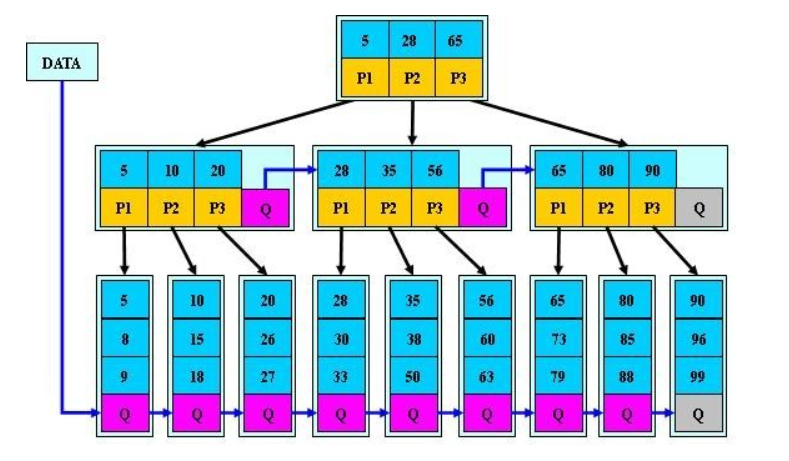
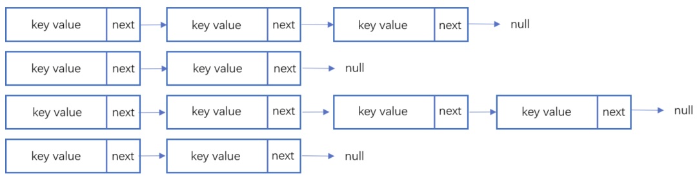
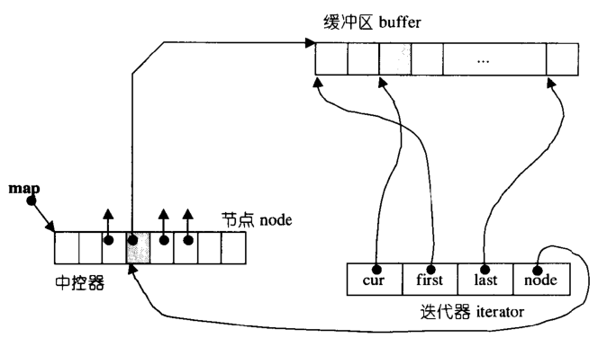
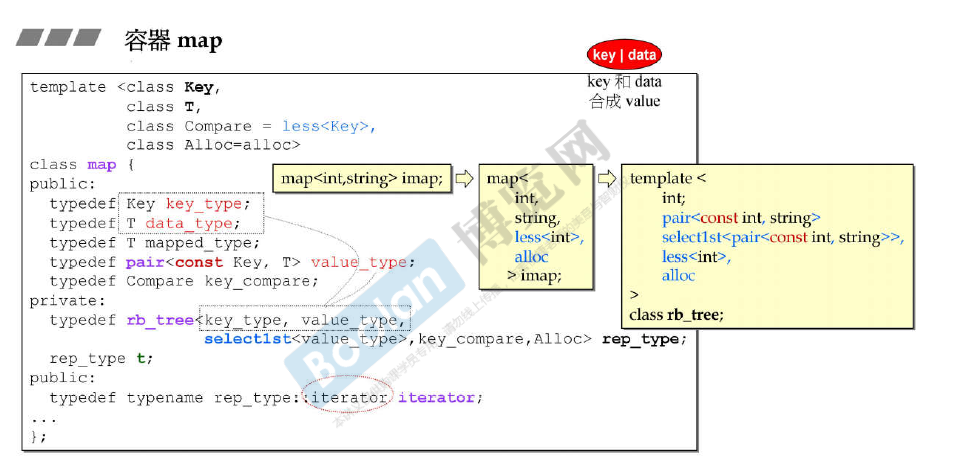
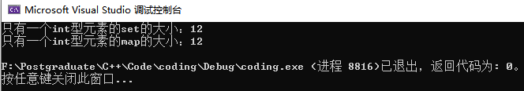
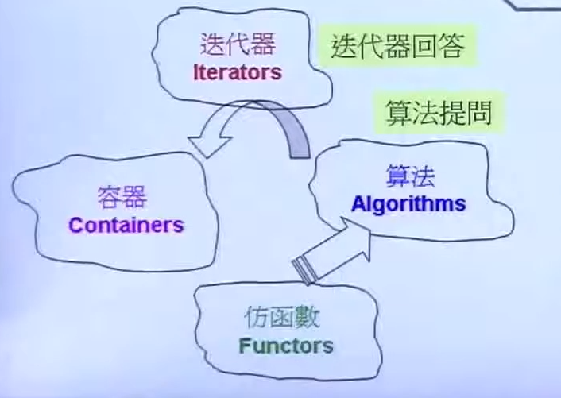
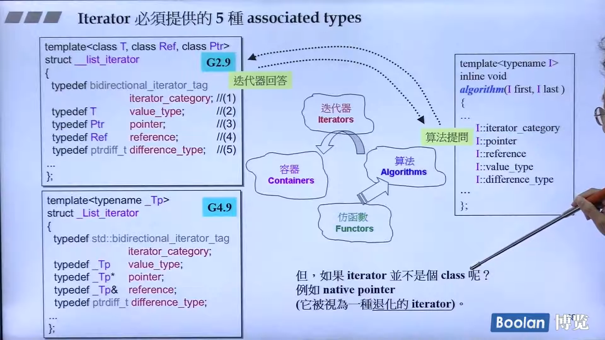
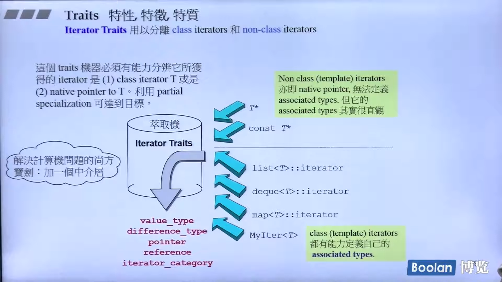
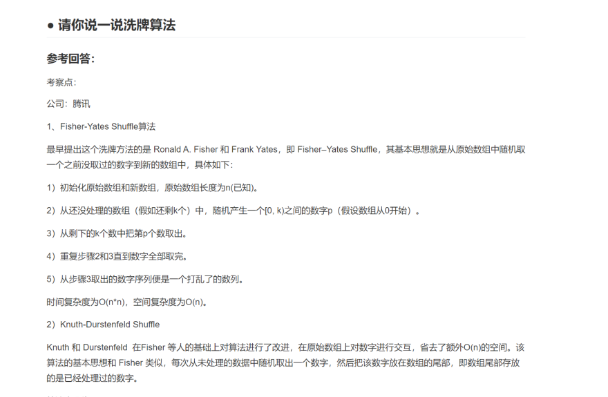
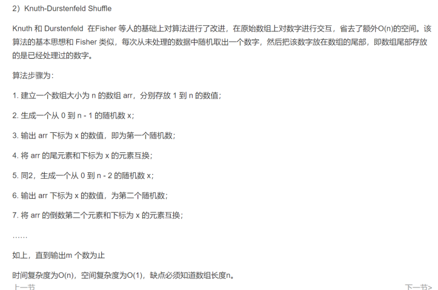

- 线性结构：数组、链表、
- 容器结构：集合、Map、HashTable
- 树形结构：AVL、RBTree、BTree


静态查找表：无序的，有序的。

既支持查找操作，又支持增删操作的集合成为动态查找表。

## 红黑树

**定义：**

（1）每个结点是红色或者黑色；（2）根结点是黑色的；（3）如果一个结点是红色的，那么它的子结点必须是黑色的；（4）从任何一个结点出发到空结点的路径上，必须包含相同数目的黑结点。

**插入：**
	新节点必然是红色的，因为插入黑节点会改变黑的数量。如果父节点是黑色的，直接插入，结束；如果父节点是红色的，分两种情况：①父节点的兄弟是黑色的，则依据情况旋转，分为LLb，RRb，LRb和RLb，前两个是单旋转，后两个是双旋转。②父节点的兄弟是红色的，则祖父节点一定是黑色的，这时候通过着色，把祖父节点改成红的，父节点及其兄弟改成黑的，但是需要继续往上调整。

**删除：**
	情况一：删除的是红色叶结点，直接删除。
	情况二：删除只有一个儿子的结点。结点的儿子一定是红色的，该结点一定是黑色的。用儿子替代并将其染成黑色。
	情况三：删除一个黑色的叶结点。很复杂，又分为两种情况
				（1）被调整结点的兄弟是黑色的（空结点也算黑）。又分为四种情况，兄弟结点有0个红儿子，兄弟结点有1个外侧红儿子，兄弟结点有1个内侧红儿子，兄弟结点有2个红儿子。
				（2）被调整结点的兄弟是红色的。则父结点一定为黑色的，兄弟结点的儿子也为黑色。可以改变兄弟和父结点的颜色，归入到（1）情况中，再做调整。

**为什么用红黑树：**

知乎上的回答：
平衡二叉树追求的是绝对平衡！也就是说左子树和右子树差值必须小于等于1。
红黑树呢？只需要保证左右子树中的黑色节点数量一致即可。这是赤裸裸的走捷径啊。这只是保证了黑色节点的绝对平衡，红色节点是不考虑的，也就是说左子树和右子树只要满足**2倍以内**的关系就可以了。

说白了，红黑树就是保持一种弱平衡，插入或删除某些结点只进行简单的操作修改就可以了，只有某些情况下会划分很复杂的情况。？

### STL中的rb_tree

**插入：**

rb_tree提供了两种insertion操作：`insert_unique()`和`insert_equal()`，前者表示节点的key一定在整个tree中独一无二，否则插入失败；后者表示节点的key可以重复。
比如set用的是`insert_unique()`，multiset用的是`insert_equal()`.

## B树与B+树

**B树是作为索引文件而驻留在磁盘上的，因此查找B树上的一个结点实际上对应着一次对磁盘的访问，其层次数是决定查找效率的最主要因素。B树的设计中，将一个磁盘块作为一个B树的结点。**
主要用途是作为大型文件的索引。B树不考虑顺序，只会一个一个地搜。

既能实现快速的随机访问，又能实现快速的顺序访问的索引结构称为B+树。用于索引顺序文件。
B+树插入时，满了就分裂，父结点也满了就再向上分裂，以此类推。
删除时，先从邻居领养，邻居也达到最少的话，就二者合并，向上以此类推。

B+树是在B树的基础上进行改造的，他的数据都在叶子节点，同时叶子节点之间还加了指针形成链表。
B+树多用于数据库中的索引。

B 树只适合随机检索，适合文件操作，B+树同时支持随机检索和顺序检索；

**那么为什么B+树用于数据库中的索引呢？**
原因：
因为在数据库中select常常不只是查询一条记录，常常要查询多条记录。比如：按照id的排序的后10条。如果是多条的话，B树需要做中序遍历，可能要跨层访问。而B+树由于所有数据都在叶子结点，不用跨层，同时由于有链表结构，只需要找到首尾，通过链表就能够把所有数据取出来了。

**为什么mysql数据库的索引不用跳表呢？**
因为数据库的数据量比较大，全量索引无法一次性加载到内存中，只好按结点来加载索引，同时又要尽量减少io次数，b树和b+树就诞生了。

### B*树

B*-tree是B+-tree的变体，在B+树的基础上(所有的叶子结点中包含了全部关键字的信息，及指向含有这些关键字记录的指针)，B*树中非根和非叶子结点再增加指向兄弟的指针；B*树定义了非叶子结点关键字个数至少为(2/3)*M，即块的最低使用率为2/3（代替B+树的1/2）。给出了一个简单实例，如下图所示：



B*树分配新结点的概率比B+树要低，空间使用率更高。

通过以上介绍，大致将B树，B+树，B*树总结如下：
B树：有序数组+平衡多叉树；
B+树：有序数组链表+平衡多叉树；*
*B*树：一棵丰满的B+树。

## 哈希表

哈希表在扩容时效率很低，会把所有元素重新哈希一遍。
**散列函数：**
	直接定址法：用线性函数。
	除留余数法：H(x) = x mod M，选M为素数，分布比较均匀。
	数字分析法：
	平方取中法：平方之后，取中间几项。
	折叠法。
**碰撞**
闭散列表：线性探测，二次探测，再散列法。
开散列表：又叫拉链法，以链表的形式。
**线性探测：**从映射到的位置开始顺序搜索，直到出现一个空位置。插入和查找都好说，但删除时，先不能真的删除，因为每个单元不仅包括自己，还作为解决碰撞时联系其他单元的占位符，所以采用**迟删除**的方法，先用一个标记位标记为已删除。缺点：过不了多久就都标记成了已删除，无空间可用了。这时要重新散列。
**二次探测法：**算出H值后，依次再找H+1^2, H+2^2, H+3^2,...，包括回绕。要保持表中有一半单元是空的，负载因子超过0.5之后就要将散列表扩大一倍。
**再散列法：**用两个散列函数。

---

### hash碰撞的解决方案

前面提到了hash算法是一定会有冲突的，那么如果我们如果遇到了hash冲突需要解决的时候应该怎么处理呢？比较常用的算法是`链地址法`和`开放地址法`。

#### 链地址法

链表地址法是使用一个链表数组，来存储相应数据，当hash遇到冲突的时候依次添加到链表的后面进行处理。


链地址在处理的流程如下：
添加一个元素的时候，首先计算元素key的hash值，确定插入数组中的位置。如果当前位置下没有重复数据，则直接添加到当前位置。当遇到冲突的时候，添加到同一个hash值的元素后面，行成一个链表。这个链表的特点是同一个链表上的Hash值相同。java的数据结构HashMap使用的就是这种方法来处理冲突，JDK1.8中，针对链表上的数据超过8条的时候，使用了红黑树进行优化。

#### 开发地址法

开放地址法是指大小为 M 的数组保存 N 个键值对，其中 M > N。我们需要依靠数组中的空位解决碰撞冲突。基于这种策略的所有方法被统称为“开放地址”哈希表。线性探测法，就是比较常用的一种“开放地址”哈希表的一种实现方式。线性探测法的核心思想是当冲突发生时，顺序查看表中下一单元，直到找出一个空单元或查遍全表。简单来说就是：**一旦发生冲突，就去寻找下 一个空的散列表地址，只要散列表足够大，空的散列地址总能找到。**

对于开放寻址冲突解决方法，除了线性探测方法之外，还有另外两种比较经典的探测方法，二次探测（Quadratic probing）和双重散列（Double hashing）。但是不管采用哪种探测方法，当散列表中空闲位置不多的时候，散列冲突的概率就会大大提高。为了尽可能保证散列表的操作效率，一般情况下，我们会尽可能保证散列表中有一定比例的空闲槽位。我们用`装载因子`（load factor）来表示空位的多少。

散列表的装载因子=填入表中的元素个数/散列表的长度。装载因子越大，说明冲突越多，性能越差。

### hash算法应用

信息加密。
数据校验。
xxxx。

## LSM树

LSM树（Log-Structured MergeTree）存储引擎和B+树存储引擎一样，同样支持增、删、读、改、顺序扫描操作。而且通过批量存储技术规避磁盘随机写入问题。当然凡事有利有弊，LSM树和B+树相比，LSM树牺牲了部分读性能，用来大幅提高写性能。LSM树存储引擎的代表数据库就是HBase。

LSM树核心思想的核心就是放弃部分读能力，换取写入的最大化能力。LSM Tree ，这个概念就是结构化合并树的意思，它的核心思路其实非常简单，就是假定内存足够大，因此不需要每次有数据更新就必须将数据写入到磁盘中，而可以先将最新的数据驻留在内存中，等到积累到足够多之后，再使用归并排序的方式将内存内的数据合并追加到磁盘队尾(因为所有待排序的树都是有序的，可以通过合并排序的方式快速合并到一起)。

日志结构的合并树（LSM-tree）是一种基于硬盘的数据结构，与B+tree相比，能显著地减少硬盘磁盘臂的开销，并能在较长的时间提供对文件的高速插入（删除）。**然而LSM-tree在某些情况下，特别是在查询需要快速响应时性能不佳。**通常LSM-tree**适用于索引插入比检索更频繁的应用系统。**

LSM树和B+树的差异主要在于读性能和写性能进行权衡。在牺牲的同时寻找其余补救方案：

1. LSM具有批量特性，存储延迟。当写读比例很大的时候（写比读多），LSM树相比于B树有更好的性能。因为随着insert操作，为了维护B+树结构，节点分裂。读磁盘的随机读写概率会变大，性能会逐渐减弱。

2. B树的写入过程：对B树的写入过程是一次原位写入的过程，主要分为两个部分，首先是查找到对应的块的位置，然后将新数据写入到刚才查找到的数据块中，然后再查找到块所对应的磁盘物理位置，将数据写入去。当然，在内存比较充足的时候，因为B树的一部分可以被缓存在内存中，所以查找块的过程有一定概率可以在内存内完成，不过为了表述清晰，我们就假定内存很小，只够存一个B树块大小的数据吧。可以看到，在上面的模式中，需要两次随机寻道（一次查找，一次原位写），才能够完成一次数据的写入，代价还是很高的。

3. LSM优化方式：

   a. Bloom filter: 就是个带随机概率的bitmap,可以快速的告诉你，某一个小的有序结构里有没有指定的那个数据的。于是就可以不用二分查找，而只需简单的计算几次就能知道数据是否在某个小集合里啦。效率得到了提升，但付出的是空间代价。
    b. compact:小树合并为大树:因为小树性能有问题，所以要有个进程不断地将小树合并到大树上，这样大部分的老数据查询也可以直接使用log2N的方式找到，不需要再进行(N/m)*log2n的查询了

## 排序

分为内排序和外排序。内排序时数据都在内存之中，适合数据元素较少的情况。
内排序分为：插入排序，选择排序，交换排序，归并排序。
插入排序：
	直接插入排序：稳定，适合数据量较少的情况，这时候直接插入就行。O(n^2)
	二分插入排序：减少比较次数。在插入新元素时，前边的已经是有序的了，所以二分查找插入点。O(n^2)
	希尔排序：不稳定。减少移动次数。
选择排序：
	直接选择排序：不稳定。
	堆排序：不稳定。O(NlogN)
交换排序：
	冒泡排序：O(N^2)，稳定的。
	快速排序：不稳定。
归并排序：稳定的。

### 快速排序如何优化

https://blog.csdn.net/qq_19525389/article/details/81436838

三数取中+插排+聚集重复元素。

### 快排与堆排相比的优点

一句话就是：因为堆排序下，数据读取的开销变大。在计算机进行运算的时候，数据不一定会从内存读取出来，而是从一种叫cache的存储单位读取。原因是cache相比内存，读取速度非常快，所以cache会把一部分我们经常读取的数据暂时储存起来，以便下一次读取的时候，可以不必跑到内存去读，而是直接在cache里面找。

一般认为读取数据遵从两个原则：temporal locality，也就是不久前读取过的一个数据，在之后很可能还会被读取一遍；另一个叫spatial locality，也就是说读取一个数据，在它周围内存地址存储的数据也很有可能被读取到。因此，在读取一个单位的数据(比如1个word)之后，不光单个word会被存入cache，与之内存地址相邻的几个word，都会以一个block为单位存入cache中。另外，cache相比内存小得多，当cache满了之后，会将旧的数据剔除，将新的数据覆盖上去。

在进行堆排序的过程中，由于我们要比较一个数组前一半和后一半的数字的大小，而当数组比较长的时候，这前一半和后一半的数据相隔比较远，这就导致了经常在cache里面找不到要读取的数据，需要从内存中读出来，而当cache满了之后，以前读取的数据又要被剔除。
简而言之快排和堆排读取arr[i]这个元素的平均时间是不一样的。

## 迭代器失效

一、迭代器失效的类型
a.由于插入元素，使得容器元素整体“迁移”导致存放原容器元素的空间不再有效，从而使得指向原空间的迭代器失效。
b.由于删除元素使得某些元素次序发生变化使得原本指向某元素的迭代器不再指向希望指向的元素。

二、vector

vector的迭代器在内存重新分配时将失效（它所指向的元素在该操作的前后不再相同）。
当把超过capacity()-size()个元素插入vector中时，内存会重新分配，所有的迭代器都将失效；否则，指向当前元素以后的任何元素的迭代器都将失效。
当删除元素时，指向被删除元素以后的任何元素的迭代器都将失效。

vector是一个顺序容器，在内存中是一块连续的内存，当删除一个元素后，内存中的数据会发生移动，以保证数据的紧凑。**所以删除一个数据后，其他数据的地址发生了变化，之前获取的迭代器根据原有的信息就访问不到正确的数据。**

三、deque

增加任何元素都将使deque的迭代器失效。在deque的中间删除元素将使迭代器失效。在deque的头或尾删除元素时，只有指向该元素的迭代器失效。

在deque容器首部或者尾部插入元素不会使得任何迭代器失效。
在其首部或尾部删除元素则只会使指向被删除元素的迭代器失效。
在deque容器的任何其他位置的插入和删除操作将使指向该容器元素的所有迭代器失效。

四、list

增加任何元素都不会使迭代器失效。删除元素时，除了指向当前被删除元素的迭代器外，其它迭代器都不会失效。

五、set

<font color=#1685a9>对于关联容器(如map, set,multimap,multiset)，删除当前的iterator，仅仅会使当前的iterator失效，只要在erase时，递增当前iterator即可。这是因为map之类的容器，使用了红黑树来实现，插入、删除一个结点不会对其他结点造成影响。erase迭代器只是被删元素的迭代器失效，但是返回值为void，所以要采用erase(iter++)的方式删除迭代器。</font>
**解析：dataMap.erase(iter++);这句话分三步走，先把iter传值到erase里面，然后iter自增，然后执行erase,所以iter在失效前已经自增了。**

如果迭代器所指向的元素被删除，则该迭代器失效。其它任何增加、删除元素的操作都不会使迭代器失效。

六、map

如果迭代器所指向的元素被删除，则该迭代器失效。其它任何增加、删除元素的操作都不会使迭代器失效。

**总结：**
迭代器失效分三种情况考虑，也是分三种数据结构考虑，分别为数组型，链表型，树型数据结构。

**数组型数据结构：**该数据结构的元素是分配在连续的内存中，insert和erase操作，都会使得删除点和插入点之后的元素挪位置，所以，插入点和删除掉之后的迭代器全部失效，也就是说insert(*iter)(或erase(*iter))，然后在iter++，是没有意义的。解决方法：erase(*iter)的返回值是下一个有效迭代器的值。 iter =cont.erase(iter);

**链表型数据结构：**对于list型的数据结构，使用了不连续分配的内存，删除运算使指向删除位置的迭代器失效，但是不会失效其他迭代器.解决办法两种，erase(*iter)会返回下一个有效迭代器的值，或者erase(iter++).

**树形数据结构：** 使用红黑树来存储数据，插入不会使得任何迭代器失效；删除运算使指向删除位置的迭代器失效，但是不会失效其他迭代器.erase迭代器只是被删元素的迭代器失效，但是返回值为void，所以要采用erase(iter++)的方式删除迭代器。

注意：经过erase(iter)之后的迭代器完全失效，该迭代器iter不能参与任何运算，包括iter++,*ite

## STL

C++标准库里的大多数class都不是线程安全的，这些通常需要在外部加锁才能供多个线程同时访问。

### vector

动态增长的数组。 扩充时，一般不是在自身所在的地方扩充，而是去另一块内存区域找能放得下的区域扩。

#### resize和reserve的区别

**基本概念**
1、`capacity`：指容器在分配新的存储空间之前能存储的元素总数

2、`size`：指当前容器所存储的元素个数

3、`resize()`：既为容器分配了空间，也创建了对象。【注：这里空间就是capacity，对象就是容器中的元素size】

4、`reserve()`：表示容器预留空间，但不是真正的创建对象，需要通过insert()或push_back()等操作创建对象

**resize和reverse区别**

1、resize() **既修改capacity大小，也修改size大小**

2、reserve() **只修改capacity大小，不修改size大小**

#### push_back() & emplace_back()

emplace_back()，该函数是 [C++](http://c.biancheng.net/cplus/) 11 新增加的，其功能和 push_back() 相同，都是在 vector 容器的尾部添加一个元素。

emplace_back() 和 push_back() 的区别，就在于底层实现的机制不同。push_back() 向容器尾部添加元素时，**首先会创建这个元素，然后再将这个元素拷贝或者移动到容器中**（如果是拷贝的话，事后会自行销毁先前创建的这个元素）；**而 emplace_back() 在实现时，则是直接在容器尾部创建这个元素，省去了拷贝或移动元素的过程。**

```c++
#include <vector> 
#include <iostream> 
using namespace std;
class testDemo
{
public:
    testDemo(int num):num(num){
        std::cout << "调用构造函数" << endl;
    }
    testDemo(const testDemo& other) :num(other.num) {
        std::cout << "调用拷贝构造函数" << endl;
    }
    testDemo(testDemo&& other) :num(other.num) {
        std::cout << "调用移动构造函数" << endl;
    }
private:
    int num;
};
int main()
{
    cout << "emplace_back:" << endl;
    std::vector<testDemo> demo1;
    demo1.emplace_back(2);  
    cout << "push_back:" << endl;
    std::vector<testDemo> demo2;
    demo2.push_back(2);
}
```

运行结果为：

```bash
emplace_back:
调用构造函数
push_back:
调用构造函数
调用移动构造函数
```

在此基础上，读者可尝试将 testDemo 类中的移动构造函数注释掉，再运行程序会发现，运行结果变为：

```c++
emplace_back:
调用构造函数
push_back:
调用构造函数
调用拷贝构造函数
```

由此可以看出，push_back() 在底层实现时，会优先选择调用移动构造函数，如果没有才会调用拷贝构造函数。

显然完成同样的操作，push_back() 的底层实现过程比 emplace_back() 更繁琐，换句话说，emplace_back() 的执行效率比 push_back() 高。因此，在实际使用时，建议大家优先选用 emplace_back()。

### deque

使用分段的方式，划分成一段一段的。
无容量的概念，动态地以分段连续空间组合而成。

所以一旦需要增加新的空间，只要配置一段连续空间，然后将其拼接在头部或尾部即可，因此对于deque来说最重要的就是如何维护这个整体的连续性，关键点就在于 deque 的迭代器上，下面来看看 deque 是如何实现的：

```c++
struct __deque_iterator
{
    ...
    T* cur;//迭代器所指缓冲区当前的元素
    T* first;//迭代器所指缓冲区第一个元素
    T* last;//迭代器所指缓冲区最后一个元素
    map_pointer node;//指向map中的node
    ...
}
```

从 deque 的迭代器数据结构可以看出，为了保持与容器联结，迭代器主要包含四个主要部分：T* cur ，迭代器所指缓冲区当前的元素; T* first，迭代器所指缓冲区第一个元素；T* last，//迭代器所指缓冲区最后一个元素 ；map_pointer node ， 指向map中的node，其结构图如下图所示：



deque迭代器的迭代器主要关注缓冲区边界是否越界。比如 deque 进行自增 或者 自减 操作时，首先要检查的是当前cur递增或者递减后的结果是否已经越界，如果越界需要对 node 进行相应的处理，比如指向前一个缓存区或者指向后一个缓冲区等；如果没有越界就可以指向当前缓冲区的上一个或者下一个空间了。

### stack/queue

stack和queue应该被称作是**适配器**，因为 satck/queue 都是在别的容器基础上进行修改，提供某些特定的接口而形成的“新型容器”。

值得注意的是：stack 的默认 Sequence 是 deque，如果你想要自己指定 list 为 Sequence 也是可以的。

### set

set，multiset，map，multimap中都是使用红黑树rb_tree的结构，其中，set是使用`insert_unique`插入元素，而multiset使用`insert_equal`插入元素，set和multiset不允许使用iterator修改元素值，因为是已经按key排好序的了，其实是使用了底部rb_tree的`const-iterator`，禁止了对元素修改。 set的所有操作，都转为了呼叫红黑树来执行，从这个角度看，set未尝不是个container adapter。

两者区别如下：

- `insert_unique()`：这是一种独一无二的插入，就如同函数名一样。如果当前 map 中如果有一样的元素时，是无法插入成功的，只有当 map 中没有预插入的元素时，才能够插入成功，这也是从源码的角度保证：一个key值**对应且只对应**一个value。
- `insert_euqal()`：这是一种相等的插入，就如同函数名一样。如果当前 map 中如果有一样的 key 时，是可以插入成功的，该函数主要用于multimap中，<u>一个key值可以对应多个value值。</u>

### map

map也是调用了rb_tree来操作，但它的iterator却不是const的（因为还可能对其key-data中的data做操作），但是map中创建了一个key-data时使用了`pair<const Key, T> value_type;`的方式，将key 设置为了const，一样不能修改。



set与 map 的底层数据结构都是 rb_tree(红黑树)，只是对 rb_tree 进行二次封装，修改他的某些接口后形成的具有新特性的容器而已，就如同前文中提到的stack/queue 对 deque进行二次封装一样。

### set与map小比较

set只提供一种数据类型的接口，但是会将这一个元素分配到key和value上，而且 `compare_function() `用的是 `identity()`函数，这个函数是输入什么输出就是什么，这样就实现了set机制，所以set的 key值 和 value 值其实是一样的了。

**其实它保存的是两份元素，而不是只保存一份元素。**

map则提供两种数据类型的接口，分别放在key和value的位置上，他的 compare_function() 采用的是红黑树的compare_function()，保存的确实是两份元素。

```c++
#include <iostream>
#include <map>
#include <set>
using namespace std;
int main()
{
 set<int> st;
 st.insert(1);
 cout << "只有一个int型元素的set的大小："<<sizeof(st) << endl;

 map<int, int> mp;
 mp.insert({1,1});
 cout << "只有一个int型元素的map的大小：" << sizeof(mp) << endl;
 return 0;
}
```



可以看出，set和map都只是保存了一份元素，前者保存了 **1**，而后者保存了 **{1:1}**，同等情况下，set 与 map 所占内存大小是一样的。所以并不是 set 保存的数据看起来好像少一个，那么它在同等情况下占的内存就少一些的，其实保存的都是两份元素。

### multiset/multimap

multimap和map的**唯一区别**就是：multimap调用的是红黑树的 insert_equal() 方法，可以实现元素的重复插入。而map调用的则是独一无二的插入 insert_unique()，只能插入不同的数据。

multiset和set也一样，底层实现都是一样的，只是在插入的时候调用的方法不一样，前者调用的是红黑树的insert_equal()，后者调用的则是独一无二的插入insert_unique()。

### iterator





本来以这种algorithm问，iterator答的方式挺好的，但iterator可能会退化为普通的指针，此时无法再回答那些问题，所以需要加一个萃取机，一种中间层（计算机中的尚方宝剑，加中间层）。然后利用偏特化的方式，就可以回答问题了。




### 比较函数

默认都是以`operator <` 做比较。但是在优先级队列中，也是以这个比较，但是是大顶堆，以降序排列。`operator >`对应着`greater<int>`。

## 洗牌算法



