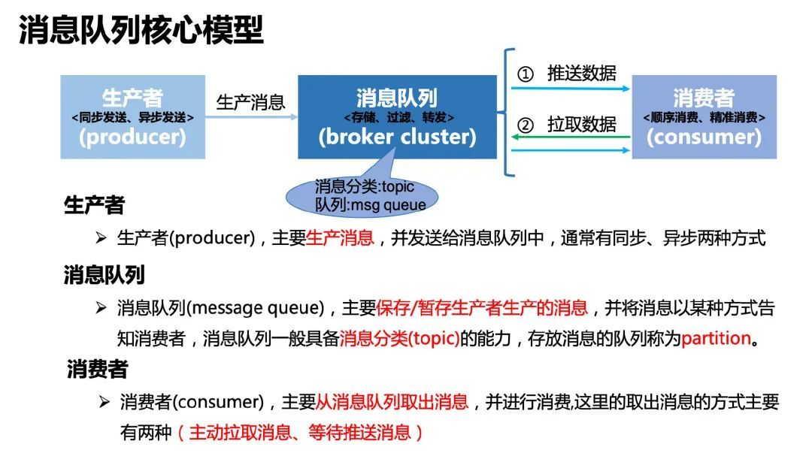

# 消息队列核心模型

上图是几乎所有消息队列设计的一个核心模型。对于一个消息队列而言，从数据流向的维度，可以拆解为三大部分：**生产者**、**消息队列集群**、**消费者**，数据是从生产者流向消息队列集群，最终再从消息队列集群流向消费者。

## 生产者

生产数据的服务，通常也称为数据的输入提供方，这里的数据通常指我们的业务数据，例如推荐场景中用户对内容的点击数据、内容曝光数据、电商中的订单数据等等。生产者通常是作为客户端的方式存在，但在支持事务消息的消息队列中，生产者也被设计为服务端，实现事务消息这一特性。其次生产者通常会有多个，消息队列集群内部也会有多个分区队列，所以在生产者发送数据时，通常会存在负载均衡的一些策略，常见的有**按 key hash**、**轮询**、**随机**等方式。其本质是**一条数据，被消息队列封装后也被称为一条消息，该条消息只能发送到其消息队列集群内部的一个分区队列中。因此只需按照一定的策略从多个队列中选择一个队列即可**。

## 消息队列集群

 消息队列集群是消息队列这种组件实现中的核心中的核心，它的主要功能是**存储消息**、**过滤消息**、**分发消息**。

过滤消息只指消息队列可以通过一定的规则或者策略进行消息的过滤，该项能力通常也被称为消息路由；过滤消息属于高阶的特性功能，AMQP 协议对这些能力抽象的比较完备，部分消息队列可以选择性的实现该协议来达到该功能，关于 AMQP 协议内容读者可以自行搜索资料阅读，此处不再展开。

分发消息是指消息队列通常需要将消息分发给处理同一逻辑的多个消费者处理或者处理不同逻辑的不同消费者处理。分发消息可以说和消费者模型想挂钩，这块会涉及到不同的数据获取方式，也会涉及到消费者消费消息的模型。这两部分内容会在 3.3 节和 3.4 节进行重点介绍。

此外绝大部分的消息队列也都支持对消息进行分类，分类的标签称为**topic(主题)**，一个 topic 中存放的是同一类消息。

## 消费者

最终消息队列存储的消息会被消费者消费使用，消费者也可以看做消息队列中数据的输出方。消费者通常有两种方式从消息队列中获取数据：**推送(push)数据**、**拉取(pull)数据**，3.3 节中会对这两种方案进行详细对比说明。其次消费者也经常是作为客户端的角色出现在在消息队列这种组件中。

费者在从消息队列中获取数据时，主要有两种方案：**1. 等待推送数据** **2. 主动拉取数据**

在此处，个人想抛开消息队列谈一点关于这两种方案的理解，其实推拉模型不仅仅只用于消息队列这种组件中，更一般意义上，它解决的其实是数据传送双方的一个问题。本质是**数据需要从一方流向另一方**。顺着这个思路来看，下面这三个例子都是遵循这个原则。

**网络中传输的数据：** 在 IO 多路复用中，以 epoll 为例，当内核检测到监听的描述符有数据到来时，epoll_wait()阻塞会返回，上层用户态程序就知道有数据就绪了，然后可以通过 read()系统调用函数读取数据。这个过程就绪通知，**类似于推送**，但推送的不是数据，而是数据就绪的信号。具体的数据获取方式还是需要通过拉取的方式来主动读。

**feeds 流系统用户时间线后台实现方案(读扩散、写扩散)：** 读扩散和写扩散更是这样一个 case。对于读扩散而言，主要采用拉取的方式获取数据。而对于写扩散而言，它是典型的数据推送的方式。当然在系统实现中，更复杂的场景往往会选择**读写结合**的思路来实现。

**生活中的点外卖例子：** 当下单点外卖时，通常也会有两种方式可以选择，**外卖派送**、**到店自取**。不过通常**外卖派送**比较实时，我们通常就选择这种方式了而已。可以看出外卖派送其实就是一种推的方式，而到店自取，则是拉的方式。