# OSI七层模型

应用层、表示层、会话层、传输层、网络层、数据链路层、物理层。

# 应用层

## HTTP

是两点之间的传输协议。

### 常见状态码：

1xx：状态码，提示信息，表示目前是协议处理的中间状态，还需要后续的操作；
2xx：成功，报文已经收到并被正确处理。
		200 OK，一切正常。
		204 No content，与200 OK基本相同，但没有body数据
		206 Partial content，是应用于 HTTP 分块下载或断点续传，表示响应返回的 body 数据并不是资源的全部，而是其中的一部分，也是服务器处理成功的状态。
3xx：重定向，资源位置发生变动， 需要客户端重新发送请求。
		301，Moved permanently，永久重定向，说明请求的资源已经不存在了，需改用新的 URL 再次访问。
		302，Found表示临时重定向，说明请求的资源还在，但暂时需要用另一个 URL 来访问。
4xx：客户端错误，请求报文有误，服务器无法处理。
		403 Forbidden，表示服务器禁止访问资源，并不是客户端的请求出错。
		404 Not found，表示请求的资源在服务器上不存在或未找到，所以无法提供给客户端。
5xx：服务器错误，服务器在处理请求时内部发生了错误。
		502 Bad gateway，通常是服务器作为网关或代理时返回的错误码，表示服务器自身工作正常，访问后端服务器发生了错误。
		503 Service unavailable，表示服务器当前很忙，暂时无法响应服务器，类似“网络服务正忙，请稍后重试”的意思。

### GET与POST区别：

Get 方法的含义是请求从服务器获取资源，这个资源可以是静态的文本、页面、图片视频等。
而POST 方法则是相反操作，它向 URI 指定的资源提交数据，数据就放在报文的 body 里。

> GET和POST都是安全和幂等的吗？

「安全」是指请求方法不会「破坏」服务器上的资源。「幂等」，意思是多次执行相同的操作，结果都是「相同」的。
很明显 GET 方法就是安全且幂等的，因为它是「只读」操作，无论操作多少次，服务器上的数据都是安全的，且每次的结果都是相同的。
POST 因为是「新增或提交数据」的操作，会修改服务器上的资源，所以是不安全的，且多次提交数据
就会创建多个资源，所以不是幂等的。

HTTP 协议里有优缺点一体的双刃剑，分别是「无状态、明文传输」，同时还有一大缺点「不安全」。

### Cookie和Session和Token：

**无状态：**
无状态的好处，因为服务器不会去记忆 HTTP 的状态，所以不需要额外的资源来记录状态信息，这能减轻服务器的负担，能够把更多的 CPU 和内存用来对外提供服务。
无状态的坏处，既然服务器没有记忆能力，它在**完成有关联性的操作**时会非常麻烦。
使用cookie。

####  cookie：
cookie 的出现是因为 HTTP 是无状态的一种协议，换句话说，服务器记不住你，可能你每刷新一次网页，就要重新输入一次账号密码进行登录。这显然是让人无法接受的，cookie 的作用就好比服务器给你贴个标签，然后你每次向服务器再发请求时，服务器就能够 cookie 认出你。

抽象地概括一下：**一个 cookie 可以认为是一个「变量」，形如`name=value`，存储在浏览器；一个 session 可以理解为一种数据结构，多数情况是「映射」（键值对），存储在服务器上**。

注意，我说的是「一个」cookie 可以认为是一个变量，但是服务器可以一次设置多个 cookie，所以有时候说 cookie 是「一组」键值对儿，这也可以说得通。
**cookie 的作用其实就是这么简单，无非就是服务器给每个客户端（浏览器）打的标签**，方便服务器辨认而已。当然，HTTP 还有很多参数可以设置 cookie，比如过期时间，或者让某个 cookie 只有某个特定路径才能使用等等。

#### session：

但问题是，我们也知道现在的很多网站功能很复杂，而且涉及很多的数据交互，比如说电商网站的购物车功能，信息量大，而且结构也比较复杂，无法通过简单的 cookie 机制传递这么多信息，而且要知道 cookie 字段是存储在 HTTP header 中的，就算能够承载这些信息，也会消耗很多的带宽，比较消耗网络资源。session 就可以配合 cookie 解决这一问题，<u>比如说一个 cookie 存储这样一个变量 `sessionID=xxxx`，仅仅把这一个 cookie 传给服务器，然后服务器通过这个 ID 找到对应的 session，这个 session 是一个数据结构，里面存储着该用户的购物车等详细信息</u>，服务器可以通过这些信息返回该用户的定制化网页，有效解决了追踪用户的问题。

**session 是一个数据结构，由网站的开发者设计，所以可以承载各种数据**，只要客户端的 cookie 传来一个唯一的 session ID，服务器就可以找到对应的 session，认出这个客户。

当然，由于 session 存储在服务器中，肯定会消耗服务器的资源，所以 **session 一般都会有一个过期时间**，服务器一般会定期检查并删除过期的 session，如果后来该用户再次访问服务器，可能就会面临重新登录等等措施，然后服务器新建一个 session，将 session ID 通过 cookie 的形式传送给客户端。

#### cookie与session对比

1，session 在服务器端，cookie 在客户端（浏览器）
2，session 默认被存在在服务器的一个文件里（不是内存）
3，session 的运行依赖 session id，而 session id 是存在 cookie 中的，也就是说，如果浏览器禁用了 cookie ，同时 session 也会失效（但是可以通过其它方式实现，比如在 url 中传递 session_id）
4，session 可以放在 文件、数据库、或内存中都可以。
5，用户验证这种场合一般会用 session

#### Token

基于Token的身份验证是无状态的，我们不将用户信息存在服务器或Session中。
【token无状态说的是服务器不保存token 只验证token。【服务器不存储session，只是通过加密算法验证token，相当于用时间换了空间性能。

基于Token的身份验证的过程如下:

1. 用户通过用户名和密码发送请求。
2. 程序验证。
3. 程序返回一个签名的token 给客户端。
4. 客户端储存token,并且每次用于每次发送请求。
5. 服务端验证token并返回数据。

每一次请求都需要token。token应该在HTTP的头部发送从而保证了Http请求无状态。我们同样通过设置服务器属性Access-Control-Allow-Origin:* ，让服务器能接受到来自所有域的请求。


### HTTP 1.0 1.1 2.0

#### **HTTP/1.1**

HTTP 协议是基于 TCP/IP，并且使用了「请求 - 应答」的通信模式，所以性能的关键就在这两点里。

1. 长连接。，HTTP/1.1 提出了长连接的通信方式，也叫持久连接。这种方式的好处在于减少了 TCP 连接的重复建立和断开所造成的额外开销，减轻了服务器端的负载。只要任意一端没有明确提出断开连接，则保持 TCP 连接状态。而1.0是短链接。

2. 流水线传输（pipeline）。即可在**同一个 TCP 连接**里面，客户端可以发起多个请求，只要第一个请求发出去了，不必等其回来，就可以发第二个请求出去，可以减少整体的响应时间。但是服务器还是按照顺序，先回应 A 请求，完成后再回应 B 请求。要是前面的回应特别慢，后面就会有许多请求排队等着。这称为「队头堵塞」。

3. 队头堵塞。因为当顺序发送的请求序列中的一个请求因为某种原因被阻塞时，在后面排队的所有请求也一同被阻塞了，会招致客户端一直请求不到数据。

> 说说 HTTP/1.1 相比 HTTP/1.0 提高了什么性能？

HTTP/1.1 相比 HTTP/1.0 性能上的改进：

+ 使用 TCP 长连接的方式改善了 HTTP/1.0 短连接造成的性能开销。
+ 支持管道（pipeline）网络传输，只要第一个请求发出去了，不必等其回来，就可以发第二个请求出去，可以减少整体的响应时间。

但 HTTP/1.1 还是有性能瓶颈：

+ 请求 / 响应头部（Header）未经压缩就发送，首部信息越多延迟越大。只能压缩 Body 的部分；
+ 发送冗长的首部。每次互相发送相同的首部造成的浪费较多；
+ 服务器是按请求的顺序响应的，如果服务器响应慢，会招致客户端一直请求不到数据，也就是队头阻塞；
+ 没有请求优先级控制；
+ 请求只能从客户端开始，服务器只能被动响应。

#### HTTP 2

> 那上面的 HTTP/1.1 的性能瓶颈，HTTP/2 做了什么优化？

1. 头部压缩。HTTP/2 会压缩头（Header）如果你同时发出多个请求，他们的头是一样的或是相似的，那么，协议会帮你消除重复的部分。这就是所谓的 HPACK 算法：在客户端和服务器同时维护一张头信息表，所有字段都会存入这个表，生成一个索引号，以后就不发送同样字段了，只发送索引号，这样就提高速度了。

2. 二进制格式。HTTP/2 不再像 HTTP/1.1 里的纯文本形式的报文，而是全面采用了二进制格式，头信息和数据体都是二进制，并且统称为帧（frame）：头信息帧和数据帧。增加了数据传输的效率。

   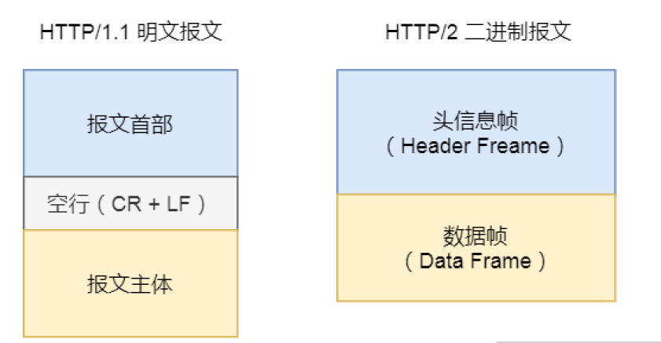

3. 数据流。HTTP/2 的数据包不是按顺序发送的，同一个连接里面连续的数据包，可能属于不同的回应。因此，必须要对数据包做标记，指出它属于哪个回应。每个请求或回应的所有数据包，称为一个数据流（ Stream ）。每个数据流都标记着一个独一无二的**编号**，其中规定客户端发出的数据流编号为奇数， 服务器发出的数据流编号为偶数。客户端**还可以指定数据流的优先级**。优先级高的请求，服务器就先响应该请求。
4. 多路复用。HTTP/2 是可以<u>在一个连接中并发多个请求或回应，而不用按照顺序一一对应</u>（一个TCP对应多个HTTP？）。移除了 HTTP/1.1 中的串行请求，不需要排队等待，也就**不会再出现「队头阻塞」问题**，降低了延迟，大幅度提高了连接的利用率。
5. 服务器推送。HTTP/2 还在一定程度上改善了传统的「请求 - 应答」工作模式，服务不再是被动地响应，也可以主动向客户端发送消息。

#### HTTP 3

> HTTP/2 有哪些缺陷？HTTP/3 做了哪些优化？

HTTP/2 主要的问题在于，多个 HTTP 请求在复用一个 TCP 连接，下层的 TCP 协议是不知道有多少个HTTP 请求的。所以一旦发生了丢包现象，就会触发 TCP 的重传机制，这样在一个 TCP 连接中的所有的 HTTP 请求都必须等待这个丢了的包被重传回来。
这都是基于 TCP 传输层的问题，所以 HTTP/3 把 HTTP 下层的 TCP 协议改成了 UDP！

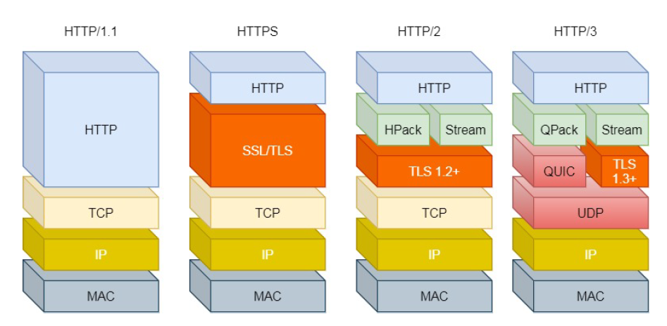

大家都知道 UDP 是不可靠传输的，但基于 UDP 的 QUIC 协议 可以实现类似 TCP 的可靠性传输。

+ QUIC 有自己的一套机制可以保证传输的可靠性的。当某个流发生丢包时，只会阻塞这个流，其他流不会受到影响。
+ TLS3 升级成了最新的 1.3 版本，头部压缩算法也升级成了 QPack 。
+ HTTPS 要建立一个连接，要花费 6 次交互，先是建立三次握手，然后是 TLS/1.3 的三次握手。QUIC 直接把以往的 TCP 和 TLS/1.3 的 6 次交互合并成了 3 次，减少了交互次数。

---

### HTTP 协议发展

#### HTTP 历史进程

1. HTTP 0.9（1991 年）只支持 get 方法不支持请求头；
2. HTTP 1.0（1996 年）基本成型，支持请求头、富文本、状态码、缓存、连接无法复用；
3. HTTP 1.1（1999 年）支持连接复用、分块发送、断点续传；
4. HTTP 2.0（2015 年）二进制分帧传输、多路复用、头部压缩、服务器推送等；
5. HTTP 3.0（2018 年）QUIC 于 2013 年实现；2018 年 10 月，IETF 的 HTTP 工作组和 QUIC 工作组共同决定将 QUIC 上的 HTTP 映射称为 "HTTP/3"，以提前使其成为全球标准。

#### **HTTP1.0 和 HTTP1.1**

1. **队头阻塞：** 下个请求必须在前一个请求返回后才能发出，导致带宽无法被充分利用，后续请求被阻塞（HTTP 1.1 尝试使用流水线（Pipelining）技术，但先天 FIFO（先进先出）机制导致当前请求的执行依赖于上一个请求执行的完成，容易引起队头阻塞，并没有从根本上解决问题）；

2. **协议开销大：** header 里携带的内容过大，且不能压缩，增加了传输的成本；

3. **单向请求：** 只能单向请求，客户端请求什么，服务器返回什么；

4. **HTTP 1.0 和 HTTP 1.1 的区别：** 

   **HTTP 1.0**：仅支持保持短暂的 TCP 连接（连接无法复用）；不支持断点续传；前一个请求响应到达之后下一个请求才能发送，存在队头阻塞 

   **HTTP 1.1**：默认支持长连接（请求可复用 TCP 连接）；支持断点续传（通过在 Header 设置参数）；优化了缓存控制策略；管道化，可以一次发送多个请求，但是响应仍是顺序返回，仍然无法解决队头阻塞的问题；新增错误状态码通知；请求消息和响应消息都支持 Host 头域

#### HTTP2

解决 HTTP1 的一些问题，但是解决不了底层 TCP 协议层面上的队头阻塞问题。2015 年

1. **二进制传输：** 二进制格式传输数据解析起来比文本更高效；
2. **多路复用：** 重新定义底层 http 语义映射，允许同一个连接上使用请求和响应双向数据流。同一域名只需占用一个 TCP 连接，通过数据流（Stream）以帧为基本协议单位，避免了因频繁创建连接产生的延迟，减少了内存消耗，提升了使用性能，并行请求，且慢的请求或先发送的请求不会阻塞其他请求的返回；
3. **Header 压缩：** 减少请求中的冗余数据，降低开销；
4. **服务端可以主动推送：** 提前给客户端推送必要的资源，这样就可以相对减少一点延迟时间；
5. **流优先级：** 数据传输优先级可控，使网站可以实现更灵活和强大的页面控制；
6. **可重置：** 能在不中断 TCP 连接的情况下停止数据的发送。

**缺点**：`HTTP 2`中，**多个请求在一个 TCP 管道中的**，出现了丢包时，`HTTP 2`的表现反倒不如`HTTP 1.1`了。因为 TCP 为了保证可靠传输，有个特别的“丢包重传”机制，丢失的包必须要等待重新传输确认，`HTTP 2`出现丢包时，整个 TCP 都要开始等待重传，那么就会阻塞该 TCP 连接中的所有请求。而对于 `HTTP 1.1` 来说，可以开启多个 TCP 连接，出现这种情况反到只会影响其中一个连接，剩余的 TCP 连接还可以正常传输数据

#### HTTP3

HTTP 是建立在 TCP 协议之上，所有 HTTP 协议的瓶颈及其优化技巧都是基于 TCP 协议本身的特性，HTTP2 虽然实现了多路复用，底层 TCP 协议层面上的问题并没有解决（**HTTP 2.0 同一域名下只需要使用一个 TCP 连接**。但是如果这个连接出现了丢包，会导致整个 TCP 都要开始等待重传，后面的所有数据都被阻塞了），而 HTTP3 的 QUIC 就是为解决 HTTP2 的 TCP 问题而生。

#### QUIC（包含UDP实现TCP功能）

QUIC协议的核心思想是将TCP协议在内核实现的诸如**可靠传输、流量控制、拥塞控制**等功能转移到**用户态**来实现，同时在加密传输方向的尝试也推动了**TLS1.3**的发展。
我们之前可能遇到过这个面试题：

> 如何用UDP协议来实现TCP协议的主要功能。

我确实笔试遇到过这道题，可以说很抓狂，题目太宏大了。不过现在看看QUIC协议就回答了这个问题：**基于UDP主体将TCP的重要功能转移到<font color=#1685a9>用户空间</font>来实现，从而绕开内核实现用户态的TCP协议**，但是真正实现起来还是非常复杂的。

##### 1. 头部阻塞

HTTP2.0协议的**多路复用机制**解决了HTTP层的队头阻塞问题，但是在**TCP层仍然存在队头阻塞问题**。TCP协议在收到数据包之后，这部分数据可能是乱序到达的，但是TCP必须将所有数据收集排序整合后给上层使用，**如果其中某个包丢失了，就必须等待重传，从而出现某个丢包数据阻塞整个连接的数据使用**。QUIC协议是基于UDP协议实现的，在一条链接上可以有**多个流**，流与流之间是**互不影响**的，当一个流出现丢包影响范围非常小，从而解决队头阻塞问题。

##### 2. 0RTT建链

使用QUIC协议的客户端和服务端要使用1RTT进行**密钥交换**，使用的交换算法是**DH**(Diffie-Hellman)**迪菲-赫尔曼算法**。分首次连接和非首次连接。非首次连接时：“前面提到客户端和服务端首次连接时服务端传递了**config包**，里面包含了服务端公钥和两个随机数，**客户端会将config存储下来**，后续再连接时可以直接使用，从而跳过这个1RTT，实现0RTT的业务数据交互。客户端保存config是有时间期限的，在config失效之后仍然需要进行首次连接时的密钥交换。”

##### 3. 连接迁移

TCP协议使用**五元组来表示一条唯一的连接**，当我们从4G环境切换到wifi环境时，手机的IP地址就会发生变化，这时必须创建新的TCP连接才能继续传输数据。
QUIC协议基于UDP实现摒弃了五元组的概念，**使用64位的随机数**作为连接的ID，并使用该ID表示连接。
基于QUIC协议之下，我们在**日常wifi和4G切换**时，或者不同基站之间切换都不会重连，从而提高业务层的体验。

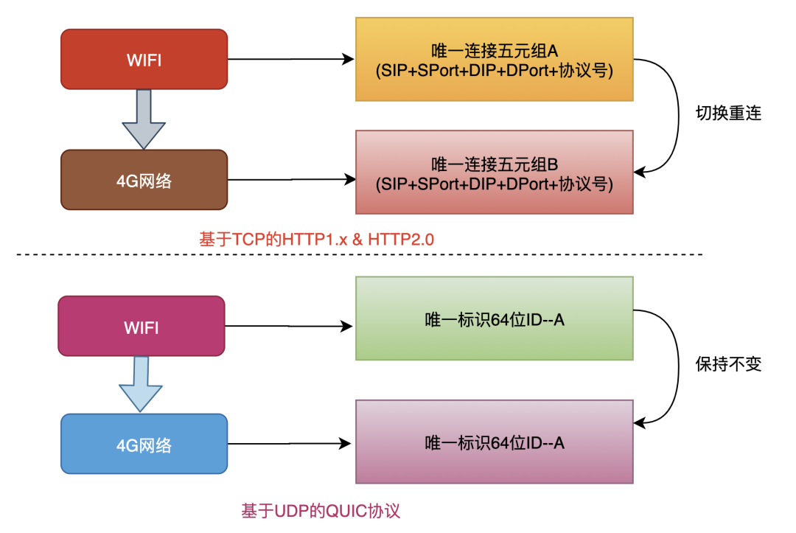

**HTTPS**

SSL/TLS 1.2 需要 4 握手，需要 2 个 RTT 的时延，我文中的图是把每个交互分开画了，实际上把他们合在一起发送，就是 4 次握手.
另外， SSL/TLS 1.3 优化了过程，只需要 1 个 RTT 往返时延，也就是只需要 3 次握手.

### HTTPS

HTTPS连接全过程：https://zhuanlan.zhihu.com/p/22142170

---

http加密原理：https://zhuanlan.zhihu.com/p/43789231 讲的很好

对称加密虽然性能好但有密钥泄漏的风险，非对称加密（2组公钥+2私钥双向传输）安全但性能低下，因此考虑用非对称加密来传输对称加密所需的密钥，然后进行对称加密，但是为了防止非对称过程产生的中间人攻击，需要对服务器公钥和服务器身份进行配对的数字认证，然后引入了CA数字**签名**+数字证书**验证**的方式！这是我梳理的整体逻辑流程。

---

HTTP 有以下安全性问题：

- 使用明文进行通信，内容可能会被**窃听**；
- 不验证通信方的身份，通信方的身份有可能遭遇**伪装**；
- 无法证明报文的完整性，报文有可能遭**篡改**。

HTTPS 并不是新协议，而是让 HTTP 先和 SSL（Secure Sockets Layer）通信，再由 SSL 和 TCP 通信，也就是说 HTTPS 使用了隧道进行通信。

通过使用 SSL，HTTPS 具有了加密（防窃听）、认证（防伪装）和完整性保护（防篡改）。

#### 加密

**1. 对称性加密**

对称密钥加密（Symmetric-Key Encryption），加密和解密使用同一密钥。

- 优点：运算速度快；
- 缺点：无法安全地将密钥传输给通信方。


**2. 非对称性加密**

非对称密钥加密，又称公开密钥加密（Public-Key Encryption），加密和解密使用不同的密钥。
公开密钥所有人都可以获得，通信发送方获得接收方的公开密钥之后，就可以使用公开密钥进行加密，接收方收到通信内容后使用私有密钥解密。
非对称密钥除了用来加密，还可以用来进行签名。因为私有密钥无法被其他人获取，因此通信发送方使用其私有密钥进行签名，通信接收方使用发送方的公开密钥对签名进行解密，就能判断这个签名是否正确。

- 优点：可以更安全地将公开密钥传输给通信发送方；
- 缺点：运算速度慢。


**3. HTTPS采用的加密方式**

上面提到对称密钥加密方式的传输效率更高，但是无法安全地将密钥 Secret Key 传输给通信方。而非对称密钥加密方式可以保证传输的安全性，因此我们可以利用非对称密钥加密方式将 Secret Key 传输给通信方。HTTPS 采用**混合的加密机制**，正是利用了上面提到的方案：

- 使用非对称密钥加密方式，传输对称密钥加密方式所需要的 Secret Key，从而保证安全性;
- 获取到 Secret Key 后，再使用对称密钥加密方式进行通信，从而保证效率。（下图中的 Session Key 就是 Secret Key）


####  认证

通过使用 **证书** 来对通信方进行认证。
数字证书认证机构（CA，Certificate Authority）是客户端与服务器双方都可信赖的第三方机构。
服务器的运营人员向 CA 提出公开密钥的申请，CA 在判明提出申请者的身份之后，会对已申请的公开密钥做数字签名，然后分配这个已签名的公开密钥，并将该公开密钥放入公开密钥证书后绑定在一起。
进行 HTTPS 通信时，服务器会把证书发送给客户端。客户端取得其中的公开密钥之后，先使用数字签名进行验证，如果验证通过，就可以开始通信了。


#### 完整性保护

SSL 提供**报文摘要**功能来进行完整性保护。
HTTP 也提供了 MD5 报文摘要功能，但不是安全的。例如报文内容被篡改之后，同时重新计算 MD5 的值，通信接收方是无法意识到发生了篡改。
HTTPS 的报文摘要功能之所以安全，是因为它结合了**加密和认证**这两个操作。试想一下，加密之后的报文，遭到篡改之后，也很难重新计算报文摘要，因为无法轻易获取明文。

# 代理

正向代理的对象是客户端，反向代理的对象是服务端。

# 网络层

## IP

网络层的主要作用是：实现主机与主机之间的通信，也叫点对点（end to end）通信。运输层是端到端？

> 网络层与数据链路层有什么关系？

其实很容易区分，在上面我们知道 IP 的作用是主机之间通信用的，而 MAC 的作用则是实现「直连」的两个设备之间通信，而 IP 则负责在「没有直连」的两个网络之间进行通信传输。一个是从北京到上海，另一个是中间怎么走，火车票、地铁票、共享单车。源IP地址和目标IP地址在传输过程中是不会变化的，只有源 MAC 地址和目标 MAC 一直在变化。

**交换机工作在数据链路层（分组转发），路由器工作在网络层。**

> 广播地址

广播地址用于在同一个链路中相互连接的主机之间发送数据包。学校班级中就有广播的例子，在准备上课的时候，通常班长会喊：“上课， 全体起立！”，班里的同学听到这句话是不是全部都站起来了？这个句话就有广播的含义。
当主机号全为 1 时，就表示该网络的广播地址。

> IP分片与重组

每种数据链路的最大传输单元` MTU `都是不相同的，如 FDDI 数据链路 MTU 4352、以太网的 MTU 是1500 字节等。那么当 IP 数据包大小大于 MTU 时， IP 数据包就会被分片。经过分片之后的 IP 数据报在被重组的时候，只能由目标主机进行，**路由器是不会进行重组的。**

在分片传输中，一旦某个分片丢失，则会造成整个 IP 数据报作废，所以 TCP 引入了 MSS 也就是在TCP 层进行分片不由 IP 层分片，那么对于 UDP 我们尽量不要发送一个大于 MTU 的数据报文。

> IP协议相关技术

### DNS：

DNS是一个**通常使用UDP的应用层协议**。当主机进行一次查询时，它构造了一个DNS查询报文并将其交给UDP。主机端的UDP为此报文添加首部字段，然后将其形成的报文段交给网络层。网络层将此UDP报文段封装进一个IP数据报中，然后将其发送给一个名字服务器。之后在查询主机中的DNS应用程序则等待对该查询的响应。若未收到，要么选择另一个名字服务器查询，要么就告知不能查询到。

---

所以域名的层级关系类似一个树状结构：

+ 根 DNS 服务器
+ 顶级域 DNS 服务器（com）
+ 权威 DNS 服务器（server.com）

指路的概念。最近的DNS服务器存着根DNS服务器的地址。

浏览器首先看一下自己的缓存里有没有，如果没有就向操作系统的缓存要，还没有就检查本机域名解析文件 hosts ，如果还是没有，就会 DNS 服务器进行查询，查询的过程如下：

1. 客户端首先会发出一个 DNS 请求，问 www.server.com 的 IP 是啥，并发给本地 DNS 服务器（也就是客户端的 TCP/IP 设置中填写的 DNS 服务器地址）。
2. 本地域名服务器收到客户端的请求后，如果缓存里的表格能找到 www.server.com，则它直接返回IP 地址。如果没有，本地 DNS 会去问它的根域名服务器：“老大， 能告诉我 www.server.com 的IP 地址吗？” 根域名服务器是最高层次的，它不直接用于域名解析，但能指明一条道路。
3. 根 DNS 收到来自本地 DNS 的请求后，发现后置是 .com，说：“www.server.com 这个域名归.com 区域管理”，我给你 .com 顶级域名服务器地址给你，你去问问它吧。”
4. 本地 DNS 收到顶级域名服务器的地址后，发起请求问“老二， 你能告诉我 www.server.com 的 IP地址吗？”
5. 顶级域名服务器说：“我给你负责 www.server.com 区域的权威 DNS 服务器的地址，你去问它应该能问到”。
6. 本地 DNS 于是转向问权威 DNS 服务器：“老三，www.server.com对应的IP是啥呀？” server.com的权威 DNS 服务器，它是域名解析结果的原出处。<u>为啥叫权威呢？就是我的域名我做主。</u>
7. 权威 DNS 服务器查询后将对应的 IP 地址 X.X.X.X 告诉本地 DNS。
8. 本地 DNS 再将 IP 地址返回客户端，客户端和目标建立连接。

### ARP：

地址解析协议。在传输一个 IP 数据报的时候，确定了源 IP 地址和目标 IP 地址后，就会通过主机「路由表」确定 IP 数据包下一跳。然而，网络层的下一层是数据链路层，所以我们还要知道「下一跳」的 MAC 地址。由于主机的路由表中可以找到下一跳的 IP 地址，所以可以通过 ARP 协议，求得下一跳的 MAC 地址。

简单地说，ARP 是借助**ARP 请求**与 **ARP 响应**两种类型的包确定 MAC 地址的。

+ 主机会通过**广播发送 ARP 请求**，这个包中包含了想要知道的 MAC 地址的主机 IP 地址。
+ 当同个链路中的所有设备收到 ARP 请求时，会去拆开 ARP 请求包里的内容，如果 ARP 请求包中的目标 IP 地址与自己的 IP 地址一致，那么这个设备就将自己的 MAC 地址塞入 ARP 响应包返回给主机。


操作系统通常会把第一次通过 ARP 获取的 MAC 地址缓存起来，以便下次直接从缓存中找到对应 IP 地址的 MAC 地址。不过，MAC 地址的缓存是有一定期限的，超过这个期限，缓存的内容将被清除。

ARP 协议是已知 IP 地址求 MAC 地址，那 RARP 协议正好相反，它是已知 MAC 地址求 IP 地址。例如将打印机服务器等小型嵌入式设备接入到网络时就经常会用得到。

### DHCP：

先说明一点，DHCP 客户端进程监听的是 68 端口号，DHCP 服务端进程监听的是 67 端口号。
这 4 个步骤：

+ 客户端首先发起**DHCP 发现报文（DHCP DISCOVER）** 的 IP 数据报，由于客户端没有 IP 地址，也不知道 DHCP 服务器的地址，所以使用的是 **UDP 广播通信**，其使用的广播目的地址是255.255.255.255（端口 67） 并且使用 0.0.0.0（端口 68） 作为源 IP 地址。DHCP 客户端将该IP 数据报传递给链路层，链路层然后将帧广播到所有的网络中设备。
+ DHCP 服务器收到 DHCP 发现报文时，用 **DHCP 提供报文（DHCP OFFER）** 向客户端做出响应。该报文仍然使用 IP 广播地址 255.255.255.255，该报文信息携带服务器提供可租约的 <u>IP 地址、子网掩码、默认网关、DNS 服务器以及 IP 地址租用期。</u>
+ 客户端收到一个或多个服务器的 DHCP 提供报文后，从中选择一个服务器，并向选中的服务器发送**DHCP 请求报文（DHCP REQUEST）**进行响应，回显配置的参数。
+ 最后，服务端用 **DHCP ACK** 报文对 DHCP 请求报文进行响应，应答所要求的参数。

一旦客户端收到 DHCP ACK 后，交互便完成了，并且客户端能够在租用期内使用 DHCP 服务器分配的 IP 地址。
如果租约的 DHCP IP 地址快到期后，客户端会向服务器发送 DHCP 请求报文：

+ 服务器如果同意继续租用，则用 DHCP ACK 报文进行应答，客户端就会延长租期。
+ 服务器如果不同意继续租用，则用 DHCP NACK 报文，客户端就要停止使用租约的 IP 地址。


可以发现，DHCP 交互中，全程都是使用**UDP 广播通信**。

> 用的是广播，那如果 DHCP 服务器和客户端不是在同一个局域网内，路由器又不会转发广播包，那不是每个网络都要配一个 DHCP 服务器？

为了解决这一问题，就出现了 DHCP 中继代理。有了 DHCP 中继代理以后，对不同网段的 IP 地址分配也可以由一个 DHCP 服务器统一进行管理。

+ DHCP 客户端会向 DHCP 中继代理发送 DHCP 请求包，而 DHCP 中继代理在收到这个广播包以后，再以单播的形式发给 DHCP 服务器。
+ 服务器端收到该包以后再向 DHCP 中继代理返回应答，并由 DHCP 中继代理将此包广播给DHCP 客户端 。

因此，DHCP 服务器即使不在同一个链路上也可以实现统一分配和管理IP地址。

### NAT:

网络地址转换协议。简单的来说 NAT 就是同个公司、家庭、教室内的主机对外部通信时，把私有 IP 地址转换成公有 IP 地址。

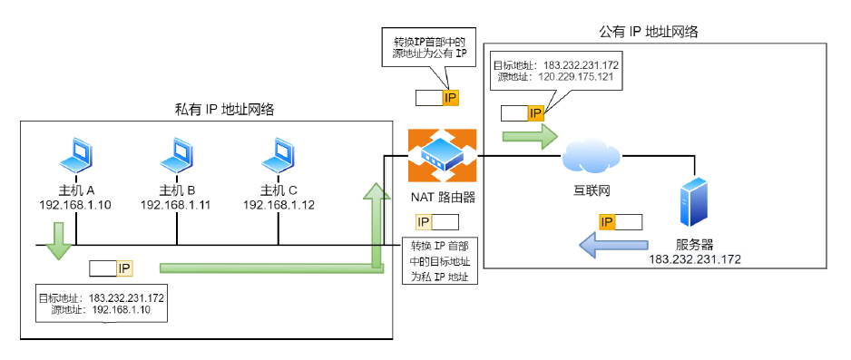

那不是 N 个私有 IP 地址，你就要 N 个公有 IP 地址？这怎么就缓解了 IPv4 地址耗尽的问题？这不瞎扯吗？

确实是，普通的 NAT 转换没什么意义。由于绝大多数的网络应用都是使用传输层协议 TCP 或 UDP 来传输数据的。因此，可以把 **IP 地址 + 端口号**一起进行转换。这样，就用一个全球 IP 地址就可以了，这种转换技术就叫网络地址与端口转换 NAPT。

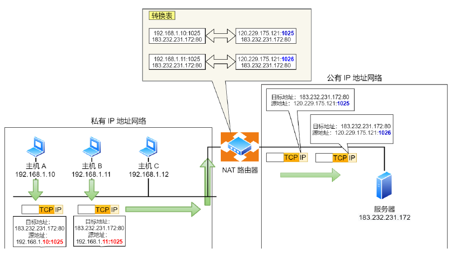

由于 NAT/NAPT 都依赖于自己的转换表，因此会有以下的问题：

+ 外部无法主动与 NAT 内部服务器建立连接，因为 NAPT 转换表没有转换记录。
+ 转换表的生成与转换操作都会产生性能开销。
+ 通信过程中，如果 NAT 路由器重启了，所有的 TCP 连接都将被重置。

如何解决 NAT 潜在的问题呢？解决的方法主要有两种方法。
第一种就是改用 IPv6
第二种 NAT 穿透技术
它能够让网络应用程序主动发现自己位于 NAT 设备之后，并且会主动获得 NAT 设备的公有 IP，并为自己建立端口映射条目，注意这些都是 NAT设备后的应用程序自动完成的。

### ICMP：

互联网控制报文协议。ICMP 主要的功能包括：**确认 IP 包是否成功送达目标地址、报告发送过程中 IP 包被废弃的原因和改善网络设置等**。一类是用于诊断的查询消息，也就是「**查询报文类型**」。另一类是通知出错原因的错误消息，也就是「**差错报文类型**」。

ICMP最典型的用途是差错报告。在某个位置，IP路由器不能找到一条通往HTTP请求中所指定的主机的路径，该路由器就会向你的主机生成并发出一个ICMP报文以指示该错误。ICMP通常被认为是IP的一部分，因为ICMP报文是承载在IP分组中的。ICMP报文是作为IP有效载荷承载的。

## ping的工作原理

ping 是**基于 ICMP 协议工作的**。ICMP 报文是封装在 IP 包里面，它工作在网络层，是 IP 协议的助手。

**查询报文类型：**

> 回送消息——0和8

回送消息用于进行通信的主机或路由器之间，判断所发送的数据包是否已经成功到达对端的一种消息， ping 命令就是利用这个消息实现的。可以向对端主机发送**回送请求**的消息**（ ICMP Echo Request Message ，类型 8 ）**，也可以接收对端主机发回来的**回送应答**消息**（ ICMP Echo Reply Message ，类型 0 ）**。

**差错报文类型：**

接下来，说明几个常用的 ICMP 差错报文的例子：
目标不可达消息 —— 类型 为 3，又分为各种，网络、主机、协议、端口不可达，需要分片而未分片。
原点抑制消息 —— 类型 4，为了缓和拥堵。
重定向消息 —— 类型 5
超时消息 —— 类型 11，TTL（time to live）

**ping查询报文的使用：**

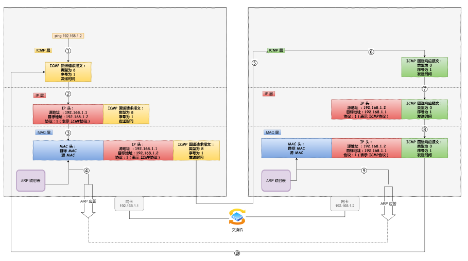

# 输入URL发生什么？

首先对URL进行解析，确定web服务器和文件名，根据这些信息生成http文件，发送给web服务器，但在这之前，需要查ip。
DNS域名解析。
浏览器调用socket库，委托协议栈工作。找到TCP，在传输前，先三次握手建立连接。生成TCP报文，TCP 报文中的数据部分就是存放 HTTP 头部 + 数据。
通过IP，有源IP和目标IP，根据路由表规则，判断哪个网卡作为源IP，生成IP报文。
两点传输，通过ARP得到MAC地址，先查ARP缓存，生成MAC报文
再通过网卡，网卡驱动从 IP 模块获取到包之后，会将其复制到网卡内的缓存区中，接着会在其开头加上**报头和起始帧分界符**，在末尾加上用于检测错误的**帧校验序列**。
交换机和路由器。
服务端和客户端互相扒皮。

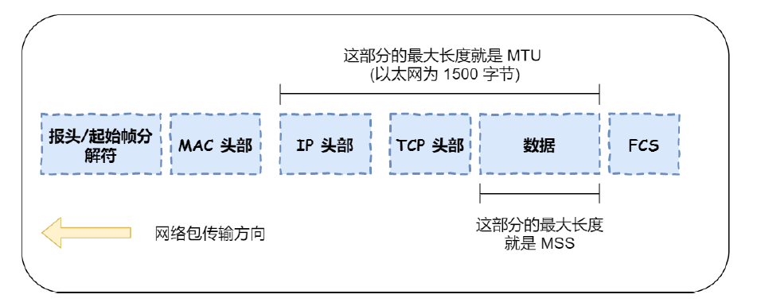

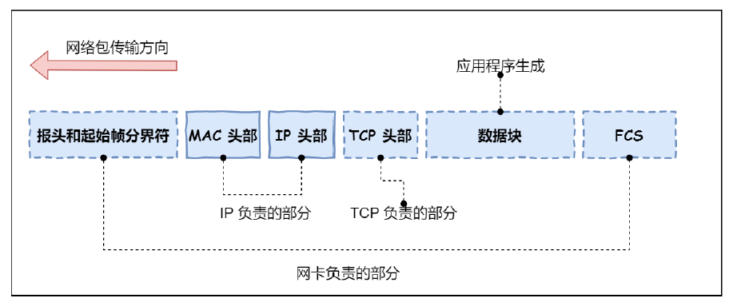


# 一些简写

<font color=#1685a9>MTU ：</font>一个网络包的最大长度，以太网中一般为 1500 字节；
<font color=#1685a9>MSS ：</font>除去 IP 和 TCP 头部之后，一个网络包所能容纳的 **TCP 数据的最大长度**；
<font color=#1685a9>MSL：</font> 是 Maximum Segment Lifetime，**报文最大生存时间**
<font color=#1685a9>TTL：</font>是 IP 数据报可以经过的最大路由数，每经过一个处理他的路由器此值就减 1
<font color=#1685a9>RTT：</font> （Round-Trip Time，往返时间）就是数据从网络一端传送到另一端所需的时间，也就是**包的往返时间**。
<font color=#1685a9>RTO：</font>超时重传时间是以 RTO （Retransmission Timeout 超时重传时间）表示。

# 传输层

## TCP

TCP连接包括Socket、序列号和窗口大小。
==TCP头部格式==：源端口号，目标端口号，序列号，确认应答号，首部长度，各种控制位，窗口大小，校验和等。。
TCP是可靠的，能确保收到的网络包是无损坏、无间隔、非冗余和按序的。
**TCP是面向连接的、可靠的、基于字节流的传输层协议。**（UDP使用**数据报**）
源地址和目的地址的字段（32位）是在 IP 头部中，作用是通过 IP 协议发送报文给对方主机。
源端口和目的端口的字段（16位）是在 TCP 头部中，作用是告诉 TCP 协议应该把报文发给哪个进程。
UDP头部只有<u>源端口号，目标端口号，包长度和校验和</u>。**只8个字节。TCP头部至少20字节。**

> TCP保证数据传输可靠性的方式

校验和（数据没被修改），序列号，确认应答，累计确认和超时重传（传输过程不丢失报文段），流量和拥塞控制一定程度上也算是。

> 字节流与数据报

**数据报**是网络传输的数据的基本单元，包含一个报头和数据本身，其中报头描述了数据的目的地以及和其它数据之间的关系。同一报文的不同分组可以由不同的传输路径通过通信子网。UDP基于**数据报**。
**字节流**方式指的是仅把传输中的报文看作是一个字节序列，在**字节流**服务中，由于没有报文边界，用户进程在某一时刻可以读或写任意数量的字节。 TCP基于**字节流**。

---

**两者的区别在于TCP接收的是一堆数据，而每次取多少由主机决定;而UDP发的是数据报，客户发送多少就接收多少。**

拥有这些区别的原因是由于TCP和UDP的特性不同而决定的。TCP是面向连接的，也就是说，在连接持续的过程中，socket中收到的数据都是由同一台主机发出的，因此，知道保证数据是有序的到达就行了，至于每次读取多少数据自己看着办。 而UDP是无连接的协议，也就是说，只要知道接收端的IP和端口，且网络是可达的，任何主机都可以向接收端发送数据。这时候，如果一次能读取超过一个报文的数据，则会乱套。比如，主机A向发送了报文P1，主机B发送了报文P2，如果能够读取超过一个报文的数据，那么就会将P1和P2的数据合并在了一起，这样的数据是没有意义的。

---

<font color=#1685a9> TCP协议使用字节流（UDP使用数据报），实际编程中字节流和数据报的主要区别体现在通信双方是否必须执行相同次数的读、写操作（只是表现形式），发送端应用程序连续执行多次写操作时，TCP模块先将这些数据放入TCP发送缓冲区中。当TCP模块真正开始发送数据时，发送缓冲区中这些等待发送的数据可能被封装成一个或多个TCP报文段发出。因此，TCP模块发送出的TCP模块发送出的TCP报文段的个数和应用程序执行的写操作次数之间没有固定的数量关系。</font>

<font color=#1685a9>当接收端收到一个或多个TCP报文段后，TCP模块将他们携带的应用程序数据按照TCP报文段的序号依次放入TCP接收缓冲区中，并通知应用程序读取数据。接收端应用程序可以一次性将TCP接收缓冲区中的数据全部都出，也可以分多次读取，这取决于用户制定的应用程序读缓冲区的大小。因此，应用程序执行的读操作次数和TCP模块接收到的TCP报文段个数之间也没有固定的数量关系。</font>

​     综上所述，发送端执行的写操作次数和接收端执行的读操作次数之间没有任何数量关系，这就是字节流的概念：应用程序对数据的发送和接收是没有边界限制的。<font color=#1685a9>UDP则不然，发送端应用程序没执行一次写操作，UDP模块就将其封装成一个UDP数据包并发送之。接收端必须及时针对每一个UDP数据报执行读操作（通过recvfrom系统调用），否则就会丢包（这经常发生在较慢的服务器上）。并且，如果过用户没有指定足够的应用程序缓冲区来读取UDP数据，则UDP数据将被截断。</font>

---

### **TCP 和 UDP 区别：**

1. 连接
TCP 是面向连接的传输层协议，传输数据前先要建立连接。
UDP 是不需要连接，即刻传输数据。
2. 服务对象
TCP 是一对一的两点服务，即一条连接只有两个端点。
UDP 支持一对一、一对多、多对多的交互通信
3. 可靠性
TCP 是可靠交付数据的，数据可以无差错、不丢失、不重复、按序到达。
UDP 是尽最大努力交付，不保证可靠交付数据。
4. 拥塞控制、流量控制
TCP 有拥塞控制和流量控制机制，保证数据传输的安全性。
UDP 则没有，即使网络非常拥堵了，也不会影响 UDP 的发送速率。
5. 首部开销
TCP 首部长度较长，会有一定的开销，首部在没有使用「选项」字段时是 20 个字节，如果使用了「选项」字段则会变长的。
UDP 首部只有 8 个字节，并且是固定不变的，开销较小。
6. 传输方式
TCP 是流式传输，没有边界，但保证顺序和可靠。
UDP 是一个包一个包的发送，是有边界的，但可能会丢包和乱序。
7. 分片不同
TCP 的数据大小如果大于 MSS 大小，则会在传输层进行分片，目标主机收到后，也同样在传输层组装 TCP 数据包，如果中途丢失了一个分片，只需要传输丢失的这个分片。
UDP 的数据大小如果大于 MTU 大小，则会在 IP 层进行分片，目标主机收到后，在 IP 层组装完数据，接着再传给传输层，但是如果中途丢了一个分片，则就需要重传所有的数据包，这样传输效率非常差，所以通常 UDP 的报文应该小于 MTU。

> 为什么 UDP 头部没有「首部长度」字段，而 TCP 头部有「首部长度」字段呢？

原因是 TCP 有可变长的「选项」字段，而 UDP 头部长度则是不会变化的，无需多一个字段去记录UDP 的首部长度。

> 为什么 UDP 头部有「包长度」字段，而 TCP 头部则没有「包长度」字段呢？

TCP数据的长度 = ip长度- ip首部长 - TCP首部长。其中 IP 总长度 和 IP 首部长度，在 IP 首部格式是已知的。TCP 首部长度，则是在 TCP 首部格式已知的，所以就可以求得 TCP 数据的长度。那按理说，UDP也能如此记算啊？因为为了网络设备硬件设计和处理方便，首部长度需要是**4 字节的整数倍**。如果去掉 UDP 「包长度」字段，那 UDP 首部长度就不是 4 字节的整数倍了，所以小林觉得这可能是为了补全 UDP 首部长度是 4 字节的整数倍，才补充了「包长度」字段。

### socket几种状态

> CLOSED 表示socket连接没被使用。 LISTENING 表示正在监听进入的连接。 SYN_SENT 表示正在试着建立连接。 SYN_RECEIVED 进行连接初始同步。 ESTABLISHED 表示连接已被建立。 CLOSE_WAIT 表示远程计算器关闭连接，正在等待socket连接的关闭。 FIN_WAIT_1 表示socket连接关闭，正在关闭连接。 CLOSING 先关闭本地socket连接，然后关闭远程socket连接，最后等待确认信息。 LAST_ACK 远程计算器关闭后，等待确认信号。 FIN_WAIT_2 socket连接关闭后，等待来自远程计算器的关闭信号。 TIME_WAIT 连接关闭后，等待远程计算器关闭重发。

### 三次握手：

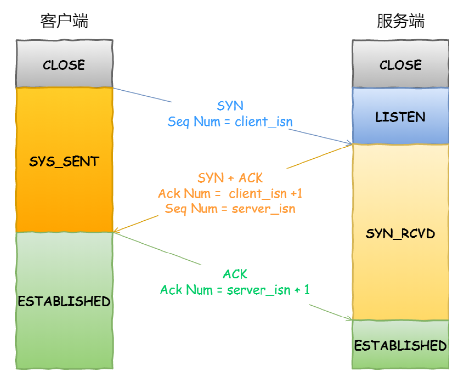

第三次握手是可以携带数据的，前两次握手不行。

> 为什么是三次握手？不是两次？四次？

三次握手的原因：

+ 阻止重复历史连接的初始化（主要原因）
+ 三次才可以同步双方的初始序列号
+ 可以避免资源浪费

**原因一：避免历史连接**
*The principle reason for the three-way handshake is to prevent old duplicate connection initiations from causing confusion.*
三次握手的首要原因是为了**防止旧的重复连接初始化造成混乱。**
客户端连续发送多次 SYN 建立连接的报文，在网络拥堵情况下：

+ 一个「旧 SYN 报文」比「最新的 SYN 」 报文早到达了服务端；
+ 那么此时服务端就会回一个 SYN + ACK 报文给客户端；
+ 客户端收到后可以根据自身的上下文，判断这是一个历史连接（序列号过期或超时），那么客户端就会发送 RST 报文给服务端，表示中止这一次连接。

如果是两次握手连接，就不能判断当前连接是否是历史连接，三次握手则可以在客户端（发送方）准备发送第三次报文时，客户端因有足够的上下文来判断当前连接是否是历史连接：

+ 如果是历史连接（序列号过期或超时），则第三次握手发送的报文是 RST 报文，以此中止历史连接；
+ 如果不是历史连接，则第三次发送的报文是 ACK 报文，通信双方就会成功建立连接；

所以，TCP 使用三次握手建立连接的最主要原因是**防止历史连接初始化了连接。**

相当于攀岩运动员回喊了一句：“认错人了，你要保护的不是我！”

**原因二：同步双方序列号**

可见，序列号在 TCP 连接中占据着非常重要的作用，所以当客户端发送携带「初始序列号」的 SYN报文的时候，需要服务端回一个 ACK 应答报文，表示客户端的 SYN 报文已被服务端成功接收，那当服务端发送「初始序列号」给客户端的时候，依然也要得到客户端的应答回应，**这样一来一回，才能确保双方的初始序列号能被可靠的同步。**

四次握手其实也能够可靠的同步双方的初始化序号，但由于第二步和第三步可以优化成一步，所以就成了「三次握手」。而两次握手只保证了一方的初始序列号能被对方成功接收，没办法保证双方的初始序列号都能被确认接收。

**原因三：避免资源浪费**

如果只有「两次握手」，当客户端的 SYN 请求连接在网络中阻塞，<font color=#1685a9>客户端没有接收到 ACK 报文</font>，就会重新发送 SYN ，由于没有第三次握手，服务器不清楚客户端是否收到了自己发送的建立连接的ACK 确认信号，所以每收到一个 SYN 就<u>只能先主动建立一个连接</u>，这会造成什么情况呢？如果客户端的 SYN 阻塞了，重复发送多次 SYN 报文，那么服务器在收到请求后就会建立多个冗余的无效链接，造成不必要的资源浪费。

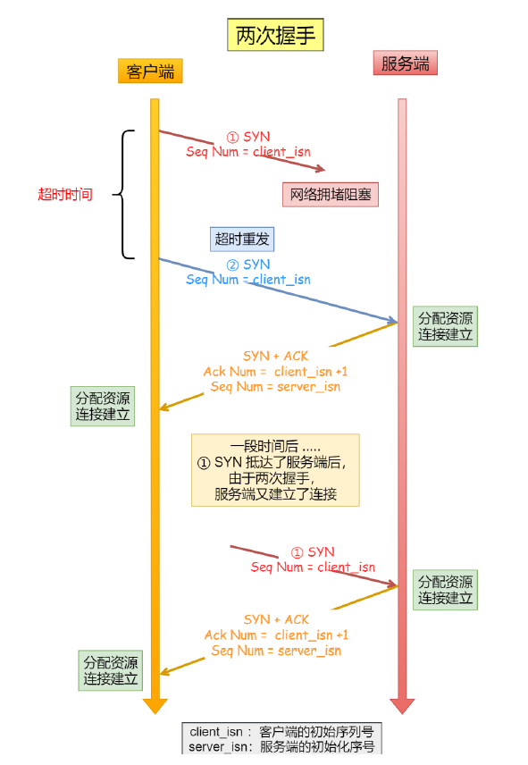

不使用「两次握手」和「四次握手」的原因：

+ 「两次握手」：无法防止历史连接的建立，会造成双方资源的浪费，也无法可靠的同步双方序列号；
+ 「四次握手」：三次握手就已经理论上最少可靠连接建立，所以不需要使用更多的通信次数。

为什么客户端和服务端的初始序列号 ISN 是不相同的？

+ 一方面，如果一个已经失效的连接被重用了，但是该旧连接的历史报文还残留在网络中，如果序列号相同，那么就无法分辨出该报文是不是历史报文，如果历史报文被新的连接接收了，则会产生数据错乱。所以，每次建立连接前**重新初始化一个序列号**主要是为了通信双方**能够根据序号将不属于本连接的报文段丢弃。**
+ 另一方面是为了安全性，防止黑客伪造的相同序列号的 TCP 报文被对方接收。

> 既然IP 层会分片，为什么 TCP 层还需要 MSS 呢？

MTU ：一个网络包的最大长度，以太网中一般为 1500 字节；
MSS ：除去 IP 和 TCP 头部之后，一个网络包所能容纳的 **TCP 数据的最大长度**；

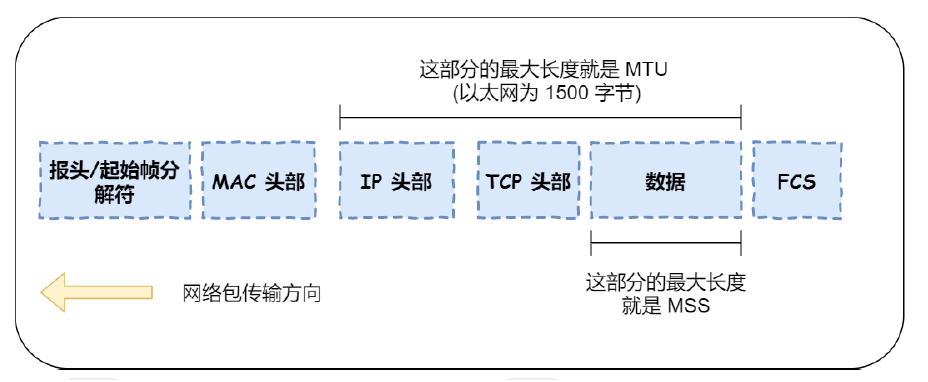

如果在 TCP 的整个报文（头部 + 数据）交给 IP 层进行分片，会有什么异常呢？

当 IP 层有一个超过 MTU 大小的数据（TCP 头部 + TCP 数据）要发送，那么 IP 层就要进行分片，把数据分片成若干片，保证每一个分片都小于 MTU。把一份 IP 数据报进行分片以后，由目标主机的 IP层来进行重新组装后，再交给上一层 TCP 传输层。这看起来井然有序，但这存在隐患的，那么当如果一个 IP 分片丢失，整个 IP 报文的所有分片都得重传。
因为 IP 层本身没有超时重传机制，它由传输层的 TCP 来负责超时和重传。当接收方发现 TCP 报文（头部 + 数据）的某一片丢失后，则不会响应 ACK 给对方，那么发送方的TCP 在超时后，就会重发**「整个 TCP 报文（头部 + 数据）」**。因此，可以得知由 IP 层进行分片传输，是非常没有效率的。
经过 TCP 层分片后，如果一个 TCP 分片丢失后，进行重发时也是以 MSS 为单位，而不用重传所有的分片，大大增加了重传的效率。

> ​	如果一个大的 TCP 报文是被 MTU 分片，那么只有「第一个分片」才具有 TCP 头部，后面的分片则没有 TCP 头部，接收方 IP 层只有重组了这些分片，才会认为是一个 TCP 报文，那么丢失了其中一个分片，接收方 IP 层就不会把 TCP 报文丢给 TCP 层，那么就会等待对方超时重传这一整个TCP 报文。
> ​	如果一个大的 TCP 报文被 MSS 分片，那么所有「分片都具有 TCP 头部」，因为每个 MSS 分片的是具有 TCP 头部的TCP报文，那么其中一个 MSS 分片丢失，就只需要重传这一个分片就可以。

#### SYN攻击

假设攻击者短时间伪造不同 IP 地址的 SYN 报文，服务端每接收到一个 SYN 报文，就进入SYN_RCVD 状态，但服务端发送出去的 ACK + SYN 报文，无法得到未知 IP 主机的 ACK 应答，久而久之就会占满服务端的 SYN 接收队列（未连接队列），使得服务器不能为正常用户服务。

*避免 SYN 攻击方式一*
其中一种解决方式是通过修改 Linux 内核参数，控制队列大小和当队列满时应做什么处理。`tcp_max_syn_backlog`参数？【不确定】
*避免SYN攻击方式二*
`tcp_syncookies` 的方式可以应对 SYN 攻击的方法：

+ 当 「 SYN 队列」满之后，后续服务器收到 SYN 包，不进入「 SYN 队列」；
+ 计算出一个 cookie 值，再以 SYN + ACK 中的「序列号」返回客户端，
+ 服务端接收到客户端的应答报文时，服务器会检查这个 ACK 包的合法性。如果合法，直接放入到
  「 Accept 队列」。
+ 最后应用通过调用 accpet() socket 接口，从「 Accept 队列」取出的连接。

### 四次挥手：

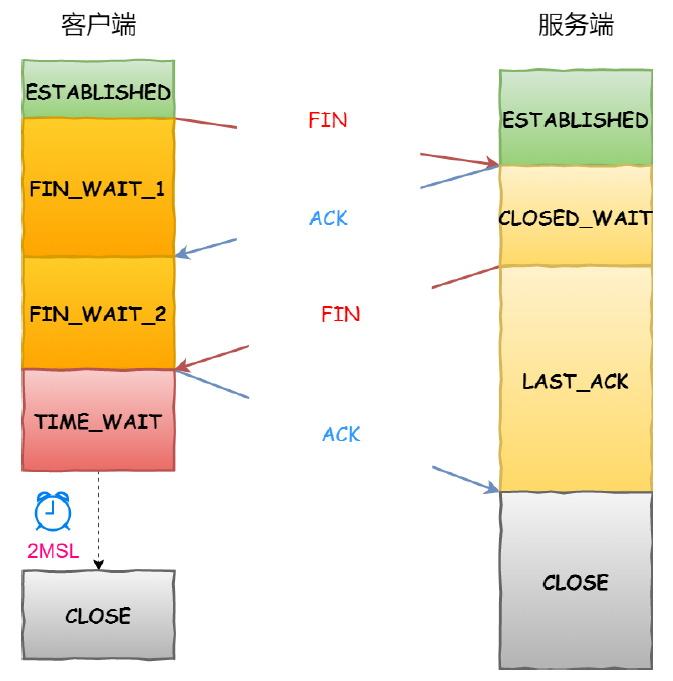

这里一点需要注意是：**主动关闭连接的，才有 TIME_WAIT 状态。**

> 为什么需要四次挥手？

再来回顾下四次挥手双方发 FIN 包的过程，就能理解为什么需要四次了。

+ 关闭连接时，客户端向服务端发送 FIN 时，仅仅表示客户端不再发送数据了但是还能接收数据。
+ 服务器收到客户端的 FIN 报文时，先回一个 ACK 应答报文，而**服务端可能还有数据需要处理和发送**，等服务端不再发送数据时，才发送 FIN 报文给客户端来表示同意现在关闭连接。

从上面过程可知，服务端通常需要等待完成数据的发送和处理，所以服务端的 ACK 和 FIN 一般都会分开发送，从而比三次握手导致多了一次。

> 为什么 TIME_WAIT 等待的时间是 2MSL？

MSL 是 Maximum Segment Lifetime，**报文最大生存时间**，它是任何报文在网络上存在的最长时间，超过这个时间报文将被丢弃。因为 TCP 报文基于是 IP 协议的，而 IP 头中有一个 TTL 字段，是 IP 数据报可以经过的最大路由数，每经过一个处理他的路由器此值就减 1，当此值为 0 则数据报将被丢弃，同时发送 ICMP 报文通知源主机。
MSL 与 TTL 的区别： <u>MSL 的单位是时间，而 TTL 是经过路由跳数</u>。所以 MSL 应该要大于等于 TTL消耗为 0 的时间，以确保报文已被自然消亡。

TIME_WAIT 等待 2 倍的 MSL，比较合理的解释是： 网络中可能存在来自发送方的数据包，当这些发送方的数据包被接收方处理后又会向对方发送响应，所以**一来一回**需要等待 2 倍的时间。比如如果被动关闭方没有收到断开连接的最后的 ACK 报文，就会触发超时重发 Fin 报文，另一方接收到 FIN 后，会重发 ACK 给被动关闭方， 一来一去正好 2 个 MSL。`2MSL` 的时间是从客户端接收到 FIN 后发送 ACK 开始计时的。如果在 TIME-WAIT 时间内，因为客户端的 ACK 没有传输到服务端，客户端又接收到了服务端重发的 FIN 报文，那么 2MSL 时间将重新计时。
在 Linux 系统里 2MSL 默认是 **60 秒**，那么一个 MSL 也就是 30 秒。Linux 系统停留在TIME_WAIT 的时间为固定的 60 秒。

> 为什么需要time_wait()状态？

需要 TIME-WAIT 状态，主要是两个原因：

+ 防止具有相同「四元组」的「旧」数据包被收到；
+ 保证「被动关闭连接」的一方能被正确的关闭，即保证最后的 ACK 能让被动关闭方接收，从而帮助其正常关闭；

*原因一：防止旧连接的数据包*

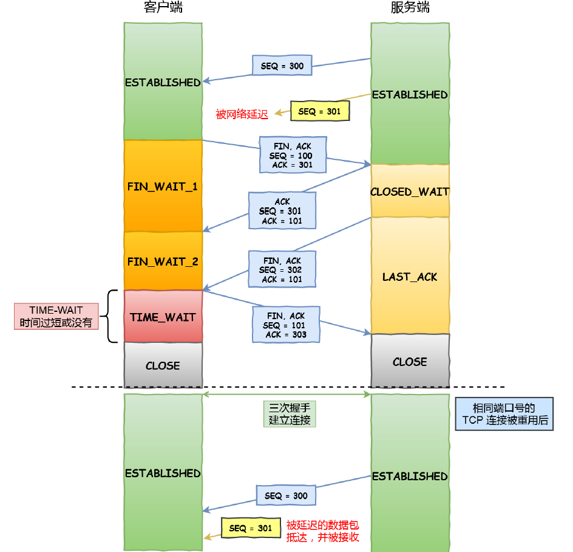

TCP连接关闭后又复用的话，那么历史数据包可能会到达，这样会认为是正常接收，就会数据错乱。TCP 就设计出了这么一个机制，经过 2MSL 这个时间，**足以让两个方向上的数据包都被丢弃，使得原来连接的数据包在网络中都自然消失，再出现的数据包一定都是新建立连接所产生的。**

---

如果Client（客户端）直接CLOSED（关闭），然后又再向Server（服务器端）发起一个新连接，我们不能保证这个新连接与刚关闭的连接的端口号是不同的。也就是说有可能新连接和老连接的端口号是相同的。一般来说不会发生什么问题，但是还是有特殊情况出现：假设新连接和已经关闭的老连接端口号是一样的，**如果前一次连接的某些数据仍然滞留在网络中**，这些延迟数据在建立新连接之后才到达Server，由于新连接和老连接的端口号是一样的，于是，TCP协议就认为那个延迟的数据是属于新连接的，**这样就和真正的新连接的数据包发生混淆了**。所以TCP连接还要在TIME_WAIT状态等待2倍MSL，这样可以保证本次连接的所有数据都从网络中消失。

*原因二：保证连接正确关闭*

TIME-WAIT 作用是**等待足够的时间以确保最后的 ACK 能让被动关闭方接收，从而帮助其正常关闭。**

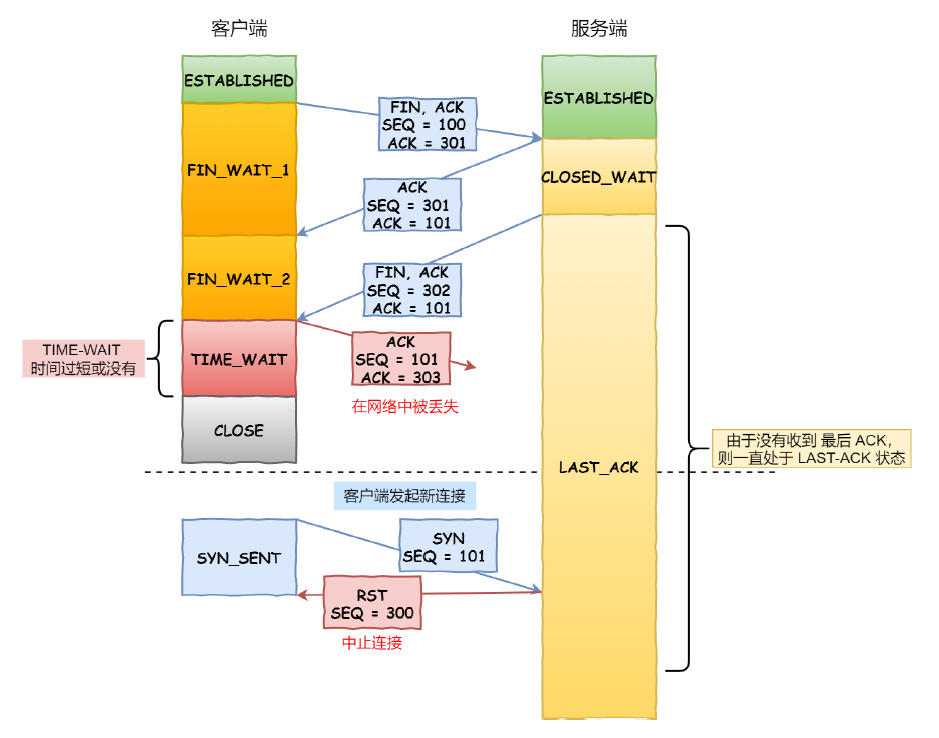

所以客户端在 TIME-WAIT 状态等待 2MSL 时间后，就可以**保证双方的连接都可以正常的关闭。**不然服务器有可能一直关不掉。不会让服务器苦苦重传等待。

### 保活机制

> 如果已经建立了连接，但是客户端突然出现故障了怎么办？

服务器保活机制。定义一个时间段，在这个时间段内，如果没有任何连接相关的活动，TCP 保活机制会开始作用，每隔一个时间间隔，发送一个**探测报文**，该探测报文包含的数据非常少，如果**连续几个探测报文都没有得到响应**，则认为当前的 TCP 连接已经死亡，系统内核将错误信息通知给上层应用程序。
主要用在服务器端，用于检测已建立TCP链接的客户端的状态，**防止因客户端崩溃或者客户端网络不可达，而服务器端一直保持该TCP链接，占用服务器端的大量资源**(因为Linux系统中可以创建的总TCP链接数是有限制的)。

```
net.ipv4.tcp_keepalive_time=7200
net.ipv4.tcp_keepalive_intvl=75
net.ipv4.tcp_keepalive_probes=9
```

7200秒内无任何连接相关活动，启动。每隔75秒，探测9次，共2小时多才探知到死亡。
第一种，**对端程序是正常工作的。**当 TCP 保活的探测报文发送给对端, 对端会正常响应，这样 TCP 保活时间会被重置，等待下一个 TCP 保活时间的到来。
第二种，**对端程序崩溃并重启**。当 TCP 保活的探测报文发送给对端后，对端是可以响应的，但由于没有该连接的有效信息，会产生一个**RST 报文**，这样很快就会发现 TCP 连接已经被重置。
第三种，**是对端程序崩溃**，或对端由于其他原因导致报文不可达。当 TCP 保活的探测报文发送给对端后，石沉大海，没有响应，连续几次，达到保活探测次数后，TCP 会报告该 TCP 连接已经死亡。

### 大量TIME_WAIT

> 大量time_wait状态发生的原因

**大量TIME_WAIT出现场景**
　　在<font color=#1685a9>高并发短连接</font>的TCP服务器上，当服务器处理完请求后立刻按照主动正常关闭连接这个场景下，会出现大量socket处于TIMEWAIT状态。如果客户端的并发量持续很高，此时部分客户端就会显示连接不上。

**大量TIME_WAIT解决方案**
**应用层面**
　　尽量避免频繁关闭连接，如业务优化，或者使用长连接等；

**系统层面**
缩短MSL时间。
增加可用端口数量。可用端口数量=单进程可打开的连接数量*机器数量。

### 大量CLOSE_WAIT

https://blog.csdn.net/MEIYOUDAO_JIUSHIDAO/article/details/119534354

### 主机/进程崩溃

> 在没有开启 TCP keepalive，且双方一直没有数据交互的情况下，如果客户端的「主机崩溃」了，会发生什么。

如果客户端主机崩溃了，服务端是**无法感知到的**，在加上服务端没有开启 TCP keepalive，又没有数据交互的情况下，**服务端的 TCP 连接将会一直处于 ESTABLISHED 连接状态**，直到服务端重启进程。

所以，我们可以得知一个点。在没有使用 TCP 保活机制，且双方不传输数据的情况下，一方的 TCP 连接处在 ESTABLISHED 状态时，并不代表另一方的 TCP 连接还一定是正常的。

> 如果进程崩溃了呢？

我自己做了个实验，使用 kill -9 来模拟进程崩溃的情况，发现**在 kill 掉进程后，服务端会发送 FIN 报文，与客户端进行四次挥手**。

所以，即使没有开启 TCP keepalive，且双方也没有数据交互的情况下，如果其中一方的进程发生了崩溃，这个过程操作系统是可以感知的到的，于是就会发送 FIN 报文给对方，然后与对方进行 TCP 四次挥手。

## Socket编程

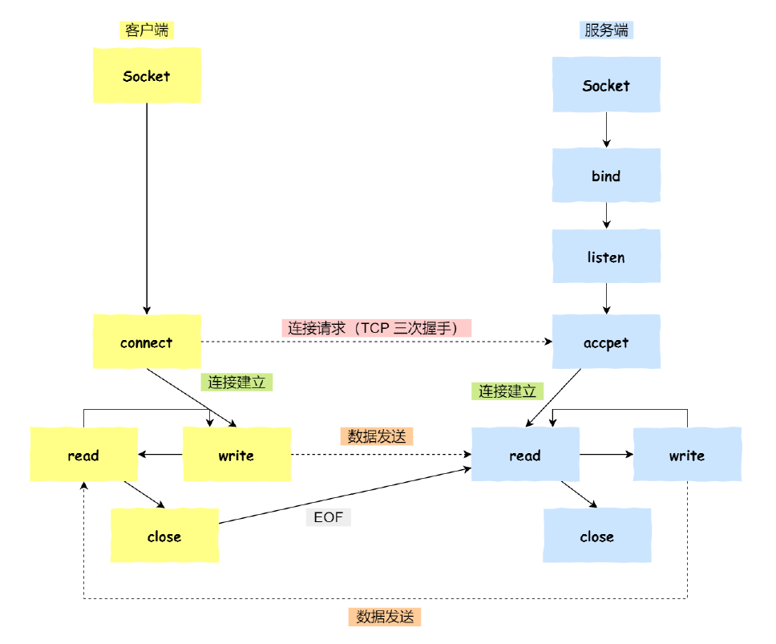

+ 服务端和客户端初始化 socket ，得到文件描述符；
+ 服务端调用 bind ，将绑定在 IP 地址和端口;
+ 服务端调用 listen ，进行监听；
+ 服务端调用 accept ，等待客户端连接；
+ 客户端调用 connect ，向服务器端的地址和端口发起连接请求；
+ 服务端 accept 返回用于传输的 socket 的文件描述符
+ 客户端调用 write 写入数据；服务端调用 read 读取数据；
+ 客户端断开连接时，会调用 close ，那么服务端 read 读取数据的时候，就会读取到了EOF ，待处理完数据后，服务端调用 close ，表示连接关闭。

这里需要注意的是，服务端调用 accept 时，连接成功了会返回一个已完成连接的 socket，后续用来传输数据。  所以，监听的 socket 和真正用来传送数据的 socket，是「两个」 socket，一个叫作**监听 socket**，一个叫作**已完成连接 socket**。成功连接建立之后，
双方开始通过 read 和 write 函数来读写数据，就像往一个文件流里面写东西一样。

> listen的backlog参数

```c
int listen (int socketfd, int backlog)
```

参数一 socketfd 为 socketfd 文件描述符
参数二 backlog，这参数在历史版本有一定的变化
在早期 Linux 内核 backlog 是 SYN 队列大小，也就是未完成的队列大小。在 Linux 内核 2.2 之后，backlog 变成 accept 队列，也就是已完成连接建立的队列长度，**所以现在通常认为 backlog 是 accept 队列。**
但是上限值是内核参数 somaxconn 的大小，也就说 accpet 队列长度 = min(backlog, somaxconn)。

## TCP重传机制

### 超时重传

`RTT` 就是数据从网络一端传送到另一端所需的时间，也就是**包的往返时间**。
超时重传时间是以 RTO （Retransmission Timeout 超时重传时间）表示。超时重传时间 RTO 的值应该略大于报文往返 RTT 的值。往返时间的估计采用滑动平均。一般是估算得到的。
如果超时重发的数据，再次超时的时候，又需要重传的时候，TCP 的策略是**超时间隔加倍**。也就是每当遇到一次超时重传的时候，都会将下一次超时时间间隔设为先前值的两倍，指数增长，**直到收到上层应用数据或收到ACK时**，再由最近的发送情况估算得到新的时间间隔。

### 快速重传

连续收到3个冗余的ACK，**非时间驱动，而是数据驱动。**如果收到3个冗余的ACK，TCP不再等待超时重传的定时器，而是立即重传该报文。

> 为什么是3个冗余ACK？

即使发送端是按序发送的，由于TCP包是封装在IP包内，IP包在传输时乱序，意味着TCP包到达接收端也是乱序的，乱序的话也会造成接收端发送冗余ACK。在重复收到三个冗余ACK的情况下，出现乱序的可能性比较小，报文丢失的可能性比较大，三个冗余ACK只是一种判定丢失的准则，也可以是4次5次。

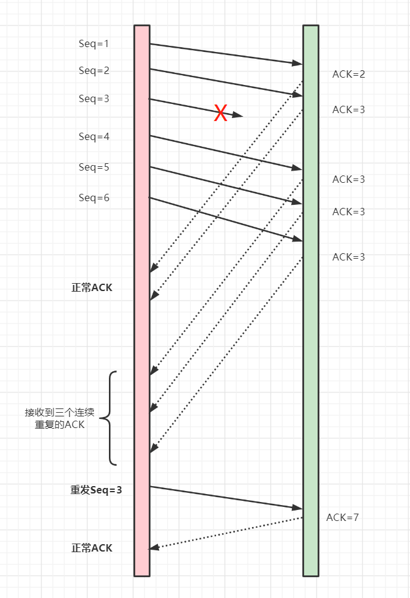

但**快速重传**还可能会有个问题：ACK只向发送端告知最大的有序报文段，到底是哪个报文丢失了呢？**并不确定**！那到底该重传多少个包呢？是重传 Seq3 呢？还是重传 Seq3、Seq4、Seq5、Seq6 呢？因为发送端并不清楚这三个连续的 ACK3 是谁传回来的。

### SACK（哪些没收到，带选择确认的重传）

为了解决快速重传的问题：**应该重传多少个包**? TCP提供了**SACK方法**（带选择确认的重传，Selective Acknowledgment）。

选择性确认。这种方式需要在 TCP 头部「选项」字段里加一个 SACK 的东西，**它可以将缓存的地图发送给发送方**，这样发送方就可以知道哪些数据收到了，哪些数据没收到，知道了这些信息，就可以只重传丢失的数据。
如果要支持 SACK ，必须双方都要支持。在 Linux 下，可以通过 net.ipv4.tcp_sack 参数打开这个功能（Linux 2.4 后默认打开）。

---

**SACK机制**就是，在快速重传的基础上，接收端返回最近收到的报文段的序列号范围，这样发送端就知道接收端哪些数据包没收到，酱紫就很清楚该重传哪些数据包啦。SACK标记是加在TCP头部**选项**字段里面的。

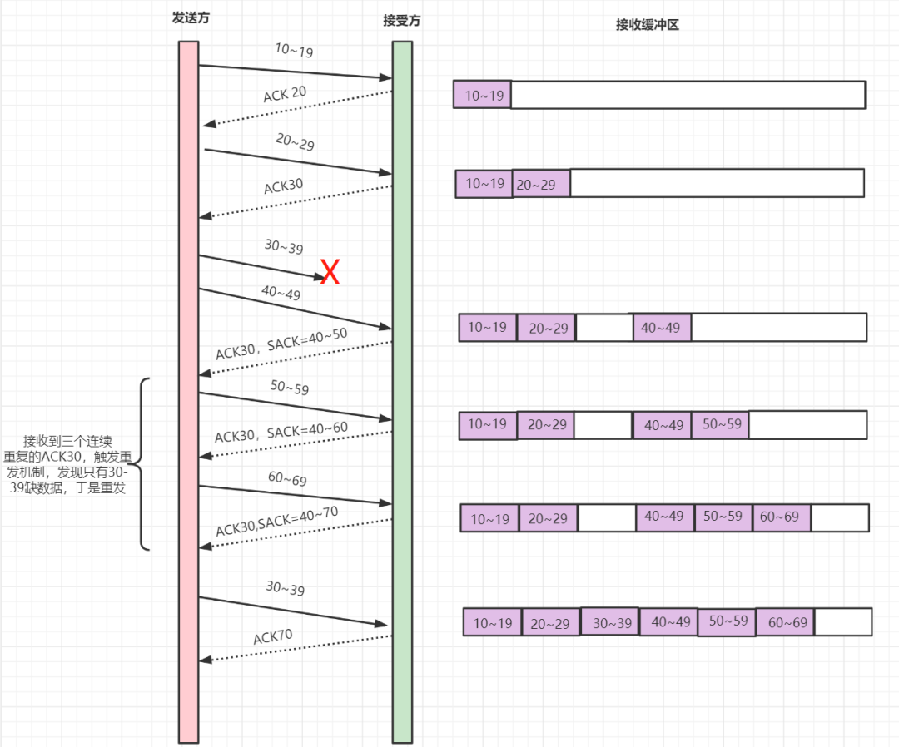


### Duplicate SACK（哪些重复了）

Duplicate SACK 又称 **D-SACK** ，其主要**使用了 SACK 来告诉「发送方」有哪些数据被重复接收了。**
可见， D-SACK 有这么几个好处：

1. 可以让「发送方」知道，是发出去的包丢了，还是接收方回应的 ACK 包丢了;
2. 可以知道是不是「发送方」的数据包被网络延迟了;
3. 可以知道网络中是不是把「发送方」的数据包给复制了;

在 Linux 下可以通过 net.ipv4.tcp_dsack 参数开启/关闭这个功能（Linux 2.4 后默认打开）。

---

D-SACK，即Duplicate SACK（重复SACK），在SACK的基础上做了一些扩展，主要用来告诉发送方，有哪些数据包自己重复接受了。DSACK的目的是**帮助发送方判断**，是否发生了包失序、ACK丢失、包重复或伪重传。**让TCP可以更好的做网络流控。**

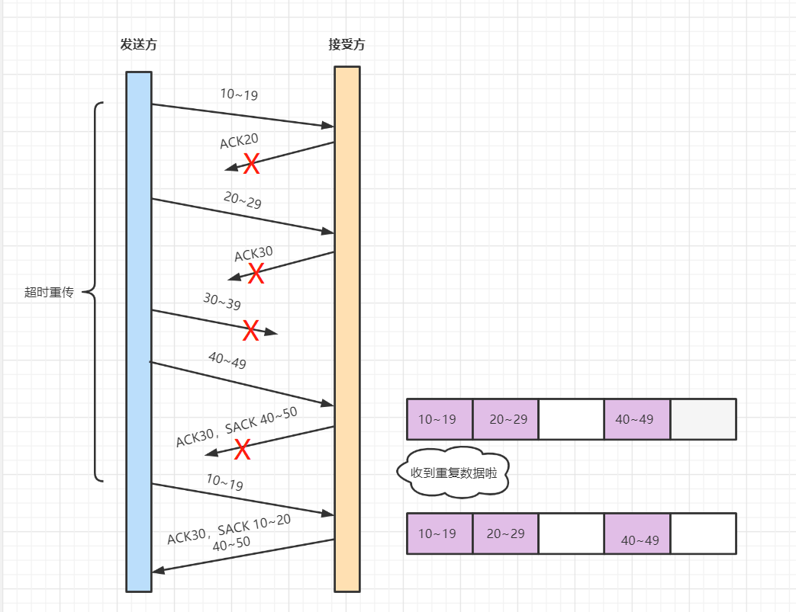

## 滑动窗口

窗口大小就是指**无需等待确认应答，而可以继续发送数据的最大值。**
TCP 头里有一个字段叫 Window ，也就是窗口大小。
这个字段是**接收端告诉发送端自己还有多少缓冲区可以接收数据。于是发送端就可以根据这个接收端的处理能力来发送数据，而不会导致接收端处理不过来。** | 通俗点讲，就是接受方每次收到数据包，在发送确认报文的时候，同时告诉发送方，自己的缓存区还有多少空余空间，缓冲区的空余空间，我们就称之为接受窗口大小。这就是win。
所以，通常窗口的大小是由**接收方的窗口大小**来决定的。
发送方发送的数据大小不能超过接收方的窗口大小，否则接收方就无法正常接收到数据。

### 发送方

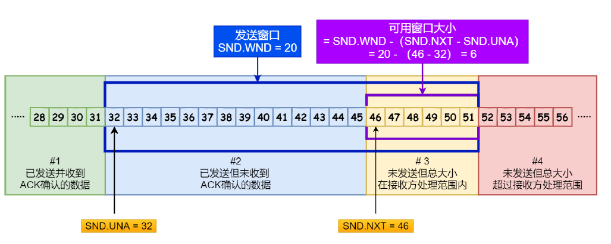

> 如何表示这四个部分？

TCP 滑动窗口方案使用三个指针来跟踪在四个传输类别中的每一个类别中的字节。其中两个指针是绝对指针（指特定的序列号），一个是相对指针（需要做偏移）。

+ SND.WND ：表示发送窗口的大小（大小是由接收方指定的）；
+ SND.UNA ：是一个绝对指针，它指向的是已发送但未收到确认的第一个字节的序列号，也就是#2 的第一个字节。
+ SND.NXT ：也是一个绝对指针，它指向未发送但可发送范围的第一个字节的序列号，也就是 #3的第一个字节。
+ 指向 #4 的第一个字节是个相对指针，它需要 SND.UNA 指针加上 SND.WND 大小的偏移量，就可以指向 #4 的第一个字节了。

那么可用窗口大小的计算就可以是： ` 可用窗口大小 = SND.WND -（SND.NXT - SND.UNA）`

### 接收方

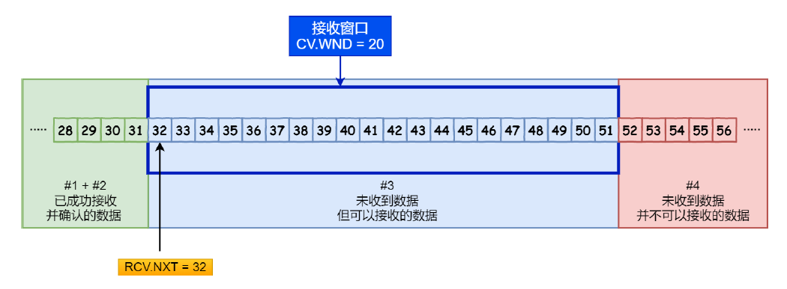

接收窗口的大小是**约等于**发送窗口的大小的。

## 流量控制

流量控制是一个**速度匹配服务，让发送方的发送速率与接收方的读取速率相匹配。**

> 怎么让发送方避免发送小数据？

使用 Nagle 算法，该算法的思路是延时处理，它满足以下两个条件中的一条才可以发送数据：

+ 要等到窗口大小 >= MSS 或是 数据大小 >= MSS
+ 收到之前发送数据的 ack 回包

只要没满足上面条件中的一条，发送方一直在囤积数据，直到满足上面的发送条件。
另外，Nagle 算法默认是打开的，如果对于一些需要小数据包交互的场景的程序，比如，telnet 或 ssh这样的交互性比较强的程序，则需要关闭 Nagle 算法。

## 拥塞控制——加性增，乘性减

拥塞控制是**作用于==网络==的，防止过多的数据包注入到网络中，避免出现网络负载过大的情况**。它的目标主要是最大化利用网络上瓶颈链路的带宽。它跟**流量控制**又有什么区别呢？流量控制是作用于==**接收者**==的，根据**接收端的实际接收能力控制发送速度**，防止分组丢失的。

TCP发送方”丢包”事件定义为：超时；3个冗余ACK。
TCP拥塞控制算法：**1. 慢启动； 2. 拥塞避免； 3.快速恢复。**前两个是TCP的强制部分。

> 拥塞窗口

拥塞窗口 cwnd是发送方维护的一个的状态变量，它会根据网络的拥塞程度动态变化的。
拥塞窗口 cwnd 变化的规则：只要网络中没有出现拥塞， cwnd 就会增大；但网络中出现了拥塞， cwnd 就减少。

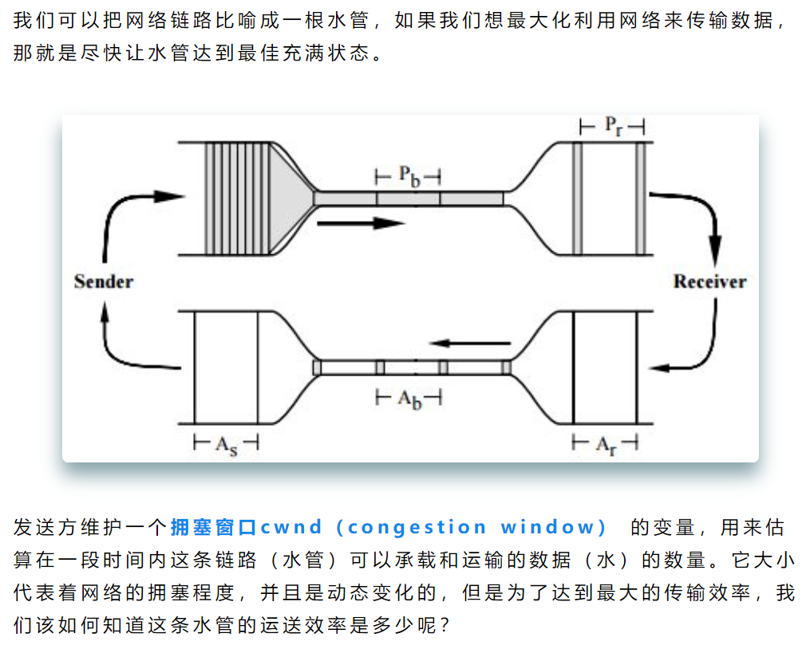

### 慢启动

指数增长。发送方从1个MSS开始，每收到一个确认报文，拥塞窗口cwnd大小就加1，指数性的增长。

慢启动算法，表面意思就是，别急慢慢来。它表示TCP建立连接完成后，一开始不要发送大量的数据，而是先探测一下网络的拥塞程度。由小到大逐渐增加拥塞窗口的大小，如果没有出现丢包，**每收到一个ACK，就将拥塞窗口cwnd大小就加1（单位是MSS）**。**每轮次**发送窗口增加一倍，呈**指数增长**，如果出现丢包，拥塞窗口就减半，进入拥塞避免阶段。

为了防止cwnd增长过大引起网络拥塞，还需设置一个**慢启动阀值ssthresh**（slow start threshold）状态变量。当`cwnd`到达该阀值后，就好像水管被关小了水龙头一样，减少拥塞状态。即当**cwnd >ssthresh**时，进入了**拥塞避免**算法。

> 何时结束？

+ 若出现超时，则将cwnd设为1并重新开始慢启动过程，同时将ssthresh（慢启动阈值）设置为cwnd/2。
+ 达到或超过ssthresh，进入拥塞避免模式。
+ 检测到3个冗余ACK，执行快速重传，进入快速恢复状态。

### 拥塞避免

**线性增长**。每当收到一个 ACK 时，cwnd 增加 1/cwnd。发送的都收集齐后，增长1；当每过一个RTT时，cwnd = cwnd + 1

> 何时结束？

+ 出现超时，cwnd = 1，ssthresh设为cwnd/2
+ 若为冗余ACK，将cwnd的值减半，将ssthresh的值记录为cwnd的值的一半。接下来进入快速恢复状态。

### 拥塞发生

当网络拥塞发生**丢包**时，会有两种情况：

- RTO超时重传
- 快速重传

如果是发生了**RTO超时重传**，就会使用拥塞发生算法。<u>“辛辛苦苦几十年，一夜回到解放前。”</u>

- 慢启动阀值sshthresh =  cwnd /2
- cwnd 重置为 1
- 进入新的慢启动过程

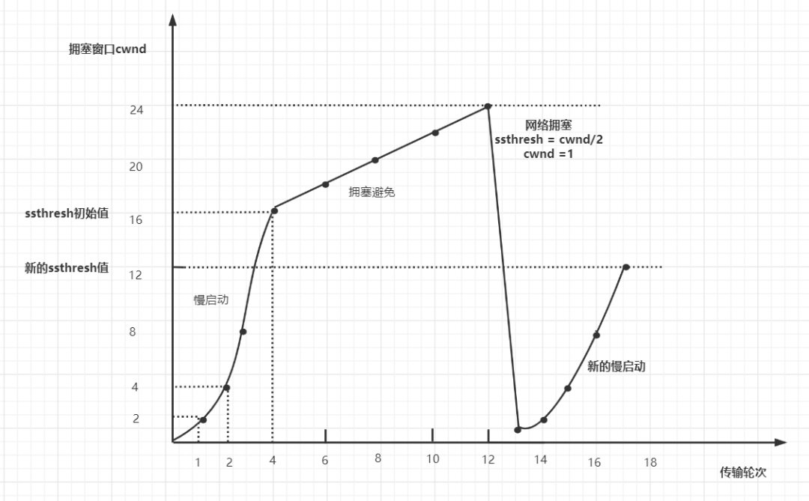

快速重传时，慢启动阀值ssthresh 和 cwnd 变化如下：

- 拥塞窗口大小 cwnd = cwnd/2
- 慢启动阀值 ssthresh = cwnd
- 进入快速恢复算法

### 快速恢复

然后，进入快速恢复算法如下：

+ 拥塞窗口 `cwnd = ssthresh + 3` （ 3 的意思是确认有 3 个数据包被收到了）；
+ 重传丢失的数据包；
+ 如果再收到重复的 ACK，那么 cwnd 增加 1；
+ 如果收到新数据的 ACK 后，把 cwnd 设置为第一步中的 ssthresh 的值，原因是该 ACK 确认了新的数据，说明从 duplicated ACK 时的数据都已收到，该恢复过程已经结束，可以回到恢复之前的状态了，也即再次进入拥塞避免状态；

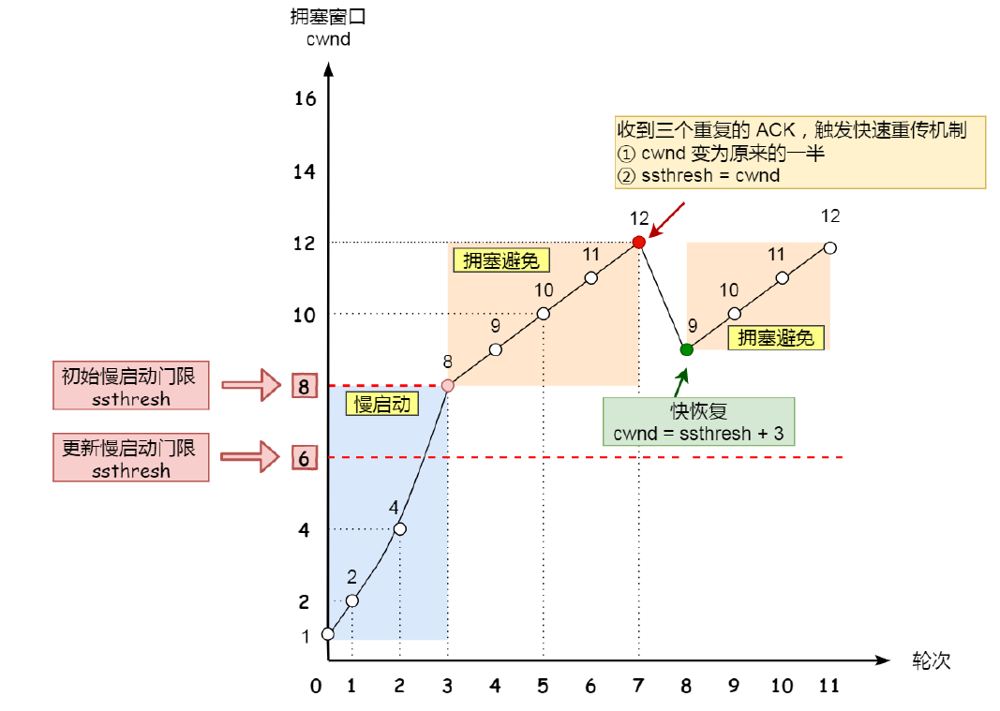

## 抓包

> 为什么抓到的TCP挥手是三次而不是四次？

因为服务器端收到客户端的 `FIN` 后，服务器端同时也要关闭连接，这样就可以把 `ACK` 和 `FIN` 合并到一起发送，节省了一个包，变成了“三次挥手”。

而通常情况下，服务器端收到客户端的` FIN` 后，很可能还没发送完数据，所以就会先回复客户端一个`ACK` 包，稍等一会儿，完成所有数据包的发送后，才会发送 `FIN` 包，这也就是四次挥手了。

## 三次握手异常情况

### 第一次握手的SYN丢了（客户端重传）

客户端发起了 SYN 包后，一直没有收到服务端的 ACK ，所以一直**超时重传**了 5次，并且每次 RTO 超时时间是不同的：
	第一次是在 1 秒超时重传
	第二次是在 3 秒超时重传
	第三次是在 7 秒超时重传
	第四次是在 15 秒超时重传
	第五次是在 31 秒超时重传

在 Linux 中，第一次握手的 SYN 超时重传次数，是如下内核参数指定的：`tcp_syn_retries`，值为5.

### 第二次握手SYN、ACK丢包（双方都重传）

​	服务端收到客户的 SYN 包后，就会回 SYN、ACK 包，但是客户端一直没有回 ACK，服务端在超时后，重传了 SYN、ACK 包，接着一会，客户端超时重传的 SYN 包又抵达了服务端，服务端收到后，超时定时器就重新计时，然后回了 SYN、ACK 包，所以相当于服务端的超时定时器只触发了一次，又被重置了。
​	最后，客户端 SYN 超时重传次数达到了 5 次（tcp_syn_retries 默认值 5 次），就不再继续发送SYN 包了。

**当第二次握手的 SYN、ACK 丢包时，客户端会超时重发 SYN 包，服务端也会超时重传 SYN、ACK 包。**

客户端 SYN 包超时重传的最大次数，是由 `tcp_syn_retries` 决定的，默认值是 5 次；服务端 SYN、ACK 包时重传的最大次数，是由 `tcp_synack_retries` 决定的，默认值是 5 次。

### 第三次握手ACK丢包（稍复杂）

由于服务端收不到第三次握手的 ACK 包，所以一直处于 `SYN_RECV` 状态, 而客户端是已完成 TCP 连接建立，处于 `ESTABLISHED` 状态，过了 1 分钟后，观察发现服务端的 TCP 连接不见了。

服务端一直处于 SYN_RECV 状态，没有进入 ESTABLISHED 状态。服务端超时重传了 SYN、ACK 包，重传了 5 次后，也就是超过 tcp_synack_retries 的值（默认值是 5），然后就没有继续重传了，此时服务端的 TCP 连接主动中止了，所以刚才处于SYN_RECV 状态的 TCP 连接断开了，而客户端依然处于ESTABLISHED 状态；

而客户端一直处于ESTABLISHED状态，若此时发送字符传送，客户端发送的数据报文，一直在超时重传，每一次重传，RTO 的值是指数增长的，所以持续了好长一段时间，客户端的 telnet 才报错退出了，此时共重传了 **15次**。

TCP 建立连接后的数据包传输，最大超时重传次数是由**`tcp_retries2`** 指定，默认值是 15 次。如果一直不传数据，则采用保活机制，大概2小时多以后断开。

## TCP快速建立连接

客户端在向服务端发起 HTTP GET 请求时，一个完整的交互过程，需要 2.5 个 RTT 的时延。由于第三次握手是可以携带数据的，这时如果在第三次握手发起 HTTP GET 请求，需要 2 个 RTT 的时延。

在 Linux 3.7 内核版本中，提供了 TCP Fast Open 功能，这个功能可以减少 TCP 连接建立的时延。

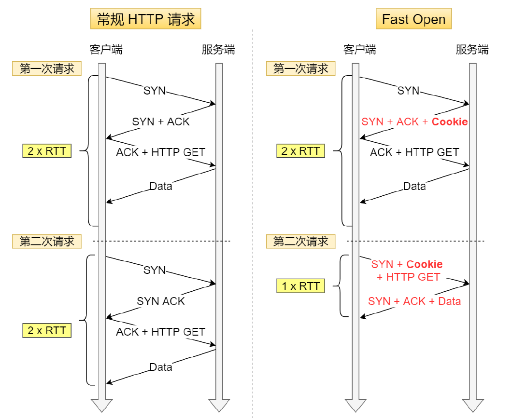

+ 在第一次建立连接的时候，服务端在第二次握手产生一个 Cookie （已加密）并通过 SYN、ACK包一起发给客户端，于是客户端就会**缓存这个 Cookie** ，所以第一次发起 HTTP Get 请求的时候，还是需要 2 个 RTT 的时延；
+ 在下次请求的时候，客户端在 SYN 包带上 Cookie 发给服务端，就**提前可以跳过三次握手的过程，因为 Cookie 中维护了一些信息**，服务端可以从 Cookie 获取 TCP 相关的信息，这时发起的 HTTP GET 请求就只需要 1 个 RTT 的时延；

注：客户端在请求并存储了 Fast Open Cookie 之后，可以不断重复 TCP Fast Open 直至服务器认为Cookie 无效（通常为过期）

## TCP延时确认与Nagle算法

当我们 TCP 报文的承载的数据非常小的时候，例如几个字节，那么整个网络的效率是很低的，因为每个 TCP 报文中都会有 20 个字节的 TCP 头部，也会有 20 个字节的 IP 头部，而数据只有几个字节，所以在整个报文中有效数据占有的比重就会非常低。这就好像快递员开着大货车送一个小包裹一样浪费。

### Nagle算法

Nagle 算法的策略：

+ 没有已发送未确认报文时，立刻发送数据。
+ 存在未确认报文时，直到「没有已发送未确认报文」或「数据长度达到 MSS 大小」时，再发送数
  据。

只要没满足上面条件中的一条，发送方一直在囤积数据，直到满足上面的发送条件。

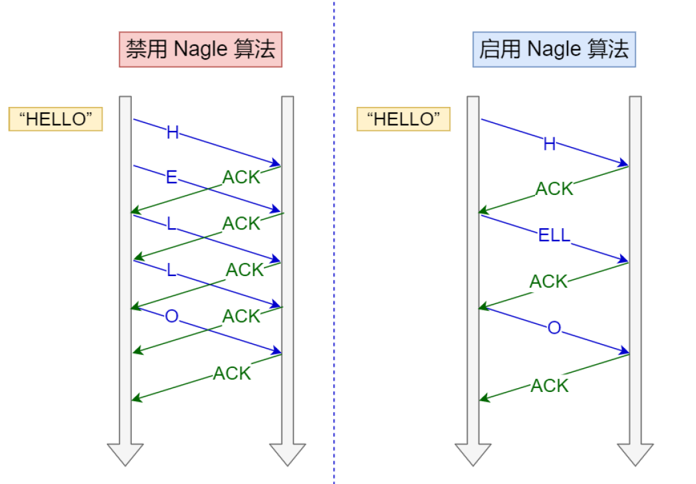

可以看出，**Nagle 算法一定会有一个小报文，也就是在最开始的时候。**

### 延迟确认

TCP 延迟确认的策略：

+ 当有响应数据要发送时，ACK 会随着响应数据一起立刻发送给对方
+ 当没有响应数据要发送时，ACK 将会延迟一段时间，以等待是否有响应数据可以一起发送
+ 如果在延迟等待发送 ACK 期间，对方的第二个数据报文又到达了，这时就会立刻发送 ACK

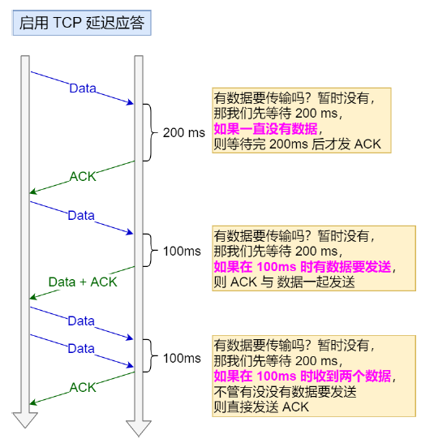

一般情况下，**Nagle算法和延迟确认**不能一起使用，Nagle算法意味着延迟发，**延迟确认**意味着延迟接收，酱紫就会造成更大的延迟，会产生性能问题。

## 拆包粘包

TCP是面向流，没有界限的一串数据。TCP底层并不了解上层业务数据的具体含义，它会根据TCP缓冲区的实际情况进行包的划分，所以在业务上认为，一**个完整的包可能会被TCP拆分成多个包进行发送**，**也有可能把多个小的包封装成一个大的数据包发送**，这就是所谓的TCP粘包和拆包问题。

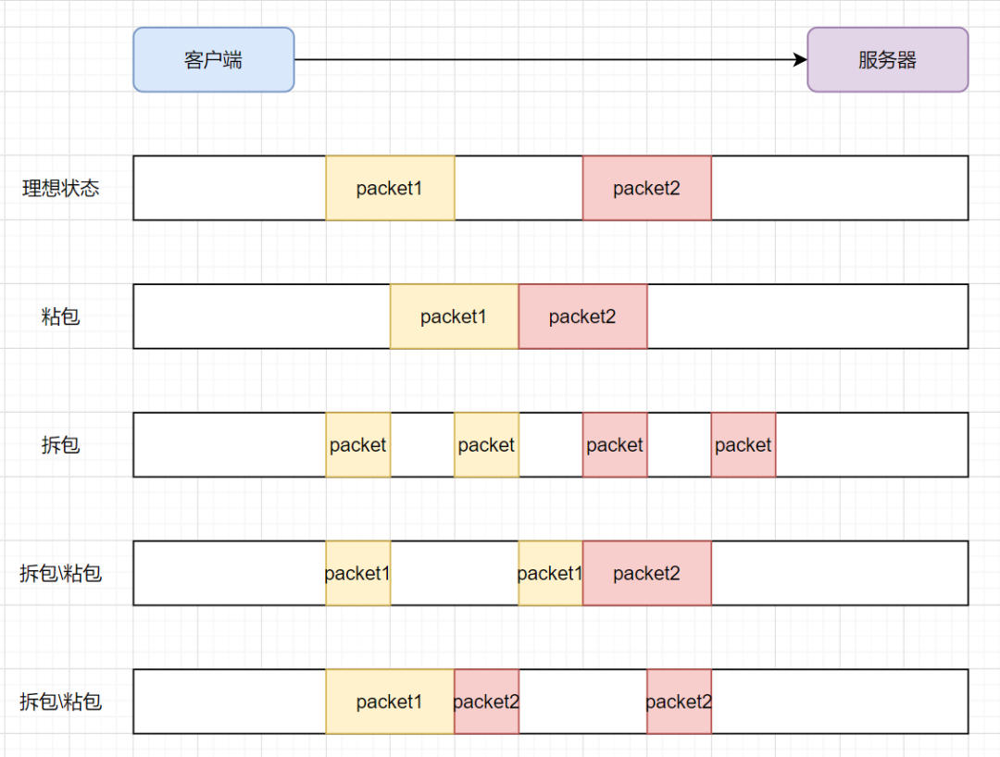

**为什么会产生粘包和拆包呢?**

- 【粘包】要**发送的数据小**于TCP发送缓冲区的大小，TCP将多次写入缓冲区的数据一次发送出去，将会发生粘包；
- 【粘包】接收数据端的应用层**没有及时读取**接收缓冲区中的数据，将发生粘包；
- 【拆包】要<u>发送的数据大于TCP发送缓冲区剩余空间大小</u>，将会发生拆包；
- 【拆包】待发送<u>数据大于MSS</u>（最大报文长度），TCP在传输前将进行拆包。即TCP报文长度-TCP头部长度>MSS。

**解决方案：**

- 发送端将每个**数据包封装为固定长度**
- 在数据尾部增加**特殊字符进行分割**
- 将数据分为两部分，一部分是头部，一部分是内容体；其中头部结构大小固定，且有一个字段声明内容体的大小。

## 半连接队列 全连接队列

网上许多博客针对增大 TCP 半连接队列和全连接队列的方式如下：

+ 增大 TCP 半连接队列的方式是增大 /proc/sys/net/ipv4/tcp_max_syn_backlog；
+ 增大 TCP 全连接队列的方式是增大 listen() 函数中的 backlog；

这里先跟大家说下，上面的方式都是不准确的。

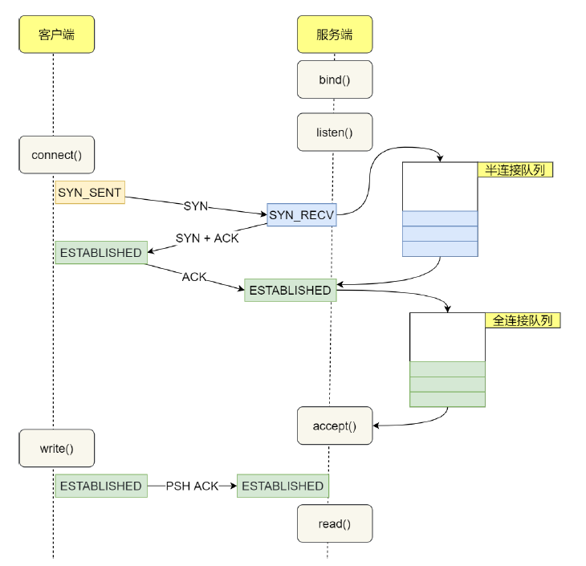

实际上，丢弃连接只是 Linux 的默认行为，我们还可以选择向客户端发送 RST 复位报文，告诉客户端连接已经建立失败。

TCP 全连接队列的最大值取决于 somaxconn 和 backlog 之间的最小值，也就是 min(somaxconn,backlog)。
somaxconn 是 Linux 内核的参数，默认值是 128，可以通过 /proc/sys/net/core/somaxconn 来设置其值；
backlog 是 listen(int sockfd, int backlog) 函数中的 backlog 大小，Nginx 默认值是 511，可以通过修改配置文件设置其长度；
所以测试环境的 TCP 全连接队列最大值为 min(128, 511)，也就是 128 ，可以执行 ss 命令查看。

如果持续不断地有连接因为 TCP 全连接队列溢出被丢弃，就应该调大 backlog 以及 somaxconn 参数。

### syncookies

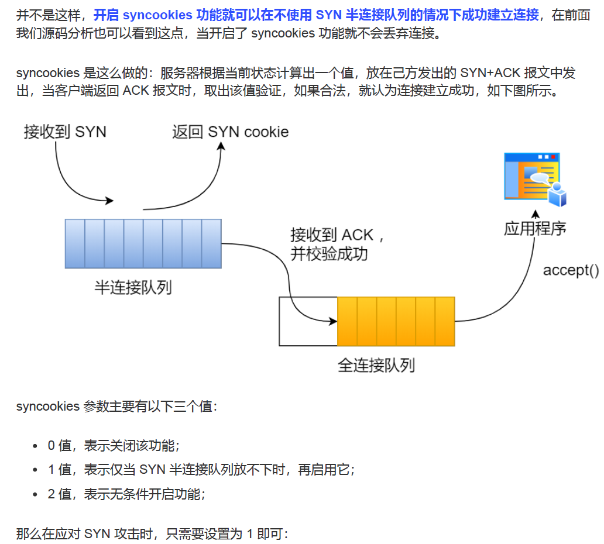

### 防御SYN攻击

**1. 增大半连接队列**：要想增大半连接队列，我们得知不能只单纯增大 tcp_max_syn_backlog 的值，还需一同增大 somaxconn 和 backlog，也就是增大全连接队列。否则，只单纯增大tcp_max_syn_backlog 是无效的。

**2. 启用syncookies**

**3. 减少SYN+ACK重传次数**：当服务端受到 SYN 攻击时，就会有大量处于 SYN_REVC 状态的 TCP 连接，处于这个状态的 TCP 会重传 SYN+ACK ，当重传超过次数达到上限后，就会断开连接。那么针对 SYN 攻击的场景，我们可以减少 SYN+ACK 的重传次数，以加快处于 SYN_REVC 状态的TCP 连接断开。

## 为什么打开 TCP 套接字有很大的开销？

chatgpt回答：

打开TCP套接字（Socket）的过程中，系统会执行一系列初始化和配置的操作，这些操作会带来较大的开销，包括：

1. 内核空间和用户空间的切换：打开套接字需要在内核中执行，这涉及到从用户空间切换到内核空间，这个过程需要花费相对较长的时间。
2. 分配内存：系统需要为套接字分配内存，包括存储套接字的结构体和缓冲区等。
3. 绑定地址：打开套接字需要绑定本地IP地址和端口，这也需要在内核空间中执行，并且需要一定的时间。
4. TCP 三次握手：在TCP连接的建立过程中，需要进行三次握手，这个过程中需要来回交换数据包，而且需要等待对方的确认，因此也需要时间。

因此，每次打开TCP套接字都需要进行一系列的操作，这些操作都需要一定的时间和资源，因此打开TCP套接字的开销较大。为了降低开销，通常可以采用**连接池**等技术来复用已经建立的连接。

## TCP/IP攻击

伪造IP攻击，SYN Flooding，UDP Flooding，TCP重置攻击，中间人攻击。

## 大文件断点续传

### 大文件上传：
将原文件分片，这样我们就可以根据预先设置好的切片最大数量将文件切分为一个个切片，然后借助 http 的可并发性，同时上传多个切片，这样<u>从原本传一个大文件，变成了`同时`传多个小的文件切片</u>，可以大大减少上传时间。另外由于是并发，传输到服务端的顺序可能会发生变化，所以我们还需要<u>给每个切片记录顺序.</u>

服务端需要负责接受这些切片，并在接收到所有切片后`合并`切片。
这里又引伸出两个问题

1. 何时合并切片，即切片什么时候传输完成
2. 如何合并切片

第一个问题需要前端进行配合，前端在每个切片中都携带切片最大数量的信息，当服务端接受到这个数量的切片时自动合并，也可以额外发一个请求主动通知服务端进行切片的合并。
第二个问题，具体如何合并切片呢？这里可以使用 nodejs 的 读写流（readStream/writeStream），将所有切片的流传输到最终文件的流里。

### 断点续传

断点续传的原理在于前端/服务端需要`记住`已上传的切片，这样下次上传就可以跳过之前已上传的部分，有两种方案实现记忆的功能

- 前端使用 localStorage 记录已上传的切片 hash
- 服务端保存已上传的切片 hash，前端每次上传前向服务端获取已上传的切片

第一种是前端的解决方案，第二种是服务端，而前端方案有一个缺陷，如果换了个浏览器就失去了记忆的效果，所以这里选取后者。

#### hash

hash是根据文件内容计算hash值，计算慢的话单开一个线程。

#### 文件秒传

所谓的文件秒传，即在服务端已经存在了上传的资源，所以当用户`再次上传`时会直接提示上传成功。
文件秒传需要依赖上一步生成的 hash，即在`上传前`，先计算出文件 hash，并把 hash 发送给服务端进行验证，由于 hash 的唯一性，所以一旦服务端能找到 hash 相同的文件，则直接返回上传成功的信息即可。秒传其实就是给用户看的障眼法，实质上根本没有上传。

---

讲完了生成 hash 和文件秒传，回到断点续传，断点续传顾名思义即断点 + 续传，所以我们第一步先实现“断点”，也就是暂停上传。