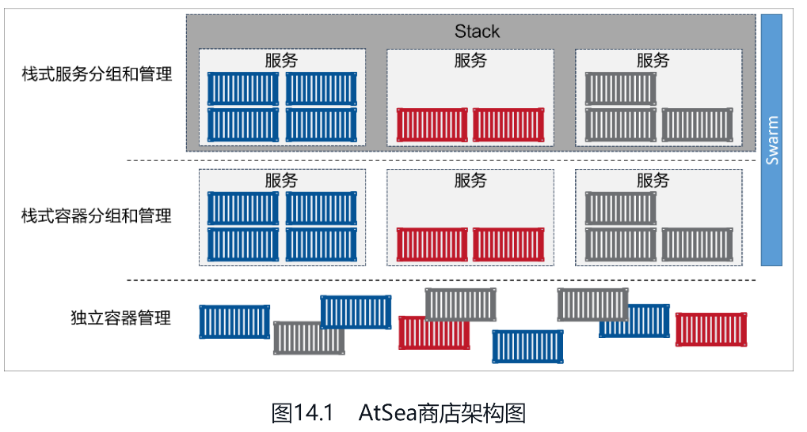

# Docker引擎

至本书撰写时，Docker引擎由如下主要的组件构成：Docker客户端（DockerClient）、Docker守护进程（Docker daemon）、containerd以及runc。它们共同负责容器的创建和运行。


Docker首次发布时，Docker引擎由两个核心组件构成：LXC和Docker daemon。

Docker daemon是单一的二进制文件，包含诸如Docker客户端、Docker API、容器运行时、镜像构建等。
LXC提供了对诸如命名空间（Namespace）和控制组（CGroup）等基础工具的操作能力，它们是基于Linux内核的容器虚拟化技术。


但是，需要1）摆脱LXC的依赖，LXC是基于Linux的。这对于一个立志于跨平台的项目来说是个问题。2）摒弃大而全的Docker daemon

目前Docker引擎的架构示意图如图5.3所示，图中有简要的描述。


## runc

runc是OCI容器运行时规范的参考实现。

去粗取精，会发现runc实质上是一个轻量级的、针对Libcontainer进行了包装的命令行交互工具（Libcontainer取代了早期Docker架构中的LXC）。

runc生来只有一个作用——创建容器，这一点它非常拿手，速度很快！不过它是一个CLI包装器，实质上就是一个独立的容器运行时工具。因此直接下载它或基于源码编译二进制文件，即可拥有一个全功能的runc。但它只是一个基础工具，并不提供类似Docker引擎所拥有的丰富功能。

有时也将runc所在的那一层称为“OCI层”，如图5.3所示。关于runc的发布信息见GitHub中opencontainers/runc库的release。

## containerd

在对Docker daemon的功能进行拆解后，所有的容器执行逻辑被重构到一个新的名为containerd（发音为container-dee）的工具中。它的主要任务是容器的生命周期管理——start | stop | pause | rm....

如前所述，containerd最初被设计为轻量级的小型工具，仅用于容器的生命周期管理。然而，随着时间的推移，它被赋予了更多的功能，比如镜像管理。

其原因之一在于，这样便于在其他项目中使用它。比如，在Kubernetes中，containerd就是一个很受欢迎的容器运行时。然而在Kubernetes这样的项目中，如果containerd能够完成一些诸如push和pull镜像这样的操作就更好了。因此，如今containerd还能够完成一些除容器生命周期管理之外的操作。不过，所有的额外功能都是模块化的、可选的，便于自行选择所需功能。所以，Kubernetes这样的项目在使用containerd时，可以仅包含所需的功能。

## 启动新容器

常用的启动容器的方法就是使用Docker命令行工具。下面的docker containerrun命令会基于alpine:latest镜像启动一个新容器。

```
docker container run --name ctr1 -it alpine:latest sh
```

当使用Docker命令行工具执行如上命令时，Docker客户端会将其转换为合适的API格式，并发送到正确的API端点。
API是在daemon中实现的。这套功能丰富、基于版本的REST API已经成为Docker的标志，并且被行业接受成为事实上的容器API。
一旦daemon接收到创建新容器的命令，它就会向containerd发出调用。daemon已经不再包含任何创建容器的代码了！
daemon使用一种CRUD风格的API，通过gRPC与containerd进行通信。
虽然名叫containerd，但是它并不负责创建容器，而是指挥runc去做。containerd将Docker镜像转换为OCI bundle，并让runc基于此创建一个新的容器。
然后，runc与操作系统内核接口进行通信，基于所有必要的工具（Namespace、CGroup等）来创建容器。容器进程作为runc的子进程启动，启动完毕后，runc将会退出。现在，容器启动完毕了。整个过程如图5.4所示。


## shim

shim是实现无daemon的容器（如5.2.7节所述，用于将运行中的容器与daemon解耦，以便进行daemon升级等操作）不可或缺的工具。
前面提到，containerd指挥runc来创建新容器。事实上，每次创建容器时它都会fork一个新的runc实例。不过，一旦容器创建完毕，对应的runc进程就会退出。因此，即使运行上百个容器，也无须保持上百个运行中的runc实例。一旦容器进程的父进程runc退出，相关联的containerd-shim进程就会成为容器的父进程。作为容器的父进程，shim的部分职责如下。

● 保持所有STDIN和STDOUT流是开启状态，从而当daemon重启的时候，容器不会因为管道（pipe）的关闭而终止。

● 将容器的退出状态反馈给daemon。

## daemon的作用

当所有的执行逻辑和运行时代码都从daemon中剥离出来之后，问题出现了——daemon中还剩什么？

显然，随着越来越多的功能从daemon中拆解出来并被模块化，这一问题的答案也会发生变化。不过，当本书撰写时，daemon的主要功能包括镜像管理、镜像构建、REST API、身份验证、安全、核心网络以及编排。

# Docker镜像

如果读者之前曾经是VM管理员，则可以把Docker镜像理解为VM模板，VM模板就像停止运行的VM，而Docker镜像就像停止运行的容器；如果读者是一名研发人员，可以将镜像理解为类（Class）。

读者需要先从镜像仓库服务中拉取镜像。常见的镜像仓库服务是Docker Hub，但是也存在其他镜像仓库服务。拉取操作会将镜像下载到本地Docker主机，读者可以使用该镜像启动一个或者多个容器。

镜像由多个层组成，每层叠加之后，从外部看来就如一个独立的对象。镜像内部是一个精简的操作系统（OS），同时还包含应用运行所必须的文件和依赖包。因为容器的设计初衷就是快速和小巧，所以镜像通常都比较小。

**镜像和容器**

一旦容器从镜像启动后，二者之间就变成了互相依赖的关系，并且在镜像上启动的容器全部停止之前，镜像是无法被删除的。

**查看镜像**

`docker image inspect`命令非常有用！该命令完美展示了镜像的细节，包括镜像层数据和元数据。

**拉取镜像**

Linux Docker主机本地镜像仓库通常位于/var/lib/docker/<storage-driver>。
使用`docker image ls`检查镜像。
使用`docker image pull ubuntu:latest`拉取镜像。如果没有在仓库名称后指定具体的镜像标签，则Docker会假设用户希望拉取标签为latest的镜像。

下面的示例只会返回悬虚（dangling）镜像。`docker image ls --filter dangling=true`
可以通过`docker image prune`命令移除全部的悬虚镜像。如果添加了-a参数，Docker会额外移除没有被使用的镜像（那些没有被任何容器使用的镜像）。

**根据镜像摘要拉取**

到目前为止，本书向读者介绍了如何通过标签来拉取镜像，这也是常见的方式。但问题是，标签是可变的！这意味着可能偶尔出现给镜像打错标签的情况，有时甚至会给新镜像打一个已经存在的标签。这些都可能导致问题！假设镜像golftrack:1.5存在一个已知的Bug。因此可以拉取该镜像后修复它，并使用相同的标签将更新的镜像重新推送回仓库。一起来思考下刚才发生了什么。镜像golftrack:1.5存在Bug，这个镜像已经应用于生产环境。如果创建一个新版本的镜像，并修复了这个Bug。那么问题来了，构建新镜像并将其推送回仓库时使用了与问题镜像相同的标签！原镜像被覆盖，但在生产环境中遗留了大量运行中的容器，没有什么好办法区分正在使用的镜像版本是修复前还是修复后的，因为两个镜像的标签是相同的！是时候轮到镜像摘要（Image Digest）出马了。

Docker 1.10中引入了新的内容寻址存储模型。作为模型的一部分，每一个镜像现在都有一个基于其内容的密码散列值。为了讨论方便，本书用摘要代指这个散列值。因为摘要是镜像内容的一个散列值，所以镜像内容的变更一定会导致散列值的改变。这意味着摘要是不可变的。这种方式可以解决前面讨论的问题。

**镜像散列值**

镜像本身就是一个配置对象，其中包含了镜像层的列表以及一些元数据信息。镜像层才是实际数据存储的地方（比如文件等，镜像层之间是完全独立的，并没有从属于某个镜像集合的概念）。镜像的唯一标识是一个加密ID，即配置对象本身的散列值。每个镜像层也由一个加密ID区分，其值为镜像层本身内容的散列值。这意味着修改镜像的内容或其中任意的镜像层，都会导致加密散列值的变化。所以，镜像和其镜像层都是不可变的，任何改动都能很轻松地被辨别。这就是所谓的**内容散列（Content Hash）**。

到目前为止，事情都很简单。但是接下来的内容就有点儿复杂了。在推送和拉取镜像的时候，都会对镜像层进行压缩来节省网络带宽以及仓库二进制存储空间。但是压缩会改变镜像内容，这意味着镜像的内容散列值在推送或者拉取操作之后，会与镜像内容不相符！这显然是个问题。例如，在推送镜像层到Docker Hub的时候，Docker Hub会尝试确认接收到的镜像没有在传输过程中被篡改。为了完成校验，Docker Hub会根据镜像层重新计算散列值，并与原散列值进行比较。因为镜像在传输过程中被压缩（发生了改变），所以散列值的校验也会失败。为避免该问题，每个镜像层同时会包含一个**分发散列值（Distribution Hash）**。这是一个压缩版镜像的散列值，当从镜像仓库服务拉取或者推送镜像的时候，其中就包含了分发散列值，该散列值会用于校验拉取的镜像是否被篡改过。这个内容寻址存储模型极大地提升了镜像的安全性，因为在拉取和推送操作后提供了一种方式来确保镜像和镜像层数据是一致的。该模型也解决了随机生成镜像和镜像层ID这种方式可能导致的ID冲突问题。

## 镜像和分层

所有的Docker镜像都起始于一个基础镜像层，当进行修改或增加新的内容时，就会在当前镜像层之上，创建新的镜像层。

举一个简单的例子，假如基于Ubuntu Linux 16.04创建一个新的镜像，这就是新镜像的第一层；如果在该镜像中添加Python包，就会在基础镜像层之上创建第二个镜像层；如果继续添加一个安全补丁，就会创建第三个镜像层。该镜像当前已经包含3个镜像层，如图6.5所示（这只是一个用于演示的很简单的例子）。


## 镜像删除

下面的示例中通过镜像ID来删除镜像，可能跟读者机器上镜像ID有所不同。`docker image rm 02674b9cb179`
如果被删除的镜像上存在运行状态的容器，那么删除操作不会被允许。再次执行删除镜像命令之前，需要停止并删除该镜像相关的全部容器。

一种删除某Docker主机上全部镜像的快捷方式是在docker image rm命令中传入当前系统的全部镜像ID，可以通过docker image ls获取全部镜像ID（使用-q参数）。

`docker image rm $(docker image ls -q) -f`

## 镜像命令

● docker image pull是下载镜像的命令。镜像从远程镜像仓库服务的仓库中下载。默认情况下，镜像会从Docker Hub的仓库中拉取。docker image pullalpine:latest命令会从Docker Hub的alpine仓库中拉取标签为latest的镜像。

● docker image ls列出了本地Docker主机上存储的镜像。可以通过--digests参数来查看镜像的SHA256签名。

● docker image inspect命令非常有用！该命令完美展示了镜像的细节，包括镜像层数据和元数据。

● docker image rm用于删除镜像。docker image rm alpine:latest命令的含义是删除alpine:latest镜像。当镜像存在关联的容器，并且容器处于运行（Up）或者停止（Exited）状态时，不允许删除该镜像。

# Docker容器

容器是镜像的运行时实例。正如从虚拟机模板上启动VM一样，用户也同样可以从单个镜像上启动一个或多个容器。虚拟机和容器最大的区别是容器更快并且更轻量级——与虚拟机运行在完整的操作系统之上相比，容器会共享其所在主机的操作系统/内核。

启动容器的简便方式是使用`docker container run`命令。该命令可以携带很多参数，在其基础的格式`docker container run <image> <app>`中，指定了启动所需的镜像以及要运行的应用。`docker container run -it ubuntu /bin/bash`则会启动某个Ubuntu Linux容器，并运行Bash Shell作为其应用。
`-it`参数可以将当前终端连接到容器的Shell终端之上。

## 检查Docker Daemon运行

通常登录Docker主机后的第一件事情是检查Docker是否正在运行。使用`docker version`.
当命令输出中包含Client和Server的内容时，可以继续下面的示例。如果在Server部分中包含了错误码，这表示Docker daemon很可能没有运行，或者当前用户没有权限访问。

## 启动容器

`docker container run -it ubuntu:latest /bin/bash`

命令的基础格式为`docker container run <options> <image>:<tag><app>`。示例中使用docker container run来启动容器，这也是启动新容器的标准命令。命令中使用了**`-it`参数使容器具备交互性并与终端进行连接**。接下来，命令中指定了具体镜像ubuntu:latest或者microsoft/powershell:nanoserver。最终，在命令中指定了运行在容器中的程序，Linux示例中是Bash Shell，Windows示例中为PowerShell。

使用了`-d`参数启动容器，并在后台运行。这种后台启动的方式不会将当前终端连接到容器当中。
`docker container run -d --name webserver -p 80:8080 nigelpoulton/pluralsight-docker-ci`
已经知道docker container run会启动一个新容器，但是这次使用-d参数替换了-it。-d表示后台模式，告知容器在后台运行。
然后为容器命名，并且指定了`-p 80:8080`。`-p`参数将Docker主机的端口映射到容器内。本例中，将Docker主机的80端口映射到了容器内的8080端口。这意味着当有流量访问主机的80端口的时候，流量会直接映射到容器内的8080端口。之所以如此是因为当前使用的镜像，其Web服务监听了8080端口。这意味着容器启动时会运行一个Web服务，监听8080端口。

按下**Ctrl-PQ组合键**则会退出容器但并不终止容器运行。这样做会切回到Docker主机的Shell，并保持容器在后台运行。
当前容器仍然在运行，并且可以通过`docker container exec`命令将终端重新连接到Docker，理解这一点很重要。
`docker container exec -it 3027eb644874 bash`.

输入exit退出容器。

## 重启

截至本书撰写时，容器支持的重启策略包括`always`、`unless-stopped`和`on-failed`。

`always`策略是一种简单的方式。除非容器被明确停止，比如通过docker containerstop命令，否则该策略会一直尝试重启处于停止状态的容器。一种简单的证明方式是启动一个新的交互式容器，并在命令后面指定`--restart always`策略，同时在命令中指定运行Shell进程。当容器启动的时候，会登录到该Shell。退出Shell时会杀死容器中PID为1的进程，并且杀死这个容器。但是因为指定了`--restart always`策略，所以容器会自动重启。如果运行`docker container ls`命令，就会看到容器的启动时间小于创建时间。下面请看示例。


注意，容器于35s前被创建，但却在1s前才启动。这是因为在容器中输入退出命令的时候，容器被杀死，然后Docker又重新启动了该容器。

--restart always策略有一个很有意思的特性，当daemon重启的时候，停止的容器也会被重启。例如，新创建一个容器并指定--restart always策略，然后通过docker container stop命令停止该容器。现在容器处于Stopped (Exited)状态。但是，如果重启Docker daemon，当daemon启动完成时，该容器也会重新启动。

always和unless-stopped的最大区别，就是那些指定了--restart unless-stopped并处于Stopped (Exited)状态的容器，不会在Docker daemon重启的时候被重启。

on-failure策略会在退出容器并且返回值不是0的时候，重启容器。就算容器处于stopped状态，在Docker daemon重启的时候，容器也会被重启。

## 查看容器详情

在前面的示例当中，读者可能发现当运行docker container run命令的时候，并没有指定容器中的具体应用。但是容器却启动了一个简单的Web服务。这是如何发生的？

当构建Docker镜像的时候，可以通过嵌入指令来列出希望容器运行时启动的默认应用。如果运行`docker image inspect`命令来查看运行容器时使用的镜像，就能看到容器启动时将要运行的应用列表了。


Cmd一项中展示了容器将会执行的命令或应用，除非在启动的时候读者指定另外的应用。如果去掉示例脚本中的转义字符，可以得到这样的命令：`/bin/sh -c "cd/src && node ./app.js`。这是基于该镜像的容器会默认运行的应用。

## 命令

● `docker container run`是启动新容器的命令。该命令的最简形式接收镜像和命令作为参数。镜像用于创建容器，而命令则是希望容器运行的应用。`docker container run -it ubuntu /bin/bash`命令会在前台启动一个Ubuntu容器，并运行Bash Shell。

● `Ctrl-PQ`会断开Shell和容器终端之间的链接，并在退出后保持容器在后台处于运行（UP）状态。

● `docker container ls`用于列出所有在运行（UP）状态的容器。如果使用-a标记，还可以看到处于停止（Exited）状态的容器。

● `docker container exec`允许用户在运行状态的容器中，启动一个新进程。该命令在将Docker主机Shell连接到一个运行中容器终端时非常有用。`dockercontainer exec -it <container-name or container-id> bash`命令会在容器内部启动一个Bash Shell进程，并连接到该Shell。为了使该命令生效，用于创建容器的镜像必须包含Bash Shell。

● `docker container stop`命令会停止运行中的容器，并将状态置为Exited(0)。该命令通过发送SIGTERM信号给容器内PID为1的进程达到目的。如果进程没有在10s之内得到清理并停止运行，那么会接着发送SIGKILL信号来强制停止该容器。`docker container stop`可以接收容器ID以及容器名称作为参数。

● `docker container start`会重启处于停止（Exited）状态的容器。可以在`dockercontainer start`命令中指定容器的名称或者ID。

● `docker container rm`会删除停止运行的容器。可以通过容器名称或者ID来指定要删除的容器。推荐首先使用`docker container stop`命令停止容器，然后使用`docker container rm`来完成删除。

● `docker container inspect`命令会显示容器的配置细节和运行时信息。该命令接收容器名称和容器ID作为主要参数。

为镜像打标签命令的格式是`docker image tag <current-tag> <new-tag>`，其作用是为指定的镜像添加一个额外的标签，并且不需要覆盖已经存在的标签。

# 应用容器化

将应用整合到容器中并且运行起来的这个过程，称为“容器化”（Containerizing），有时也叫作“Docker化”（Dockerizing）。

完整的应用容器化过程主要分为以下几个步骤。

（1）编写应用代码。

（2）创建一个Dockerfile，其中包括当前应用的描述、依赖以及该如何运行这个应用。

（3）对该Dockerfile执行docker image build命令。

（4）等待Docker将应用程序构建到Docker镜像中。一旦应用容器化完成（即应用被打包为一个Docker镜像），就能以镜像的形式交付并以容器的方式运行了。


## Dockerfile

Dockerfile主要包括两个用途。

● 对当前应用的描述。

● 指导Docker完成应用的容器化（创建一个包含当前应用的镜像）。


每个Dockerfile文件第一行都是FROM指令。FROM指令指定的镜像，会作为当前镜像的一个基础镜像层，当前应用的剩余内容会作为新增镜像层添加到基础镜像层之上。

接下来，Dockerfile中通过标签（LABEL）方式指定了当前镜像的维护者为“nigelpoulton@hotmail. com”。每个标签其实是一个键值对（Key-Value），在一个镜像当中可以通过增加标签的方式来为镜像添加自定义元数据。备注维护者信息有助于为该镜像的潜在使用者提供沟通途径，这是一种值得提倡的做法。

RUN apk add --update nodejs npm 指令使用alpine的apk包管理器将nodejs和nodejs-npm安装到当前镜像之中。RUN指令会在FROM指定的alpine基础镜像之上，新建一个镜像层来存储这些安装内容。

COPY. / src指令将应用相关文件从构建上下文复制到了当前镜像中，并且新建一个镜像层来存储。COPY执行结束之后，当前镜像共包含3层。

下一步，Dockerfile通过WORKDIR指令，为Dockerfile中尚未执行的指令设置工作目录。该目录与镜像相关，并且会作为元数据记录到镜像配置中，但不会创建新的镜像层。

然后，RUN npm install指令会根据package.json中的配置信息，使用npm来安装当前应用的相关依赖包。npm命令会在前文设置的工作目录中执行，并且在镜像中新建镜像层来保存相应的依赖文件。目前镜像一共包含4层。


因为当前应用需要通过TCP端口8080对外提供一个Web服务，所以在Dockerfile中通过EXPOSE 8080指令来完成相应端口的设置。这个配置信息会作为镜像的元数据被保存下来，并不会产生新的镜像层。

最终，通过ENTRYPOINT指令来指定当前镜像的入口程序。ENTRYPOINT指定的配置信息也是通过镜像元数据的形式保存下来，而不是新增镜像层。

Dockerfile中的注释行，都是以#开头的。除注释之外，每一行都是一条指令（Instruction）。指令的格式是指令参数如下。INSTRUCTION argument指令是不区分大小写的，但是通常都采用大写的方式。这样Dockerfile的可读性会高一些。Docker image build命令会按行来解析Dockerfile中的指令并顺序执行。部分指令会在镜像中创建新的镜像层，其他指令只会增加或修改镜像的元数据信息。

在上面的例子当中，新增镜像层的指令包括FROM、RUN以及COPY，而新增元数据的指令包括EXPOSE、WORKDIR、ENV以及ENTERPOINT。关于如何区分命令是否会新建镜像层，一个基本的原则是，如果指令的作用是向镜像中增添新的文件或者程序，那么这条指令就会新建镜像层；如果只是告诉Docker如何完成构建或者如何运行应用程序，那么就只会增加镜像的元数据。

**利用缓存构建**

<u>首先，一旦有指令在缓存中未命中（没有该指令对应的镜像层），则后续的整个构建过程将不再使用缓存</u>。在编写Dockerfile时须特别注意这一点，<u>尽量将易于发生变化的指令置于Dockerfile文件的后方执行</u>。这意味着缓存未命中的情况将直到构建的后期才会出现——从而构建过程能够尽量从缓存中获益。

## 多阶段构建

看书

## 命令

● docker image build命令会读取Dockerfile，并将应用程序容器化。使用-t参数为镜像打标签，使用-f参数指定Dockerfile的路径和名称，使用-f参数可以指定位于任意路径下的任意名称的Dockerfile。构建上下文是指应用文件存放的位置，可能是本地Docker主机上的一个目录或一个远程的Git库。

● Dockerfile中的FROM指令用于指定要构建的镜像的基础镜像。它通常是Dockerfile中的第一条指令。

● Dockerfile中的RUN指令用于在镜像中执行命令，这会创建新的镜像层。每个RUN指令创建一个新的镜像层。

● Dockerfile中的COPY指令用于将文件作为一个新的层添加到镜像中。通常使用COPY指令将应用代码赋值到镜像中。

● Dockerfile中的EXPOSE指令用于记录应用所使用的网络端口。

● Dockerfile中的ENTRYPOINT指令用于指定镜像以容器方式启动后默认运行的程序。

● 其他的Dockerfile指令还有LABEL、ENV、ONBUILD、HEALTHCHECK、CMD等。

# 使用Docker Compose部署应用

Docker Compose与Docker Stack非常类似。本章主要介绍Docker Compose，它能够在Docker节点上，以单引擎模式（Single-Engine Mode）进行**多容器应用的部署和管理**。下一章将介绍Docker Stack，它能够以Swarm模式对Docker节点上的多容器应用进行部署和管理。

部署和管理繁多的服务是困难的。而这正是Docker Compose要解决的问题。**Docker Compose并不是通过脚本和各种冗长的docker命令来将应用组件组织起来，而是通过一个声明式的配置文件描述整个应用，从而使用一条命令完成部署。**

应用部署成功后，还可以通过一系列简单的命令实现对其完整声明周期的管理。甚至，配置文件还可以置于版本控制系统中进行存储和管理。

Docker Compose是一个<u>基于Docker Engine进行安装的Python工具</u>。该工具使得用户可以在一个声明式的配置文件中定义一个多容器的应用，并通过一个简单的命令完成部署。Compose文件可以是YAML或JSON格式，其中定义了所有的容器、网络、卷以及应用所需的密码。docker-compose命令行工具会解析该文件，并调用Docker来执行部署。一旦应用完成部署，用户就可以使用不同的docker-compose子命令来管理应用的整个生命周期。

## Compose文件

Docker Compose使用YAML文件来定义多服务的应用。Docker Compose默认使用文件名docker-compose.yml。当然，用户也可以使用-f参数指定具体文件。

如下是一个简单的Compose文件的示例，它定义了一个包含两个服务（web-fe和redis）的小型Flask应用。这是一个能够对访问者进行计数并将其保存到Redis的简单的Web服务。本书中将其命名为counter-app，并将其作为后续章节的示例应用程序。


在深入研究之前粗略观察文件的基本结构，首先可以注意到，它包含4个一级key：version、services、networks、volumes。

version是必须指定的，而且总是位于文件的第一行。它定义了Compose文件格式（主要是API）的版本。建议使用最新版本。

services用于定义不同的应用服务。上边的例子定义了两个服务：一个名为web-fe的Web前端服务以及一个名为redis的内存数据库服务。Docker Compose会将每个服务部署在各自的容器中。

networks用于指引Docker创建新的网络。**默认情况下，Docker Compose会创建bridge网络**。这是一种单主机网络，只能够实现同一主机上容器的连接。当然，也可以使用driver属性来指定不同的网络类型。

volumes用于指引Docker来创建新的卷。

Compose文件中的services部分定义了两个二级key：web-fe和redis。它们各自定义了一个应用程序服务。需要明确的是，Docker Compose会将每个服务部署为一个容器，并且会使用key作为容器名字的一部分。本例中定义了两个key：web-fe和redis。因此Docker Compose会部署两个容器，一个容器的名字中会包含web-fe，而另一个会包含redis。

## 部署及管理应用

常用的启动一个Compose应用（通过Compose文件定义的多容器应用称为“Compose应用”）的方式就是docker-compose up命令。它会构建所需的镜像，创建网络和卷，并启动容器。默认情况下，docker-compose up会查找名为docker-compose.yml或docker-compose.yaml的Compose文件。如果Compose文件是其他文件名，则需要通过-f参数来指定。如下命令会基于名为prod-equus-bass.yml的Compose文件部署应用。`docker-compose -f prod-equus-bass.yml up`

请注意，Docker Compose会将项目名称（counter-app）和Compose文件中定义的资源名称（web-fe）连起来，作为新构建的镜像的名称。Docker Compose部署的所有资源的名称都会遵循这一规范。

使用`down`来停止。需要特别注意的是，counter-vol卷并没有被删除，因为卷应该是用于数据的长期持久化存储的。因此，卷的生命周期是与相应的容器完全解耦的。执行dockervolume ls可见该卷依然存在于系统中。写到卷上的所有数据都会保存下来。同样，执行docker-compose up过程中拉取或构建的镜像也会保留在系统中。因此，再次部署该应用将更加快捷。

使用`docker-compose ps`命令来查看应用的状态。

使用`docker-compose top`命令列出各个服务（容器）内运行的进程。

对于已停止的Compose应用，可以使用docker-compose rm命令来删除。这会删除应用相关的容器和网络，但是不会删除卷和镜像。

## 命令

● docker-compose up命令用于部署一个Compose应用。默认情况下该命令会读取名为docker-compose.yml或docker-compose.yaml的文件，当然用户也可以使用-f指定其他文件名。通常情况下，会使用-d参数令应用在后台启动。

● docker-compose stop命令会停止Compose应用相关的所有容器，但不会删除它们。被停止的应用可以很容易地通过docker-compose restart命令重新启动。

● docker-compose rm命令用于删除已停止的Compose应用。它会删除容器和网络，但是不会删除卷和镜像。

● docker-compose restart命令会重启已停止的Compose应用。如果用户在停止该应用后对其进行了变更，那么变更的内容不会反映在重启后的应用中，这时需要重新部署应用使变更生效。

● docker-compose ps命令用于列出Compose应用中的各个容器。输出内容包括当前状态、容器运行的命令以及网络端口。

● docker-compose down会停止并删除运行中的Compose应用。它会删除容器和网络，但是不会删除卷和镜像。

# Docker Swarm

概括来说，Swarm有两个核心组件：安全集群和编排引擎。Docker Swarm包含两方面：一个企业级的Docker安全集群，以及一个微服务应用编排引擎。

集群方面，Swarm将一个或多个Docker节点组织起来，使得用户能够以集群方式管理它们。Swarm默认内置有加密的分布式集群存储（encrypted distributedcluster store）、加密网络（Encrypted Network）、公用TLS（Mutual TLS）、安全集群接入令牌Secure Cluster Join Token）以及一套简化数字证书管理的PKI（Public Key Infrastructure）。用户可以自如地添加或删除节点，这非常棒！

编排方面，Swarm提供了一套丰富的API使得部署和管理复杂的微服务应用变得易如反掌。通过将应用定义在声明式配置文件中，就可以使用原生的Docker命令完成部署。此外，甚至还可以执行滚动升级、回滚以及扩缩容操作，同样基于简单的命令即可完成。

以往，Docker Swarm是一个基于Docker引擎之上的独立产品。自Docker 1.12版本之后，它已经完全集成在Docker引擎中，执行一条命令即可启用。到2018年，除了原生Swarm应用，它还可以部署和管理Kubernetes应用。即便在本书撰写时，对Kubernetes应用的支持也是新特性。

---

从集群角度来说，一个Swarm由一个或多个Docker节点组成。这些节点可以是物理服务器、虚拟机、树莓派（Raspberry Pi）或云实例。唯一的前提就是要求所有节点通过可靠的网络相连。

节点会被配置为管理节点（Manager）或工作节点（Worker）。管理节点负责集群控制面（Control Plane），进行诸如监控集群状态、分发任务至工作节点等操作。工作节点接收来自管理节点的任务并执行。

Swarm的配置和状态信息保存在一套位于所有管理节点上的分布式etcd数据库中。<u>该数据库运行于内存中</u>，并保持数据的最新状态。关于该数据库最棒的是，它几乎不需要任何配置——作为Swarm的一部分被安装，无须管理。

关于集群管理，最大的挑战在于保证其安全性。搭建Swarm集群时将不可避免地使用TLS，因为它被Swarm紧密集成。在安全意识日盛的今天，这样的工具值得大力推广。Swarm使用TLS进行通信加密、节点认证和角色授权。自动密钥轮换（Automatic Key Rotation）更是锦上添花！其在后台默默进行，用户甚至感知不到这一功能的存在！

关于应用编排，Swarm中的最小调度单元是**服务**。它是随Swarm引入的，在API中是一个新的对象元素，它基于容器封装了一些高级特性，是一个更高层次的概念。当容器被封装在一个服务中时，我们称之为一个任务或一个副本，服务中增加了诸如扩缩容、滚动升级以及简单回滚等特性。


## Swarm集群

搭建Swarm的过程有时也被称为初始化Swarm，大体流程包括初始化第一个管理节点>加入额外的管理节点>加入工作节点>完成。

不包含在任何Swarm中的Docker节点，称为运行于单引擎（Single-Engine）模式。一旦被加入Swarm集群，则切换为Swarm模式。


在单引擎模式下的Docker主机上运行`docker swarm init`会将其切换到Swarm模式，并创建一个新的Swarm，将自身设置为Swarm的第一个管理节点。

## 高可用

从技术上来说，Swarm实现了一种**主从方式**的多管理节点的HA。这意味着，即使你可能——并且应该——有多个管理节点，也总是仅有一个节点处于活动状态。通常处于活动状态的管理节点被称为“主节点”（leader），而主节点也是唯一一个会对Swarm发送控制命令的节点。也就是说，只有主节点才会变更配置，或发送任务到工作节点。如果一个备用（非活动）管理节点接收到了Swarm命令，则它会将其转发给主节点。

这一过程如图10.4所示。步骤①指命令从一个远程的Docker客户端发送给一个管理节点；步骤②指非主节点将命令转发给主节点；步骤③指主节点对Swarm执行命令。


仔细观察图10.4的读者会发现，管理节点或者是Leader或者是Follower。这是Raft的术语，因为Swarm使用了Raft共识算法的一种具体实现来支持管理节点的HA。关于HA，以下是两条最佳实践原则。● 部署奇数个管理节点。● 不要部署太多管理节点（建议3个或5个）。

部署奇数个管理节点有利于减少脑裂（Split-Brain）情况的出现机会。假如有4个管理节点，当网络发生分区时，可能会在每个分区有两个管理节点。这种情况被称为脑裂——每个分区都知道曾经有4个节点，但是当前网络中仅有两个节点。糟糕的是，每个分区都无法知道其余两个节点是否运行，也无从得知本分区是否掌握大多数（Quorum）。虽然在脑裂情况下集群依然在运行，但是已经无法变更配置，或增加和管理应用负载了。

不过，如果部署有3个或5个管理节点，并且也发生了网络分区，就不会出现每个分区拥有同样数量的管理节点的情况。这意味着掌握多数管理节点的分区能够继续对集群进行管理。图10.5中右侧的例子，阐释了这种情况，左侧的分区知道自己掌握了多数的管理节点。

## 锁定Swarm

尽管内置有如此多的原生安全机制，重启一个旧的管理节点或进行备份恢复仍有可能对集群造成影响。一个旧的管理节点重新接入Swarm会自动解密并获得Raft数据库中长时间序列的访问权，这会带来安全隐患。进行备份恢复可能会抹掉最新的Swarm配置。

为了规避以上问题，Docker提供了自动锁机制来锁定Swarm，这会强制要求重启的管理节点在提供一个集群解锁码之后才有权从新接入集群。

通过在执行docker swarm init命令来创建一个新的Swarm集群时传入--autolock参数可以直接启用锁。然而，前面已经搭建了一个Swarm集群，这时也可以使用docker swarm update命令来启用锁。

## Swarm服务

使用服务仍能够配置大多数熟悉的容器属性，比如容器名、端口映射、接入网络和镜像。此外还增加了额外的特性，比如可以声明应用服务的期望状态，将其告知Docker后，Docker会负责进行服务的部署和管理。举例说明，假如某应用有一个Web前端服务，该服务有相应的镜像。测试表明对于正常的流量来说5个实例可以应对。那么就可以将这一需求转换为一个服务，该服务声明了容器使用的镜像，并且服务应该总是有5个运行中的副本。

使用`docker service create`命令创建一个新的服务。


返回的这是服务id。

回顾一下命令和输出。使用docker service creale命令告知Docker正在声明一个新服务，并传递--name参数将其命名为web-fe。将每个节点上的8080端口映射到服务副本内部的8080端口。接下来，使用--replicas参数告知Docker应该总是有5个此服务的副本。最后，告知Docker哪个镜像用于副本——重要的是，要了解所有的服务副本使用相同的镜像和配置。

敲击回车键之后，主管理节点会在Swarm中实例化5个副本——请注意管理节点也会作为工作节点运行。相关各工作节点或管理节点会拉取镜像，然后启动一个运行在8080端口上的容器。

这还没有结束。所有的服务都会被 Swarm 持续监控——Swarm 会在后台进行轮训检查（Reconciliation Loop），来持续比较服务的实际状态和期望状态是否一致。如果一致，则皆大欢喜，无须任何额外操作；如果不一致，Swarm会使其一致。换句话说，Swarm会一直确保实际状态能够满足期望状态的要求。举例说明，假如运行有web-fe副本的某个工作节点宕机了，则web-fe的实际状态从5个副本降为4个，从而不能满足期望状态的要求。Docker变回启动一个新的web-fe副本来使实际状态与期望状态保持一致。这一特性功能强大，使得服务在面对节点宕机等问题时具有自愈能力。

使用`docker service ls`命令可以查看Swarm中所有运行中的服务。执行`docker service ps`命令可以查看服务副本列表及各副本的状态。关于服务更为详细的信息可以使用`docker service inspect`命令查看。

## 命令

● `docker swarm init`命令用户创建一个新的Swarm。执行该命令的节点会成为第一个管理节点，并且会切换到Swarm模式。

● `docker swarm join-token`命令用于查询加入管理节点和工作节点到现有Swarm时所使用的命令和Token。要获取新增管理节点的命令，请执行docker swarmjoin-token manager命令；要获取新增工作节点的命令，请执行docker swarmjoin-token worker命令。

● `docker node ls`命令用于列出Swarm中的所有节点及相关信息，包括哪些是管理节点、哪个是主管理节点。

● `docker service create`命令用于创建一个新服务。

● `docker service ls`命令用于列出Swarm中运行的服务，以及诸如服务状态、服务副本等基本信息。

● `docker service ps <service>`命令会给出更多关于某个服务副本的信息。

● `docker service inspect`命令用于获取关于服务的详尽信息。附加--pretty参数可限制仅显示重要信息。

● `docker service scale`命令用于对服务副本个数进行增减。

● `docker service update`命令用于对运行中的服务的属性进行变更。

● `docker service logs`命令用于查看服务的日志。

● `docker service rm`命令用于从Swarm中删除某服务。该命令会在不做确认的情况下删除服务的所有副本，所以使用时应保持警惕。

# Docker网络

在顶层设计中，Docker网络架构由3个主要部分构成：CNM、Libnetwork和驱动。
CNM是设计标准。在CNM中，规定了Docker网络架构的基础组成要素。
Libnetwork是CNM的具体实现，并且被Docker采用。Libnetwork通过Go语言编写，并实现了CNM中列举的核心组件。
驱动通过实现特定网络拓扑的方式来拓展该模型的能力。


## CNM

CNM定义了3个基本要素：沙盒（Sandbox）、终端（Endpoint）和网络（Network）。

沙盒是一个独立的网络栈。其中包括以太网接口、端口、路由表以及DNS配置。

终端就是虚拟网络接口。就像普通网络接口一样，终端主要职责是负责创建连接。在CNM中，终端负责将沙盒连接到网络。

网络是802.1d网桥（类似大家熟知的交换机）的软件实现。因此，网络就是需要交互的终端的集合，并且终端之间相互独立。


Docker环境中最小的调度单位就是容器，而CNM也恰如其名，负责为容器提供网络功能。图11.3展示了CNM组件是如何与容器进行关联的——沙盒被放置在容器内部，为容器提供网络连接。


容器A只有一个接口（终端）并连接到了网络A。容器B有两个接口（终端）并且分别接入了网络A和网络B。容器A与B之间是可以相互通信的，因为都接入了网络A。但是，如果没有三层路由器的支持，容器B的两个终端之间是不能进行通信的。

需要重点理解的是，终端与常见的网络适配器类似，这意味着终端只能接入某一个网络。**因此，如果容器需要接入到多个网络，就需要多个终端。**

## Libnetwork

Libnetwork实现了CNM中定义的全部3个组件。此外它还实现了本地服务发现（Service Discovery）、基于Ingress的容器负载均衡，以及网络控制层和管理层功能。

## 驱动

如果说Libnetwork实现了控制层和管理层功能，那么驱动就负责实现数据层。
Docker封装了若干内置驱动，通常被称作原生驱动或者本地驱动。在Linux上包括Bridge、Overlay以及Macvlan，在Windows上包括NAT、Overlay、Transport以及L2 Bridge。


## 单机桥接网络

最简单的Docker网络就是单机桥接网络。

● 单机意味着该网络只能在单个Docker主机上运行，并且只能与所在Docker主机上的容器进行连接。
● 桥接意味着这是802.1.d桥接的一种实现（二层交换机）。

# 卷与持久化数据

每个Docker容器都有自己的非持久化存储。非持久化存储自动创建，从属于容器，生命周期与容器相同。这意味着删除容器也会删除全部非持久化数据。

如果希望自己的容器数据保留下来（持久化），则需要将数据存储在卷上。卷与容器是解耦的，从而可以独立地创建并管理卷，并且卷并未与任意容器生命周期绑定。最终效果即用户可以删除一个关联了卷的容器，但是卷并不会被删除。

总体来说，用户创建卷，然后创建容器，接着将卷挂载到容器上。卷会挂载到容器文件系统的某个目录之下，任何写到该目录下的内容都会写到卷中。即使容器被删除，卷与其上面的数据仍然存在。

`docker container run -dit --name voltainer --mount source=bizvol,target=/vol alphie`
即使系统中没有叫作bizvol的卷，命令也应该能够成功运行。这里引出了很有意思的一点。如果指定了已经存在的卷，Docker会使用该卷。如果指定的卷不存在，Docker会创建一个卷。

尽管容器和卷各自拥有独立的生命周期，Docker也不允许删除正在被容器使用的卷。

## 命令

● docker volume create命令用于创建新卷。默认情况下，新卷创建使用local驱动，但是可以通过-d参数来指定不同的驱动。

● docker volume ls会列出本地Docker主机上的全部卷。

● docker volume inspect用于查看卷的详细信息。可以使用该命令查看卷在Docker主机文件系统中的具体位置。

● docker volume prune会删除未被容器或者服务副本使用的全部卷。谨慎使用！

● docker volume rm删除未被使用的指定卷。

# Docker Stack

Stack能够在单个声明文件中定义复杂的多服务应用。Stack还提供了简单的方式来部署应用并管理其完整的生命周期：初始化部署> 健康检查 > 扩容 > 更新 > 回滚，以及其他功能！

步骤很简单。在Compose文件中定义应用，然后通过docker stack deploy命令完成部署和管理。就是这样！
Stack是基于Docker Swarm之上来完成应用的部署。因此诸如安全等高级特性，其实都是来自Swarm。

简而言之，Docker适用于开发和测试。Docker Stack则适用于大规模场景和生产环境。

如果了解Docker Compose，就会发现Docker Stack非常简单。事实上在许多方面，Stack一直是期望的Compose——完全集成到Docker中，并能够管理应用的整个生命周期。从体系结构上来讲，Stack位于Docker应用层级的最顶端。Stack基于服务进行构建，而服务又基于容器，如图14.1所示。



# Docker安全

好的安全性是基于分层隔离的，而Docker恰好有很多分层。Docker支持所有主流Linux安全机制，同时Docker自身还提供了很多简单的并且易于配置的安全技术。安全本质就是分层！通俗地讲，拥有更多的安全层，就能拥有更多的安全性。而Docker提供了很多安全层。


● Docker Swarm模式：默认是开启安全功能的。无须任何配置，就可以获得加密节点ID、双向认证、自动化CA配置、自动证书更新、加密集群存储、加密网络等安全功能。

● Docker内容信任（Docker Content Trust, DCT）：允许用户对镜像签名，并且对拉取的镜像的完整度和发布者进行验证。

● Docker安全扫描（Docker Security Scanning）：分析Docker镜像，检查已知缺陷，并提供对应的详细报告。

● Docker密钥：使安全成为Docker生态系统中重要的一环。Docker密钥存储在加密集群存储中，在容器传输过程中实时解密，使用时保存在内存文件系统，并运行了一个最小权限模型。

# linux安全

### 命名空间

内核命名空间属于容器中非常核心的一部分！ 该技术能够将操作系统（OS）进行拆分，使一个操作系统看起来像多个互相独立的操作系统一样。这种技术可以用来做一些非常酷的事情，比如在相同的OS上运行多个Web服务，同时还不存在端口冲突的问题。该技术还允许多个应用运行在相同OS上并且不存在竞争，同时还能共享配置文件以及类库。

但重要的是要理解，**Docker容器是由各种命名空间组合而成的**。再次强调一遍，**Docker容器本质就是命名空间的有组织集合。**

Linux Docker现在利用了下列内核命名空间。● 进程ID（PID）。● 网络（NET）。● 文件系统/挂载（MNT）。● 进程内通信（IPC）。● 用户（USER）。● UTS。
例如，每个容器都由自己的PID、NET、MNT、IPC、UTS构成，还可能包括USER命名空间。这些命名空间有机的组合就是所谓的容器。


● 进程ID命名空间：Docker使用PID命名空间为每个容器提供互相独立的容器树。每个容器都拥有自己的进程树，意味着每个容器都有自己的PID为1的进程。PID命名空间也意味着容器不能看到其他容器的进程树，或者其所在主机的进程树。

● 网络命名空间：Docker使用NET命名空间为每个容器提供互相隔离的网络栈。网络栈中包括接口、P地址、端口地址以及路由表。例如，每个容器都有自己的eth0网络接口，并且有自己独立的IP和端口地址。

● 挂载点命名空间：每个容器都有互相隔离的根目录/。这意味着每个容器都有自己的/etc、/var、/dev等目录。容器内的进程不能访问Linux主机上的目录，或者其他容器的目录，只能访问自己容器的独立挂载命名空间。

● 进程内通信命名空间：Docker使用IPC命名空间在容器内提供共享内存。IPC提供的共享内存在不同容器间也是互相独立的。

● 用户命名空间：Docker允许用户使用USER命名空间将容器内用户映射到Linux主机不同的用户上。<u>常见的例子就是将容器内的root用户映射到Linux主机的非root用户上。</u>用户命名空间对于Docker来说还属于新生事物且非必选项。该部分内容在未来可能出现改变。

● UTS命名空间：Docker使用UTS命名空间为每个容器提供自己的主机名称。


### Control Group

如果说命名空间用于隔离，那么控制组就是用于限额。
在Docker的世界中，容器之间是互相隔离的，但却共享OS资源，比如CPU、RAM以及硬盘I/O。CGroup允许用户设置限制，这样单个容器就不能占用主机全部的CPU、RAM或者存储I/O资源了。

### 其他

以root身份运行容器不是什么好主意，root拥有全部的权限，因此很危险。但是，如果以非root身份在后台运行容器的话，非root用户缺少权限，处处受限。所以用户需要一种技术，能选择容器运行所需的root用户权限。了解一下Capability！

Docker使用过滤模式下的Seccomp来限制容器对宿主机内核发起的系统调用。


## Docker平台安全技术

