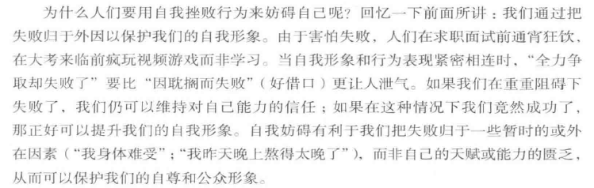

# 社会心理学导论

**社会心理学是研究人们如何看待彼此，如何互相影响，互相联系的科学。**它关注的核心是：我们如何构建我们的世界；我们的社会直觉如何指引我们，而有时候又是如何误导我们的；我们的社会行为如何受他人、我们自己的态度和性格以及生物性的影响；社会心理学的原理是如何应用于我们的日常生活和其他研究领域中的。

# 社会中的自我

后见之明。 我早就知道了。**这种后见之明偏差（我早就知道了现象）常导致人们过高评价自己的判断与预测。**

焦点效应，人们往往把自己看作一切的中心，并直觉地高估别人对我们的关注程度。

西方工业文化中的人更盛行**个人主义**，而亚洲、非洲和中南美地区的本土文化则把**集体主义**放在更重要的位置上。这种文化孕育了**相互依存的自我**，更喜欢自我批评，而不是自我肯定。“东亚人的思维更具有整体性，从人际关系和环境的角度出发来思考人和物。”

“人们会认为他们周一的心情会更糟糕，而事实上他们周一时的心情并不比其他工作日更差。”

“为人们提供较小的选择范围可能比为他们提供较大的选择范围更能给他们带来满足感。”

“自我效能可以鼓励我们在逆境中也不要轻言放弃，即使一开始就失败了也要坚持下去，全力奋斗而不要因为怀疑自己而过于分心。”

> 自我服务偏差，我们更多的是关注自己所做的事情。所以在一段感情里，我可能更多的关注到了自己的付出，而忽略了对方，这属于自我恭维的比较：与他人相比，认为自己更好。

> 我应该是一个高自尊的人。“相比于低自尊的人，高自尊的人往往更能尽情享受并保持这种良好的感觉。xxx指出，‘相信自己比同伴拥有更多的天赋和积极的品质，能使我们对自己保持良好的感觉，而且这种对自己的正性评价能为我们提供应付日常生活中压力环境所需的资源。”//是我自己没错了，每当有一件值得开心的事发生时，即使后来发生了一件不好的事情，也会想到这件事而不那么伤心。

> 这就解释了一些初中高中生总表示“我要是好好学怎么怎么样”。

# 社会信念和判断

## 社会世界的感知

我们的感知、解释和回忆在多大程度上会受到假设和预先判断的影响。

### 感知和解释事件

“沮丧情绪可以启动负性联结。而人们在心情好的时候，则会突然觉得自己的过去更有意义，前途更加光明。”

“我们并非如实地对现实进行反应，而是根据我们对现实的建构做出反应。”“我们对许多社会信息的加工是自动的。它是无目的的，不为肉眼所见，而且发生在我们意识之外。”

**“ 当社会信息可以做出多重解释时，先入为主就很重要了。”**  （

>  交大老师，公众号文章，他老婆，瑞幸，星巴克咖啡。

  “最后的结论是：我们通过自己的信念、态度和价值观来看待我们的社会。这就是我们的信念如此重要的一个原因；正是我们的信念塑造了我们对其他任何事物的解释。”

> 所以对一个人信念的塑造十分重要，也就是我们的中小学的教育应该努力塑造正确的价值观。而对于那些学习好的，也就是大概率正确地接受了这样的一份教育，也就树立了正确的观念，而那些没经过比较系统的塑造的，或者因为家庭原因教育不好的，是不是也就变得相对畸形，在很多事情上他的观点看法都有些奇怪或者违背原则。互联网的普及使得形形色色的人都接入进了同一个圈子里，五花八门的人持有五花八门的信念，也就造成了一些“离谱”“反智”言论的大批量涌现。

### 信念固着

“一旦人们为错误的信息建立了理论基础，那么就很难再让他们否定这条错误的信息。这种现象被称为**信念固着**，它证明了信念可以独立存在，并且当支持它的证据被否定时仍会存活下来。 ”

“这些实验给我们揭示了这样一种现象，我们越是极力想证明我们的论和解释可能是正确的，我们就对挑战自己信念的信息越封闭。一旦我们确信一个被指控的人犯了罪、一个令人讨厌的陌生人的确会表现出那样的行为，或者我们钟爱的某一股票的市值一定会有所上升，那么，我们就会为维护我们的解释而回击各种挑战。”

> 这不就是某些粉丝为维护自己的偶像时选择不理性地偏袒。

“我们的信念和期待在很大程度上会影响我们对事件的建构。” “但这种收益在某些时候是以一定的付出为代价的：我们成了自己思维图式的囚徒。”

有什么方法能够纠正我们的信念固着吗？唯一的方法是：<u>解释相反的观点</u>。

### 建构我们自己和我们世界的记忆

心理学研究认为，“我们的记忆并不是我们记忆库中所存信息的精准复制品。相反，我们会在提取信息的同时对记忆进行建构。就像古生物学家根据化石推断出恐龙的实际样子那样，我们也是用自身当前的感受和期许将许多不连贯的信息碎片整合起来，重构我们的过去。”

> 这就是为什么很多人说想回到高中，因为他们大多数忘记了高中学习时候的苦闷和压力，只记得了那时候属于自己的青春。还有一个原因是，他们已经经历过了高考，已经知道了自己未来是个什么样子，而想再回去时，也是带着这个已成定局的结局“回去”的，而不是担心自己可能发挥的不好而变得更糟。

**“人们不应为承认自己犯错而感到羞愧，因为换句话说，这表示他现在比以前更聪明了。”**	——乔纳森·斯威夫特，英国政治家及小说家，Thoughts on Various Subjects

“旅行只有在回忆时才是迷人的。”		——保罗·泰鲁

**“每一代的父母都在为下一代的价值观哀叹，部分原因是他们错误地认为自己年轻时候的价值观与自己现在的价值观很接近。**而当每一代年轻人回忆自己的父母时，他们都会根据自己当前的感受将父母描述成令人愉快或令人悲伤的。

“有时候，我们现在的观点是经过改良的——在这种情况下，我们可能将自己的过去回忆得与其实际情况更加不同。”

## 社会世界的判断

理解我们形成社会判断的过程

### 直觉判断

”总而言之，我们大脑所知道的比它告诉我们的要多得多。“

### 过度自信

”对过去知识进行的判断中存在一种“智力自负”现象（“我早就知道了”），这种现象会影响对目前知识的评价和对未来行为的预测。“

”讽刺的是，能不不足反而会促进过度自信倾向。“ ”对能力的认识也是需要能力的。“

”大部分学生同样很自信地低估了写论文和其他学位作业所需的时间。“

**对过度自信的矫正**
”我们可以从对过度自信的研究中得到什么启发教训呢？一个教训是要对别人独断性的陈述保持谨慎。即便当人们看起来十分确信自己是正确的时候，他们也可能是错的。**自信和能力之间没有什么必然一致的关系。**“

”尽管如此，我们在任何一点伤都不应该低估人们的自信或摧毁他们的果断性。在那些需要人们表现出智慧的时刻，那些缺乏自信的人无法毫不犹豫地说出或做出坚定的决定。虽然过度自信会让我们付出代价，但基于现实的自信是有适应意义的。“

### 启发式判断：心理捷径

”**代表性启发式判断**是指对某个事物进行评价时，在直觉的引导下，将其与某一类别的心理特征进行比较。“

易得性启发式判断，”简言之，我们越容易回想起某个东西，那个东西就越可能是真的。“

”同样，媒体对同性恋话题的关注使得‘同性恋’在认知上更容易获得。“

> 确实如此，一件事物提的次数多了，大家也就逐渐见怪不怪了，或者说开始被迫接受了。

”易得性启发式判断的运用可以揭示出一条基本的社会思维规律：人们从一条一般公理演绎出一个具体例证的过程是缓慢的，但是，他们从某一个鲜明的例证归纳出一般公理的过程则是非常迅速的。“

> 例如，就很多女性对自己日常生活中接触到的男性很少去总结一般性的属于男性群体的特征，而对于自己在网络上看到了部分”猥琐男“的”恶臭“发言之后，开始对男性群体有了”一般公理性“的不好印象，并因此带来极大的反感。

”同样，生动的奇闻轶事通常比统计数据更引人注目。我们为了鲜少发生的儿童绑架事件焦虑不安，但在孩子坐车时不给他系安全带；我们害怕恐怖主义，却对全球气候变化这一’缓慢走向世界末日‘无动于衷；在2011年日本海啸和核灾难发生后，我们恐惧核污染，却不关心煤炭开采和燃烧导致的数量更大的死亡。简言之，我们为小概率事件忧心忡忡，却忽略了高概率事件。“

> 是的，这也是新冠疫情刚开始的时候，大家都呈现出一种恐慌。刚开始时都在和03年非典作比较，我当时不理解，心想因为非典死亡的人数可比每年因车祸死亡的人数少多了，为什么人们会呈现出如此大的担心与恐慌。但其实这个例子不恰当，跟原文这里说的也不太对应，当时的恐慌更多的是来源于对新病毒的未知，无法预测未来会发生什么。但读到这里时就想到了之前自己的这个想法，多少有一丝丝关联，于是记录一下。

”对大多数空中旅行者来说，旅行中最危险的一段便是驾车去往飞机场的路上。“ 哈哈哈哈原文这里是说汽车事故死亡率是飞机的230倍。

”结果发现在2001年的最后3个月的死亡人数比之前5年间每3个月的平均死亡人数多出了350人。从这点看来，’9·11’事件的恐怖袭击者，以一种令人察觉不到的方式——在美国的公路上——杀死了更多的人，多于他们所袭击的那4架飞机上的乘客。”

### 反事实思维

“铜牌获得者（他们很容易设想比赛结束后自己没有获得奖牌）比银牌获得者（他们很容易设想自己获得金牌时的情景）显得更快乐。在领奖台上，据说快乐排名是1-3-2。”

“绝大部分人对已做的事情的悔恨比对没有做的事情的悔恨要小。如果我们敢于更经常地在超出我们感到舒适的范围外做出反应——去冒险，面对失败，至少曾经尝试过，我们是否能够因此而少些悔恨呢？”

> “如果早知道那天是我们最后一面，我绝不会和你谈论琐事，浪费时间”

### 错觉思维

“当我们期待发现某种重要的联系时，我们很容易会将各随机事件联系起来，从而知觉到一种**错觉相关**。”

“掷骰子的人希望掷出小点时，出手相对轻柔，而希望掷出大点时，则出手相对较重。”

“尽管如此，我们还是无法认识到这种回归效应。我们经常困惑于为何棒球年度新人的第二个赛季总会相对平庸——是他过于自信了吗？我们似乎都忘记了异乎寻常的表现总要回归到正常状态。”

> 我们总是对一些运动员或比赛选手持有这种心理预期，比如对一些电竞新人选手的期待等。

### 情绪和判断

“我们的情绪能够给我们的所见所闻着色，部分是通过将与特定情绪相关联的经验带入头脑。在糟糕的情绪下，我们的思维也更抑郁。”

> 最早接触到的情绪和判断：小学课文里，作者心情好时就写鸟儿欢快地叫，心情不好时就先鸟儿叽叽喳喳的真烦人。

## 社会世界的解释

了解我们怎样解释他人的行为，以及这种解释的准确性。

“我们对他人的评判取决于我们如何解释他人的行为。基于我们的解释，我们会把杀人行为判定为谋杀、过失杀人、正当防卫甚至英雄行为。基于我们的解释，我
们会把一个无家可归的人看做缺乏迎难而上的主动性的人，或者将其看做一个失业且福利遭到削减的人。基于我们的解释，我们会把某个人的示好行为解释成真心实意的友好或者虚情假意的逢迎。归因理论有助于我们理解这一解释起作用的机制。”

### 归因因果：归于个人还是情境

“许多男性认为频繁的约会邀请会使女性非常开心，而事实上这种行为通常会被女人认为是骚扰。”

“有时，约会强暴始于男人将女人的温柔误解为性诱惑。”

“当男性位高权重时，这种错误归因尤其容易发生。”

> 一些位高权重的人，更容易自大，坚持自己的想法，对他人表达的观点不再是认真倾听，而是听个大概，然后就带入了自己的错误归因。

常识性归因：

+ 一致性：个体在这种情境下出席那类型为的一致性如何？
+ 区别性：个体的这种行为是否具体对应于该特定情境？
+ 共同反应：其他人在这种情境下出现类似行为的可能性如何？

> 我非常依赖于“共同反应”，如果其他人在此情境下也会表现的和我一样，我就会获得极大的释然。

### 基本归因错误

“当我们解释他人的行为时，我们会低估环境造成的影响，而高估个人的特质和态度所造成的影响。 ”

> 确实如此，我们在从某件矛盾事件出发，评判一些网络上男女提出的情感问题时，多半都是会直接代入“这个人怎样怎样”，而没有设身处地想一下在那个情境下大多数人会怎样。我们更倾向于放大当事人的特质，而忽略了环境、情境因素的加成。其实很多事情都是“你跺你也麻”，我们代入角色时，绝不可能像我们身为局外人那样理性和处理的井井有条。

“这种归因错误是难以避免的，即使人们清楚地意识到某人的行为反应是自己引起的，他们仍然低估外在因素的影响。”

> 举个不恰当的例子，就比如一些穿着火辣的女孩遭到了混混的骚扰，人们虽然会指责混混的不当行为，但也会谴责女生不该这么穿。但其实每天穿着火辣或者暴露的女生千千万，遭到骚扰的可能就只有几起。也就是说，这大多都是由“遇到了坏男人”这种情境引起的。但真正发生时，人们还是愿意将双方的错误五五开分成。该例子也不是很恰当，因为穿着暴露确实会增大被骚扰的概率，但主要思想应该和文章说的差不多。

“简言之，我们通常认为他人的行为就是其内在特点的直接反映。”

“在日常生活中，那些拥有社会权利的人通常发起并控制着谈话，而这常常会导致人们高估他们的知识和智力水平。”

### 我们为什么会犯归因错误

“当我们作为行动者时，环境会支配我们的注意；而当我们观察别人的行为时，作为行为载体的人则会成为我们注意的中心，而环境变得相对模糊。如果我自己狂怒，那是因为当时的情境让我太生气了。但当我看到别人暴怒时，会觉得他似乎脾气不大好。”

> 这也许也是后悔的来源之一？我们在回忆自己之前的某件事时，通常会懊恼“我当时怎么那样做”，因为在回忆过程中忽略了当时环境的影响，而真当我们身临其境时，我们也许（甚至是大概率我觉得）还会那么做。

> 错误归因，假如我们看到了一个视频，男人在对女人破口大骂，第一反应往往是这个男人怎么这样，而不会去想是不是他在这之前得到了什么不公正的对待。也就是第一反应会给这个男人扣帽子，“易怒、没素质”，而不去想情境带给他的影响有多大。

“驾车到加油站，我们可能认为把车停在第二个油泵挡着第一个泵的人缺乏公德心。实际上那个人刚到加油站时，第一个泵正在使用中，因此应把她的行为归因为情境所致。”

“当我们回忆自己的过去时，我们就变得和旁观者一样了。对于我们中的大多数来说,“过去的你”并不是今天“现实中的你”。我们几乎将过去的自己（以及那个遥远未来的自己）看成占了我们身体的其他人。”

“社会心理学的目标是让我们了解自己思维荒谬之处，以期我们变得更理性，更加贴近现实。希望并不是没用的：学习心理学的学生在解释行为的时候，就不像那些同样聪明的学自然科学的学生那样单纯。”

> 也就是能更理性、从多角度出发看待问题，识破复杂性。

## 社会期望的影响

了解我们的社会信念是怎样起作用的。

### 从他人那里获得我们的期望

“在实验室游戏中，敌意几乎总是招致敌意:那些认为对手不合作的人很容易诱发对手的不合作( Kelley &Stahelski，1970)。如果每一个团体都将其他团体视为攻击性的、怨恨的和报复性的，自然会招致其他团体表现出这样的行为以自我防御，从而形成一个自我延续的恶性循环。”

## 社会信念和判断的结论

提供认知社会心理学看人性

# 态度和行为

## 态度对行为的预测

内在的态度在多大程度上且在什么条件下会影响我们外在的行为。

“人们表现出的态度很难预测他们的各种行为。 “

”道德伪善“（显得有道德水准，但实际上拒绝为之付出任何代价）便是一个态度和行为相背离的例子。 

”当道德与贪婪同处在竞技场中时，通常是贪婪大获全胜。“

**”真理只有在被发现时才会变得显而易见。“**

### 态度何时能预测行为

”我们有时也称之为见风使舵，强烈的社会影响——害怕受到指责——歪曲了真正的意见。”